## Week 45 from 02 November through 08 November 2025

## Table of Contents

### Main Sections

- **[Introduction](#introduction)**
- **[Data Cleaning](#data-cleaning)**
- **[Exploratory Analysis](#exploratory-analysis)**
  - [Call Distribution: Hour by Day of Week](#call-distribution-hour-by-day-of-week)
  - [Distribution of Service Calls by Shift](#distribution-of-service-calls-by-shift)
  - [CAD-centric Analyses](#cad-centric-analyses)
  - [Summary Statistics and Analyses](#summary-statsitcs-and-analyses)
- **[Discipline Analyses](#discipline-analyses)**
  - [APD Analyses](#apd-analyses)
  - [AFD FIRE Analyses](#afd-fire-analyses)
  - [AFD EMS Analyses](#afd-ems-analyses)
- **[Additional Analyses](#additional-analyses)**
  - [Possible Service Delays](#possible-service-delays)
- **[High-Priority and Critical Calls](#high-priority-and-critical-calls)**
  - [High-Priority Call Types](#high-priority-call-types)
  - [High-Priority Response Times](#high-priority-response-times)
- **[E-911 Service Call Analyses](#e-911-service-call-analyses)**
  - [E-911 Call Response Summary](#e-911-call-response-summary)
  - [E-911 Call Breakdowns](#e-911-call-breakdowns)
- **[Cardiac Arrest Calls Analysis](#cardiac-arrest-calls-analysis)**
- **[Mental Health Analyses](#mental-health-analyses)**
- **[Call Source Unrecorded](#call-source-unrecorded)**
- **[Hybrid Call Takers](#hybrid-call-takers)**
- **[Outlier Identification](#outlier-identification)**
- **[Comparisons](#comparisons)**
- **[Conclusion](#conclusion)**

---


## Introduction

This is the weekly report for week 45 covering the period from 02 Nov through 08 Nov 2025. The report will include analyses of the data to emphasize different information that is contained within the data and may be pertinent to both operations and management.


```
## Processing current week data: 1934 rows
```

```
## Call_Reception column check: TRUE
```

```
## Processing last week data: 1849 rows
```

```
## Both weeks ready for analysis and comparison
```

For this week, there were a total of 1934 calls for service. The column list is below:


```
##  [1] "Master_Incident_Number"            "Response_Date"                    
##  [3] "WeekNo"                            "DOW"                              
##  [5] "Day"                               "Hour"                             
##  [7] "Shift"                             "Day_Night"                        
##  [9] "ShiftPart"                         "Agency"                           
## [11] "Problem"                           "Priority_Number"                  
## [13] "Call_Reception"                    "Call_Taker"                       
## [15] "Dispatcher"                        "Incident_Start_Time"              
## [17] "TimeCallViewed"                    "Incident_Queue_Time"              
## [19] "Time_To_Queue"                     "Elapsed_PS_Queue"                 
## [21] "Time_To_Queue_Diff"                "Incident_Dispatch_Time"           
## [23] "Time_To_Dispatch"                  "Elapsed_Queue_Disp"               
## [25] "Time_To_Disp_Diff"                 "Incident_Phone_Stop"              
## [27] "Phone_Time"                        "Elapsed_PS_CTD"                   
## [29] "Phone_Time_Diff"                   "TimeFirstUnitDispatchAcknowledged"
## [31] "Processing_Time"                   "Elapsed_Processing"               
## [33] "Diff_Proc_Time"                    "Incident_Enroute_Time"            
## [35] "Rollout_Time"                      "Elapsed_Rollout"                  
## [37] "Diff_Rollout_Time"                 "Incident_Arrival_Time"            
## [39] "Transit_Time"                      "Elapsed_Transit"                  
## [41] "Diff_Transit_Time"                 "TimeFirstCallCleared"             
## [43] "Incident_First_Close_Time"         "Call_Reopened"                    
## [45] "First_Reopen_Time"                 "Final_Closed_Time"                
## [47] "Total_Call_Time"                   "Elapsed_Call_Time"                
## [49] "Diff_Total_Call_Time"              "Disposition"
```

## Executive Summary


### Weekly KPI Summary

<div class="tabwid"><style>.cl-a1950ebc{}.cl-a1798b10{font-family:'Arial';font-size:9pt;font-weight:bold;font-style:normal;text-decoration:none;color:rgba(0, 0, 0, 1.00);background-color:transparent;}.cl-a1798b24{font-family:'Arial';font-size:9pt;font-weight:normal;font-style:normal;text-decoration:none;color:rgba(0, 0, 0, 1.00);background-color:transparent;}.cl-a18e1fd0{margin:0;text-align:left;border-bottom: 0 solid rgba(0, 0, 0, 1.00);border-top: 0 solid rgba(0, 0, 0, 1.00);border-left: 0 solid rgba(0, 0, 0, 1.00);border-right: 0 solid rgba(0, 0, 0, 1.00);padding-bottom:3pt;padding-top:3pt;padding-left:3pt;padding-right:3pt;line-height: 1;background-color:transparent;}.cl-a18e69c2{width:1.802in;background-color:transparent;vertical-align: middle;border-bottom: 1.5pt solid rgba(102, 102, 102, 1.00);border-top: 1.5pt solid rgba(102, 102, 102, 1.00);border-left: 0 solid rgba(0, 0, 0, 1.00);border-right: 0 solid rgba(0, 0, 0, 1.00);margin-bottom:0;margin-top:0;margin-left:0;margin-right:0;}.cl-a18e69cc{width:0.829in;background-color:transparent;vertical-align: middle;border-bottom: 1.5pt solid rgba(102, 102, 102, 1.00);border-top: 1.5pt solid rgba(102, 102, 102, 1.00);border-left: 0 solid rgba(0, 0, 0, 1.00);border-right: 0 solid rgba(0, 0, 0, 1.00);margin-bottom:0;margin-top:0;margin-left:0;margin-right:0;}.cl-a18e69cd{width:0.829in;background-color:transparent;vertical-align: middle;border-bottom: 1.5pt solid rgba(102, 102, 102, 1.00);border-top: 1.5pt solid rgba(102, 102, 102, 1.00);border-left: 0 solid rgba(0, 0, 0, 1.00);border-right: 0 solid rgba(0, 0, 0, 1.00);margin-bottom:0;margin-top:0;margin-left:0;margin-right:0;}.cl-a18e69d6{width:0.988in;background-color:transparent;vertical-align: middle;border-bottom: 1.5pt solid rgba(102, 102, 102, 1.00);border-top: 1.5pt solid rgba(102, 102, 102, 1.00);border-left: 0 solid rgba(0, 0, 0, 1.00);border-right: 0 solid rgba(0, 0, 0, 1.00);margin-bottom:0;margin-top:0;margin-left:0;margin-right:0;}.cl-a18e69d7{width:0.593in;background-color:transparent;vertical-align: middle;border-bottom: 1.5pt solid rgba(102, 102, 102, 1.00);border-top: 1.5pt solid rgba(102, 102, 102, 1.00);border-left: 0 solid rgba(0, 0, 0, 1.00);border-right: 0 solid rgba(0, 0, 0, 1.00);margin-bottom:0;margin-top:0;margin-left:0;margin-right:0;}.cl-a18e69d8{width:1.802in;background-color:rgba(245, 245, 245, 1.00);vertical-align: middle;border-bottom: 0 solid rgba(0, 0, 0, 1.00);border-top: 0 solid rgba(0, 0, 0, 1.00);border-left: 0 solid rgba(0, 0, 0, 1.00);border-right: 0 solid rgba(0, 0, 0, 1.00);margin-bottom:0;margin-top:0;margin-left:0;margin-right:0;}.cl-a18e69e0{width:0.829in;background-color:rgba(245, 245, 245, 1.00);vertical-align: middle;border-bottom: 0 solid rgba(0, 0, 0, 1.00);border-top: 0 solid rgba(0, 0, 0, 1.00);border-left: 0 solid rgba(0, 0, 0, 1.00);border-right: 0 solid rgba(0, 0, 0, 1.00);margin-bottom:0;margin-top:0;margin-left:0;margin-right:0;}.cl-a18e69ea{width:0.829in;background-color:rgba(245, 245, 245, 1.00);vertical-align: middle;border-bottom: 0 solid rgba(0, 0, 0, 1.00);border-top: 0 solid rgba(0, 0, 0, 1.00);border-left: 0 solid rgba(0, 0, 0, 1.00);border-right: 0 solid rgba(0, 0, 0, 1.00);margin-bottom:0;margin-top:0;margin-left:0;margin-right:0;}.cl-a18e69eb{width:0.988in;background-color:rgba(245, 245, 245, 1.00);vertical-align: middle;border-bottom: 0 solid rgba(0, 0, 0, 1.00);border-top: 0 solid rgba(0, 0, 0, 1.00);border-left: 0 solid rgba(0, 0, 0, 1.00);border-right: 0 solid rgba(0, 0, 0, 1.00);margin-bottom:0;margin-top:0;margin-left:0;margin-right:0;}.cl-a18e69f4{width:0.593in;background-color:rgba(245, 245, 245, 1.00);vertical-align: middle;border-bottom: 0 solid rgba(0, 0, 0, 1.00);border-top: 0 solid rgba(0, 0, 0, 1.00);border-left: 0 solid rgba(0, 0, 0, 1.00);border-right: 0 solid rgba(0, 0, 0, 1.00);margin-bottom:0;margin-top:0;margin-left:0;margin-right:0;}.cl-a18e69fe{width:1.802in;background-color:transparent;vertical-align: middle;border-bottom: 0 solid rgba(0, 0, 0, 1.00);border-top: 0 solid rgba(0, 0, 0, 1.00);border-left: 0 solid rgba(0, 0, 0, 1.00);border-right: 0 solid rgba(0, 0, 0, 1.00);margin-bottom:0;margin-top:0;margin-left:0;margin-right:0;}.cl-a18e69ff{width:0.829in;background-color:transparent;vertical-align: middle;border-bottom: 0 solid rgba(0, 0, 0, 1.00);border-top: 0 solid rgba(0, 0, 0, 1.00);border-left: 0 solid rgba(0, 0, 0, 1.00);border-right: 0 solid rgba(0, 0, 0, 1.00);margin-bottom:0;margin-top:0;margin-left:0;margin-right:0;}.cl-a18e6a00{width:0.829in;background-color:transparent;vertical-align: middle;border-bottom: 0 solid rgba(0, 0, 0, 1.00);border-top: 0 solid rgba(0, 0, 0, 1.00);border-left: 0 solid rgba(0, 0, 0, 1.00);border-right: 0 solid rgba(0, 0, 0, 1.00);margin-bottom:0;margin-top:0;margin-left:0;margin-right:0;}.cl-a18e6a08{width:0.988in;background-color:transparent;vertical-align: middle;border-bottom: 0 solid rgba(0, 0, 0, 1.00);border-top: 0 solid rgba(0, 0, 0, 1.00);border-left: 0 solid rgba(0, 0, 0, 1.00);border-right: 0 solid rgba(0, 0, 0, 1.00);margin-bottom:0;margin-top:0;margin-left:0;margin-right:0;}.cl-a18e6a09{width:0.593in;background-color:transparent;vertical-align: middle;border-bottom: 0 solid rgba(0, 0, 0, 1.00);border-top: 0 solid rgba(0, 0, 0, 1.00);border-left: 0 solid rgba(0, 0, 0, 1.00);border-right: 0 solid rgba(0, 0, 0, 1.00);margin-bottom:0;margin-top:0;margin-left:0;margin-right:0;}.cl-a18e6a0a{width:1.802in;background-color:transparent;vertical-align: middle;border-bottom: 0 solid rgba(0, 0, 0, 1.00);border-top: 0 solid rgba(0, 0, 0, 1.00);border-left: 0 solid rgba(0, 0, 0, 1.00);border-right: 0 solid rgba(0, 0, 0, 1.00);margin-bottom:0;margin-top:0;margin-left:0;margin-right:0;}.cl-a18e6a12{width:0.829in;background-color:transparent;vertical-align: middle;border-bottom: 0 solid rgba(0, 0, 0, 1.00);border-top: 0 solid rgba(0, 0, 0, 1.00);border-left: 0 solid rgba(0, 0, 0, 1.00);border-right: 0 solid rgba(0, 0, 0, 1.00);margin-bottom:0;margin-top:0;margin-left:0;margin-right:0;}.cl-a18e6a13{width:0.829in;background-color:transparent;vertical-align: middle;border-bottom: 0 solid rgba(0, 0, 0, 1.00);border-top: 0 solid rgba(0, 0, 0, 1.00);border-left: 0 solid rgba(0, 0, 0, 1.00);border-right: 0 solid rgba(0, 0, 0, 1.00);margin-bottom:0;margin-top:0;margin-left:0;margin-right:0;}.cl-a18e6a14{width:0.988in;background-color:transparent;vertical-align: middle;border-bottom: 0 solid rgba(0, 0, 0, 1.00);border-top: 0 solid rgba(0, 0, 0, 1.00);border-left: 0 solid rgba(0, 0, 0, 1.00);border-right: 0 solid rgba(0, 0, 0, 1.00);margin-bottom:0;margin-top:0;margin-left:0;margin-right:0;}.cl-a18e6a15{width:0.593in;background-color:transparent;vertical-align: middle;border-bottom: 0 solid rgba(0, 0, 0, 1.00);border-top: 0 solid rgba(0, 0, 0, 1.00);border-left: 0 solid rgba(0, 0, 0, 1.00);border-right: 0 solid rgba(0, 0, 0, 1.00);margin-bottom:0;margin-top:0;margin-left:0;margin-right:0;}.cl-a18e6a1c{width:1.802in;background-color:transparent;vertical-align: middle;border-bottom: 1.5pt solid rgba(102, 102, 102, 1.00);border-top: 0 solid rgba(0, 0, 0, 1.00);border-left: 0 solid rgba(0, 0, 0, 1.00);border-right: 0 solid rgba(0, 0, 0, 1.00);margin-bottom:0;margin-top:0;margin-left:0;margin-right:0;}.cl-a18e6a1d{width:0.829in;background-color:transparent;vertical-align: middle;border-bottom: 1.5pt solid rgba(102, 102, 102, 1.00);border-top: 0 solid rgba(0, 0, 0, 1.00);border-left: 0 solid rgba(0, 0, 0, 1.00);border-right: 0 solid rgba(0, 0, 0, 1.00);margin-bottom:0;margin-top:0;margin-left:0;margin-right:0;}.cl-a18e6a1e{width:0.829in;background-color:transparent;vertical-align: middle;border-bottom: 1.5pt solid rgba(102, 102, 102, 1.00);border-top: 0 solid rgba(0, 0, 0, 1.00);border-left: 0 solid rgba(0, 0, 0, 1.00);border-right: 0 solid rgba(0, 0, 0, 1.00);margin-bottom:0;margin-top:0;margin-left:0;margin-right:0;}.cl-a18e6a26{width:0.988in;background-color:transparent;vertical-align: middle;border-bottom: 1.5pt solid rgba(102, 102, 102, 1.00);border-top: 0 solid rgba(0, 0, 0, 1.00);border-left: 0 solid rgba(0, 0, 0, 1.00);border-right: 0 solid rgba(0, 0, 0, 1.00);margin-bottom:0;margin-top:0;margin-left:0;margin-right:0;}.cl-a18e6a27{width:0.593in;background-color:transparent;vertical-align: middle;border-bottom: 1.5pt solid rgba(102, 102, 102, 1.00);border-top: 0 solid rgba(0, 0, 0, 1.00);border-left: 0 solid rgba(0, 0, 0, 1.00);border-right: 0 solid rgba(0, 0, 0, 1.00);margin-bottom:0;margin-top:0;margin-left:0;margin-right:0;}.tabwid {
  font-size: initial;
  padding-bottom: 1em;
}

.tabwid table{
  border-spacing:0px !important;
  border-collapse:collapse;
  line-height:1;
  margin-left:auto;
  margin-right:auto;
  border-width: 0;
  border-color: transparent;
  caption-side: top;
}
.tabwid-caption-bottom table{
  caption-side: bottom;
}
.tabwid_left table{
  margin-left:0;
}
.tabwid_right table{
  margin-right:0;
}
.tabwid td, .tabwid th {
    padding: 0;
}
.tabwid a {
  text-decoration: none;
}
.tabwid thead {
    background-color: transparent;
}
.tabwid tfoot {
    background-color: transparent;
}
.tabwid table tr {
background-color: transparent;
}
.katex-display {
    margin: 0 0 !important;
}</style><table data-quarto-disable-processing='true' class='cl-a1950ebc'><thead><tr style="overflow-wrap:break-word;"><th class="cl-a18e69c2"><p class="cl-a18e1fd0"><span class="cl-a1798b10">Key Performance Indicator</span></p></th><th class="cl-a18e69cc"><p class="cl-a18e1fd0"><span class="cl-a1798b10">This Week</span></p></th><th class="cl-a18e69cd"><p class="cl-a18e1fd0"><span class="cl-a1798b10">Last Week</span></p></th><th class="cl-a18e69d6"><p class="cl-a18e1fd0"><span class="cl-a1798b10">Change (Δ%)</span></p></th><th class="cl-a18e69d7"><p class="cl-a18e1fd0"><span class="cl-a1798b10">Status</span></p></th></tr></thead><tbody><tr style="overflow-wrap:break-word;"><td class="cl-a18e69d8"><p class="cl-a18e1fd0"><span class="cl-a1798b24">Total Call Volume</span></p></td><td class="cl-a18e69e0"><p class="cl-a18e1fd0"><span class="cl-a1798b24">1,934</span></p></td><td class="cl-a18e69ea"><p class="cl-a18e1fd0"><span class="cl-a1798b24">1,849</span></p></td><td class="cl-a18e69eb"><p class="cl-a18e1fd0"><span class="cl-a1798b24">+85 (+4.6%)</span></p></td><td class="cl-a18e69f4"><p class="cl-a18e1fd0"><span class="cl-a1798b24">—</span></p></td></tr><tr style="overflow-wrap:break-word;"><td class="cl-a18e69fe"><p class="cl-a18e1fd0"><span class="cl-a1798b24">Median Time to Queue (s)</span></p></td><td class="cl-a18e69ff"><p class="cl-a18e1fd0"><span class="cl-a1798b24">40</span></p></td><td class="cl-a18e6a00"><p class="cl-a18e1fd0"><span class="cl-a1798b24">38</span></p></td><td class="cl-a18e6a08"><p class="cl-a18e1fd0"><span class="cl-a1798b24">+2 (+5.3%)</span></p></td><td class="cl-a18e6a09"><p class="cl-a18e1fd0"><span class="cl-a1798b24">—</span></p></td></tr><tr style="overflow-wrap:break-word;"><td class="cl-a18e69d8"><p class="cl-a18e1fd0"><span class="cl-a1798b24">Median Time to Dispatch (s)</span></p></td><td class="cl-a18e69e0"><p class="cl-a18e1fd0"><span class="cl-a1798b24">17</span></p></td><td class="cl-a18e69ea"><p class="cl-a18e1fd0"><span class="cl-a1798b24">17</span></p></td><td class="cl-a18e69eb"><p class="cl-a18e1fd0"><span class="cl-a1798b24">+0 (+0%)</span></p></td><td class="cl-a18e69f4"><p class="cl-a18e1fd0"><span class="cl-a1798b24">—</span></p></td></tr><tr style="overflow-wrap:break-word;"><td class="cl-a18e6a0a"><p class="cl-a18e1fd0"><span class="cl-a1798b24">Median Phone Time (s)</span></p></td><td class="cl-a18e6a12"><p class="cl-a18e1fd0"><span class="cl-a1798b24">129</span></p></td><td class="cl-a18e6a13"><p class="cl-a18e1fd0"><span class="cl-a1798b24">121.5</span></p></td><td class="cl-a18e6a14"><p class="cl-a18e1fd0"><span class="cl-a1798b24">+7.5 (+6.2%)</span></p></td><td class="cl-a18e6a15"><p class="cl-a18e1fd0"><span class="cl-a1798b24">—</span></p></td></tr><tr style="overflow-wrap:break-word;"><td class="cl-a18e69d8"><p class="cl-a18e1fd0"><span class="cl-a1798b24">LAW P1 SLA (≤60s)</span></p></td><td class="cl-a18e69e0"><p class="cl-a18e1fd0"><span class="cl-a1798b24">61.4%</span></p></td><td class="cl-a18e69ea"><p class="cl-a18e1fd0"><span class="cl-a1798b24">58.9%</span></p></td><td class="cl-a18e69eb"><p class="cl-a18e1fd0"><span class="cl-a1798b24">-11.8%</span></p></td><td class="cl-a18e69f4"><p class="cl-a18e1fd0"><span class="cl-a1798b24">✗</span></p></td></tr><tr style="overflow-wrap:break-word;"><td class="cl-a18e6a0a"><p class="cl-a18e1fd0"><span class="cl-a1798b24">LAW P2 SLA (≤120s)</span></p></td><td class="cl-a18e6a12"><p class="cl-a18e1fd0"><span class="cl-a1798b24">63.1%</span></p></td><td class="cl-a18e6a13"><p class="cl-a18e1fd0"><span class="cl-a1798b24">58.9%</span></p></td><td class="cl-a18e6a14"><p class="cl-a18e1fd0"><span class="cl-a1798b24">+4.2%</span></p></td><td class="cl-a18e6a15"><p class="cl-a18e1fd0"><span class="cl-a1798b24">✗</span></p></td></tr><tr style="overflow-wrap:break-word;"><td class="cl-a18e69d8"><p class="cl-a18e1fd0"><span class="cl-a1798b24">FIRE/EMS SLA (≤64s)</span></p></td><td class="cl-a18e69e0"><p class="cl-a18e1fd0"><span class="cl-a1798b24">77.1%</span></p></td><td class="cl-a18e69ea"><p class="cl-a18e1fd0"><span class="cl-a1798b24">79.1%</span></p></td><td class="cl-a18e69eb"><p class="cl-a18e1fd0"><span class="cl-a1798b24">-2%</span></p></td><td class="cl-a18e69f4"><p class="cl-a18e1fd0"><span class="cl-a1798b24">✗</span></p></td></tr><tr style="overflow-wrap:break-word;"><td class="cl-a18e6a1c"><p class="cl-a18e1fd0"><span class="cl-a1798b24">FIRE/EMS SLA (≤106s)</span></p></td><td class="cl-a18e6a1d"><p class="cl-a18e1fd0"><span class="cl-a1798b24">92.5%</span></p></td><td class="cl-a18e6a1e"><p class="cl-a18e1fd0"><span class="cl-a1798b24">96.2%</span></p></td><td class="cl-a18e6a26"><p class="cl-a18e1fd0"><span class="cl-a1798b24">-3.7%</span></p></td><td class="cl-a18e6a27"><p class="cl-a18e1fd0"><span class="cl-a1798b24">⚠</span></p></td></tr></tbody></table></div>

**Status Legend:** ✓ = Meets Target | ⚠ = Warning | ✗ = Below Target | — = Not Applicable

### Key Insights


1. **SLA Compliance**: 3 metric(s) below target: LAW P1 at 61.4%, LAW P2 at 63.1%, FIRE/EMS 64s at 77.1%.

2. **Call Complexity**: Median phone time at 129 seconds, up 6.2%, suggesting more complex calls this week.

## Data Cleaning

In order to have a good dataset for analysis, some data cleaning was performed. The first step is to check for missing values in the dataset.


From this plot, we can see that there are only 16 columns with missing data. Of those, the column with the largest number of missing values is First_Reopen_Time. That is something that we would like to see because that means that most of our calls are closed once and left that way. Later, we will look deeper into those calls to see if there are any patterns to those calls. There were 233 calls that did not have a recorded time that the call arrived, representing 12% of calls for the week. We will have to determine if they were cancelled or how many of those were mutual aid calls where we did not receive a phone call.

## Exploratory Analysis

One of the first analyses is to break down different factor elements to see what we have in the dataset. Since the data source for this report is the CAD system, the counts of service calls may not correlate to phone volumes. We will have to, in future, find good methods to integrate the phone date into the reports.

### Call Distribution: Hour by Day of Week

The following visualization shows the distribution of service calls throughout the day (by hour) for each day of the week. This helps identify patterns in service call volume across different days and times.

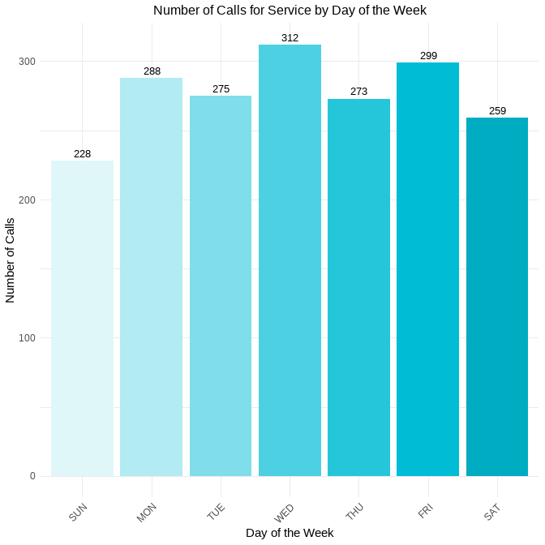

From this chart, we can see that Wednesday was the busiest day of the week with 312 service calls created, and the slowest day was Sunday with 228 service calls. There is some consistency throughout the week, with 84 calls difference between the busiest and slowest days.


This week, the busiest hour of the day was 0900 hours, with 129 calls for service. 0500 hours was the slowest hour of the day with 27 calls. Additionally, the pattern shows consistent traffic from late rush hour through the day into the early evening before seeing the volumes start to decline. This appears to confirm assumptions about the busiest parts of the day.

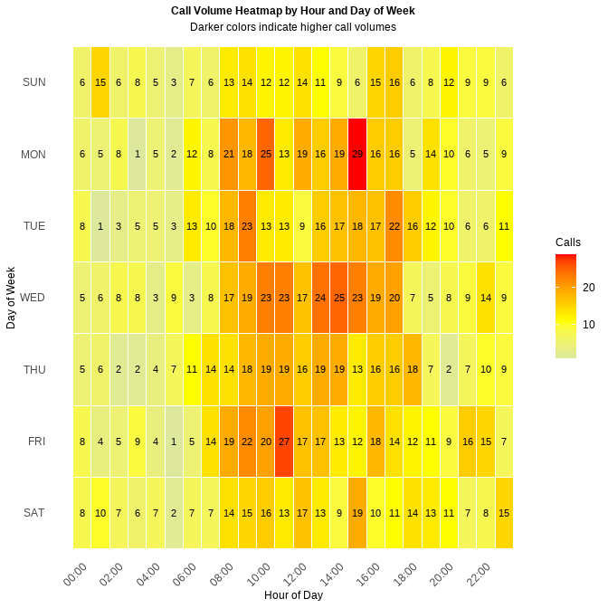

The heat map shows one intense spike on Tuesday at 1000 hours. There is an additional spike on Wednesday at 1000 hours. Overall, since 0900 hours was the busiest hour of the week, the heatmap shows that it was reasonably consistent throughout the week. 

### Distribution of Service Calls by Shift

These analyses show the distribution of service calls as created through both day and night shifts and specific shifts in general. Each shift was split into three four-hour blocks for future analyses in order to determine how fatigue may be expressed during the course of the shift.

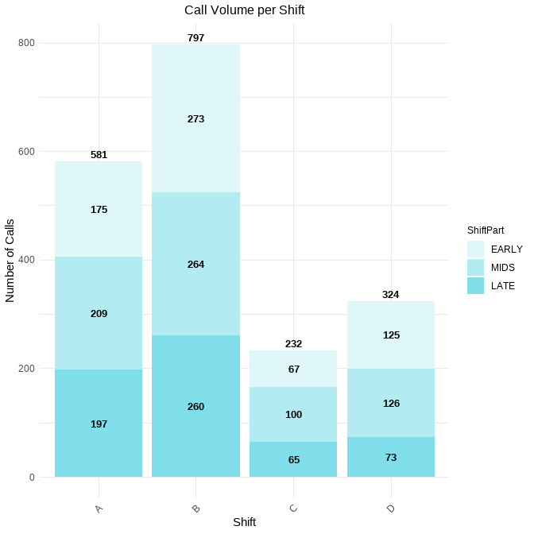

As expected, day shifts are busier than night shifts by a considerable margin. As expected, the call volumes throughout the shift for day shift are fairly consistent and on night shift, the longer the shifts go, fewer calls are received. These are both expected from prior work.

### CAD-centric Analyses

The following bar charts break down the volume of service calls using various other CAD-centric breakdowns that may be useful for various supplemental analyses. The first of those below shows the distribution pattern of service calls by priority number. This is overall for the center in all disciplines. Specific breakdowns for each discipline will be reflected in later sections.

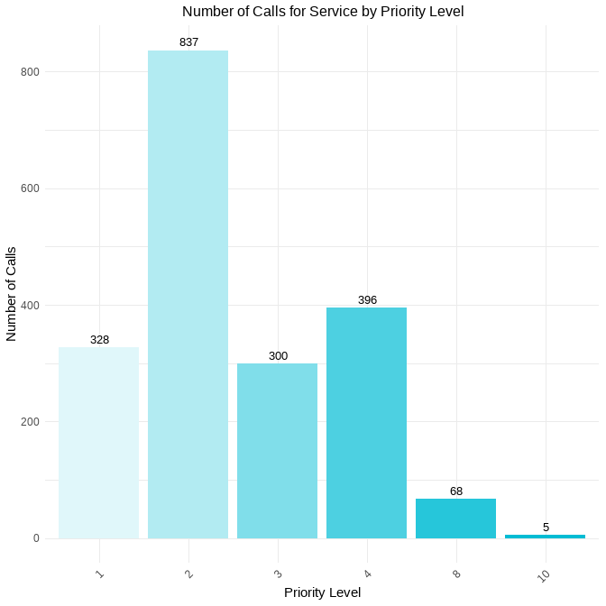

The majority of calls received were Priority 2 calls. Priority 2 calls are 43.3 percent of the total number of calls, while Priority 1 calls are 17 percent of the total number of calls. This is a consistent pattern and more detailed analyses of the high priority, and specifically priority 1 calls, can be found below.


As expected, the majority of calls are for POLICE. They represent 72.3
percent of the total number of calls. This is fairly consistent with previous analyses. We can also examine the way in which we are receiving the calls by looking at the Call_Reception column. That chart is below.

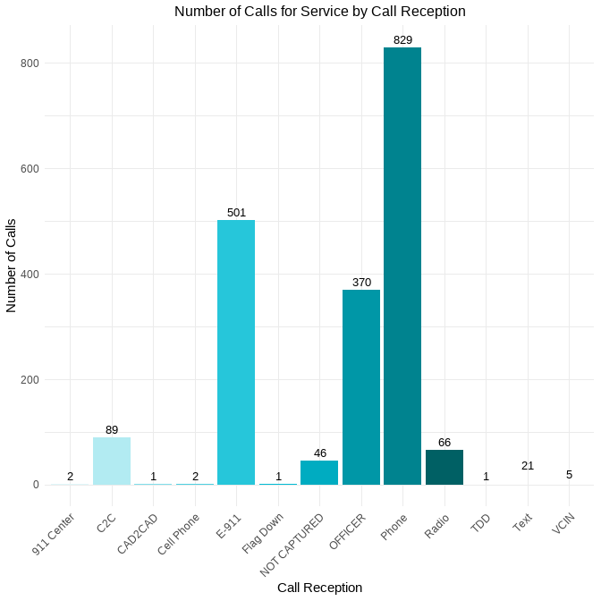

Most of the calls arrived by Phone. 911 trunk line calls were 25.9 percent of all calls. There were 46 calls where we did not indicate how the service call was received. This is 2.4 percent of the total number of calls. These calls should be investigated to determine why call origination is not being tracked.

The following is a chart of the disposition codes that have been used this week.

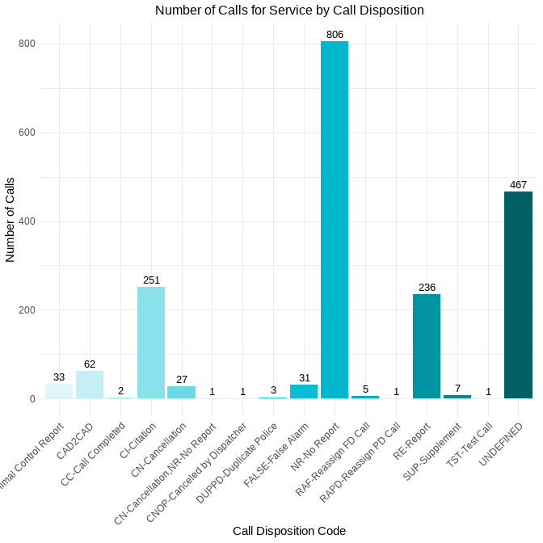

As can be seen from the bar chart, NR-No Report was the most common disposition code used with 806 calls coded that way. It is interesting to note that no calls, this week, have been closed without a disposition.

The following is a chart of the top 10 call types. The data is limited to ensure visual clarity and legibility of the information.

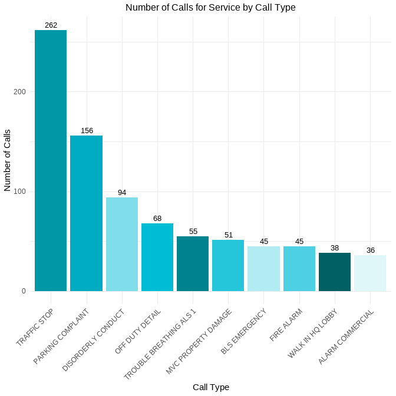

This week, the most common problem nature was TRAFFIC STOP. For AFD, the most common was FIRE ALARM. The most common medical call for service was TROUBLE BREATHING ALS 1.

We can also look at the number of calls taken by telecommunicators. Again, like the problem types, we will limit the chart to the top 10 telecommunicators to ensure visual clarity and legibility of the information.


It is interesting to note that the top "call taker" is GARCIA, VILMA again this week with 97 calls.

<div class="tabwid"><style>.cl-a5147df2{}.cl-a508d2d6{font-family:'Arial';font-size:9pt;font-weight:bold;font-style:normal;text-decoration:none;color:rgba(0, 0, 0, 1.00);background-color:transparent;}.cl-a508d2ea{font-family:'Arial';font-size:9pt;font-weight:normal;font-style:normal;text-decoration:none;color:rgba(0, 0, 0, 1.00);background-color:transparent;}.cl-a50c7206{margin:0;text-align:left;border-bottom: 0 solid rgba(0, 0, 0, 1.00);border-top: 0 solid rgba(0, 0, 0, 1.00);border-left: 0 solid rgba(0, 0, 0, 1.00);border-right: 0 solid rgba(0, 0, 0, 1.00);padding-bottom:3pt;padding-top:3pt;padding-left:3pt;padding-right:3pt;line-height: 1;background-color:transparent;}.cl-a50c7210{margin:0;text-align:right;border-bottom: 0 solid rgba(0, 0, 0, 1.00);border-top: 0 solid rgba(0, 0, 0, 1.00);border-left: 0 solid rgba(0, 0, 0, 1.00);border-right: 0 solid rgba(0, 0, 0, 1.00);padding-bottom:3pt;padding-top:3pt;padding-left:3pt;padding-right:3pt;line-height: 1;background-color:transparent;}.cl-a50c9ad8{width:1.572in;background-color:transparent;vertical-align: middle;border-bottom: 1.5pt solid rgba(102, 102, 102, 1.00);border-top: 1.5pt solid rgba(102, 102, 102, 1.00);border-left: 0 solid rgba(0, 0, 0, 1.00);border-right: 0 solid rgba(0, 0, 0, 1.00);margin-bottom:0;margin-top:0;margin-left:0;margin-right:0;}.cl-a50c9ae2{width:0.51in;background-color:transparent;vertical-align: middle;border-bottom: 1.5pt solid rgba(102, 102, 102, 1.00);border-top: 1.5pt solid rgba(102, 102, 102, 1.00);border-left: 0 solid rgba(0, 0, 0, 1.00);border-right: 0 solid rgba(0, 0, 0, 1.00);margin-bottom:0;margin-top:0;margin-left:0;margin-right:0;}.cl-a50c9aec{width:1.253in;background-color:transparent;vertical-align: middle;border-bottom: 1.5pt solid rgba(102, 102, 102, 1.00);border-top: 1.5pt solid rgba(102, 102, 102, 1.00);border-left: 0 solid rgba(0, 0, 0, 1.00);border-right: 0 solid rgba(0, 0, 0, 1.00);margin-bottom:0;margin-top:0;margin-left:0;margin-right:0;}.cl-a50c9af6{width:1.267in;background-color:transparent;vertical-align: middle;border-bottom: 1.5pt solid rgba(102, 102, 102, 1.00);border-top: 1.5pt solid rgba(102, 102, 102, 1.00);border-left: 0 solid rgba(0, 0, 0, 1.00);border-right: 0 solid rgba(0, 0, 0, 1.00);margin-bottom:0;margin-top:0;margin-left:0;margin-right:0;}.cl-a50c9af7{width:1.274in;background-color:transparent;vertical-align: middle;border-bottom: 1.5pt solid rgba(102, 102, 102, 1.00);border-top: 1.5pt solid rgba(102, 102, 102, 1.00);border-left: 0 solid rgba(0, 0, 0, 1.00);border-right: 0 solid rgba(0, 0, 0, 1.00);margin-bottom:0;margin-top:0;margin-left:0;margin-right:0;}.cl-a50c9af8{width:1.572in;background-color:rgba(245, 245, 245, 1.00);vertical-align: middle;border-bottom: 0 solid rgba(0, 0, 0, 1.00);border-top: 0 solid rgba(0, 0, 0, 1.00);border-left: 0 solid rgba(0, 0, 0, 1.00);border-right: 0 solid rgba(0, 0, 0, 1.00);margin-bottom:0;margin-top:0;margin-left:0;margin-right:0;}.cl-a50c9b00{width:0.51in;background-color:rgba(245, 245, 245, 1.00);vertical-align: middle;border-bottom: 0 solid rgba(0, 0, 0, 1.00);border-top: 0 solid rgba(0, 0, 0, 1.00);border-left: 0 solid rgba(0, 0, 0, 1.00);border-right: 0 solid rgba(0, 0, 0, 1.00);margin-bottom:0;margin-top:0;margin-left:0;margin-right:0;}.cl-a50c9b0a{width:1.253in;background-color:rgba(245, 245, 245, 1.00);vertical-align: middle;border-bottom: 0 solid rgba(0, 0, 0, 1.00);border-top: 0 solid rgba(0, 0, 0, 1.00);border-left: 0 solid rgba(0, 0, 0, 1.00);border-right: 0 solid rgba(0, 0, 0, 1.00);margin-bottom:0;margin-top:0;margin-left:0;margin-right:0;}.cl-a50c9b14{width:1.267in;background-color:rgba(245, 245, 245, 1.00);vertical-align: middle;border-bottom: 0 solid rgba(0, 0, 0, 1.00);border-top: 0 solid rgba(0, 0, 0, 1.00);border-left: 0 solid rgba(0, 0, 0, 1.00);border-right: 0 solid rgba(0, 0, 0, 1.00);margin-bottom:0;margin-top:0;margin-left:0;margin-right:0;}.cl-a50c9b15{width:1.274in;background-color:rgba(245, 245, 245, 1.00);vertical-align: middle;border-bottom: 0 solid rgba(0, 0, 0, 1.00);border-top: 0 solid rgba(0, 0, 0, 1.00);border-left: 0 solid rgba(0, 0, 0, 1.00);border-right: 0 solid rgba(0, 0, 0, 1.00);margin-bottom:0;margin-top:0;margin-left:0;margin-right:0;}.cl-a50c9b1e{width:1.572in;background-color:transparent;vertical-align: middle;border-bottom: 0 solid rgba(0, 0, 0, 1.00);border-top: 0 solid rgba(0, 0, 0, 1.00);border-left: 0 solid rgba(0, 0, 0, 1.00);border-right: 0 solid rgba(0, 0, 0, 1.00);margin-bottom:0;margin-top:0;margin-left:0;margin-right:0;}.cl-a50c9b1f{width:0.51in;background-color:transparent;vertical-align: middle;border-bottom: 0 solid rgba(0, 0, 0, 1.00);border-top: 0 solid rgba(0, 0, 0, 1.00);border-left: 0 solid rgba(0, 0, 0, 1.00);border-right: 0 solid rgba(0, 0, 0, 1.00);margin-bottom:0;margin-top:0;margin-left:0;margin-right:0;}.cl-a50c9b20{width:1.253in;background-color:transparent;vertical-align: middle;border-bottom: 0 solid rgba(0, 0, 0, 1.00);border-top: 0 solid rgba(0, 0, 0, 1.00);border-left: 0 solid rgba(0, 0, 0, 1.00);border-right: 0 solid rgba(0, 0, 0, 1.00);margin-bottom:0;margin-top:0;margin-left:0;margin-right:0;}.cl-a50c9b28{width:1.267in;background-color:transparent;vertical-align: middle;border-bottom: 0 solid rgba(0, 0, 0, 1.00);border-top: 0 solid rgba(0, 0, 0, 1.00);border-left: 0 solid rgba(0, 0, 0, 1.00);border-right: 0 solid rgba(0, 0, 0, 1.00);margin-bottom:0;margin-top:0;margin-left:0;margin-right:0;}.cl-a50c9b29{width:1.274in;background-color:transparent;vertical-align: middle;border-bottom: 0 solid rgba(0, 0, 0, 1.00);border-top: 0 solid rgba(0, 0, 0, 1.00);border-left: 0 solid rgba(0, 0, 0, 1.00);border-right: 0 solid rgba(0, 0, 0, 1.00);margin-bottom:0;margin-top:0;margin-left:0;margin-right:0;}.cl-a50c9b2a{width:1.572in;background-color:rgba(245, 245, 245, 1.00);vertical-align: middle;border-bottom: 0 solid rgba(0, 0, 0, 1.00);border-top: 0 solid rgba(0, 0, 0, 1.00);border-left: 0 solid rgba(0, 0, 0, 1.00);border-right: 0 solid rgba(0, 0, 0, 1.00);margin-bottom:0;margin-top:0;margin-left:0;margin-right:0;}.cl-a50c9b2b{width:0.51in;background-color:rgba(245, 245, 245, 1.00);vertical-align: middle;border-bottom: 0 solid rgba(0, 0, 0, 1.00);border-top: 0 solid rgba(0, 0, 0, 1.00);border-left: 0 solid rgba(0, 0, 0, 1.00);border-right: 0 solid rgba(0, 0, 0, 1.00);margin-bottom:0;margin-top:0;margin-left:0;margin-right:0;}.cl-a50c9b32{width:1.253in;background-color:rgba(245, 245, 245, 1.00);vertical-align: middle;border-bottom: 0 solid rgba(0, 0, 0, 1.00);border-top: 0 solid rgba(0, 0, 0, 1.00);border-left: 0 solid rgba(0, 0, 0, 1.00);border-right: 0 solid rgba(0, 0, 0, 1.00);margin-bottom:0;margin-top:0;margin-left:0;margin-right:0;}.cl-a50c9b33{width:1.267in;background-color:rgba(245, 245, 245, 1.00);vertical-align: middle;border-bottom: 0 solid rgba(0, 0, 0, 1.00);border-top: 0 solid rgba(0, 0, 0, 1.00);border-left: 0 solid rgba(0, 0, 0, 1.00);border-right: 0 solid rgba(0, 0, 0, 1.00);margin-bottom:0;margin-top:0;margin-left:0;margin-right:0;}.cl-a50c9b34{width:1.274in;background-color:rgba(245, 245, 245, 1.00);vertical-align: middle;border-bottom: 0 solid rgba(0, 0, 0, 1.00);border-top: 0 solid rgba(0, 0, 0, 1.00);border-left: 0 solid rgba(0, 0, 0, 1.00);border-right: 0 solid rgba(0, 0, 0, 1.00);margin-bottom:0;margin-top:0;margin-left:0;margin-right:0;}.cl-a50c9b35{width:1.572in;background-color:transparent;vertical-align: middle;border-bottom: 0 solid rgba(0, 0, 0, 1.00);border-top: 0 solid rgba(0, 0, 0, 1.00);border-left: 0 solid rgba(0, 0, 0, 1.00);border-right: 0 solid rgba(0, 0, 0, 1.00);margin-bottom:0;margin-top:0;margin-left:0;margin-right:0;}.cl-a50c9b36{width:0.51in;background-color:transparent;vertical-align: middle;border-bottom: 0 solid rgba(0, 0, 0, 1.00);border-top: 0 solid rgba(0, 0, 0, 1.00);border-left: 0 solid rgba(0, 0, 0, 1.00);border-right: 0 solid rgba(0, 0, 0, 1.00);margin-bottom:0;margin-top:0;margin-left:0;margin-right:0;}.cl-a50c9b3c{width:1.253in;background-color:transparent;vertical-align: middle;border-bottom: 0 solid rgba(0, 0, 0, 1.00);border-top: 0 solid rgba(0, 0, 0, 1.00);border-left: 0 solid rgba(0, 0, 0, 1.00);border-right: 0 solid rgba(0, 0, 0, 1.00);margin-bottom:0;margin-top:0;margin-left:0;margin-right:0;}.cl-a50c9b46{width:1.267in;background-color:transparent;vertical-align: middle;border-bottom: 0 solid rgba(0, 0, 0, 1.00);border-top: 0 solid rgba(0, 0, 0, 1.00);border-left: 0 solid rgba(0, 0, 0, 1.00);border-right: 0 solid rgba(0, 0, 0, 1.00);margin-bottom:0;margin-top:0;margin-left:0;margin-right:0;}.cl-a50c9b47{width:1.274in;background-color:transparent;vertical-align: middle;border-bottom: 0 solid rgba(0, 0, 0, 1.00);border-top: 0 solid rgba(0, 0, 0, 1.00);border-left: 0 solid rgba(0, 0, 0, 1.00);border-right: 0 solid rgba(0, 0, 0, 1.00);margin-bottom:0;margin-top:0;margin-left:0;margin-right:0;}.cl-a50c9b50{width:1.572in;background-color:transparent;vertical-align: middle;border-bottom: 1.5pt solid rgba(102, 102, 102, 1.00);border-top: 0 solid rgba(0, 0, 0, 1.00);border-left: 0 solid rgba(0, 0, 0, 1.00);border-right: 0 solid rgba(0, 0, 0, 1.00);margin-bottom:0;margin-top:0;margin-left:0;margin-right:0;}.cl-a50c9b5a{width:0.51in;background-color:transparent;vertical-align: middle;border-bottom: 1.5pt solid rgba(102, 102, 102, 1.00);border-top: 0 solid rgba(0, 0, 0, 1.00);border-left: 0 solid rgba(0, 0, 0, 1.00);border-right: 0 solid rgba(0, 0, 0, 1.00);margin-bottom:0;margin-top:0;margin-left:0;margin-right:0;}.cl-a50c9b64{width:1.253in;background-color:transparent;vertical-align: middle;border-bottom: 1.5pt solid rgba(102, 102, 102, 1.00);border-top: 0 solid rgba(0, 0, 0, 1.00);border-left: 0 solid rgba(0, 0, 0, 1.00);border-right: 0 solid rgba(0, 0, 0, 1.00);margin-bottom:0;margin-top:0;margin-left:0;margin-right:0;}.cl-a50c9b65{width:1.267in;background-color:transparent;vertical-align: middle;border-bottom: 1.5pt solid rgba(102, 102, 102, 1.00);border-top: 0 solid rgba(0, 0, 0, 1.00);border-left: 0 solid rgba(0, 0, 0, 1.00);border-right: 0 solid rgba(0, 0, 0, 1.00);margin-bottom:0;margin-top:0;margin-left:0;margin-right:0;}.cl-a50c9b6e{width:1.274in;background-color:transparent;vertical-align: middle;border-bottom: 1.5pt solid rgba(102, 102, 102, 1.00);border-top: 0 solid rgba(0, 0, 0, 1.00);border-left: 0 solid rgba(0, 0, 0, 1.00);border-right: 0 solid rgba(0, 0, 0, 1.00);margin-bottom:0;margin-top:0;margin-left:0;margin-right:0;}.tabwid {
  font-size: initial;
  padding-bottom: 1em;
}

.tabwid table{
  border-spacing:0px !important;
  border-collapse:collapse;
  line-height:1;
  margin-left:auto;
  margin-right:auto;
  border-width: 0;
  border-color: transparent;
  caption-side: top;
}
.tabwid-caption-bottom table{
  caption-side: bottom;
}
.tabwid_left table{
  margin-left:0;
}
.tabwid_right table{
  margin-right:0;
}
.tabwid td, .tabwid th {
    padding: 0;
}
.tabwid a {
  text-decoration: none;
}
.tabwid thead {
    background-color: transparent;
}
.tabwid tfoot {
    background-color: transparent;
}
.tabwid table tr {
background-color: transparent;
}
.katex-display {
    margin: 0 0 !important;
}</style><table data-quarto-disable-processing='true' class='cl-a5147df2'><thead><tr style="overflow-wrap:break-word;"><th class="cl-a50c9ad8"><p class="cl-a50c7206"><span class="cl-a508d2d6">Call Taker</span></p></th><th class="cl-a50c9ae2"><p class="cl-a50c7210"><span class="cl-a508d2d6">Calls</span></p></th><th class="cl-a50c9aec"><p class="cl-a50c7210"><span class="cl-a508d2d6">Total Phone (sec)</span></p></th><th class="cl-a50c9af6"><p class="cl-a50c7210"><span class="cl-a508d2d6">Total Phone (min)</span></p></th><th class="cl-a50c9af7"><p class="cl-a50c7210"><span class="cl-a508d2d6">Mean Phone (sec)</span></p></th></tr></thead><tbody><tr style="overflow-wrap:break-word;"><td class="cl-a50c9af8"><p class="cl-a50c7206"><span class="cl-a508d2ea">VALENTIN, EMERITA</span></p></td><td class="cl-a50c9b00"><p class="cl-a50c7210"><span class="cl-a508d2ea">91</span></p></td><td class="cl-a50c9b0a"><p class="cl-a50c7210"><span class="cl-a508d2ea">45,569</span></p></td><td class="cl-a50c9b14"><p class="cl-a50c7210"><span class="cl-a508d2ea">759.5</span></p></td><td class="cl-a50c9b15"><p class="cl-a50c7210"><span class="cl-a508d2ea">501</span></p></td></tr><tr style="overflow-wrap:break-word;"><td class="cl-a50c9b1e"><p class="cl-a50c7206"><span class="cl-a508d2ea">PATTERSON, JAHAIRA</span></p></td><td class="cl-a50c9b1f"><p class="cl-a50c7210"><span class="cl-a508d2ea">84</span></p></td><td class="cl-a50c9b20"><p class="cl-a50c7210"><span class="cl-a508d2ea">34,469</span></p></td><td class="cl-a50c9b28"><p class="cl-a50c7210"><span class="cl-a508d2ea">574.5</span></p></td><td class="cl-a50c9b29"><p class="cl-a50c7210"><span class="cl-a508d2ea">410</span></p></td></tr><tr style="overflow-wrap:break-word;"><td class="cl-a50c9b2a"><p class="cl-a50c7206"><span class="cl-a508d2ea">GARCIA, VILMA</span></p></td><td class="cl-a50c9b2b"><p class="cl-a50c7210"><span class="cl-a508d2ea">97</span></p></td><td class="cl-a50c9b32"><p class="cl-a50c7210"><span class="cl-a508d2ea">23,214</span></p></td><td class="cl-a50c9b33"><p class="cl-a50c7210"><span class="cl-a508d2ea">386.9</span></p></td><td class="cl-a50c9b34"><p class="cl-a50c7210"><span class="cl-a508d2ea">239</span></p></td></tr><tr style="overflow-wrap:break-word;"><td class="cl-a50c9b1e"><p class="cl-a50c7206"><span class="cl-a508d2ea">BONSU, VALERIE</span></p></td><td class="cl-a50c9b1f"><p class="cl-a50c7210"><span class="cl-a508d2ea">32</span></p></td><td class="cl-a50c9b20"><p class="cl-a50c7210"><span class="cl-a508d2ea">20,986</span></p></td><td class="cl-a50c9b28"><p class="cl-a50c7210"><span class="cl-a508d2ea">349.8</span></p></td><td class="cl-a50c9b29"><p class="cl-a50c7210"><span class="cl-a508d2ea">656</span></p></td></tr><tr style="overflow-wrap:break-word;"><td class="cl-a50c9b2a"><p class="cl-a50c7206"><span class="cl-a508d2ea">WILLIAMS, DARNELL</span></p></td><td class="cl-a50c9b2b"><p class="cl-a50c7210"><span class="cl-a508d2ea">80</span></p></td><td class="cl-a50c9b32"><p class="cl-a50c7210"><span class="cl-a508d2ea">19,732</span></p></td><td class="cl-a50c9b33"><p class="cl-a50c7210"><span class="cl-a508d2ea">328.9</span></p></td><td class="cl-a50c9b34"><p class="cl-a50c7210"><span class="cl-a508d2ea">247</span></p></td></tr><tr style="overflow-wrap:break-word;"><td class="cl-a50c9b1e"><p class="cl-a50c7206"><span class="cl-a508d2ea">GOODWIN, SHEENA</span></p></td><td class="cl-a50c9b1f"><p class="cl-a50c7210"><span class="cl-a508d2ea">64</span></p></td><td class="cl-a50c9b20"><p class="cl-a50c7210"><span class="cl-a508d2ea">18,323</span></p></td><td class="cl-a50c9b28"><p class="cl-a50c7210"><span class="cl-a508d2ea">305.4</span></p></td><td class="cl-a50c9b29"><p class="cl-a50c7210"><span class="cl-a508d2ea">286</span></p></td></tr><tr style="overflow-wrap:break-word;"><td class="cl-a50c9b2a"><p class="cl-a50c7206"><span class="cl-a508d2ea">CRUZ, STEPHANIE</span></p></td><td class="cl-a50c9b2b"><p class="cl-a50c7210"><span class="cl-a508d2ea">64</span></p></td><td class="cl-a50c9b32"><p class="cl-a50c7210"><span class="cl-a508d2ea">17,796</span></p></td><td class="cl-a50c9b33"><p class="cl-a50c7210"><span class="cl-a508d2ea">296.6</span></p></td><td class="cl-a50c9b34"><p class="cl-a50c7210"><span class="cl-a508d2ea">278</span></p></td></tr><tr style="overflow-wrap:break-word;"><td class="cl-a50c9b35"><p class="cl-a50c7206"><span class="cl-a508d2ea">FARRI, ANGELINE</span></p></td><td class="cl-a50c9b36"><p class="cl-a50c7210"><span class="cl-a508d2ea">76</span></p></td><td class="cl-a50c9b3c"><p class="cl-a50c7210"><span class="cl-a508d2ea">17,593</span></p></td><td class="cl-a50c9b46"><p class="cl-a50c7210"><span class="cl-a508d2ea">293.2</span></p></td><td class="cl-a50c9b47"><p class="cl-a50c7210"><span class="cl-a508d2ea">231</span></p></td></tr><tr style="overflow-wrap:break-word;"><td class="cl-a50c9af8"><p class="cl-a50c7206"><span class="cl-a508d2ea">WALKER, KAREN</span></p></td><td class="cl-a50c9b00"><p class="cl-a50c7210"><span class="cl-a508d2ea">30</span></p></td><td class="cl-a50c9b0a"><p class="cl-a50c7210"><span class="cl-a508d2ea">16,651</span></p></td><td class="cl-a50c9b14"><p class="cl-a50c7210"><span class="cl-a508d2ea">277.5</span></p></td><td class="cl-a50c9b15"><p class="cl-a50c7210"><span class="cl-a508d2ea">555</span></p></td></tr><tr style="overflow-wrap:break-word;"><td class="cl-a50c9b50"><p class="cl-a50c7206"><span class="cl-a508d2ea">PEREZ, CARLOS</span></p></td><td class="cl-a50c9b5a"><p class="cl-a50c7210"><span class="cl-a508d2ea">49</span></p></td><td class="cl-a50c9b64"><p class="cl-a50c7210"><span class="cl-a508d2ea">16,581</span></p></td><td class="cl-a50c9b65"><p class="cl-a50c7210"><span class="cl-a508d2ea">276.4</span></p></td><td class="cl-a50c9b6e"><p class="cl-a50c7210"><span class="cl-a508d2ea">338</span></p></td></tr></tbody></table></div>

This table shows the call takers with the highest cumulative time on the phone. This week, VALENTIN, EMERITA had the largest average time on the phone with an average of 501 seconds per call. This could be due to a number of factors, including the complexity of the calls faced.

### Multi-Week Performance Trends


The trend charts above show performance metrics over the last 4 weeks, allowing identification of patterns and emerging issues. Week 45 shows an increase of 85 calls compared to week 44.

#### Dual-Axis: Volume & Efficiency Trend

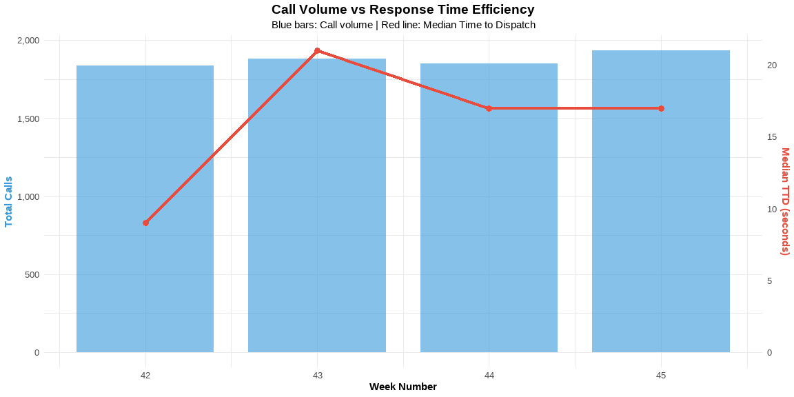

This dual-axis chart allows quick visual assessment of whether call volume changes correlate with dispatch efficiency. Inverse relationships (volume ↑, TTD ↑) may indicate capacity constraints.

### Priority-Level Efficiency Analysis


<div class="tabwid"><style>.cl-a6d4395c{}.cl-a6ca36e6{font-family:'Arial';font-size:9pt;font-weight:bold;font-style:normal;text-decoration:none;color:rgba(0, 0, 0, 1.00);background-color:transparent;}.cl-a6ca36f0{font-family:'Arial';font-size:9pt;font-weight:normal;font-style:normal;text-decoration:none;color:rgba(0, 0, 0, 1.00);background-color:transparent;}.cl-a6ce159a{margin:0;text-align:left;border-bottom: 0 solid rgba(0, 0, 0, 1.00);border-top: 0 solid rgba(0, 0, 0, 1.00);border-left: 0 solid rgba(0, 0, 0, 1.00);border-right: 0 solid rgba(0, 0, 0, 1.00);padding-bottom:3pt;padding-top:3pt;padding-left:3pt;padding-right:3pt;line-height: 1;background-color:transparent;}.cl-a6ce15a4{margin:0;text-align:right;border-bottom: 0 solid rgba(0, 0, 0, 1.00);border-top: 0 solid rgba(0, 0, 0, 1.00);border-left: 0 solid rgba(0, 0, 0, 1.00);border-right: 0 solid rgba(0, 0, 0, 1.00);padding-bottom:3pt;padding-top:3pt;padding-left:3pt;padding-right:3pt;line-height: 1;background-color:transparent;}.cl-a6ce3e9e{width:0.649in;background-color:transparent;vertical-align: middle;border-bottom: 1.5pt solid rgba(102, 102, 102, 1.00);border-top: 1.5pt solid rgba(102, 102, 102, 1.00);border-left: 0 solid rgba(0, 0, 0, 1.00);border-right: 0 solid rgba(0, 0, 0, 1.00);margin-bottom:0;margin-top:0;margin-left:0;margin-right:0;}.cl-a6ce3ea8{width:0.51in;background-color:transparent;vertical-align: middle;border-bottom: 1.5pt solid rgba(102, 102, 102, 1.00);border-top: 1.5pt solid rgba(102, 102, 102, 1.00);border-left: 0 solid rgba(0, 0, 0, 1.00);border-right: 0 solid rgba(0, 0, 0, 1.00);margin-bottom:0;margin-top:0;margin-left:0;margin-right:0;}.cl-a6ce3eb2{width:0.933in;background-color:transparent;vertical-align: middle;border-bottom: 1.5pt solid rgba(102, 102, 102, 1.00);border-top: 1.5pt solid rgba(102, 102, 102, 1.00);border-left: 0 solid rgba(0, 0, 0, 1.00);border-right: 0 solid rgba(0, 0, 0, 1.00);margin-bottom:0;margin-top:0;margin-left:0;margin-right:0;}.cl-a6ce3ebc{width:0.85in;background-color:transparent;vertical-align: middle;border-bottom: 1.5pt solid rgba(102, 102, 102, 1.00);border-top: 1.5pt solid rgba(102, 102, 102, 1.00);border-left: 0 solid rgba(0, 0, 0, 1.00);border-right: 0 solid rgba(0, 0, 0, 1.00);margin-bottom:0;margin-top:0;margin-left:0;margin-right:0;}.cl-a6ce3ebd{width:0.926in;background-color:transparent;vertical-align: middle;border-bottom: 1.5pt solid rgba(102, 102, 102, 1.00);border-top: 1.5pt solid rgba(102, 102, 102, 1.00);border-left: 0 solid rgba(0, 0, 0, 1.00);border-right: 0 solid rgba(0, 0, 0, 1.00);margin-bottom:0;margin-top:0;margin-left:0;margin-right:0;}.cl-a6ce3ebe{width:0.843in;background-color:transparent;vertical-align: middle;border-bottom: 1.5pt solid rgba(102, 102, 102, 1.00);border-top: 1.5pt solid rgba(102, 102, 102, 1.00);border-left: 0 solid rgba(0, 0, 0, 1.00);border-right: 0 solid rgba(0, 0, 0, 1.00);margin-bottom:0;margin-top:0;margin-left:0;margin-right:0;}.cl-a6ce3ec6{width:1.065in;background-color:transparent;vertical-align: middle;border-bottom: 1.5pt solid rgba(102, 102, 102, 1.00);border-top: 1.5pt solid rgba(102, 102, 102, 1.00);border-left: 0 solid rgba(0, 0, 0, 1.00);border-right: 0 solid rgba(0, 0, 0, 1.00);margin-bottom:0;margin-top:0;margin-left:0;margin-right:0;}.cl-a6ce3ed0{width:0.982in;background-color:transparent;vertical-align: middle;border-bottom: 1.5pt solid rgba(102, 102, 102, 1.00);border-top: 1.5pt solid rgba(102, 102, 102, 1.00);border-left: 0 solid rgba(0, 0, 0, 1.00);border-right: 0 solid rgba(0, 0, 0, 1.00);margin-bottom:0;margin-top:0;margin-left:0;margin-right:0;}.cl-a6ce3ed1{width:1.17in;background-color:transparent;vertical-align: middle;border-bottom: 1.5pt solid rgba(102, 102, 102, 1.00);border-top: 1.5pt solid rgba(102, 102, 102, 1.00);border-left: 0 solid rgba(0, 0, 0, 1.00);border-right: 0 solid rgba(0, 0, 0, 1.00);margin-bottom:0;margin-top:0;margin-left:0;margin-right:0;}.cl-a6ce3eda{width:0.878in;background-color:transparent;vertical-align: middle;border-bottom: 1.5pt solid rgba(102, 102, 102, 1.00);border-top: 1.5pt solid rgba(102, 102, 102, 1.00);border-left: 0 solid rgba(0, 0, 0, 1.00);border-right: 0 solid rgba(0, 0, 0, 1.00);margin-bottom:0;margin-top:0;margin-left:0;margin-right:0;}.cl-a6ce3edb{width:0.649in;background-color:rgba(245, 245, 245, 1.00);vertical-align: middle;border-bottom: 0 solid rgba(0, 0, 0, 1.00);border-top: 0 solid rgba(0, 0, 0, 1.00);border-left: 0 solid rgba(0, 0, 0, 1.00);border-right: 0 solid rgba(0, 0, 0, 1.00);margin-bottom:0;margin-top:0;margin-left:0;margin-right:0;}.cl-a6ce3edc{width:0.51in;background-color:rgba(245, 245, 245, 1.00);vertical-align: middle;border-bottom: 0 solid rgba(0, 0, 0, 1.00);border-top: 0 solid rgba(0, 0, 0, 1.00);border-left: 0 solid rgba(0, 0, 0, 1.00);border-right: 0 solid rgba(0, 0, 0, 1.00);margin-bottom:0;margin-top:0;margin-left:0;margin-right:0;}.cl-a6ce3ee4{width:0.933in;background-color:rgba(245, 245, 245, 1.00);vertical-align: middle;border-bottom: 0 solid rgba(0, 0, 0, 1.00);border-top: 0 solid rgba(0, 0, 0, 1.00);border-left: 0 solid rgba(0, 0, 0, 1.00);border-right: 0 solid rgba(0, 0, 0, 1.00);margin-bottom:0;margin-top:0;margin-left:0;margin-right:0;}.cl-a6ce3ee5{width:0.85in;background-color:rgba(245, 245, 245, 1.00);vertical-align: middle;border-bottom: 0 solid rgba(0, 0, 0, 1.00);border-top: 0 solid rgba(0, 0, 0, 1.00);border-left: 0 solid rgba(0, 0, 0, 1.00);border-right: 0 solid rgba(0, 0, 0, 1.00);margin-bottom:0;margin-top:0;margin-left:0;margin-right:0;}.cl-a6ce3eee{width:0.926in;background-color:rgba(245, 245, 245, 1.00);vertical-align: middle;border-bottom: 0 solid rgba(0, 0, 0, 1.00);border-top: 0 solid rgba(0, 0, 0, 1.00);border-left: 0 solid rgba(0, 0, 0, 1.00);border-right: 0 solid rgba(0, 0, 0, 1.00);margin-bottom:0;margin-top:0;margin-left:0;margin-right:0;}.cl-a6ce3eef{width:0.843in;background-color:rgba(245, 245, 245, 1.00);vertical-align: middle;border-bottom: 0 solid rgba(0, 0, 0, 1.00);border-top: 0 solid rgba(0, 0, 0, 1.00);border-left: 0 solid rgba(0, 0, 0, 1.00);border-right: 0 solid rgba(0, 0, 0, 1.00);margin-bottom:0;margin-top:0;margin-left:0;margin-right:0;}.cl-a6ce3ef0{width:1.065in;background-color:rgba(245, 245, 245, 1.00);vertical-align: middle;border-bottom: 0 solid rgba(0, 0, 0, 1.00);border-top: 0 solid rgba(0, 0, 0, 1.00);border-left: 0 solid rgba(0, 0, 0, 1.00);border-right: 0 solid rgba(0, 0, 0, 1.00);margin-bottom:0;margin-top:0;margin-left:0;margin-right:0;}.cl-a6ce3ef8{width:0.982in;background-color:rgba(245, 245, 245, 1.00);vertical-align: middle;border-bottom: 0 solid rgba(0, 0, 0, 1.00);border-top: 0 solid rgba(0, 0, 0, 1.00);border-left: 0 solid rgba(0, 0, 0, 1.00);border-right: 0 solid rgba(0, 0, 0, 1.00);margin-bottom:0;margin-top:0;margin-left:0;margin-right:0;}.cl-a6ce3ef9{width:1.17in;background-color:rgba(245, 245, 245, 1.00);vertical-align: middle;border-bottom: 0 solid rgba(0, 0, 0, 1.00);border-top: 0 solid rgba(0, 0, 0, 1.00);border-left: 0 solid rgba(0, 0, 0, 1.00);border-right: 0 solid rgba(0, 0, 0, 1.00);margin-bottom:0;margin-top:0;margin-left:0;margin-right:0;}.cl-a6ce3f02{width:0.878in;background-color:rgba(245, 245, 245, 1.00);vertical-align: middle;border-bottom: 0 solid rgba(0, 0, 0, 1.00);border-top: 0 solid rgba(0, 0, 0, 1.00);border-left: 0 solid rgba(0, 0, 0, 1.00);border-right: 0 solid rgba(0, 0, 0, 1.00);margin-bottom:0;margin-top:0;margin-left:0;margin-right:0;}.cl-a6ce3f03{width:0.649in;background-color:transparent;vertical-align: middle;border-bottom: 0 solid rgba(0, 0, 0, 1.00);border-top: 0 solid rgba(0, 0, 0, 1.00);border-left: 0 solid rgba(0, 0, 0, 1.00);border-right: 0 solid rgba(0, 0, 0, 1.00);margin-bottom:0;margin-top:0;margin-left:0;margin-right:0;}.cl-a6ce3f0c{width:0.51in;background-color:transparent;vertical-align: middle;border-bottom: 0 solid rgba(0, 0, 0, 1.00);border-top: 0 solid rgba(0, 0, 0, 1.00);border-left: 0 solid rgba(0, 0, 0, 1.00);border-right: 0 solid rgba(0, 0, 0, 1.00);margin-bottom:0;margin-top:0;margin-left:0;margin-right:0;}.cl-a6ce3f16{width:0.933in;background-color:transparent;vertical-align: middle;border-bottom: 0 solid rgba(0, 0, 0, 1.00);border-top: 0 solid rgba(0, 0, 0, 1.00);border-left: 0 solid rgba(0, 0, 0, 1.00);border-right: 0 solid rgba(0, 0, 0, 1.00);margin-bottom:0;margin-top:0;margin-left:0;margin-right:0;}.cl-a6ce3f17{width:0.85in;background-color:transparent;vertical-align: middle;border-bottom: 0 solid rgba(0, 0, 0, 1.00);border-top: 0 solid rgba(0, 0, 0, 1.00);border-left: 0 solid rgba(0, 0, 0, 1.00);border-right: 0 solid rgba(0, 0, 0, 1.00);margin-bottom:0;margin-top:0;margin-left:0;margin-right:0;}.cl-a6ce3f20{width:0.926in;background-color:transparent;vertical-align: middle;border-bottom: 0 solid rgba(0, 0, 0, 1.00);border-top: 0 solid rgba(0, 0, 0, 1.00);border-left: 0 solid rgba(0, 0, 0, 1.00);border-right: 0 solid rgba(0, 0, 0, 1.00);margin-bottom:0;margin-top:0;margin-left:0;margin-right:0;}.cl-a6ce3f2a{width:0.843in;background-color:transparent;vertical-align: middle;border-bottom: 0 solid rgba(0, 0, 0, 1.00);border-top: 0 solid rgba(0, 0, 0, 1.00);border-left: 0 solid rgba(0, 0, 0, 1.00);border-right: 0 solid rgba(0, 0, 0, 1.00);margin-bottom:0;margin-top:0;margin-left:0;margin-right:0;}.cl-a6ce3f2b{width:1.065in;background-color:transparent;vertical-align: middle;border-bottom: 0 solid rgba(0, 0, 0, 1.00);border-top: 0 solid rgba(0, 0, 0, 1.00);border-left: 0 solid rgba(0, 0, 0, 1.00);border-right: 0 solid rgba(0, 0, 0, 1.00);margin-bottom:0;margin-top:0;margin-left:0;margin-right:0;}.cl-a6ce3f2c{width:0.982in;background-color:transparent;vertical-align: middle;border-bottom: 0 solid rgba(0, 0, 0, 1.00);border-top: 0 solid rgba(0, 0, 0, 1.00);border-left: 0 solid rgba(0, 0, 0, 1.00);border-right: 0 solid rgba(0, 0, 0, 1.00);margin-bottom:0;margin-top:0;margin-left:0;margin-right:0;}.cl-a6ce3f34{width:1.17in;background-color:transparent;vertical-align: middle;border-bottom: 0 solid rgba(0, 0, 0, 1.00);border-top: 0 solid rgba(0, 0, 0, 1.00);border-left: 0 solid rgba(0, 0, 0, 1.00);border-right: 0 solid rgba(0, 0, 0, 1.00);margin-bottom:0;margin-top:0;margin-left:0;margin-right:0;}.cl-a6ce3f35{width:0.878in;background-color:transparent;vertical-align: middle;border-bottom: 0 solid rgba(0, 0, 0, 1.00);border-top: 0 solid rgba(0, 0, 0, 1.00);border-left: 0 solid rgba(0, 0, 0, 1.00);border-right: 0 solid rgba(0, 0, 0, 1.00);margin-bottom:0;margin-top:0;margin-left:0;margin-right:0;}.cl-a6ce3f36{width:0.649in;background-color:rgba(245, 245, 245, 1.00);vertical-align: middle;border-bottom: 0 solid rgba(0, 0, 0, 1.00);border-top: 0 solid rgba(0, 0, 0, 1.00);border-left: 0 solid rgba(0, 0, 0, 1.00);border-right: 0 solid rgba(0, 0, 0, 1.00);margin-bottom:0;margin-top:0;margin-left:0;margin-right:0;}.cl-a6ce3f3e{width:0.51in;background-color:rgba(245, 245, 245, 1.00);vertical-align: middle;border-bottom: 0 solid rgba(0, 0, 0, 1.00);border-top: 0 solid rgba(0, 0, 0, 1.00);border-left: 0 solid rgba(0, 0, 0, 1.00);border-right: 0 solid rgba(0, 0, 0, 1.00);margin-bottom:0;margin-top:0;margin-left:0;margin-right:0;}.cl-a6ce3f3f{width:0.933in;background-color:rgba(245, 245, 245, 1.00);vertical-align: middle;border-bottom: 0 solid rgba(0, 0, 0, 1.00);border-top: 0 solid rgba(0, 0, 0, 1.00);border-left: 0 solid rgba(0, 0, 0, 1.00);border-right: 0 solid rgba(0, 0, 0, 1.00);margin-bottom:0;margin-top:0;margin-left:0;margin-right:0;}.cl-a6ce3f40{width:0.85in;background-color:rgba(245, 245, 245, 1.00);vertical-align: middle;border-bottom: 0 solid rgba(0, 0, 0, 1.00);border-top: 0 solid rgba(0, 0, 0, 1.00);border-left: 0 solid rgba(0, 0, 0, 1.00);border-right: 0 solid rgba(0, 0, 0, 1.00);margin-bottom:0;margin-top:0;margin-left:0;margin-right:0;}.cl-a6ce3f48{width:0.926in;background-color:rgba(245, 245, 245, 1.00);vertical-align: middle;border-bottom: 0 solid rgba(0, 0, 0, 1.00);border-top: 0 solid rgba(0, 0, 0, 1.00);border-left: 0 solid rgba(0, 0, 0, 1.00);border-right: 0 solid rgba(0, 0, 0, 1.00);margin-bottom:0;margin-top:0;margin-left:0;margin-right:0;}.cl-a6ce3f49{width:0.843in;background-color:rgba(245, 245, 245, 1.00);vertical-align: middle;border-bottom: 0 solid rgba(0, 0, 0, 1.00);border-top: 0 solid rgba(0, 0, 0, 1.00);border-left: 0 solid rgba(0, 0, 0, 1.00);border-right: 0 solid rgba(0, 0, 0, 1.00);margin-bottom:0;margin-top:0;margin-left:0;margin-right:0;}.cl-a6ce3f52{width:1.065in;background-color:rgba(245, 245, 245, 1.00);vertical-align: middle;border-bottom: 0 solid rgba(0, 0, 0, 1.00);border-top: 0 solid rgba(0, 0, 0, 1.00);border-left: 0 solid rgba(0, 0, 0, 1.00);border-right: 0 solid rgba(0, 0, 0, 1.00);margin-bottom:0;margin-top:0;margin-left:0;margin-right:0;}.cl-a6ce3f53{width:0.982in;background-color:rgba(245, 245, 245, 1.00);vertical-align: middle;border-bottom: 0 solid rgba(0, 0, 0, 1.00);border-top: 0 solid rgba(0, 0, 0, 1.00);border-left: 0 solid rgba(0, 0, 0, 1.00);border-right: 0 solid rgba(0, 0, 0, 1.00);margin-bottom:0;margin-top:0;margin-left:0;margin-right:0;}.cl-a6ce3f5c{width:1.17in;background-color:rgba(245, 245, 245, 1.00);vertical-align: middle;border-bottom: 0 solid rgba(0, 0, 0, 1.00);border-top: 0 solid rgba(0, 0, 0, 1.00);border-left: 0 solid rgba(0, 0, 0, 1.00);border-right: 0 solid rgba(0, 0, 0, 1.00);margin-bottom:0;margin-top:0;margin-left:0;margin-right:0;}.cl-a6ce3f66{width:0.878in;background-color:rgba(245, 245, 245, 1.00);vertical-align: middle;border-bottom: 0 solid rgba(0, 0, 0, 1.00);border-top: 0 solid rgba(0, 0, 0, 1.00);border-left: 0 solid rgba(0, 0, 0, 1.00);border-right: 0 solid rgba(0, 0, 0, 1.00);margin-bottom:0;margin-top:0;margin-left:0;margin-right:0;}.cl-a6ce3f67{width:0.649in;background-color:transparent;vertical-align: middle;border-bottom: 0 solid rgba(0, 0, 0, 1.00);border-top: 0 solid rgba(0, 0, 0, 1.00);border-left: 0 solid rgba(0, 0, 0, 1.00);border-right: 0 solid rgba(0, 0, 0, 1.00);margin-bottom:0;margin-top:0;margin-left:0;margin-right:0;}.cl-a6ce3f68{width:0.51in;background-color:transparent;vertical-align: middle;border-bottom: 0 solid rgba(0, 0, 0, 1.00);border-top: 0 solid rgba(0, 0, 0, 1.00);border-left: 0 solid rgba(0, 0, 0, 1.00);border-right: 0 solid rgba(0, 0, 0, 1.00);margin-bottom:0;margin-top:0;margin-left:0;margin-right:0;}.cl-a6ce3f70{width:0.933in;background-color:transparent;vertical-align: middle;border-bottom: 0 solid rgba(0, 0, 0, 1.00);border-top: 0 solid rgba(0, 0, 0, 1.00);border-left: 0 solid rgba(0, 0, 0, 1.00);border-right: 0 solid rgba(0, 0, 0, 1.00);margin-bottom:0;margin-top:0;margin-left:0;margin-right:0;}.cl-a6ce3f71{width:0.85in;background-color:transparent;vertical-align: middle;border-bottom: 0 solid rgba(0, 0, 0, 1.00);border-top: 0 solid rgba(0, 0, 0, 1.00);border-left: 0 solid rgba(0, 0, 0, 1.00);border-right: 0 solid rgba(0, 0, 0, 1.00);margin-bottom:0;margin-top:0;margin-left:0;margin-right:0;}.cl-a6ce3f7a{width:0.926in;background-color:transparent;vertical-align: middle;border-bottom: 0 solid rgba(0, 0, 0, 1.00);border-top: 0 solid rgba(0, 0, 0, 1.00);border-left: 0 solid rgba(0, 0, 0, 1.00);border-right: 0 solid rgba(0, 0, 0, 1.00);margin-bottom:0;margin-top:0;margin-left:0;margin-right:0;}.cl-a6ce3f7b{width:0.843in;background-color:transparent;vertical-align: middle;border-bottom: 0 solid rgba(0, 0, 0, 1.00);border-top: 0 solid rgba(0, 0, 0, 1.00);border-left: 0 solid rgba(0, 0, 0, 1.00);border-right: 0 solid rgba(0, 0, 0, 1.00);margin-bottom:0;margin-top:0;margin-left:0;margin-right:0;}.cl-a6ce3f84{width:1.065in;background-color:transparent;vertical-align: middle;border-bottom: 0 solid rgba(0, 0, 0, 1.00);border-top: 0 solid rgba(0, 0, 0, 1.00);border-left: 0 solid rgba(0, 0, 0, 1.00);border-right: 0 solid rgba(0, 0, 0, 1.00);margin-bottom:0;margin-top:0;margin-left:0;margin-right:0;}.cl-a6ce3f85{width:0.982in;background-color:transparent;vertical-align: middle;border-bottom: 0 solid rgba(0, 0, 0, 1.00);border-top: 0 solid rgba(0, 0, 0, 1.00);border-left: 0 solid rgba(0, 0, 0, 1.00);border-right: 0 solid rgba(0, 0, 0, 1.00);margin-bottom:0;margin-top:0;margin-left:0;margin-right:0;}.cl-a6ce3f86{width:1.17in;background-color:transparent;vertical-align: middle;border-bottom: 0 solid rgba(0, 0, 0, 1.00);border-top: 0 solid rgba(0, 0, 0, 1.00);border-left: 0 solid rgba(0, 0, 0, 1.00);border-right: 0 solid rgba(0, 0, 0, 1.00);margin-bottom:0;margin-top:0;margin-left:0;margin-right:0;}.cl-a6ce3f8e{width:0.878in;background-color:transparent;vertical-align: middle;border-bottom: 0 solid rgba(0, 0, 0, 1.00);border-top: 0 solid rgba(0, 0, 0, 1.00);border-left: 0 solid rgba(0, 0, 0, 1.00);border-right: 0 solid rgba(0, 0, 0, 1.00);margin-bottom:0;margin-top:0;margin-left:0;margin-right:0;}.cl-a6ce3f8f{width:0.649in;background-color:transparent;vertical-align: middle;border-bottom: 1.5pt solid rgba(102, 102, 102, 1.00);border-top: 0 solid rgba(0, 0, 0, 1.00);border-left: 0 solid rgba(0, 0, 0, 1.00);border-right: 0 solid rgba(0, 0, 0, 1.00);margin-bottom:0;margin-top:0;margin-left:0;margin-right:0;}.cl-a6ce3f90{width:0.51in;background-color:transparent;vertical-align: middle;border-bottom: 1.5pt solid rgba(102, 102, 102, 1.00);border-top: 0 solid rgba(0, 0, 0, 1.00);border-left: 0 solid rgba(0, 0, 0, 1.00);border-right: 0 solid rgba(0, 0, 0, 1.00);margin-bottom:0;margin-top:0;margin-left:0;margin-right:0;}.cl-a6ce3f98{width:0.933in;background-color:transparent;vertical-align: middle;border-bottom: 1.5pt solid rgba(102, 102, 102, 1.00);border-top: 0 solid rgba(0, 0, 0, 1.00);border-left: 0 solid rgba(0, 0, 0, 1.00);border-right: 0 solid rgba(0, 0, 0, 1.00);margin-bottom:0;margin-top:0;margin-left:0;margin-right:0;}.cl-a6ce3f99{width:0.85in;background-color:transparent;vertical-align: middle;border-bottom: 1.5pt solid rgba(102, 102, 102, 1.00);border-top: 0 solid rgba(0, 0, 0, 1.00);border-left: 0 solid rgba(0, 0, 0, 1.00);border-right: 0 solid rgba(0, 0, 0, 1.00);margin-bottom:0;margin-top:0;margin-left:0;margin-right:0;}.cl-a6ce3fa2{width:0.926in;background-color:transparent;vertical-align: middle;border-bottom: 1.5pt solid rgba(102, 102, 102, 1.00);border-top: 0 solid rgba(0, 0, 0, 1.00);border-left: 0 solid rgba(0, 0, 0, 1.00);border-right: 0 solid rgba(0, 0, 0, 1.00);margin-bottom:0;margin-top:0;margin-left:0;margin-right:0;}.cl-a6ce3fa3{width:0.843in;background-color:transparent;vertical-align: middle;border-bottom: 1.5pt solid rgba(102, 102, 102, 1.00);border-top: 0 solid rgba(0, 0, 0, 1.00);border-left: 0 solid rgba(0, 0, 0, 1.00);border-right: 0 solid rgba(0, 0, 0, 1.00);margin-bottom:0;margin-top:0;margin-left:0;margin-right:0;}.cl-a6ce3fa4{width:1.065in;background-color:transparent;vertical-align: middle;border-bottom: 1.5pt solid rgba(102, 102, 102, 1.00);border-top: 0 solid rgba(0, 0, 0, 1.00);border-left: 0 solid rgba(0, 0, 0, 1.00);border-right: 0 solid rgba(0, 0, 0, 1.00);margin-bottom:0;margin-top:0;margin-left:0;margin-right:0;}.cl-a6ce3fac{width:0.982in;background-color:transparent;vertical-align: middle;border-bottom: 1.5pt solid rgba(102, 102, 102, 1.00);border-top: 0 solid rgba(0, 0, 0, 1.00);border-left: 0 solid rgba(0, 0, 0, 1.00);border-right: 0 solid rgba(0, 0, 0, 1.00);margin-bottom:0;margin-top:0;margin-left:0;margin-right:0;}.cl-a6ce3fb6{width:1.17in;background-color:transparent;vertical-align: middle;border-bottom: 1.5pt solid rgba(102, 102, 102, 1.00);border-top: 0 solid rgba(0, 0, 0, 1.00);border-left: 0 solid rgba(0, 0, 0, 1.00);border-right: 0 solid rgba(0, 0, 0, 1.00);margin-bottom:0;margin-top:0;margin-left:0;margin-right:0;}.cl-a6ce3fb7{width:0.878in;background-color:transparent;vertical-align: middle;border-bottom: 1.5pt solid rgba(102, 102, 102, 1.00);border-top: 0 solid rgba(0, 0, 0, 1.00);border-left: 0 solid rgba(0, 0, 0, 1.00);border-right: 0 solid rgba(0, 0, 0, 1.00);margin-bottom:0;margin-top:0;margin-left:0;margin-right:0;}.tabwid {
  font-size: initial;
  padding-bottom: 1em;
}

.tabwid table{
  border-spacing:0px !important;
  border-collapse:collapse;
  line-height:1;
  margin-left:auto;
  margin-right:auto;
  border-width: 0;
  border-color: transparent;
  caption-side: top;
}
.tabwid-caption-bottom table{
  caption-side: bottom;
}
.tabwid_left table{
  margin-left:0;
}
.tabwid_right table{
  margin-right:0;
}
.tabwid td, .tabwid th {
    padding: 0;
}
.tabwid a {
  text-decoration: none;
}
.tabwid thead {
    background-color: transparent;
}
.tabwid tfoot {
    background-color: transparent;
}
.tabwid table tr {
background-color: transparent;
}
.katex-display {
    margin: 0 0 !important;
}</style><table data-quarto-disable-processing='true' class='cl-a6d4395c'><thead><tr style="overflow-wrap:break-word;"><th class="cl-a6ce3e9e"><p class="cl-a6ce159a"><span class="cl-a6ca36e6">Priority</span></p></th><th class="cl-a6ce3ea8"><p class="cl-a6ce15a4"><span class="cl-a6ca36e6">Calls</span></p></th><th class="cl-a6ce3eb2"><p class="cl-a6ce15a4"><span class="cl-a6ca36e6">Med TTQ (s)</span></p></th><th class="cl-a6ce3ebc"><p class="cl-a6ce15a4"><span class="cl-a6ca36e6">Mean_TTQ</span></p></th><th class="cl-a6ce3ebd"><p class="cl-a6ce15a4"><span class="cl-a6ca36e6">Med TTD (s)</span></p></th><th class="cl-a6ce3ebe"><p class="cl-a6ce15a4"><span class="cl-a6ca36e6">Mean_TTD</span></p></th><th class="cl-a6ce3ec6"><p class="cl-a6ce15a4"><span class="cl-a6ca36e6">Med Phone (s)</span></p></th><th class="cl-a6ce3ed0"><p class="cl-a6ce15a4"><span class="cl-a6ca36e6">Mean_Phone</span></p></th><th class="cl-a6ce3ed1"><p class="cl-a6ce15a4"><span class="cl-a6ca36e6">Med Process (s)</span></p></th><th class="cl-a6ce3eda"><p class="cl-a6ce159a"><span class="cl-a6ca36e6">SLA Target</span></p></th></tr></thead><tbody><tr style="overflow-wrap:break-word;"><td class="cl-a6ce3edb"><p class="cl-a6ce159a"><span class="cl-a6ca36f0">01</span></p></td><td class="cl-a6ce3edc"><p class="cl-a6ce15a4"><span class="cl-a6ca36f0">328</span></p></td><td class="cl-a6ce3ee4"><p class="cl-a6ce15a4"><span class="cl-a6ca36f0">35.0</span></p></td><td class="cl-a6ce3ee5"><p class="cl-a6ce15a4"><span class="cl-a6ca36f0">38.1</span></p></td><td class="cl-a6ce3eee"><p class="cl-a6ce15a4"><span class="cl-a6ca36f0">2.0</span></p></td><td class="cl-a6ce3eef"><p class="cl-a6ce15a4"><span class="cl-a6ca36f0">11.3</span></p></td><td class="cl-a6ce3ef0"><p class="cl-a6ce15a4"><span class="cl-a6ca36f0">224</span></p></td><td class="cl-a6ce3ef8"><p class="cl-a6ce15a4"><span class="cl-a6ca36f0">290.1</span></p></td><td class="cl-a6ce3ef9"><p class="cl-a6ce15a4"><span class="cl-a6ca36f0">40.5</span></p></td><td class="cl-a6ce3f02"><p class="cl-a6ce159a"><span class="cl-a6ca36f0">60s</span></p></td></tr><tr style="overflow-wrap:break-word;"><td class="cl-a6ce3f03"><p class="cl-a6ce159a"><span class="cl-a6ca36f0">02</span></p></td><td class="cl-a6ce3f0c"><p class="cl-a6ce15a4"><span class="cl-a6ca36f0">837</span></p></td><td class="cl-a6ce3f16"><p class="cl-a6ce15a4"><span class="cl-a6ca36f0">30.0</span></p></td><td class="cl-a6ce3f17"><p class="cl-a6ce15a4"><span class="cl-a6ca36f0">54.0</span></p></td><td class="cl-a6ce3f20"><p class="cl-a6ce15a4"><span class="cl-a6ca36f0">31.0</span></p></td><td class="cl-a6ce3f2a"><p class="cl-a6ce15a4"><span class="cl-a6ca36f0">505.0</span></p></td><td class="cl-a6ce3f2b"><p class="cl-a6ce15a4"><span class="cl-a6ca36f0">95</span></p></td><td class="cl-a6ce3f2c"><p class="cl-a6ce15a4"><span class="cl-a6ca36f0">211.7</span></p></td><td class="cl-a6ce3f34"><p class="cl-a6ce15a4"><span class="cl-a6ca36f0">94.0</span></p></td><td class="cl-a6ce3f35"><p class="cl-a6ce159a"><span class="cl-a6ca36f0">120s</span></p></td></tr><tr style="overflow-wrap:break-word;"><td class="cl-a6ce3f36"><p class="cl-a6ce159a"><span class="cl-a6ca36f0">03</span></p></td><td class="cl-a6ce3f3e"><p class="cl-a6ce15a4"><span class="cl-a6ca36f0">300</span></p></td><td class="cl-a6ce3f3f"><p class="cl-a6ce15a4"><span class="cl-a6ca36f0">51.0</span></p></td><td class="cl-a6ce3f40"><p class="cl-a6ce15a4"><span class="cl-a6ca36f0">77.7</span></p></td><td class="cl-a6ce3f48"><p class="cl-a6ce15a4"><span class="cl-a6ca36f0">3.0</span></p></td><td class="cl-a6ce3f49"><p class="cl-a6ce15a4"><span class="cl-a6ca36f0">1,210.9</span></p></td><td class="cl-a6ce3f52"><p class="cl-a6ce15a4"><span class="cl-a6ca36f0">147</span></p></td><td class="cl-a6ce3f53"><p class="cl-a6ce15a4"><span class="cl-a6ca36f0">223.9</span></p></td><td class="cl-a6ce3f5c"><p class="cl-a6ce15a4"><span class="cl-a6ca36f0">77.5</span></p></td><td class="cl-a6ce3f66"><p class="cl-a6ce159a"><span class="cl-a6ca36f0">600s</span></p></td></tr><tr style="overflow-wrap:break-word;"><td class="cl-a6ce3f67"><p class="cl-a6ce159a"><span class="cl-a6ca36f0">04</span></p></td><td class="cl-a6ce3f68"><p class="cl-a6ce15a4"><span class="cl-a6ca36f0">396</span></p></td><td class="cl-a6ce3f70"><p class="cl-a6ce15a4"><span class="cl-a6ca36f0">59.5</span></p></td><td class="cl-a6ce3f71"><p class="cl-a6ce15a4"><span class="cl-a6ca36f0">88.8</span></p></td><td class="cl-a6ce3f7a"><p class="cl-a6ce15a4"><span class="cl-a6ca36f0">819.5</span></p></td><td class="cl-a6ce3f7b"><p class="cl-a6ce15a4"><span class="cl-a6ca36f0">3,824.9</span></p></td><td class="cl-a6ce3f84"><p class="cl-a6ce15a4"><span class="cl-a6ca36f0">140</span></p></td><td class="cl-a6ce3f85"><p class="cl-a6ce15a4"><span class="cl-a6ca36f0">262.1</span></p></td><td class="cl-a6ce3f86"><p class="cl-a6ce15a4"><span class="cl-a6ca36f0">864.5</span></p></td><td class="cl-a6ce3f8e"><p class="cl-a6ce159a"><span class="cl-a6ca36f0">3600s</span></p></td></tr><tr style="overflow-wrap:break-word;"><td class="cl-a6ce3edb"><p class="cl-a6ce159a"><span class="cl-a6ca36f0">08</span></p></td><td class="cl-a6ce3edc"><p class="cl-a6ce15a4"><span class="cl-a6ca36f0">68</span></p></td><td class="cl-a6ce3ee4"><p class="cl-a6ce15a4"><span class="cl-a6ca36f0">0.0</span></p></td><td class="cl-a6ce3ee5"><p class="cl-a6ce15a4"><span class="cl-a6ca36f0">1.3</span></p></td><td class="cl-a6ce3eee"><p class="cl-a6ce15a4"><span class="cl-a6ca36f0">0.0</span></p></td><td class="cl-a6ce3eef"><p class="cl-a6ce15a4"><span class="cl-a6ca36f0">1.0</span></p></td><td class="cl-a6ce3ef0"><p class="cl-a6ce15a4"><span class="cl-a6ca36f0">0</span></p></td><td class="cl-a6ce3ef8"><p class="cl-a6ce15a4"><span class="cl-a6ca36f0">2.3</span></p></td><td class="cl-a6ce3ef9"><p class="cl-a6ce15a4"><span class="cl-a6ca36f0">0.0</span></p></td><td class="cl-a6ce3f02"><p class="cl-a6ce159a"><span class="cl-a6ca36f0">—</span></p></td></tr><tr style="overflow-wrap:break-word;"><td class="cl-a6ce3f8f"><p class="cl-a6ce159a"><span class="cl-a6ca36f0">10</span></p></td><td class="cl-a6ce3f90"><p class="cl-a6ce15a4"><span class="cl-a6ca36f0">5</span></p></td><td class="cl-a6ce3f98"><p class="cl-a6ce15a4"><span class="cl-a6ca36f0">39.0</span></p></td><td class="cl-a6ce3f99"><p class="cl-a6ce15a4"><span class="cl-a6ca36f0">3,369.2</span></p></td><td class="cl-a6ce3fa2"><p class="cl-a6ce15a4"><span class="cl-a6ca36f0">2.0</span></p></td><td class="cl-a6ce3fa3"><p class="cl-a6ce15a4"><span class="cl-a6ca36f0">-3,323.0</span></p></td><td class="cl-a6ce3fa4"><p class="cl-a6ce15a4"><span class="cl-a6ca36f0">61</span></p></td><td class="cl-a6ce3fac"><p class="cl-a6ce15a4"><span class="cl-a6ca36f0">157.6</span></p></td><td class="cl-a6ce3fb6"><p class="cl-a6ce15a4"><span class="cl-a6ca36f0">47.0</span></p></td><td class="cl-a6ce3fb7"><p class="cl-a6ce159a"><span class="cl-a6ca36f0">—</span></p></td></tr></tbody></table></div>


Priority 1 calls have a median Time to Dispatch of 2 seconds, which is within the SLA target of 60 seconds.

### Call Type Complexity Analysis

<div class="tabwid"><style>.cl-a749080e{}.cl-a73f1d8a{font-family:'Arial';font-size:9pt;font-weight:bold;font-style:normal;text-decoration:none;color:rgba(0, 0, 0, 1.00);background-color:transparent;}.cl-a73f1d94{font-family:'Arial';font-size:9pt;font-weight:normal;font-style:normal;text-decoration:none;color:rgba(0, 0, 0, 1.00);background-color:transparent;}.cl-a74312b4{margin:0;text-align:left;border-bottom: 0 solid rgba(0, 0, 0, 1.00);border-top: 0 solid rgba(0, 0, 0, 1.00);border-left: 0 solid rgba(0, 0, 0, 1.00);border-right: 0 solid rgba(0, 0, 0, 1.00);padding-bottom:3pt;padding-top:3pt;padding-left:3pt;padding-right:3pt;line-height: 1;background-color:transparent;}.cl-a74312be{margin:0;text-align:right;border-bottom: 0 solid rgba(0, 0, 0, 1.00);border-top: 0 solid rgba(0, 0, 0, 1.00);border-left: 0 solid rgba(0, 0, 0, 1.00);border-right: 0 solid rgba(0, 0, 0, 1.00);padding-bottom:3pt;padding-top:3pt;padding-left:3pt;padding-right:3pt;line-height: 1;background-color:transparent;}.cl-a7433c4e{width:2.128in;background-color:transparent;vertical-align: middle;border-bottom: 1.5pt solid rgba(102, 102, 102, 1.00);border-top: 1.5pt solid rgba(102, 102, 102, 1.00);border-left: 0 solid rgba(0, 0, 0, 1.00);border-right: 0 solid rgba(0, 0, 0, 1.00);margin-bottom:0;margin-top:0;margin-left:0;margin-right:0;}.cl-a7433c58{width:0.67in;background-color:transparent;vertical-align: middle;border-bottom: 1.5pt solid rgba(102, 102, 102, 1.00);border-top: 1.5pt solid rgba(102, 102, 102, 1.00);border-left: 0 solid rgba(0, 0, 0, 1.00);border-right: 0 solid rgba(0, 0, 0, 1.00);margin-bottom:0;margin-top:0;margin-left:0;margin-right:0;}.cl-a7433c59{width:0.51in;background-color:transparent;vertical-align: middle;border-bottom: 1.5pt solid rgba(102, 102, 102, 1.00);border-top: 1.5pt solid rgba(102, 102, 102, 1.00);border-left: 0 solid rgba(0, 0, 0, 1.00);border-right: 0 solid rgba(0, 0, 0, 1.00);margin-bottom:0;margin-top:0;margin-left:0;margin-right:0;}.cl-a7433c62{width:1.17in;background-color:transparent;vertical-align: middle;border-bottom: 1.5pt solid rgba(102, 102, 102, 1.00);border-top: 1.5pt solid rgba(102, 102, 102, 1.00);border-left: 0 solid rgba(0, 0, 0, 1.00);border-right: 0 solid rgba(0, 0, 0, 1.00);margin-bottom:0;margin-top:0;margin-left:0;margin-right:0;}.cl-a7433c6c{width:1.239in;background-color:transparent;vertical-align: middle;border-bottom: 1.5pt solid rgba(102, 102, 102, 1.00);border-top: 1.5pt solid rgba(102, 102, 102, 1.00);border-left: 0 solid rgba(0, 0, 0, 1.00);border-right: 0 solid rgba(0, 0, 0, 1.00);margin-bottom:0;margin-top:0;margin-left:0;margin-right:0;}.cl-a7433c76{width:0.885in;background-color:transparent;vertical-align: middle;border-bottom: 1.5pt solid rgba(102, 102, 102, 1.00);border-top: 1.5pt solid rgba(102, 102, 102, 1.00);border-left: 0 solid rgba(0, 0, 0, 1.00);border-right: 0 solid rgba(0, 0, 0, 1.00);margin-bottom:0;margin-top:0;margin-left:0;margin-right:0;}.cl-a7433c77{width:0.76in;background-color:transparent;vertical-align: middle;border-bottom: 1.5pt solid rgba(102, 102, 102, 1.00);border-top: 1.5pt solid rgba(102, 102, 102, 1.00);border-left: 0 solid rgba(0, 0, 0, 1.00);border-right: 0 solid rgba(0, 0, 0, 1.00);margin-bottom:0;margin-top:0;margin-left:0;margin-right:0;}.cl-a7433c80{width:2.128in;background-color:rgba(245, 245, 245, 1.00);vertical-align: middle;border-bottom: 0 solid rgba(0, 0, 0, 1.00);border-top: 0 solid rgba(0, 0, 0, 1.00);border-left: 0 solid rgba(0, 0, 0, 1.00);border-right: 0 solid rgba(0, 0, 0, 1.00);margin-bottom:0;margin-top:0;margin-left:0;margin-right:0;}.cl-a7433c81{width:0.67in;background-color:rgba(245, 245, 245, 1.00);vertical-align: middle;border-bottom: 0 solid rgba(0, 0, 0, 1.00);border-top: 0 solid rgba(0, 0, 0, 1.00);border-left: 0 solid rgba(0, 0, 0, 1.00);border-right: 0 solid rgba(0, 0, 0, 1.00);margin-bottom:0;margin-top:0;margin-left:0;margin-right:0;}.cl-a7433c82{width:0.51in;background-color:rgba(245, 245, 245, 1.00);vertical-align: middle;border-bottom: 0 solid rgba(0, 0, 0, 1.00);border-top: 0 solid rgba(0, 0, 0, 1.00);border-left: 0 solid rgba(0, 0, 0, 1.00);border-right: 0 solid rgba(0, 0, 0, 1.00);margin-bottom:0;margin-top:0;margin-left:0;margin-right:0;}.cl-a7433c8a{width:1.17in;background-color:rgba(245, 245, 245, 1.00);vertical-align: middle;border-bottom: 0 solid rgba(0, 0, 0, 1.00);border-top: 0 solid rgba(0, 0, 0, 1.00);border-left: 0 solid rgba(0, 0, 0, 1.00);border-right: 0 solid rgba(0, 0, 0, 1.00);margin-bottom:0;margin-top:0;margin-left:0;margin-right:0;}.cl-a7433c8b{width:1.239in;background-color:rgba(245, 245, 245, 1.00);vertical-align: middle;border-bottom: 0 solid rgba(0, 0, 0, 1.00);border-top: 0 solid rgba(0, 0, 0, 1.00);border-left: 0 solid rgba(0, 0, 0, 1.00);border-right: 0 solid rgba(0, 0, 0, 1.00);margin-bottom:0;margin-top:0;margin-left:0;margin-right:0;}.cl-a7433c8c{width:0.885in;background-color:rgba(245, 245, 245, 1.00);vertical-align: middle;border-bottom: 0 solid rgba(0, 0, 0, 1.00);border-top: 0 solid rgba(0, 0, 0, 1.00);border-left: 0 solid rgba(0, 0, 0, 1.00);border-right: 0 solid rgba(0, 0, 0, 1.00);margin-bottom:0;margin-top:0;margin-left:0;margin-right:0;}.cl-a7433c94{width:0.76in;background-color:rgba(245, 245, 245, 1.00);vertical-align: middle;border-bottom: 0 solid rgba(0, 0, 0, 1.00);border-top: 0 solid rgba(0, 0, 0, 1.00);border-left: 0 solid rgba(0, 0, 0, 1.00);border-right: 0 solid rgba(0, 0, 0, 1.00);margin-bottom:0;margin-top:0;margin-left:0;margin-right:0;}.cl-a7433c95{width:2.128in;background-color:transparent;vertical-align: middle;border-bottom: 0 solid rgba(0, 0, 0, 1.00);border-top: 0 solid rgba(0, 0, 0, 1.00);border-left: 0 solid rgba(0, 0, 0, 1.00);border-right: 0 solid rgba(0, 0, 0, 1.00);margin-bottom:0;margin-top:0;margin-left:0;margin-right:0;}.cl-a7433c96{width:0.67in;background-color:transparent;vertical-align: middle;border-bottom: 0 solid rgba(0, 0, 0, 1.00);border-top: 0 solid rgba(0, 0, 0, 1.00);border-left: 0 solid rgba(0, 0, 0, 1.00);border-right: 0 solid rgba(0, 0, 0, 1.00);margin-bottom:0;margin-top:0;margin-left:0;margin-right:0;}.cl-a7433c9e{width:0.51in;background-color:transparent;vertical-align: middle;border-bottom: 0 solid rgba(0, 0, 0, 1.00);border-top: 0 solid rgba(0, 0, 0, 1.00);border-left: 0 solid rgba(0, 0, 0, 1.00);border-right: 0 solid rgba(0, 0, 0, 1.00);margin-bottom:0;margin-top:0;margin-left:0;margin-right:0;}.cl-a7433c9f{width:1.17in;background-color:transparent;vertical-align: middle;border-bottom: 0 solid rgba(0, 0, 0, 1.00);border-top: 0 solid rgba(0, 0, 0, 1.00);border-left: 0 solid rgba(0, 0, 0, 1.00);border-right: 0 solid rgba(0, 0, 0, 1.00);margin-bottom:0;margin-top:0;margin-left:0;margin-right:0;}.cl-a7433ca8{width:1.239in;background-color:transparent;vertical-align: middle;border-bottom: 0 solid rgba(0, 0, 0, 1.00);border-top: 0 solid rgba(0, 0, 0, 1.00);border-left: 0 solid rgba(0, 0, 0, 1.00);border-right: 0 solid rgba(0, 0, 0, 1.00);margin-bottom:0;margin-top:0;margin-left:0;margin-right:0;}.cl-a7433ca9{width:0.885in;background-color:transparent;vertical-align: middle;border-bottom: 0 solid rgba(0, 0, 0, 1.00);border-top: 0 solid rgba(0, 0, 0, 1.00);border-left: 0 solid rgba(0, 0, 0, 1.00);border-right: 0 solid rgba(0, 0, 0, 1.00);margin-bottom:0;margin-top:0;margin-left:0;margin-right:0;}.cl-a7433caa{width:0.76in;background-color:transparent;vertical-align: middle;border-bottom: 0 solid rgba(0, 0, 0, 1.00);border-top: 0 solid rgba(0, 0, 0, 1.00);border-left: 0 solid rgba(0, 0, 0, 1.00);border-right: 0 solid rgba(0, 0, 0, 1.00);margin-bottom:0;margin-top:0;margin-left:0;margin-right:0;}.cl-a7433cab{width:2.128in;background-color:rgba(245, 245, 245, 1.00);vertical-align: middle;border-bottom: 0 solid rgba(0, 0, 0, 1.00);border-top: 0 solid rgba(0, 0, 0, 1.00);border-left: 0 solid rgba(0, 0, 0, 1.00);border-right: 0 solid rgba(0, 0, 0, 1.00);margin-bottom:0;margin-top:0;margin-left:0;margin-right:0;}.cl-a7433cb2{width:0.67in;background-color:rgba(245, 245, 245, 1.00);vertical-align: middle;border-bottom: 0 solid rgba(0, 0, 0, 1.00);border-top: 0 solid rgba(0, 0, 0, 1.00);border-left: 0 solid rgba(0, 0, 0, 1.00);border-right: 0 solid rgba(0, 0, 0, 1.00);margin-bottom:0;margin-top:0;margin-left:0;margin-right:0;}.cl-a7433cb3{width:0.51in;background-color:rgba(245, 245, 245, 1.00);vertical-align: middle;border-bottom: 0 solid rgba(0, 0, 0, 1.00);border-top: 0 solid rgba(0, 0, 0, 1.00);border-left: 0 solid rgba(0, 0, 0, 1.00);border-right: 0 solid rgba(0, 0, 0, 1.00);margin-bottom:0;margin-top:0;margin-left:0;margin-right:0;}.cl-a7433cbc{width:1.17in;background-color:rgba(245, 245, 245, 1.00);vertical-align: middle;border-bottom: 0 solid rgba(0, 0, 0, 1.00);border-top: 0 solid rgba(0, 0, 0, 1.00);border-left: 0 solid rgba(0, 0, 0, 1.00);border-right: 0 solid rgba(0, 0, 0, 1.00);margin-bottom:0;margin-top:0;margin-left:0;margin-right:0;}.cl-a7433cc6{width:1.239in;background-color:rgba(245, 245, 245, 1.00);vertical-align: middle;border-bottom: 0 solid rgba(0, 0, 0, 1.00);border-top: 0 solid rgba(0, 0, 0, 1.00);border-left: 0 solid rgba(0, 0, 0, 1.00);border-right: 0 solid rgba(0, 0, 0, 1.00);margin-bottom:0;margin-top:0;margin-left:0;margin-right:0;}.cl-a7433cc7{width:0.885in;background-color:rgba(245, 245, 245, 1.00);vertical-align: middle;border-bottom: 0 solid rgba(0, 0, 0, 1.00);border-top: 0 solid rgba(0, 0, 0, 1.00);border-left: 0 solid rgba(0, 0, 0, 1.00);border-right: 0 solid rgba(0, 0, 0, 1.00);margin-bottom:0;margin-top:0;margin-left:0;margin-right:0;}.cl-a7433cc8{width:0.76in;background-color:rgba(245, 245, 245, 1.00);vertical-align: middle;border-bottom: 0 solid rgba(0, 0, 0, 1.00);border-top: 0 solid rgba(0, 0, 0, 1.00);border-left: 0 solid rgba(0, 0, 0, 1.00);border-right: 0 solid rgba(0, 0, 0, 1.00);margin-bottom:0;margin-top:0;margin-left:0;margin-right:0;}.cl-a7433cd0{width:2.128in;background-color:transparent;vertical-align: middle;border-bottom: 0 solid rgba(0, 0, 0, 1.00);border-top: 0 solid rgba(0, 0, 0, 1.00);border-left: 0 solid rgba(0, 0, 0, 1.00);border-right: 0 solid rgba(0, 0, 0, 1.00);margin-bottom:0;margin-top:0;margin-left:0;margin-right:0;}.cl-a7433cda{width:0.67in;background-color:transparent;vertical-align: middle;border-bottom: 0 solid rgba(0, 0, 0, 1.00);border-top: 0 solid rgba(0, 0, 0, 1.00);border-left: 0 solid rgba(0, 0, 0, 1.00);border-right: 0 solid rgba(0, 0, 0, 1.00);margin-bottom:0;margin-top:0;margin-left:0;margin-right:0;}.cl-a7433cdb{width:0.51in;background-color:transparent;vertical-align: middle;border-bottom: 0 solid rgba(0, 0, 0, 1.00);border-top: 0 solid rgba(0, 0, 0, 1.00);border-left: 0 solid rgba(0, 0, 0, 1.00);border-right: 0 solid rgba(0, 0, 0, 1.00);margin-bottom:0;margin-top:0;margin-left:0;margin-right:0;}.cl-a7433ce4{width:1.17in;background-color:transparent;vertical-align: middle;border-bottom: 0 solid rgba(0, 0, 0, 1.00);border-top: 0 solid rgba(0, 0, 0, 1.00);border-left: 0 solid rgba(0, 0, 0, 1.00);border-right: 0 solid rgba(0, 0, 0, 1.00);margin-bottom:0;margin-top:0;margin-left:0;margin-right:0;}.cl-a7433ce5{width:1.239in;background-color:transparent;vertical-align: middle;border-bottom: 0 solid rgba(0, 0, 0, 1.00);border-top: 0 solid rgba(0, 0, 0, 1.00);border-left: 0 solid rgba(0, 0, 0, 1.00);border-right: 0 solid rgba(0, 0, 0, 1.00);margin-bottom:0;margin-top:0;margin-left:0;margin-right:0;}.cl-a7433cee{width:0.885in;background-color:transparent;vertical-align: middle;border-bottom: 0 solid rgba(0, 0, 0, 1.00);border-top: 0 solid rgba(0, 0, 0, 1.00);border-left: 0 solid rgba(0, 0, 0, 1.00);border-right: 0 solid rgba(0, 0, 0, 1.00);margin-bottom:0;margin-top:0;margin-left:0;margin-right:0;}.cl-a7433cef{width:0.76in;background-color:transparent;vertical-align: middle;border-bottom: 0 solid rgba(0, 0, 0, 1.00);border-top: 0 solid rgba(0, 0, 0, 1.00);border-left: 0 solid rgba(0, 0, 0, 1.00);border-right: 0 solid rgba(0, 0, 0, 1.00);margin-bottom:0;margin-top:0;margin-left:0;margin-right:0;}.cl-a7433cf0{width:2.128in;background-color:transparent;vertical-align: middle;border-bottom: 1.5pt solid rgba(102, 102, 102, 1.00);border-top: 0 solid rgba(0, 0, 0, 1.00);border-left: 0 solid rgba(0, 0, 0, 1.00);border-right: 0 solid rgba(0, 0, 0, 1.00);margin-bottom:0;margin-top:0;margin-left:0;margin-right:0;}.cl-a7433cf8{width:0.67in;background-color:transparent;vertical-align: middle;border-bottom: 1.5pt solid rgba(102, 102, 102, 1.00);border-top: 0 solid rgba(0, 0, 0, 1.00);border-left: 0 solid rgba(0, 0, 0, 1.00);border-right: 0 solid rgba(0, 0, 0, 1.00);margin-bottom:0;margin-top:0;margin-left:0;margin-right:0;}.cl-a7433cf9{width:0.51in;background-color:transparent;vertical-align: middle;border-bottom: 1.5pt solid rgba(102, 102, 102, 1.00);border-top: 0 solid rgba(0, 0, 0, 1.00);border-left: 0 solid rgba(0, 0, 0, 1.00);border-right: 0 solid rgba(0, 0, 0, 1.00);margin-bottom:0;margin-top:0;margin-left:0;margin-right:0;}.cl-a7433d02{width:1.17in;background-color:transparent;vertical-align: middle;border-bottom: 1.5pt solid rgba(102, 102, 102, 1.00);border-top: 0 solid rgba(0, 0, 0, 1.00);border-left: 0 solid rgba(0, 0, 0, 1.00);border-right: 0 solid rgba(0, 0, 0, 1.00);margin-bottom:0;margin-top:0;margin-left:0;margin-right:0;}.cl-a7433d03{width:1.239in;background-color:transparent;vertical-align: middle;border-bottom: 1.5pt solid rgba(102, 102, 102, 1.00);border-top: 0 solid rgba(0, 0, 0, 1.00);border-left: 0 solid rgba(0, 0, 0, 1.00);border-right: 0 solid rgba(0, 0, 0, 1.00);margin-bottom:0;margin-top:0;margin-left:0;margin-right:0;}.cl-a7433d0c{width:0.885in;background-color:transparent;vertical-align: middle;border-bottom: 1.5pt solid rgba(102, 102, 102, 1.00);border-top: 0 solid rgba(0, 0, 0, 1.00);border-left: 0 solid rgba(0, 0, 0, 1.00);border-right: 0 solid rgba(0, 0, 0, 1.00);margin-bottom:0;margin-top:0;margin-left:0;margin-right:0;}.cl-a7433d0d{width:0.76in;background-color:transparent;vertical-align: middle;border-bottom: 1.5pt solid rgba(102, 102, 102, 1.00);border-top: 0 solid rgba(0, 0, 0, 1.00);border-left: 0 solid rgba(0, 0, 0, 1.00);border-right: 0 solid rgba(0, 0, 0, 1.00);margin-bottom:0;margin-top:0;margin-left:0;margin-right:0;}.tabwid {
  font-size: initial;
  padding-bottom: 1em;
}

.tabwid table{
  border-spacing:0px !important;
  border-collapse:collapse;
  line-height:1;
  margin-left:auto;
  margin-right:auto;
  border-width: 0;
  border-color: transparent;
  caption-side: top;
}
.tabwid-caption-bottom table{
  caption-side: bottom;
}
.tabwid_left table{
  margin-left:0;
}
.tabwid_right table{
  margin-right:0;
}
.tabwid td, .tabwid th {
    padding: 0;
}
.tabwid a {
  text-decoration: none;
}
.tabwid thead {
    background-color: transparent;
}
.tabwid tfoot {
    background-color: transparent;
}
.tabwid table tr {
background-color: transparent;
}
.katex-display {
    margin: 0 0 !important;
}</style><table data-quarto-disable-processing='true' class='cl-a749080e'><thead><tr style="overflow-wrap:break-word;"><th class="cl-a7433c4e"><p class="cl-a74312b4"><span class="cl-a73f1d8a">Call Type</span></p></th><th class="cl-a7433c58"><p class="cl-a74312b4"><span class="cl-a73f1d8a">Agency</span></p></th><th class="cl-a7433c59"><p class="cl-a74312be"><span class="cl-a73f1d8a">Calls</span></p></th><th class="cl-a7433c62"><p class="cl-a74312be"><span class="cl-a73f1d8a">Med Process (s)</span></p></th><th class="cl-a7433c6c"><p class="cl-a74312be"><span class="cl-a73f1d8a">Mean Process (s)</span></p></th><th class="cl-a7433c76"><p class="cl-a74312be"><span class="cl-a73f1d8a">Complexity</span></p></th><th class="cl-a7433c77"><p class="cl-a74312b4"><span class="cl-a73f1d8a">Category</span></p></th></tr></thead><tbody><tr style="overflow-wrap:break-word;"><td class="cl-a7433c80"><p class="cl-a74312b4"><span class="cl-a73f1d94">LARCENY OTHER DELAY</span></p></td><td class="cl-a7433c81"><p class="cl-a74312b4"><span class="cl-a73f1d94">POLICE</span></p></td><td class="cl-a7433c82"><p class="cl-a74312be"><span class="cl-a73f1d94">11</span></p></td><td class="cl-a7433c8a"><p class="cl-a74312be"><span class="cl-a73f1d94">16,575.0</span></p></td><td class="cl-a7433c8b"><p class="cl-a74312be"><span class="cl-a73f1d94">32,115.545</span></p></td><td class="cl-a7433c8c"><p class="cl-a74312be"><span class="cl-a73f1d94">100.0</span></p></td><td class="cl-a7433c94"><p class="cl-a74312b4"><span class="cl-a73f1d94">Very High</span></p></td></tr><tr style="overflow-wrap:break-word;"><td class="cl-a7433c95"><p class="cl-a74312b4"><span class="cl-a73f1d94">LARCENY COMMERCIAL DELAY</span></p></td><td class="cl-a7433c96"><p class="cl-a74312b4"><span class="cl-a73f1d94">POLICE</span></p></td><td class="cl-a7433c9e"><p class="cl-a74312be"><span class="cl-a73f1d94">7</span></p></td><td class="cl-a7433c9f"><p class="cl-a74312be"><span class="cl-a73f1d94">8,198.0</span></p></td><td class="cl-a7433ca8"><p class="cl-a74312be"><span class="cl-a73f1d94">18,282.571</span></p></td><td class="cl-a7433ca9"><p class="cl-a74312be"><span class="cl-a73f1d94">65.4</span></p></td><td class="cl-a7433caa"><p class="cl-a74312b4"><span class="cl-a73f1d94">High</span></p></td></tr><tr style="overflow-wrap:break-word;"><td class="cl-a7433cab"><p class="cl-a74312b4"><span class="cl-a73f1d94">ASSIST OUTSIDE AGENCY</span></p></td><td class="cl-a7433cb2"><p class="cl-a74312b4"><span class="cl-a73f1d94">POLICE</span></p></td><td class="cl-a7433cb3"><p class="cl-a74312be"><span class="cl-a73f1d94">7</span></p></td><td class="cl-a7433cbc"><p class="cl-a74312be"><span class="cl-a73f1d94">4,592.0</span></p></td><td class="cl-a7433cc6"><p class="cl-a74312be"><span class="cl-a73f1d94">11,403.000</span></p></td><td class="cl-a7433cc7"><p class="cl-a74312be"><span class="cl-a73f1d94">38.2</span></p></td><td class="cl-a7433cc8"><p class="cl-a74312b4"><span class="cl-a73f1d94">Moderate</span></p></td></tr><tr style="overflow-wrap:break-word;"><td class="cl-a7433cd0"><p class="cl-a74312b4"><span class="cl-a73f1d94">SHOPLIFTING IN PROG</span></p></td><td class="cl-a7433cda"><p class="cl-a74312b4"><span class="cl-a73f1d94">POLICE</span></p></td><td class="cl-a7433cdb"><p class="cl-a74312be"><span class="cl-a73f1d94">8</span></p></td><td class="cl-a7433ce4"><p class="cl-a74312be"><span class="cl-a73f1d94">213.5</span></p></td><td class="cl-a7433ce5"><p class="cl-a74312be"><span class="cl-a73f1d94">8,724.375</span></p></td><td class="cl-a7433cee"><p class="cl-a74312be"><span class="cl-a73f1d94">36.0</span></p></td><td class="cl-a7433cef"><p class="cl-a74312b4"><span class="cl-a73f1d94">Moderate</span></p></td></tr><tr style="overflow-wrap:break-word;"><td class="cl-a7433cab"><p class="cl-a74312b4"><span class="cl-a73f1d94">TELEPHONE COMPLAINT</span></p></td><td class="cl-a7433cb2"><p class="cl-a74312b4"><span class="cl-a73f1d94">POLICE</span></p></td><td class="cl-a7433cb3"><p class="cl-a74312be"><span class="cl-a73f1d94">7</span></p></td><td class="cl-a7433cbc"><p class="cl-a74312be"><span class="cl-a73f1d94">7,758.0</span></p></td><td class="cl-a7433cc6"><p class="cl-a74312be"><span class="cl-a73f1d94">10,706.857</span></p></td><td class="cl-a7433cc7"><p class="cl-a74312be"><span class="cl-a73f1d94">33.9</span></p></td><td class="cl-a7433cc8"><p class="cl-a74312b4"><span class="cl-a73f1d94">Moderate</span></p></td></tr><tr style="overflow-wrap:break-word;"><td class="cl-a7433cd0"><p class="cl-a74312b4"><span class="cl-a73f1d94">ASSIST CITIZEN DELAY</span></p></td><td class="cl-a7433cda"><p class="cl-a74312b4"><span class="cl-a73f1d94">POLICE</span></p></td><td class="cl-a7433cdb"><p class="cl-a74312be"><span class="cl-a73f1d94">17</span></p></td><td class="cl-a7433ce4"><p class="cl-a74312be"><span class="cl-a73f1d94">3,215.0</span></p></td><td class="cl-a7433ce5"><p class="cl-a74312be"><span class="cl-a73f1d94">7,474.765</span></p></td><td class="cl-a7433cee"><p class="cl-a74312be"><span class="cl-a73f1d94">30.2</span></p></td><td class="cl-a7433cef"><p class="cl-a74312b4"><span class="cl-a73f1d94">Moderate</span></p></td></tr><tr style="overflow-wrap:break-word;"><td class="cl-a7433cab"><p class="cl-a74312b4"><span class="cl-a73f1d94">ASSIST CITIZEN PROMPT</span></p></td><td class="cl-a7433cb2"><p class="cl-a74312b4"><span class="cl-a73f1d94">POLICE</span></p></td><td class="cl-a7433cb3"><p class="cl-a74312be"><span class="cl-a73f1d94">23</span></p></td><td class="cl-a7433cbc"><p class="cl-a74312be"><span class="cl-a73f1d94">867.0</span></p></td><td class="cl-a7433cc6"><p class="cl-a74312be"><span class="cl-a73f1d94">4,615.391</span></p></td><td class="cl-a7433cc7"><p class="cl-a74312be"><span class="cl-a73f1d94">21.5</span></p></td><td class="cl-a7433cc8"><p class="cl-a74312b4"><span class="cl-a73f1d94">Low</span></p></td></tr><tr style="overflow-wrap:break-word;"><td class="cl-a7433cd0"><p class="cl-a74312b4"><span class="cl-a73f1d94">PROPERTY FOUND</span></p></td><td class="cl-a7433cda"><p class="cl-a74312b4"><span class="cl-a73f1d94">POLICE</span></p></td><td class="cl-a7433cdb"><p class="cl-a74312be"><span class="cl-a73f1d94">16</span></p></td><td class="cl-a7433ce4"><p class="cl-a74312be"><span class="cl-a73f1d94">4,740.0</span></p></td><td class="cl-a7433ce5"><p class="cl-a74312be"><span class="cl-a73f1d94">6,848.625</span></p></td><td class="cl-a7433cee"><p class="cl-a74312be"><span class="cl-a73f1d94">20.6</span></p></td><td class="cl-a7433cef"><p class="cl-a74312b4"><span class="cl-a73f1d94">Low</span></p></td></tr><tr style="overflow-wrap:break-word;"><td class="cl-a7433cab"><p class="cl-a74312b4"><span class="cl-a73f1d94">LARCENY FROM AUTO DELAY</span></p></td><td class="cl-a7433cb2"><p class="cl-a74312b4"><span class="cl-a73f1d94">POLICE</span></p></td><td class="cl-a7433cb3"><p class="cl-a74312be"><span class="cl-a73f1d94">14</span></p></td><td class="cl-a7433cbc"><p class="cl-a74312be"><span class="cl-a73f1d94">2,547.0</span></p></td><td class="cl-a7433cc6"><p class="cl-a74312be"><span class="cl-a73f1d94">5,822.857</span></p></td><td class="cl-a7433cc7"><p class="cl-a74312be"><span class="cl-a73f1d94">18.8</span></p></td><td class="cl-a7433cc8"><p class="cl-a74312b4"><span class="cl-a73f1d94">Low</span></p></td></tr><tr style="overflow-wrap:break-word;"><td class="cl-a7433cf0"><p class="cl-a74312b4"><span class="cl-a73f1d94">WALK IN HQ LOBBY</span></p></td><td class="cl-a7433cf8"><p class="cl-a74312b4"><span class="cl-a73f1d94">POLICE</span></p></td><td class="cl-a7433cf9"><p class="cl-a74312be"><span class="cl-a73f1d94">38</span></p></td><td class="cl-a7433d02"><p class="cl-a74312be"><span class="cl-a73f1d94">1,452.5</span></p></td><td class="cl-a7433d03"><p class="cl-a74312be"><span class="cl-a73f1d94">4,200.395</span></p></td><td class="cl-a7433d0c"><p class="cl-a74312be"><span class="cl-a73f1d94">17.6</span></p></td><td class="cl-a7433d0d"><p class="cl-a74312b4"><span class="cl-a73f1d94">Low</span></p></td></tr></tbody></table></div>

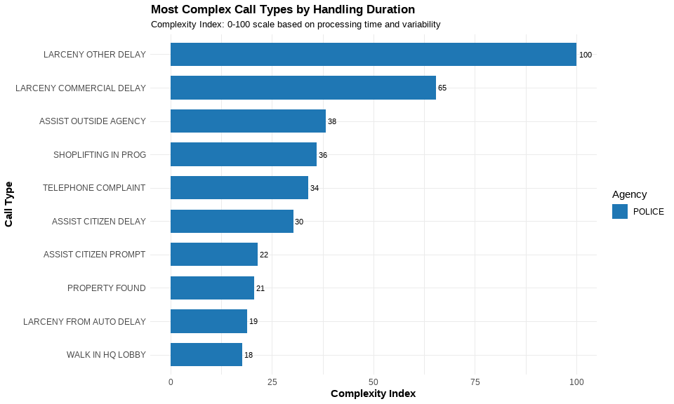

The most complex call type this week was **LARCENY OTHER DELAY** with a complexity index of 100, requiring an average of 32,116 seconds to process.

## Advanced Analytics & Strategic Insights

This section provides advanced analytics, staffing insights, and automated recommendations to complement the operational metrics above.

### All Dispatcher Performance Analysis

This section analyzes performance across all dispatchers to identify workload distribution, efficiency patterns, and development opportunities.

<div class="tabwid"><style>.cl-a7c2f286{}.cl-a7b7e620{font-family:'Arial';font-size:9pt;font-weight:bold;font-style:normal;text-decoration:none;color:rgba(0, 0, 0, 1.00);background-color:transparent;}.cl-a7b7e62a{font-family:'Arial';font-size:9pt;font-weight:normal;font-style:normal;text-decoration:none;color:rgba(0, 0, 0, 1.00);background-color:transparent;}.cl-a7bbeba8{margin:0;text-align:left;border-bottom: 0 solid rgba(0, 0, 0, 1.00);border-top: 0 solid rgba(0, 0, 0, 1.00);border-left: 0 solid rgba(0, 0, 0, 1.00);border-right: 0 solid rgba(0, 0, 0, 1.00);padding-bottom:3pt;padding-top:3pt;padding-left:3pt;padding-right:3pt;line-height: 1;background-color:transparent;}.cl-a7bbebb2{margin:0;text-align:right;border-bottom: 0 solid rgba(0, 0, 0, 1.00);border-top: 0 solid rgba(0, 0, 0, 1.00);border-left: 0 solid rgba(0, 0, 0, 1.00);border-right: 0 solid rgba(0, 0, 0, 1.00);padding-bottom:3pt;padding-top:3pt;padding-left:3pt;padding-right:3pt;line-height: 1;background-color:transparent;}.cl-a7bc1920{width:1.677in;background-color:transparent;vertical-align: middle;border-bottom: 1.5pt solid rgba(102, 102, 102, 1.00);border-top: 1.5pt solid rgba(102, 102, 102, 1.00);border-left: 0 solid rgba(0, 0, 0, 1.00);border-right: 0 solid rgba(0, 0, 0, 1.00);margin-bottom:0;margin-top:0;margin-left:0;margin-right:0;}.cl-a7bc192a{width:0.843in;background-color:transparent;vertical-align: middle;border-bottom: 1.5pt solid rgba(102, 102, 102, 1.00);border-top: 1.5pt solid rgba(102, 102, 102, 1.00);border-left: 0 solid rgba(0, 0, 0, 1.00);border-right: 0 solid rgba(0, 0, 0, 1.00);margin-bottom:0;margin-top:0;margin-left:0;margin-right:0;}.cl-a7bc192b{width:1.107in;background-color:transparent;vertical-align: middle;border-bottom: 1.5pt solid rgba(102, 102, 102, 1.00);border-top: 1.5pt solid rgba(102, 102, 102, 1.00);border-left: 0 solid rgba(0, 0, 0, 1.00);border-right: 0 solid rgba(0, 0, 0, 1.00);margin-bottom:0;margin-top:0;margin-left:0;margin-right:0;}.cl-a7bc1934{width:0.996in;background-color:transparent;vertical-align: middle;border-bottom: 1.5pt solid rgba(102, 102, 102, 1.00);border-top: 1.5pt solid rgba(102, 102, 102, 1.00);border-left: 0 solid rgba(0, 0, 0, 1.00);border-right: 0 solid rgba(0, 0, 0, 1.00);margin-bottom:0;margin-top:0;margin-left:0;margin-right:0;}.cl-a7bc1935{width:0.698in;background-color:transparent;vertical-align: middle;border-bottom: 1.5pt solid rgba(102, 102, 102, 1.00);border-top: 1.5pt solid rgba(102, 102, 102, 1.00);border-left: 0 solid rgba(0, 0, 0, 1.00);border-right: 0 solid rgba(0, 0, 0, 1.00);margin-bottom:0;margin-top:0;margin-left:0;margin-right:0;}.cl-a7bc193e{width:1.107in;background-color:transparent;vertical-align: middle;border-bottom: 1.5pt solid rgba(102, 102, 102, 1.00);border-top: 1.5pt solid rgba(102, 102, 102, 1.00);border-left: 0 solid rgba(0, 0, 0, 1.00);border-right: 0 solid rgba(0, 0, 0, 1.00);margin-bottom:0;margin-top:0;margin-left:0;margin-right:0;}.cl-a7bc193f{width:1.677in;background-color:rgba(245, 245, 245, 1.00);vertical-align: middle;border-bottom: 0 solid rgba(0, 0, 0, 1.00);border-top: 0 solid rgba(0, 0, 0, 1.00);border-left: 0 solid rgba(0, 0, 0, 1.00);border-right: 0 solid rgba(0, 0, 0, 1.00);margin-bottom:0;margin-top:0;margin-left:0;margin-right:0;}.cl-a7bc1948{width:0.843in;background-color:rgba(245, 245, 245, 1.00);vertical-align: middle;border-bottom: 0 solid rgba(0, 0, 0, 1.00);border-top: 0 solid rgba(0, 0, 0, 1.00);border-left: 0 solid rgba(0, 0, 0, 1.00);border-right: 0 solid rgba(0, 0, 0, 1.00);margin-bottom:0;margin-top:0;margin-left:0;margin-right:0;}.cl-a7bc1949{width:1.107in;background-color:rgba(245, 245, 245, 1.00);vertical-align: middle;border-bottom: 0 solid rgba(0, 0, 0, 1.00);border-top: 0 solid rgba(0, 0, 0, 1.00);border-left: 0 solid rgba(0, 0, 0, 1.00);border-right: 0 solid rgba(0, 0, 0, 1.00);margin-bottom:0;margin-top:0;margin-left:0;margin-right:0;}.cl-a7bc194a{width:0.996in;background-color:rgba(245, 245, 245, 1.00);vertical-align: middle;border-bottom: 0 solid rgba(0, 0, 0, 1.00);border-top: 0 solid rgba(0, 0, 0, 1.00);border-left: 0 solid rgba(0, 0, 0, 1.00);border-right: 0 solid rgba(0, 0, 0, 1.00);margin-bottom:0;margin-top:0;margin-left:0;margin-right:0;}.cl-a7bc1952{width:0.698in;background-color:rgba(245, 245, 245, 1.00);vertical-align: middle;border-bottom: 0 solid rgba(0, 0, 0, 1.00);border-top: 0 solid rgba(0, 0, 0, 1.00);border-left: 0 solid rgba(0, 0, 0, 1.00);border-right: 0 solid rgba(0, 0, 0, 1.00);margin-bottom:0;margin-top:0;margin-left:0;margin-right:0;}.cl-a7bc1953{width:1.107in;background-color:rgba(245, 245, 245, 1.00);vertical-align: middle;border-bottom: 0 solid rgba(0, 0, 0, 1.00);border-top: 0 solid rgba(0, 0, 0, 1.00);border-left: 0 solid rgba(0, 0, 0, 1.00);border-right: 0 solid rgba(0, 0, 0, 1.00);margin-bottom:0;margin-top:0;margin-left:0;margin-right:0;}.cl-a7bc1954{width:1.677in;background-color:transparent;vertical-align: middle;border-bottom: 0 solid rgba(0, 0, 0, 1.00);border-top: 0 solid rgba(0, 0, 0, 1.00);border-left: 0 solid rgba(0, 0, 0, 1.00);border-right: 0 solid rgba(0, 0, 0, 1.00);margin-bottom:0;margin-top:0;margin-left:0;margin-right:0;}.cl-a7bc195c{width:0.843in;background-color:transparent;vertical-align: middle;border-bottom: 0 solid rgba(0, 0, 0, 1.00);border-top: 0 solid rgba(0, 0, 0, 1.00);border-left: 0 solid rgba(0, 0, 0, 1.00);border-right: 0 solid rgba(0, 0, 0, 1.00);margin-bottom:0;margin-top:0;margin-left:0;margin-right:0;}.cl-a7bc195d{width:1.107in;background-color:transparent;vertical-align: middle;border-bottom: 0 solid rgba(0, 0, 0, 1.00);border-top: 0 solid rgba(0, 0, 0, 1.00);border-left: 0 solid rgba(0, 0, 0, 1.00);border-right: 0 solid rgba(0, 0, 0, 1.00);margin-bottom:0;margin-top:0;margin-left:0;margin-right:0;}.cl-a7bc195e{width:0.996in;background-color:transparent;vertical-align: middle;border-bottom: 0 solid rgba(0, 0, 0, 1.00);border-top: 0 solid rgba(0, 0, 0, 1.00);border-left: 0 solid rgba(0, 0, 0, 1.00);border-right: 0 solid rgba(0, 0, 0, 1.00);margin-bottom:0;margin-top:0;margin-left:0;margin-right:0;}.cl-a7bc1966{width:0.698in;background-color:transparent;vertical-align: middle;border-bottom: 0 solid rgba(0, 0, 0, 1.00);border-top: 0 solid rgba(0, 0, 0, 1.00);border-left: 0 solid rgba(0, 0, 0, 1.00);border-right: 0 solid rgba(0, 0, 0, 1.00);margin-bottom:0;margin-top:0;margin-left:0;margin-right:0;}.cl-a7bc1967{width:1.107in;background-color:transparent;vertical-align: middle;border-bottom: 0 solid rgba(0, 0, 0, 1.00);border-top: 0 solid rgba(0, 0, 0, 1.00);border-left: 0 solid rgba(0, 0, 0, 1.00);border-right: 0 solid rgba(0, 0, 0, 1.00);margin-bottom:0;margin-top:0;margin-left:0;margin-right:0;}.cl-a7bc1970{width:1.677in;background-color:rgba(245, 245, 245, 1.00);vertical-align: middle;border-bottom: 0 solid rgba(0, 0, 0, 1.00);border-top: 0 solid rgba(0, 0, 0, 1.00);border-left: 0 solid rgba(0, 0, 0, 1.00);border-right: 0 solid rgba(0, 0, 0, 1.00);margin-bottom:0;margin-top:0;margin-left:0;margin-right:0;}.cl-a7bc1971{width:0.843in;background-color:rgba(245, 245, 245, 1.00);vertical-align: middle;border-bottom: 0 solid rgba(0, 0, 0, 1.00);border-top: 0 solid rgba(0, 0, 0, 1.00);border-left: 0 solid rgba(0, 0, 0, 1.00);border-right: 0 solid rgba(0, 0, 0, 1.00);margin-bottom:0;margin-top:0;margin-left:0;margin-right:0;}.cl-a7bc197a{width:1.107in;background-color:rgba(245, 245, 245, 1.00);vertical-align: middle;border-bottom: 0 solid rgba(0, 0, 0, 1.00);border-top: 0 solid rgba(0, 0, 0, 1.00);border-left: 0 solid rgba(0, 0, 0, 1.00);border-right: 0 solid rgba(0, 0, 0, 1.00);margin-bottom:0;margin-top:0;margin-left:0;margin-right:0;}.cl-a7bc197b{width:0.996in;background-color:rgba(245, 245, 245, 1.00);vertical-align: middle;border-bottom: 0 solid rgba(0, 0, 0, 1.00);border-top: 0 solid rgba(0, 0, 0, 1.00);border-left: 0 solid rgba(0, 0, 0, 1.00);border-right: 0 solid rgba(0, 0, 0, 1.00);margin-bottom:0;margin-top:0;margin-left:0;margin-right:0;}.cl-a7bc1984{width:0.698in;background-color:rgba(245, 245, 245, 1.00);vertical-align: middle;border-bottom: 0 solid rgba(0, 0, 0, 1.00);border-top: 0 solid rgba(0, 0, 0, 1.00);border-left: 0 solid rgba(0, 0, 0, 1.00);border-right: 0 solid rgba(0, 0, 0, 1.00);margin-bottom:0;margin-top:0;margin-left:0;margin-right:0;}.cl-a7bc1985{width:1.107in;background-color:rgba(245, 245, 245, 1.00);vertical-align: middle;border-bottom: 0 solid rgba(0, 0, 0, 1.00);border-top: 0 solid rgba(0, 0, 0, 1.00);border-left: 0 solid rgba(0, 0, 0, 1.00);border-right: 0 solid rgba(0, 0, 0, 1.00);margin-bottom:0;margin-top:0;margin-left:0;margin-right:0;}.cl-a7bc1986{width:1.677in;background-color:transparent;vertical-align: middle;border-bottom: 0 solid rgba(0, 0, 0, 1.00);border-top: 0 solid rgba(0, 0, 0, 1.00);border-left: 0 solid rgba(0, 0, 0, 1.00);border-right: 0 solid rgba(0, 0, 0, 1.00);margin-bottom:0;margin-top:0;margin-left:0;margin-right:0;}.cl-a7bc198e{width:0.843in;background-color:transparent;vertical-align: middle;border-bottom: 0 solid rgba(0, 0, 0, 1.00);border-top: 0 solid rgba(0, 0, 0, 1.00);border-left: 0 solid rgba(0, 0, 0, 1.00);border-right: 0 solid rgba(0, 0, 0, 1.00);margin-bottom:0;margin-top:0;margin-left:0;margin-right:0;}.cl-a7bc198f{width:1.107in;background-color:transparent;vertical-align: middle;border-bottom: 0 solid rgba(0, 0, 0, 1.00);border-top: 0 solid rgba(0, 0, 0, 1.00);border-left: 0 solid rgba(0, 0, 0, 1.00);border-right: 0 solid rgba(0, 0, 0, 1.00);margin-bottom:0;margin-top:0;margin-left:0;margin-right:0;}.cl-a7bc1990{width:0.996in;background-color:transparent;vertical-align: middle;border-bottom: 0 solid rgba(0, 0, 0, 1.00);border-top: 0 solid rgba(0, 0, 0, 1.00);border-left: 0 solid rgba(0, 0, 0, 1.00);border-right: 0 solid rgba(0, 0, 0, 1.00);margin-bottom:0;margin-top:0;margin-left:0;margin-right:0;}.cl-a7bc1998{width:0.698in;background-color:transparent;vertical-align: middle;border-bottom: 0 solid rgba(0, 0, 0, 1.00);border-top: 0 solid rgba(0, 0, 0, 1.00);border-left: 0 solid rgba(0, 0, 0, 1.00);border-right: 0 solid rgba(0, 0, 0, 1.00);margin-bottom:0;margin-top:0;margin-left:0;margin-right:0;}.cl-a7bc1999{width:1.107in;background-color:transparent;vertical-align: middle;border-bottom: 0 solid rgba(0, 0, 0, 1.00);border-top: 0 solid rgba(0, 0, 0, 1.00);border-left: 0 solid rgba(0, 0, 0, 1.00);border-right: 0 solid rgba(0, 0, 0, 1.00);margin-bottom:0;margin-top:0;margin-left:0;margin-right:0;}.cl-a7bc19a2{width:1.677in;background-color:transparent;vertical-align: middle;border-bottom: 0 solid rgba(0, 0, 0, 1.00);border-top: 0 solid rgba(0, 0, 0, 1.00);border-left: 0 solid rgba(0, 0, 0, 1.00);border-right: 0 solid rgba(0, 0, 0, 1.00);margin-bottom:0;margin-top:0;margin-left:0;margin-right:0;}.cl-a7bc19a3{width:0.843in;background-color:transparent;vertical-align: middle;border-bottom: 0 solid rgba(0, 0, 0, 1.00);border-top: 0 solid rgba(0, 0, 0, 1.00);border-left: 0 solid rgba(0, 0, 0, 1.00);border-right: 0 solid rgba(0, 0, 0, 1.00);margin-bottom:0;margin-top:0;margin-left:0;margin-right:0;}.cl-a7bc19a4{width:1.107in;background-color:transparent;vertical-align: middle;border-bottom: 0 solid rgba(0, 0, 0, 1.00);border-top: 0 solid rgba(0, 0, 0, 1.00);border-left: 0 solid rgba(0, 0, 0, 1.00);border-right: 0 solid rgba(0, 0, 0, 1.00);margin-bottom:0;margin-top:0;margin-left:0;margin-right:0;}.cl-a7bc19ac{width:0.996in;background-color:transparent;vertical-align: middle;border-bottom: 0 solid rgba(0, 0, 0, 1.00);border-top: 0 solid rgba(0, 0, 0, 1.00);border-left: 0 solid rgba(0, 0, 0, 1.00);border-right: 0 solid rgba(0, 0, 0, 1.00);margin-bottom:0;margin-top:0;margin-left:0;margin-right:0;}.cl-a7bc19ad{width:0.698in;background-color:transparent;vertical-align: middle;border-bottom: 0 solid rgba(0, 0, 0, 1.00);border-top: 0 solid rgba(0, 0, 0, 1.00);border-left: 0 solid rgba(0, 0, 0, 1.00);border-right: 0 solid rgba(0, 0, 0, 1.00);margin-bottom:0;margin-top:0;margin-left:0;margin-right:0;}.cl-a7bc19ae{width:1.107in;background-color:transparent;vertical-align: middle;border-bottom: 0 solid rgba(0, 0, 0, 1.00);border-top: 0 solid rgba(0, 0, 0, 1.00);border-left: 0 solid rgba(0, 0, 0, 1.00);border-right: 0 solid rgba(0, 0, 0, 1.00);margin-bottom:0;margin-top:0;margin-left:0;margin-right:0;}.cl-a7bc19b6{width:1.677in;background-color:transparent;vertical-align: middle;border-bottom: 0 solid rgba(0, 0, 0, 1.00);border-top: 0 solid rgba(0, 0, 0, 1.00);border-left: 0 solid rgba(0, 0, 0, 1.00);border-right: 0 solid rgba(0, 0, 0, 1.00);margin-bottom:0;margin-top:0;margin-left:0;margin-right:0;}.cl-a7bc19c0{width:0.843in;background-color:transparent;vertical-align: middle;border-bottom: 0 solid rgba(0, 0, 0, 1.00);border-top: 0 solid rgba(0, 0, 0, 1.00);border-left: 0 solid rgba(0, 0, 0, 1.00);border-right: 0 solid rgba(0, 0, 0, 1.00);margin-bottom:0;margin-top:0;margin-left:0;margin-right:0;}.cl-a7bc19c1{width:1.107in;background-color:transparent;vertical-align: middle;border-bottom: 0 solid rgba(0, 0, 0, 1.00);border-top: 0 solid rgba(0, 0, 0, 1.00);border-left: 0 solid rgba(0, 0, 0, 1.00);border-right: 0 solid rgba(0, 0, 0, 1.00);margin-bottom:0;margin-top:0;margin-left:0;margin-right:0;}.cl-a7bc19c2{width:0.996in;background-color:transparent;vertical-align: middle;border-bottom: 0 solid rgba(0, 0, 0, 1.00);border-top: 0 solid rgba(0, 0, 0, 1.00);border-left: 0 solid rgba(0, 0, 0, 1.00);border-right: 0 solid rgba(0, 0, 0, 1.00);margin-bottom:0;margin-top:0;margin-left:0;margin-right:0;}.cl-a7bc19ca{width:0.698in;background-color:transparent;vertical-align: middle;border-bottom: 0 solid rgba(0, 0, 0, 1.00);border-top: 0 solid rgba(0, 0, 0, 1.00);border-left: 0 solid rgba(0, 0, 0, 1.00);border-right: 0 solid rgba(0, 0, 0, 1.00);margin-bottom:0;margin-top:0;margin-left:0;margin-right:0;}.cl-a7bc19cb{width:1.107in;background-color:transparent;vertical-align: middle;border-bottom: 0 solid rgba(0, 0, 0, 1.00);border-top: 0 solid rgba(0, 0, 0, 1.00);border-left: 0 solid rgba(0, 0, 0, 1.00);border-right: 0 solid rgba(0, 0, 0, 1.00);margin-bottom:0;margin-top:0;margin-left:0;margin-right:0;}.cl-a7bc19cc{width:1.677in;background-color:rgba(245, 245, 245, 1.00);vertical-align: middle;border-bottom: 0 solid rgba(0, 0, 0, 1.00);border-top: 0 solid rgba(0, 0, 0, 1.00);border-left: 0 solid rgba(0, 0, 0, 1.00);border-right: 0 solid rgba(0, 0, 0, 1.00);margin-bottom:0;margin-top:0;margin-left:0;margin-right:0;}.cl-a7bc19d4{width:0.843in;background-color:rgba(245, 245, 245, 1.00);vertical-align: middle;border-bottom: 0 solid rgba(0, 0, 0, 1.00);border-top: 0 solid rgba(0, 0, 0, 1.00);border-left: 0 solid rgba(0, 0, 0, 1.00);border-right: 0 solid rgba(0, 0, 0, 1.00);margin-bottom:0;margin-top:0;margin-left:0;margin-right:0;}.cl-a7bc19d5{width:1.107in;background-color:rgba(245, 245, 245, 1.00);vertical-align: middle;border-bottom: 0 solid rgba(0, 0, 0, 1.00);border-top: 0 solid rgba(0, 0, 0, 1.00);border-left: 0 solid rgba(0, 0, 0, 1.00);border-right: 0 solid rgba(0, 0, 0, 1.00);margin-bottom:0;margin-top:0;margin-left:0;margin-right:0;}.cl-a7bc19d6{width:0.996in;background-color:rgba(245, 245, 245, 1.00);vertical-align: middle;border-bottom: 0 solid rgba(0, 0, 0, 1.00);border-top: 0 solid rgba(0, 0, 0, 1.00);border-left: 0 solid rgba(0, 0, 0, 1.00);border-right: 0 solid rgba(0, 0, 0, 1.00);margin-bottom:0;margin-top:0;margin-left:0;margin-right:0;}.cl-a7bc19de{width:0.698in;background-color:rgba(245, 245, 245, 1.00);vertical-align: middle;border-bottom: 0 solid rgba(0, 0, 0, 1.00);border-top: 0 solid rgba(0, 0, 0, 1.00);border-left: 0 solid rgba(0, 0, 0, 1.00);border-right: 0 solid rgba(0, 0, 0, 1.00);margin-bottom:0;margin-top:0;margin-left:0;margin-right:0;}.cl-a7bc19df{width:1.107in;background-color:rgba(245, 245, 245, 1.00);vertical-align: middle;border-bottom: 0 solid rgba(0, 0, 0, 1.00);border-top: 0 solid rgba(0, 0, 0, 1.00);border-left: 0 solid rgba(0, 0, 0, 1.00);border-right: 0 solid rgba(0, 0, 0, 1.00);margin-bottom:0;margin-top:0;margin-left:0;margin-right:0;}.cl-a7bc19e0{width:1.677in;background-color:transparent;vertical-align: middle;border-bottom: 1.5pt solid rgba(102, 102, 102, 1.00);border-top: 0 solid rgba(0, 0, 0, 1.00);border-left: 0 solid rgba(0, 0, 0, 1.00);border-right: 0 solid rgba(0, 0, 0, 1.00);margin-bottom:0;margin-top:0;margin-left:0;margin-right:0;}.cl-a7bc19e8{width:0.843in;background-color:transparent;vertical-align: middle;border-bottom: 1.5pt solid rgba(102, 102, 102, 1.00);border-top: 0 solid rgba(0, 0, 0, 1.00);border-left: 0 solid rgba(0, 0, 0, 1.00);border-right: 0 solid rgba(0, 0, 0, 1.00);margin-bottom:0;margin-top:0;margin-left:0;margin-right:0;}.cl-a7bc19f2{width:1.107in;background-color:transparent;vertical-align: middle;border-bottom: 1.5pt solid rgba(102, 102, 102, 1.00);border-top: 0 solid rgba(0, 0, 0, 1.00);border-left: 0 solid rgba(0, 0, 0, 1.00);border-right: 0 solid rgba(0, 0, 0, 1.00);margin-bottom:0;margin-top:0;margin-left:0;margin-right:0;}.cl-a7bc19f3{width:0.996in;background-color:transparent;vertical-align: middle;border-bottom: 1.5pt solid rgba(102, 102, 102, 1.00);border-top: 0 solid rgba(0, 0, 0, 1.00);border-left: 0 solid rgba(0, 0, 0, 1.00);border-right: 0 solid rgba(0, 0, 0, 1.00);margin-bottom:0;margin-top:0;margin-left:0;margin-right:0;}.cl-a7bc19fc{width:0.698in;background-color:transparent;vertical-align: middle;border-bottom: 1.5pt solid rgba(102, 102, 102, 1.00);border-top: 0 solid rgba(0, 0, 0, 1.00);border-left: 0 solid rgba(0, 0, 0, 1.00);border-right: 0 solid rgba(0, 0, 0, 1.00);margin-bottom:0;margin-top:0;margin-left:0;margin-right:0;}.cl-a7bc19fd{width:1.107in;background-color:transparent;vertical-align: middle;border-bottom: 1.5pt solid rgba(102, 102, 102, 1.00);border-top: 0 solid rgba(0, 0, 0, 1.00);border-left: 0 solid rgba(0, 0, 0, 1.00);border-right: 0 solid rgba(0, 0, 0, 1.00);margin-bottom:0;margin-top:0;margin-left:0;margin-right:0;}.tabwid {
  font-size: initial;
  padding-bottom: 1em;
}

.tabwid table{
  border-spacing:0px !important;
  border-collapse:collapse;
  line-height:1;
  margin-left:auto;
  margin-right:auto;
  border-width: 0;
  border-color: transparent;
  caption-side: top;
}
.tabwid-caption-bottom table{
  caption-side: bottom;
}
.tabwid_left table{
  margin-left:0;
}
.tabwid_right table{
  margin-right:0;
}
.tabwid td, .tabwid th {
    padding: 0;
}
.tabwid a {
  text-decoration: none;
}
.tabwid thead {
    background-color: transparent;
}
.tabwid tfoot {
    background-color: transparent;
}
.tabwid table tr {
background-color: transparent;
}
.katex-display {
    margin: 0 0 !important;
}</style><table data-quarto-disable-processing='true' class='cl-a7c2f286'><thead><tr style="overflow-wrap:break-word;"><th class="cl-a7bc1920"><p class="cl-a7bbeba8"><span class="cl-a7b7e620">Dispatcher</span></p></th><th class="cl-a7bc192a"><p class="cl-a7bbebb2"><span class="cl-a7b7e620">Total Calls</span></p></th><th class="cl-a7bc192b"><p class="cl-a7bbebb2"><span class="cl-a7b7e620">Median TTD (s)</span></p></th><th class="cl-a7bc1934"><p class="cl-a7bbebb2"><span class="cl-a7b7e620">Mean TTD (s)</span></p></th><th class="cl-a7bc1935"><p class="cl-a7bbebb2"><span class="cl-a7b7e620">P1 Calls</span></p></th><th class="cl-a7bc1935"><p class="cl-a7bbebb2"><span class="cl-a7b7e620">P2 Calls</span></p></th><th class="cl-a7bc193e"><p class="cl-a7bbebb2"><span class="cl-a7b7e620">High Priority %</span></p></th></tr></thead><tbody><tr style="overflow-wrap:break-word;"><td class="cl-a7bc193f"><p class="cl-a7bbeba8"><span class="cl-a7b7e62a">LEWIS, LESLIE</span></p></td><td class="cl-a7bc1948"><p class="cl-a7bbebb2"><span class="cl-a7b7e62a">176</span></p></td><td class="cl-a7bc1949"><p class="cl-a7bbebb2"><span class="cl-a7b7e62a">67.0</span></p></td><td class="cl-a7bc194a"><p class="cl-a7bbebb2"><span class="cl-a7b7e62a">1,212.9</span></p></td><td class="cl-a7bc1952"><p class="cl-a7bbebb2"><span class="cl-a7b7e62a">4</span></p></td><td class="cl-a7bc1952"><p class="cl-a7bbebb2"><span class="cl-a7b7e62a">123</span></p></td><td class="cl-a7bc1953"><p class="cl-a7bbebb2"><span class="cl-a7b7e62a">72.2</span></p></td></tr><tr style="overflow-wrap:break-word;"><td class="cl-a7bc1954"><p class="cl-a7bbeba8"><span class="cl-a7b7e62a">GATTO, GIANNA</span></p></td><td class="cl-a7bc195c"><p class="cl-a7bbebb2"><span class="cl-a7b7e62a">124</span></p></td><td class="cl-a7bc195d"><p class="cl-a7bbebb2"><span class="cl-a7b7e62a">420.0</span></p></td><td class="cl-a7bc195e"><p class="cl-a7bbebb2"><span class="cl-a7b7e62a">2,662.1</span></p></td><td class="cl-a7bc1966"><p class="cl-a7bbebb2"><span class="cl-a7b7e62a">7</span></p></td><td class="cl-a7bc1966"><p class="cl-a7bbebb2"><span class="cl-a7b7e62a">76</span></p></td><td class="cl-a7bc1967"><p class="cl-a7bbebb2"><span class="cl-a7b7e62a">66.9</span></p></td></tr><tr style="overflow-wrap:break-word;"><td class="cl-a7bc1970"><p class="cl-a7bbeba8"><span class="cl-a7b7e62a">FOSTER, KANESHA</span></p></td><td class="cl-a7bc1971"><p class="cl-a7bbebb2"><span class="cl-a7b7e62a">100</span></p></td><td class="cl-a7bc197a"><p class="cl-a7bbebb2"><span class="cl-a7b7e62a">151.0</span></p></td><td class="cl-a7bc197b"><p class="cl-a7bbebb2"><span class="cl-a7b7e62a">1,018.3</span></p></td><td class="cl-a7bc1984"><p class="cl-a7bbebb2"><span class="cl-a7b7e62a">6</span></p></td><td class="cl-a7bc1984"><p class="cl-a7bbebb2"><span class="cl-a7b7e62a">62</span></p></td><td class="cl-a7bc1985"><p class="cl-a7bbebb2"><span class="cl-a7b7e62a">68.0</span></p></td></tr><tr style="overflow-wrap:break-word;"><td class="cl-a7bc1986"><p class="cl-a7bbeba8"><span class="cl-a7b7e62a">WALKER, JUANITA</span></p></td><td class="cl-a7bc198e"><p class="cl-a7bbebb2"><span class="cl-a7b7e62a">96</span></p></td><td class="cl-a7bc198f"><p class="cl-a7bbebb2"><span class="cl-a7b7e62a">170.0</span></p></td><td class="cl-a7bc1990"><p class="cl-a7bbebb2"><span class="cl-a7b7e62a">1,783.4</span></p></td><td class="cl-a7bc1998"><p class="cl-a7bbebb2"><span class="cl-a7b7e62a">1</span></p></td><td class="cl-a7bc1998"><p class="cl-a7bbebb2"><span class="cl-a7b7e62a">57</span></p></td><td class="cl-a7bc1999"><p class="cl-a7bbebb2"><span class="cl-a7b7e62a">60.4</span></p></td></tr><tr style="overflow-wrap:break-word;"><td class="cl-a7bc1970"><p class="cl-a7bbeba8"><span class="cl-a7b7e62a">FLOURNOY, ERICKA</span></p></td><td class="cl-a7bc1971"><p class="cl-a7bbebb2"><span class="cl-a7b7e62a">74</span></p></td><td class="cl-a7bc197a"><p class="cl-a7bbebb2"><span class="cl-a7b7e62a">138.5</span></p></td><td class="cl-a7bc197b"><p class="cl-a7bbebb2"><span class="cl-a7b7e62a">1,663.7</span></p></td><td class="cl-a7bc1984"><p class="cl-a7bbebb2"><span class="cl-a7b7e62a">10</span></p></td><td class="cl-a7bc1984"><p class="cl-a7bbebb2"><span class="cl-a7b7e62a">28</span></p></td><td class="cl-a7bc1985"><p class="cl-a7bbebb2"><span class="cl-a7b7e62a">51.4</span></p></td></tr><tr style="overflow-wrap:break-word;"><td class="cl-a7bc1954"><p class="cl-a7bbeba8"><span class="cl-a7b7e62a">BONSU, VALERIE</span></p></td><td class="cl-a7bc195c"><p class="cl-a7bbebb2"><span class="cl-a7b7e62a">55</span></p></td><td class="cl-a7bc195d"><p class="cl-a7bbebb2"><span class="cl-a7b7e62a">463.0</span></p></td><td class="cl-a7bc195e"><p class="cl-a7bbebb2"><span class="cl-a7b7e62a">2,555.5</span></p></td><td class="cl-a7bc1966"><p class="cl-a7bbebb2"><span class="cl-a7b7e62a">1</span></p></td><td class="cl-a7bc1966"><p class="cl-a7bbebb2"><span class="cl-a7b7e62a">35</span></p></td><td class="cl-a7bc1967"><p class="cl-a7bbebb2"><span class="cl-a7b7e62a">65.5</span></p></td></tr><tr style="overflow-wrap:break-word;"><td class="cl-a7bc1970"><p class="cl-a7bbeba8"><span class="cl-a7b7e62a">DOGAN, KYLAH</span></p></td><td class="cl-a7bc1971"><p class="cl-a7bbebb2"><span class="cl-a7b7e62a">40</span></p></td><td class="cl-a7bc197a"><p class="cl-a7bbebb2"><span class="cl-a7b7e62a">563.5</span></p></td><td class="cl-a7bc197b"><p class="cl-a7bbebb2"><span class="cl-a7b7e62a">4,480.5</span></p></td><td class="cl-a7bc1984"><p class="cl-a7bbebb2"><span class="cl-a7b7e62a">0</span></p></td><td class="cl-a7bc1984"><p class="cl-a7bbebb2"><span class="cl-a7b7e62a">25</span></p></td><td class="cl-a7bc1985"><p class="cl-a7bbebb2"><span class="cl-a7b7e62a">62.5</span></p></td></tr><tr style="overflow-wrap:break-word;"><td class="cl-a7bc19a2"><p class="cl-a7bbeba8"><span class="cl-a7b7e62a">GRAVES, CHRISTINA</span></p></td><td class="cl-a7bc19a3"><p class="cl-a7bbebb2"><span class="cl-a7b7e62a">23</span></p></td><td class="cl-a7bc19a4"><p class="cl-a7bbebb2"><span class="cl-a7b7e62a">2.0</span></p></td><td class="cl-a7bc19ac"><p class="cl-a7bbebb2"><span class="cl-a7b7e62a">2.4</span></p></td><td class="cl-a7bc19ad"><p class="cl-a7bbebb2"><span class="cl-a7b7e62a">9</span></p></td><td class="cl-a7bc19ad"><p class="cl-a7bbebb2"><span class="cl-a7b7e62a">4</span></p></td><td class="cl-a7bc19ae"><p class="cl-a7bbebb2"><span class="cl-a7b7e62a">56.5</span></p></td></tr><tr style="overflow-wrap:break-word;"><td class="cl-a7bc193f"><p class="cl-a7bbeba8"><span class="cl-a7b7e62a">PRIESTLY, SHAVAUGHN</span></p></td><td class="cl-a7bc1948"><p class="cl-a7bbebb2"><span class="cl-a7b7e62a">21</span></p></td><td class="cl-a7bc1949"><p class="cl-a7bbebb2"><span class="cl-a7b7e62a">296.0</span></p></td><td class="cl-a7bc194a"><p class="cl-a7bbebb2"><span class="cl-a7b7e62a">1,390.3</span></p></td><td class="cl-a7bc1952"><p class="cl-a7bbebb2"><span class="cl-a7b7e62a">2</span></p></td><td class="cl-a7bc1952"><p class="cl-a7bbebb2"><span class="cl-a7b7e62a">14</span></p></td><td class="cl-a7bc1953"><p class="cl-a7bbebb2"><span class="cl-a7b7e62a">76.2</span></p></td></tr><tr style="overflow-wrap:break-word;"><td class="cl-a7bc19a2"><p class="cl-a7bbeba8"><span class="cl-a7b7e62a">HARDING, AUTUMN</span></p></td><td class="cl-a7bc19a3"><p class="cl-a7bbebb2"><span class="cl-a7b7e62a">16</span></p></td><td class="cl-a7bc19a4"><p class="cl-a7bbebb2"><span class="cl-a7b7e62a">20.5</span></p></td><td class="cl-a7bc19ac"><p class="cl-a7bbebb2"><span class="cl-a7b7e62a">77.9</span></p></td><td class="cl-a7bc19ad"><p class="cl-a7bbebb2"><span class="cl-a7b7e62a">1</span></p></td><td class="cl-a7bc19ad"><p class="cl-a7bbebb2"><span class="cl-a7b7e62a">13</span></p></td><td class="cl-a7bc19ae"><p class="cl-a7bbebb2"><span class="cl-a7b7e62a">87.5</span></p></td></tr><tr style="overflow-wrap:break-word;"><td class="cl-a7bc193f"><p class="cl-a7bbeba8"><span class="cl-a7b7e62a">SMITH, TERESA</span></p></td><td class="cl-a7bc1948"><p class="cl-a7bbebb2"><span class="cl-a7b7e62a">16</span></p></td><td class="cl-a7bc1949"><p class="cl-a7bbebb2"><span class="cl-a7b7e62a">182.5</span></p></td><td class="cl-a7bc194a"><p class="cl-a7bbebb2"><span class="cl-a7b7e62a">1,158.8</span></p></td><td class="cl-a7bc1952"><p class="cl-a7bbebb2"><span class="cl-a7b7e62a">1</span></p></td><td class="cl-a7bc1952"><p class="cl-a7bbebb2"><span class="cl-a7b7e62a">9</span></p></td><td class="cl-a7bc1953"><p class="cl-a7bbebb2"><span class="cl-a7b7e62a">62.5</span></p></td></tr><tr style="overflow-wrap:break-word;"><td class="cl-a7bc1986"><p class="cl-a7bbeba8"><span class="cl-a7b7e62a">WALKER, KAREN</span></p></td><td class="cl-a7bc198e"><p class="cl-a7bbebb2"><span class="cl-a7b7e62a">14</span></p></td><td class="cl-a7bc198f"><p class="cl-a7bbebb2"><span class="cl-a7b7e62a">2.0</span></p></td><td class="cl-a7bc1990"><p class="cl-a7bbebb2"><span class="cl-a7b7e62a">-1,184.9</span></p></td><td class="cl-a7bc1998"><p class="cl-a7bbebb2"><span class="cl-a7b7e62a">4</span></p></td><td class="cl-a7bc1998"><p class="cl-a7bbebb2"><span class="cl-a7b7e62a">3</span></p></td><td class="cl-a7bc1999"><p class="cl-a7bbebb2"><span class="cl-a7b7e62a">50.0</span></p></td></tr><tr style="overflow-wrap:break-word;"><td class="cl-a7bc1970"><p class="cl-a7bbeba8"><span class="cl-a7b7e62a">COOPER, KAKILA</span></p></td><td class="cl-a7bc1971"><p class="cl-a7bbebb2"><span class="cl-a7b7e62a">11</span></p></td><td class="cl-a7bc197a"><p class="cl-a7bbebb2"><span class="cl-a7b7e62a">3.0</span></p></td><td class="cl-a7bc197b"><p class="cl-a7bbebb2"><span class="cl-a7b7e62a">5.0</span></p></td><td class="cl-a7bc1984"><p class="cl-a7bbebb2"><span class="cl-a7b7e62a">7</span></p></td><td class="cl-a7bc1984"><p class="cl-a7bbebb2"><span class="cl-a7b7e62a">1</span></p></td><td class="cl-a7bc1985"><p class="cl-a7bbebb2"><span class="cl-a7b7e62a">72.7</span></p></td></tr><tr style="overflow-wrap:break-word;"><td class="cl-a7bc19b6"><p class="cl-a7bbeba8"><span class="cl-a7b7e62a">ALLEN, TIANA</span></p></td><td class="cl-a7bc19c0"><p class="cl-a7bbebb2"><span class="cl-a7b7e62a">10</span></p></td><td class="cl-a7bc19c1"><p class="cl-a7bbebb2"><span class="cl-a7b7e62a">137.0</span></p></td><td class="cl-a7bc19c2"><p class="cl-a7bbebb2"><span class="cl-a7b7e62a">253.3</span></p></td><td class="cl-a7bc19ca"><p class="cl-a7bbebb2"><span class="cl-a7b7e62a">2</span></p></td><td class="cl-a7bc19ca"><p class="cl-a7bbebb2"><span class="cl-a7b7e62a">5</span></p></td><td class="cl-a7bc19cb"><p class="cl-a7bbebb2"><span class="cl-a7b7e62a">70.0</span></p></td></tr><tr style="overflow-wrap:break-word;"><td class="cl-a7bc19cc"><p class="cl-a7bbeba8"><span class="cl-a7b7e62a">VALENTIN, EMERITA</span></p></td><td class="cl-a7bc19d4"><p class="cl-a7bbebb2"><span class="cl-a7b7e62a">9</span></p></td><td class="cl-a7bc19d5"><p class="cl-a7bbebb2"><span class="cl-a7b7e62a">35.0</span></p></td><td class="cl-a7bc19d6"><p class="cl-a7bbebb2"><span class="cl-a7b7e62a">249.4</span></p></td><td class="cl-a7bc19de"><p class="cl-a7bbebb2"><span class="cl-a7b7e62a">0</span></p></td><td class="cl-a7bc19de"><p class="cl-a7bbebb2"><span class="cl-a7b7e62a">3</span></p></td><td class="cl-a7bc19df"><p class="cl-a7bbebb2"><span class="cl-a7b7e62a">33.3</span></p></td></tr><tr style="overflow-wrap:break-word;"><td class="cl-a7bc19a2"><p class="cl-a7bbeba8"><span class="cl-a7b7e62a">FARRI, ANGELINE</span></p></td><td class="cl-a7bc19a3"><p class="cl-a7bbebb2"><span class="cl-a7b7e62a">8</span></p></td><td class="cl-a7bc19a4"><p class="cl-a7bbebb2"><span class="cl-a7b7e62a">660.0</span></p></td><td class="cl-a7bc19ac"><p class="cl-a7bbebb2"><span class="cl-a7b7e62a">825.0</span></p></td><td class="cl-a7bc19ad"><p class="cl-a7bbebb2"><span class="cl-a7b7e62a">0</span></p></td><td class="cl-a7bc19ad"><p class="cl-a7bbebb2"><span class="cl-a7b7e62a">3</span></p></td><td class="cl-a7bc19ae"><p class="cl-a7bbebb2"><span class="cl-a7b7e62a">37.5</span></p></td></tr><tr style="overflow-wrap:break-word;"><td class="cl-a7bc1970"><p class="cl-a7bbeba8"><span class="cl-a7b7e62a">PATTERSON, JAHAIRA</span></p></td><td class="cl-a7bc1971"><p class="cl-a7bbebb2"><span class="cl-a7b7e62a">7</span></p></td><td class="cl-a7bc197a"><p class="cl-a7bbebb2"><span class="cl-a7b7e62a">10.0</span></p></td><td class="cl-a7bc197b"><p class="cl-a7bbebb2"><span class="cl-a7b7e62a">19.3</span></p></td><td class="cl-a7bc1984"><p class="cl-a7bbebb2"><span class="cl-a7b7e62a">0</span></p></td><td class="cl-a7bc1984"><p class="cl-a7bbebb2"><span class="cl-a7b7e62a">2</span></p></td><td class="cl-a7bc1985"><p class="cl-a7bbebb2"><span class="cl-a7b7e62a">28.6</span></p></td></tr><tr style="overflow-wrap:break-word;"><td class="cl-a7bc19a2"><p class="cl-a7bbeba8"><span class="cl-a7b7e62a">MACK, BRIANA</span></p></td><td class="cl-a7bc19a3"><p class="cl-a7bbebb2"><span class="cl-a7b7e62a">6</span></p></td><td class="cl-a7bc19a4"><p class="cl-a7bbebb2"><span class="cl-a7b7e62a">11.5</span></p></td><td class="cl-a7bc19ac"><p class="cl-a7bbebb2"><span class="cl-a7b7e62a">41.3</span></p></td><td class="cl-a7bc19ad"><p class="cl-a7bbebb2"><span class="cl-a7b7e62a">2</span></p></td><td class="cl-a7bc19ad"><p class="cl-a7bbebb2"><span class="cl-a7b7e62a">1</span></p></td><td class="cl-a7bc19ae"><p class="cl-a7bbebb2"><span class="cl-a7b7e62a">50.0</span></p></td></tr><tr style="overflow-wrap:break-word;"><td class="cl-a7bc1970"><p class="cl-a7bbeba8"><span class="cl-a7b7e62a">GOODWIN, SHEENA</span></p></td><td class="cl-a7bc1971"><p class="cl-a7bbebb2"><span class="cl-a7b7e62a">5</span></p></td><td class="cl-a7bc197a"><p class="cl-a7bbebb2"><span class="cl-a7b7e62a">2.0</span></p></td><td class="cl-a7bc197b"><p class="cl-a7bbebb2"><span class="cl-a7b7e62a">2.0</span></p></td><td class="cl-a7bc1984"><p class="cl-a7bbebb2"><span class="cl-a7b7e62a">4</span></p></td><td class="cl-a7bc1984"><p class="cl-a7bbebb2"><span class="cl-a7b7e62a">0</span></p></td><td class="cl-a7bc1985"><p class="cl-a7bbebb2"><span class="cl-a7b7e62a">80.0</span></p></td></tr><tr style="overflow-wrap:break-word;"><td class="cl-a7bc19a2"><p class="cl-a7bbeba8"><span class="cl-a7b7e62a">MESARIS, MATTHEW</span></p></td><td class="cl-a7bc19a3"><p class="cl-a7bbebb2"><span class="cl-a7b7e62a">4</span></p></td><td class="cl-a7bc19a4"><p class="cl-a7bbebb2"><span class="cl-a7b7e62a">2.5</span></p></td><td class="cl-a7bc19ac"><p class="cl-a7bbebb2"><span class="cl-a7b7e62a">2.2</span></p></td><td class="cl-a7bc19ad"><p class="cl-a7bbebb2"><span class="cl-a7b7e62a">3</span></p></td><td class="cl-a7bc19ad"><p class="cl-a7bbebb2"><span class="cl-a7b7e62a">0</span></p></td><td class="cl-a7bc19ae"><p class="cl-a7bbebb2"><span class="cl-a7b7e62a">75.0</span></p></td></tr><tr style="overflow-wrap:break-word;"><td class="cl-a7bc193f"><p class="cl-a7bbeba8"><span class="cl-a7b7e62a">PICKERAL, LAUREN</span></p></td><td class="cl-a7bc1948"><p class="cl-a7bbebb2"><span class="cl-a7b7e62a">4</span></p></td><td class="cl-a7bc1949"><p class="cl-a7bbebb2"><span class="cl-a7b7e62a">173.5</span></p></td><td class="cl-a7bc194a"><p class="cl-a7bbebb2"><span class="cl-a7b7e62a">244.0</span></p></td><td class="cl-a7bc1952"><p class="cl-a7bbebb2"><span class="cl-a7b7e62a">0</span></p></td><td class="cl-a7bc1952"><p class="cl-a7bbebb2"><span class="cl-a7b7e62a">1</span></p></td><td class="cl-a7bc1953"><p class="cl-a7bbebb2"><span class="cl-a7b7e62a">25.0</span></p></td></tr><tr style="overflow-wrap:break-word;"><td class="cl-a7bc1986"><p class="cl-a7bbeba8"><span class="cl-a7b7e62a">WALKER, LATITIA</span></p></td><td class="cl-a7bc198e"><p class="cl-a7bbebb2"><span class="cl-a7b7e62a">3</span></p></td><td class="cl-a7bc198f"><p class="cl-a7bbebb2"><span class="cl-a7b7e62a">4,784.0</span></p></td><td class="cl-a7bc1990"><p class="cl-a7bbebb2"><span class="cl-a7b7e62a">3,824.0</span></p></td><td class="cl-a7bc1998"><p class="cl-a7bbebb2"><span class="cl-a7b7e62a">0</span></p></td><td class="cl-a7bc1998"><p class="cl-a7bbebb2"><span class="cl-a7b7e62a">1</span></p></td><td class="cl-a7bc1999"><p class="cl-a7bbebb2"><span class="cl-a7b7e62a">33.3</span></p></td></tr><tr style="overflow-wrap:break-word;"><td class="cl-a7bc193f"><p class="cl-a7bbeba8"><span class="cl-a7b7e62a">CRUZ, STEPHANIE</span></p></td><td class="cl-a7bc1948"><p class="cl-a7bbebb2"><span class="cl-a7b7e62a">1</span></p></td><td class="cl-a7bc1949"><p class="cl-a7bbebb2"><span class="cl-a7b7e62a">0.0</span></p></td><td class="cl-a7bc194a"><p class="cl-a7bbebb2"><span class="cl-a7b7e62a">0.0</span></p></td><td class="cl-a7bc1952"><p class="cl-a7bbebb2"><span class="cl-a7b7e62a">0</span></p></td><td class="cl-a7bc1952"><p class="cl-a7bbebb2"><span class="cl-a7b7e62a">0</span></p></td><td class="cl-a7bc1953"><p class="cl-a7bbebb2"><span class="cl-a7b7e62a">0.0</span></p></td></tr><tr style="overflow-wrap:break-word;"><td class="cl-a7bc19e0"><p class="cl-a7bbeba8"><span class="cl-a7b7e62a">WILLIAMS, DARNELL</span></p></td><td class="cl-a7bc19e8"><p class="cl-a7bbebb2"><span class="cl-a7b7e62a">1</span></p></td><td class="cl-a7bc19f2"><p class="cl-a7bbebb2"><span class="cl-a7b7e62a">31.0</span></p></td><td class="cl-a7bc19f3"><p class="cl-a7bbebb2"><span class="cl-a7b7e62a">31.0</span></p></td><td class="cl-a7bc19fc"><p class="cl-a7bbebb2"><span class="cl-a7b7e62a">0</span></p></td><td class="cl-a7bc19fc"><p class="cl-a7bbebb2"><span class="cl-a7b7e62a">0</span></p></td><td class="cl-a7bc19fd"><p class="cl-a7bbebb2"><span class="cl-a7b7e62a">0.0</span></p></td></tr></tbody></table></div>

#### Automated/CAD-to-CAD/Null Dispatches (Separate View)

These entries are operational mechanisms (e.g., system auto-routes or inter-CAD transfers) and are shown separately to avoid skewing peer comparisons of individual dispatchers.

<div class="tabwid"><style>.cl-a7f1cb56{}.cl-a7e81bc4{font-family:'Arial';font-size:9pt;font-weight:bold;font-style:normal;text-decoration:none;color:rgba(0, 0, 0, 1.00);background-color:transparent;}.cl-a7e81bd8{font-family:'Arial';font-size:9pt;font-weight:normal;font-style:normal;text-decoration:none;color:rgba(0, 0, 0, 1.00);background-color:transparent;}.cl-a7ebfd48{margin:0;text-align:left;border-bottom: 0 solid rgba(0, 0, 0, 1.00);border-top: 0 solid rgba(0, 0, 0, 1.00);border-left: 0 solid rgba(0, 0, 0, 1.00);border-right: 0 solid rgba(0, 0, 0, 1.00);padding-bottom:3pt;padding-top:3pt;padding-left:3pt;padding-right:3pt;line-height: 1;background-color:transparent;}.cl-a7ebfd5c{margin:0;text-align:right;border-bottom: 0 solid rgba(0, 0, 0, 1.00);border-top: 0 solid rgba(0, 0, 0, 1.00);border-left: 0 solid rgba(0, 0, 0, 1.00);border-right: 0 solid rgba(0, 0, 0, 1.00);padding-bottom:3pt;padding-top:3pt;padding-left:3pt;padding-right:3pt;line-height: 1;background-color:transparent;}.cl-a7ec24d0{width:1.468in;background-color:transparent;vertical-align: middle;border-bottom: 1.5pt solid rgba(102, 102, 102, 1.00);border-top: 1.5pt solid rgba(102, 102, 102, 1.00);border-left: 0 solid rgba(0, 0, 0, 1.00);border-right: 0 solid rgba(0, 0, 0, 1.00);margin-bottom:0;margin-top:0;margin-left:0;margin-right:0;}.cl-a7ec24da{width:0.843in;background-color:transparent;vertical-align: middle;border-bottom: 1.5pt solid rgba(102, 102, 102, 1.00);border-top: 1.5pt solid rgba(102, 102, 102, 1.00);border-left: 0 solid rgba(0, 0, 0, 1.00);border-right: 0 solid rgba(0, 0, 0, 1.00);margin-bottom:0;margin-top:0;margin-left:0;margin-right:0;}.cl-a7ec24db{width:0.933in;background-color:transparent;vertical-align: middle;border-bottom: 1.5pt solid rgba(102, 102, 102, 1.00);border-top: 1.5pt solid rgba(102, 102, 102, 1.00);border-left: 0 solid rgba(0, 0, 0, 1.00);border-right: 0 solid rgba(0, 0, 0, 1.00);margin-bottom:0;margin-top:0;margin-left:0;margin-right:0;}.cl-a7ec24e4{width:0.926in;background-color:transparent;vertical-align: middle;border-bottom: 1.5pt solid rgba(102, 102, 102, 1.00);border-top: 1.5pt solid rgba(102, 102, 102, 1.00);border-left: 0 solid rgba(0, 0, 0, 1.00);border-right: 0 solid rgba(0, 0, 0, 1.00);margin-bottom:0;margin-top:0;margin-left:0;margin-right:0;}.cl-a7ec24e5{width:1.065in;background-color:transparent;vertical-align: middle;border-bottom: 1.5pt solid rgba(102, 102, 102, 1.00);border-top: 1.5pt solid rgba(102, 102, 102, 1.00);border-left: 0 solid rgba(0, 0, 0, 1.00);border-right: 0 solid rgba(0, 0, 0, 1.00);margin-bottom:0;margin-top:0;margin-left:0;margin-right:0;}.cl-a7ec24e6{width:1.468in;background-color:rgba(245, 245, 245, 1.00);vertical-align: middle;border-bottom: 0 solid rgba(0, 0, 0, 1.00);border-top: 0 solid rgba(0, 0, 0, 1.00);border-left: 0 solid rgba(0, 0, 0, 1.00);border-right: 0 solid rgba(0, 0, 0, 1.00);margin-bottom:0;margin-top:0;margin-left:0;margin-right:0;}.cl-a7ec24ee{width:0.843in;background-color:rgba(245, 245, 245, 1.00);vertical-align: middle;border-bottom: 0 solid rgba(0, 0, 0, 1.00);border-top: 0 solid rgba(0, 0, 0, 1.00);border-left: 0 solid rgba(0, 0, 0, 1.00);border-right: 0 solid rgba(0, 0, 0, 1.00);margin-bottom:0;margin-top:0;margin-left:0;margin-right:0;}.cl-a7ec24f8{width:0.933in;background-color:rgba(245, 245, 245, 1.00);vertical-align: middle;border-bottom: 0 solid rgba(0, 0, 0, 1.00);border-top: 0 solid rgba(0, 0, 0, 1.00);border-left: 0 solid rgba(0, 0, 0, 1.00);border-right: 0 solid rgba(0, 0, 0, 1.00);margin-bottom:0;margin-top:0;margin-left:0;margin-right:0;}.cl-a7ec24f9{width:0.926in;background-color:rgba(245, 245, 245, 1.00);vertical-align: middle;border-bottom: 0 solid rgba(0, 0, 0, 1.00);border-top: 0 solid rgba(0, 0, 0, 1.00);border-left: 0 solid rgba(0, 0, 0, 1.00);border-right: 0 solid rgba(0, 0, 0, 1.00);margin-bottom:0;margin-top:0;margin-left:0;margin-right:0;}.cl-a7ec2502{width:1.065in;background-color:rgba(245, 245, 245, 1.00);vertical-align: middle;border-bottom: 0 solid rgba(0, 0, 0, 1.00);border-top: 0 solid rgba(0, 0, 0, 1.00);border-left: 0 solid rgba(0, 0, 0, 1.00);border-right: 0 solid rgba(0, 0, 0, 1.00);margin-bottom:0;margin-top:0;margin-left:0;margin-right:0;}.cl-a7ec2503{width:1.468in;background-color:transparent;vertical-align: middle;border-bottom: 0 solid rgba(0, 0, 0, 1.00);border-top: 0 solid rgba(0, 0, 0, 1.00);border-left: 0 solid rgba(0, 0, 0, 1.00);border-right: 0 solid rgba(0, 0, 0, 1.00);margin-bottom:0;margin-top:0;margin-left:0;margin-right:0;}.cl-a7ec250c{width:0.843in;background-color:transparent;vertical-align: middle;border-bottom: 0 solid rgba(0, 0, 0, 1.00);border-top: 0 solid rgba(0, 0, 0, 1.00);border-left: 0 solid rgba(0, 0, 0, 1.00);border-right: 0 solid rgba(0, 0, 0, 1.00);margin-bottom:0;margin-top:0;margin-left:0;margin-right:0;}.cl-a7ec250d{width:0.933in;background-color:transparent;vertical-align: middle;border-bottom: 0 solid rgba(0, 0, 0, 1.00);border-top: 0 solid rgba(0, 0, 0, 1.00);border-left: 0 solid rgba(0, 0, 0, 1.00);border-right: 0 solid rgba(0, 0, 0, 1.00);margin-bottom:0;margin-top:0;margin-left:0;margin-right:0;}.cl-a7ec2516{width:0.926in;background-color:transparent;vertical-align: middle;border-bottom: 0 solid rgba(0, 0, 0, 1.00);border-top: 0 solid rgba(0, 0, 0, 1.00);border-left: 0 solid rgba(0, 0, 0, 1.00);border-right: 0 solid rgba(0, 0, 0, 1.00);margin-bottom:0;margin-top:0;margin-left:0;margin-right:0;}.cl-a7ec2517{width:1.065in;background-color:transparent;vertical-align: middle;border-bottom: 0 solid rgba(0, 0, 0, 1.00);border-top: 0 solid rgba(0, 0, 0, 1.00);border-left: 0 solid rgba(0, 0, 0, 1.00);border-right: 0 solid rgba(0, 0, 0, 1.00);margin-bottom:0;margin-top:0;margin-left:0;margin-right:0;}.cl-a7ec2518{width:1.468in;background-color:rgba(245, 245, 245, 1.00);vertical-align: middle;border-bottom: 1.5pt solid rgba(102, 102, 102, 1.00);border-top: 0 solid rgba(0, 0, 0, 1.00);border-left: 0 solid rgba(0, 0, 0, 1.00);border-right: 0 solid rgba(0, 0, 0, 1.00);margin-bottom:0;margin-top:0;margin-left:0;margin-right:0;}.cl-a7ec2520{width:0.843in;background-color:rgba(245, 245, 245, 1.00);vertical-align: middle;border-bottom: 1.5pt solid rgba(102, 102, 102, 1.00);border-top: 0 solid rgba(0, 0, 0, 1.00);border-left: 0 solid rgba(0, 0, 0, 1.00);border-right: 0 solid rgba(0, 0, 0, 1.00);margin-bottom:0;margin-top:0;margin-left:0;margin-right:0;}.cl-a7ec252a{width:0.933in;background-color:rgba(245, 245, 245, 1.00);vertical-align: middle;border-bottom: 1.5pt solid rgba(102, 102, 102, 1.00);border-top: 0 solid rgba(0, 0, 0, 1.00);border-left: 0 solid rgba(0, 0, 0, 1.00);border-right: 0 solid rgba(0, 0, 0, 1.00);margin-bottom:0;margin-top:0;margin-left:0;margin-right:0;}.cl-a7ec252b{width:0.926in;background-color:rgba(245, 245, 245, 1.00);vertical-align: middle;border-bottom: 1.5pt solid rgba(102, 102, 102, 1.00);border-top: 0 solid rgba(0, 0, 0, 1.00);border-left: 0 solid rgba(0, 0, 0, 1.00);border-right: 0 solid rgba(0, 0, 0, 1.00);margin-bottom:0;margin-top:0;margin-left:0;margin-right:0;}.cl-a7ec252c{width:1.065in;background-color:rgba(245, 245, 245, 1.00);vertical-align: middle;border-bottom: 1.5pt solid rgba(102, 102, 102, 1.00);border-top: 0 solid rgba(0, 0, 0, 1.00);border-left: 0 solid rgba(0, 0, 0, 1.00);border-right: 0 solid rgba(0, 0, 0, 1.00);margin-bottom:0;margin-top:0;margin-left:0;margin-right:0;}.tabwid {
  font-size: initial;
  padding-bottom: 1em;
}

.tabwid table{
  border-spacing:0px !important;
  border-collapse:collapse;
  line-height:1;
  margin-left:auto;
  margin-right:auto;
  border-width: 0;
  border-color: transparent;
  caption-side: top;
}
.tabwid-caption-bottom table{
  caption-side: bottom;
}
.tabwid_left table{
  margin-left:0;
}
.tabwid_right table{
  margin-right:0;
}
.tabwid td, .tabwid th {
    padding: 0;
}
.tabwid a {
  text-decoration: none;
}
.tabwid thead {
    background-color: transparent;
}
.tabwid tfoot {
    background-color: transparent;
}
.tabwid table tr {
background-color: transparent;
}
.katex-display {
    margin: 0 0 !important;
}</style><table data-quarto-disable-processing='true' class='cl-a7f1cb56'><thead><tr style="overflow-wrap:break-word;"><th class="cl-a7ec24d0"><p class="cl-a7ebfd48"><span class="cl-a7e81bc4">Category</span></p></th><th class="cl-a7ec24da"><p class="cl-a7ebfd5c"><span class="cl-a7e81bc4">Total Calls</span></p></th><th class="cl-a7ec24db"><p class="cl-a7ebfd5c"><span class="cl-a7e81bc4">Med TTQ (s)</span></p></th><th class="cl-a7ec24e4"><p class="cl-a7ebfd5c"><span class="cl-a7e81bc4">Med TTD (s)</span></p></th><th class="cl-a7ec24e5"><p class="cl-a7ebfd5c"><span class="cl-a7e81bc4">Med Phone (s)</span></p></th></tr></thead><tbody><tr style="overflow-wrap:break-word;"><td class="cl-a7ec24e6"><p class="cl-a7ebfd48"><span class="cl-a7e81bd8">NULL</span></p></td><td class="cl-a7ec24ee"><p class="cl-a7ebfd5c"><span class="cl-a7e81bd8">665</span></p></td><td class="cl-a7ec24f8"><p class="cl-a7ebfd5c"><span class="cl-a7e81bd8">13</span></p></td><td class="cl-a7ec24f9"><p class="cl-a7ebfd5c"><span class="cl-a7e81bd8">29</span></p></td><td class="cl-a7ec2502"><p class="cl-a7ebfd5c"><span class="cl-a7e81bd8">38</span></p></td></tr><tr style="overflow-wrap:break-word;"><td class="cl-a7ec2503"><p class="cl-a7ebfd48"><span class="cl-a7e81bd8">Automatic Dispatch</span></p></td><td class="cl-a7ec250c"><p class="cl-a7ebfd5c"><span class="cl-a7e81bd8">353</span></p></td><td class="cl-a7ec250d"><p class="cl-a7ebfd5c"><span class="cl-a7e81bd8">45</span></p></td><td class="cl-a7ec2516"><p class="cl-a7ebfd5c"><span class="cl-a7e81bd8">2</span></p></td><td class="cl-a7ec2517"><p class="cl-a7ebfd5c"><span class="cl-a7e81bd8">167</span></p></td></tr><tr style="overflow-wrap:break-word;"><td class="cl-a7ec2518"><p class="cl-a7ebfd48"><span class="cl-a7e81bd8">CAD to CAD Service 1</span></p></td><td class="cl-a7ec2520"><p class="cl-a7ebfd5c"><span class="cl-a7e81bd8">92</span></p></td><td class="cl-a7ec252a"><p class="cl-a7ebfd5c"><span class="cl-a7e81bd8">0</span></p></td><td class="cl-a7ec252b"><p class="cl-a7ebfd5c"><span class="cl-a7e81bd8">0</span></p></td><td class="cl-a7ec252c"><p class="cl-a7ebfd5c"><span class="cl-a7e81bd8"></span></p></td></tr></tbody></table></div>

#### Workload Distribution


``` r
# Top 15 dispatchers by call volume
top_dispatchers <- dispatcher_performance %>%
  slice_head(n = 15)

ggplot(top_dispatchers, aes(x = reorder(Dispatcher, Total_Calls), y = Total_Calls)) +
  geom_col(aes(fill = High_Priority_Pct), width = 0.7) +
  geom_text(aes(label = Total_Calls), hjust = -0.2, size = 3) +
  scale_fill_gradient2(
    name = "High Priority %",
    low = "#2ECC71",
    mid = "#F39C12",
    high = "#E74C3C",
    midpoint = 30
  ) +
  coord_flip() +
  labs(
    title = "Top 15 Dispatchers by Call Volume",
    subtitle = "Color indicates percentage of high-priority (P1/P2) calls",
    x = "Dispatcher",
    y = "Total Calls"
  ) +
  theme_minimal() +
  theme(
    plot.title = element_text(size = 13, face = "bold"),
    plot.subtitle = element_text(size = 10),
    axis.text = element_text(size = 9),
    legend.position = "right"
  )
```

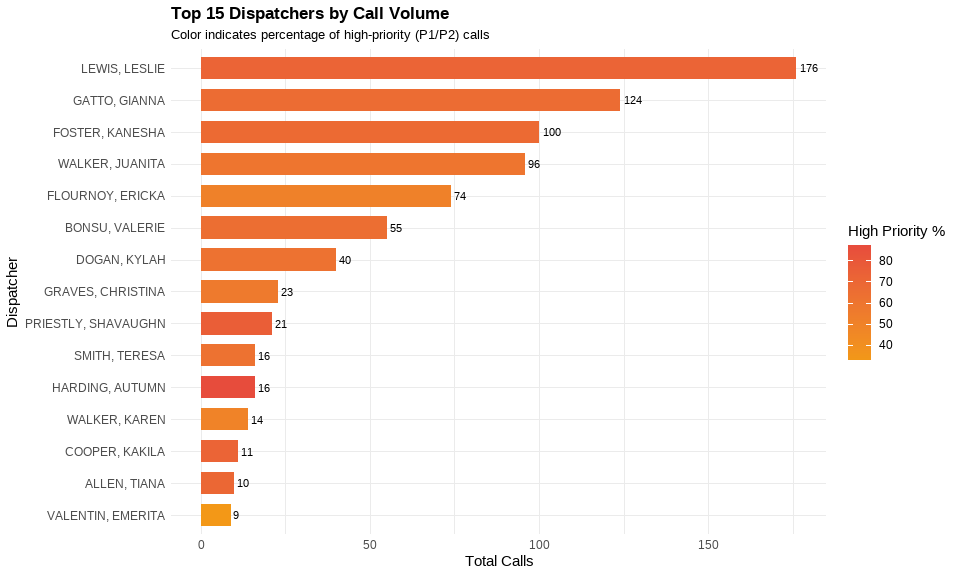

### Staff Development Insights


#### Top Performers (Fastest Median TTD)


``` r
to_ft(
  top_performers %>% dplyr::select(Dispatcher, Total_Calls, Median_TTD, High_Priority_Pct),
  caption = "Top 5 Performers - Fastest Dispatch Times (min 10 calls)",
  header_map = list(
    Dispatcher = "Dispatcher",
    Total_Calls = "Calls",
    Median_TTD = "Median TTD (s)",
    High_Priority_Pct = "High Priority %"
  ),
  digits = 1
)
```

<div class="tabwid"><style>.cl-a856bff2{}.cl-a84d5476{font-family:'Arial';font-size:9pt;font-weight:bold;font-style:normal;text-decoration:none;color:rgba(0, 0, 0, 1.00);background-color:transparent;}.cl-a84d5480{font-family:'Arial';font-size:9pt;font-weight:normal;font-style:normal;text-decoration:none;color:rgba(0, 0, 0, 1.00);background-color:transparent;}.cl-a8513992{margin:0;text-align:left;border-bottom: 0 solid rgba(0, 0, 0, 1.00);border-top: 0 solid rgba(0, 0, 0, 1.00);border-left: 0 solid rgba(0, 0, 0, 1.00);border-right: 0 solid rgba(0, 0, 0, 1.00);padding-bottom:3pt;padding-top:3pt;padding-left:3pt;padding-right:3pt;line-height: 1;background-color:transparent;}.cl-a851399c{margin:0;text-align:right;border-bottom: 0 solid rgba(0, 0, 0, 1.00);border-top: 0 solid rgba(0, 0, 0, 1.00);border-left: 0 solid rgba(0, 0, 0, 1.00);border-right: 0 solid rgba(0, 0, 0, 1.00);padding-bottom:3pt;padding-top:3pt;padding-left:3pt;padding-right:3pt;line-height: 1;background-color:transparent;}.cl-a85160c0{width:1.475in;background-color:transparent;vertical-align: middle;border-bottom: 1.5pt solid rgba(102, 102, 102, 1.00);border-top: 1.5pt solid rgba(102, 102, 102, 1.00);border-left: 0 solid rgba(0, 0, 0, 1.00);border-right: 0 solid rgba(0, 0, 0, 1.00);margin-bottom:0;margin-top:0;margin-left:0;margin-right:0;}.cl-a85160d4{width:0.51in;background-color:transparent;vertical-align: middle;border-bottom: 1.5pt solid rgba(102, 102, 102, 1.00);border-top: 1.5pt solid rgba(102, 102, 102, 1.00);border-left: 0 solid rgba(0, 0, 0, 1.00);border-right: 0 solid rgba(0, 0, 0, 1.00);margin-bottom:0;margin-top:0;margin-left:0;margin-right:0;}.cl-a85160d5{width:1.107in;background-color:transparent;vertical-align: middle;border-bottom: 1.5pt solid rgba(102, 102, 102, 1.00);border-top: 1.5pt solid rgba(102, 102, 102, 1.00);border-left: 0 solid rgba(0, 0, 0, 1.00);border-right: 0 solid rgba(0, 0, 0, 1.00);margin-bottom:0;margin-top:0;margin-left:0;margin-right:0;}.cl-a85160d6{width:1.107in;background-color:transparent;vertical-align: middle;border-bottom: 1.5pt solid rgba(102, 102, 102, 1.00);border-top: 1.5pt solid rgba(102, 102, 102, 1.00);border-left: 0 solid rgba(0, 0, 0, 1.00);border-right: 0 solid rgba(0, 0, 0, 1.00);margin-bottom:0;margin-top:0;margin-left:0;margin-right:0;}.cl-a85160de{width:1.475in;background-color:rgba(245, 245, 245, 1.00);vertical-align: middle;border-bottom: 0 solid rgba(0, 0, 0, 1.00);border-top: 0 solid rgba(0, 0, 0, 1.00);border-left: 0 solid rgba(0, 0, 0, 1.00);border-right: 0 solid rgba(0, 0, 0, 1.00);margin-bottom:0;margin-top:0;margin-left:0;margin-right:0;}.cl-a85160df{width:0.51in;background-color:rgba(245, 245, 245, 1.00);vertical-align: middle;border-bottom: 0 solid rgba(0, 0, 0, 1.00);border-top: 0 solid rgba(0, 0, 0, 1.00);border-left: 0 solid rgba(0, 0, 0, 1.00);border-right: 0 solid rgba(0, 0, 0, 1.00);margin-bottom:0;margin-top:0;margin-left:0;margin-right:0;}.cl-a85160e8{width:1.107in;background-color:rgba(245, 245, 245, 1.00);vertical-align: middle;border-bottom: 0 solid rgba(0, 0, 0, 1.00);border-top: 0 solid rgba(0, 0, 0, 1.00);border-left: 0 solid rgba(0, 0, 0, 1.00);border-right: 0 solid rgba(0, 0, 0, 1.00);margin-bottom:0;margin-top:0;margin-left:0;margin-right:0;}.cl-a85160e9{width:1.107in;background-color:rgba(245, 245, 245, 1.00);vertical-align: middle;border-bottom: 0 solid rgba(0, 0, 0, 1.00);border-top: 0 solid rgba(0, 0, 0, 1.00);border-left: 0 solid rgba(0, 0, 0, 1.00);border-right: 0 solid rgba(0, 0, 0, 1.00);margin-bottom:0;margin-top:0;margin-left:0;margin-right:0;}.cl-a85160f2{width:1.475in;background-color:transparent;vertical-align: middle;border-bottom: 0 solid rgba(0, 0, 0, 1.00);border-top: 0 solid rgba(0, 0, 0, 1.00);border-left: 0 solid rgba(0, 0, 0, 1.00);border-right: 0 solid rgba(0, 0, 0, 1.00);margin-bottom:0;margin-top:0;margin-left:0;margin-right:0;}.cl-a85160f3{width:0.51in;background-color:transparent;vertical-align: middle;border-bottom: 0 solid rgba(0, 0, 0, 1.00);border-top: 0 solid rgba(0, 0, 0, 1.00);border-left: 0 solid rgba(0, 0, 0, 1.00);border-right: 0 solid rgba(0, 0, 0, 1.00);margin-bottom:0;margin-top:0;margin-left:0;margin-right:0;}.cl-a85160f4{width:1.107in;background-color:transparent;vertical-align: middle;border-bottom: 0 solid rgba(0, 0, 0, 1.00);border-top: 0 solid rgba(0, 0, 0, 1.00);border-left: 0 solid rgba(0, 0, 0, 1.00);border-right: 0 solid rgba(0, 0, 0, 1.00);margin-bottom:0;margin-top:0;margin-left:0;margin-right:0;}.cl-a85160fc{width:1.107in;background-color:transparent;vertical-align: middle;border-bottom: 0 solid rgba(0, 0, 0, 1.00);border-top: 0 solid rgba(0, 0, 0, 1.00);border-left: 0 solid rgba(0, 0, 0, 1.00);border-right: 0 solid rgba(0, 0, 0, 1.00);margin-bottom:0;margin-top:0;margin-left:0;margin-right:0;}.cl-a85160fd{width:1.475in;background-color:rgba(245, 245, 245, 1.00);vertical-align: middle;border-bottom: 0 solid rgba(0, 0, 0, 1.00);border-top: 0 solid rgba(0, 0, 0, 1.00);border-left: 0 solid rgba(0, 0, 0, 1.00);border-right: 0 solid rgba(0, 0, 0, 1.00);margin-bottom:0;margin-top:0;margin-left:0;margin-right:0;}.cl-a85160fe{width:0.51in;background-color:rgba(245, 245, 245, 1.00);vertical-align: middle;border-bottom: 0 solid rgba(0, 0, 0, 1.00);border-top: 0 solid rgba(0, 0, 0, 1.00);border-left: 0 solid rgba(0, 0, 0, 1.00);border-right: 0 solid rgba(0, 0, 0, 1.00);margin-bottom:0;margin-top:0;margin-left:0;margin-right:0;}.cl-a85160ff{width:1.107in;background-color:rgba(245, 245, 245, 1.00);vertical-align: middle;border-bottom: 0 solid rgba(0, 0, 0, 1.00);border-top: 0 solid rgba(0, 0, 0, 1.00);border-left: 0 solid rgba(0, 0, 0, 1.00);border-right: 0 solid rgba(0, 0, 0, 1.00);margin-bottom:0;margin-top:0;margin-left:0;margin-right:0;}.cl-a8516106{width:1.107in;background-color:rgba(245, 245, 245, 1.00);vertical-align: middle;border-bottom: 0 solid rgba(0, 0, 0, 1.00);border-top: 0 solid rgba(0, 0, 0, 1.00);border-left: 0 solid rgba(0, 0, 0, 1.00);border-right: 0 solid rgba(0, 0, 0, 1.00);margin-bottom:0;margin-top:0;margin-left:0;margin-right:0;}.cl-a8516107{width:1.475in;background-color:transparent;vertical-align: middle;border-bottom: 0 solid rgba(0, 0, 0, 1.00);border-top: 0 solid rgba(0, 0, 0, 1.00);border-left: 0 solid rgba(0, 0, 0, 1.00);border-right: 0 solid rgba(0, 0, 0, 1.00);margin-bottom:0;margin-top:0;margin-left:0;margin-right:0;}.cl-a8516108{width:0.51in;background-color:transparent;vertical-align: middle;border-bottom: 0 solid rgba(0, 0, 0, 1.00);border-top: 0 solid rgba(0, 0, 0, 1.00);border-left: 0 solid rgba(0, 0, 0, 1.00);border-right: 0 solid rgba(0, 0, 0, 1.00);margin-bottom:0;margin-top:0;margin-left:0;margin-right:0;}.cl-a8516110{width:1.107in;background-color:transparent;vertical-align: middle;border-bottom: 0 solid rgba(0, 0, 0, 1.00);border-top: 0 solid rgba(0, 0, 0, 1.00);border-left: 0 solid rgba(0, 0, 0, 1.00);border-right: 0 solid rgba(0, 0, 0, 1.00);margin-bottom:0;margin-top:0;margin-left:0;margin-right:0;}.cl-a8516111{width:1.107in;background-color:transparent;vertical-align: middle;border-bottom: 0 solid rgba(0, 0, 0, 1.00);border-top: 0 solid rgba(0, 0, 0, 1.00);border-left: 0 solid rgba(0, 0, 0, 1.00);border-right: 0 solid rgba(0, 0, 0, 1.00);margin-bottom:0;margin-top:0;margin-left:0;margin-right:0;}.cl-a851611a{width:1.475in;background-color:rgba(245, 245, 245, 1.00);vertical-align: middle;border-bottom: 1.5pt solid rgba(102, 102, 102, 1.00);border-top: 0 solid rgba(0, 0, 0, 1.00);border-left: 0 solid rgba(0, 0, 0, 1.00);border-right: 0 solid rgba(0, 0, 0, 1.00);margin-bottom:0;margin-top:0;margin-left:0;margin-right:0;}.cl-a8516124{width:0.51in;background-color:rgba(245, 245, 245, 1.00);vertical-align: middle;border-bottom: 1.5pt solid rgba(102, 102, 102, 1.00);border-top: 0 solid rgba(0, 0, 0, 1.00);border-left: 0 solid rgba(0, 0, 0, 1.00);border-right: 0 solid rgba(0, 0, 0, 1.00);margin-bottom:0;margin-top:0;margin-left:0;margin-right:0;}.cl-a8516125{width:1.107in;background-color:rgba(245, 245, 245, 1.00);vertical-align: middle;border-bottom: 1.5pt solid rgba(102, 102, 102, 1.00);border-top: 0 solid rgba(0, 0, 0, 1.00);border-left: 0 solid rgba(0, 0, 0, 1.00);border-right: 0 solid rgba(0, 0, 0, 1.00);margin-bottom:0;margin-top:0;margin-left:0;margin-right:0;}.cl-a851612e{width:1.107in;background-color:rgba(245, 245, 245, 1.00);vertical-align: middle;border-bottom: 1.5pt solid rgba(102, 102, 102, 1.00);border-top: 0 solid rgba(0, 0, 0, 1.00);border-left: 0 solid rgba(0, 0, 0, 1.00);border-right: 0 solid rgba(0, 0, 0, 1.00);margin-bottom:0;margin-top:0;margin-left:0;margin-right:0;}.tabwid {
  font-size: initial;
  padding-bottom: 1em;
}

.tabwid table{
  border-spacing:0px !important;
  border-collapse:collapse;
  line-height:1;
  margin-left:auto;
  margin-right:auto;
  border-width: 0;
  border-color: transparent;
  caption-side: top;
}
.tabwid-caption-bottom table{
  caption-side: bottom;
}
.tabwid_left table{
  margin-left:0;
}
.tabwid_right table{
  margin-right:0;
}
.tabwid td, .tabwid th {
    padding: 0;
}
.tabwid a {
  text-decoration: none;
}
.tabwid thead {
    background-color: transparent;
}
.tabwid tfoot {
    background-color: transparent;
}
.tabwid table tr {
background-color: transparent;
}
.katex-display {
    margin: 0 0 !important;
}</style><table data-quarto-disable-processing='true' class='cl-a856bff2'><thead><tr style="overflow-wrap:break-word;"><th class="cl-a85160c0"><p class="cl-a8513992"><span class="cl-a84d5476">Dispatcher</span></p></th><th class="cl-a85160d4"><p class="cl-a851399c"><span class="cl-a84d5476">Calls</span></p></th><th class="cl-a85160d5"><p class="cl-a851399c"><span class="cl-a84d5476">Median TTD (s)</span></p></th><th class="cl-a85160d6"><p class="cl-a851399c"><span class="cl-a84d5476">High Priority %</span></p></th></tr></thead><tbody><tr style="overflow-wrap:break-word;"><td class="cl-a85160de"><p class="cl-a8513992"><span class="cl-a84d5480">GRAVES, CHRISTINA</span></p></td><td class="cl-a85160df"><p class="cl-a851399c"><span class="cl-a84d5480">23</span></p></td><td class="cl-a85160e8"><p class="cl-a851399c"><span class="cl-a84d5480">2.0</span></p></td><td class="cl-a85160e9"><p class="cl-a851399c"><span class="cl-a84d5480">56.5</span></p></td></tr><tr style="overflow-wrap:break-word;"><td class="cl-a85160f2"><p class="cl-a8513992"><span class="cl-a84d5480">WALKER, KAREN</span></p></td><td class="cl-a85160f3"><p class="cl-a851399c"><span class="cl-a84d5480">14</span></p></td><td class="cl-a85160f4"><p class="cl-a851399c"><span class="cl-a84d5480">2.0</span></p></td><td class="cl-a85160fc"><p class="cl-a851399c"><span class="cl-a84d5480">50.0</span></p></td></tr><tr style="overflow-wrap:break-word;"><td class="cl-a85160fd"><p class="cl-a8513992"><span class="cl-a84d5480">COOPER, KAKILA</span></p></td><td class="cl-a85160fe"><p class="cl-a851399c"><span class="cl-a84d5480">11</span></p></td><td class="cl-a85160ff"><p class="cl-a851399c"><span class="cl-a84d5480">3.0</span></p></td><td class="cl-a8516106"><p class="cl-a851399c"><span class="cl-a84d5480">72.7</span></p></td></tr><tr style="overflow-wrap:break-word;"><td class="cl-a8516107"><p class="cl-a8513992"><span class="cl-a84d5480">HARDING, AUTUMN</span></p></td><td class="cl-a8516108"><p class="cl-a851399c"><span class="cl-a84d5480">16</span></p></td><td class="cl-a8516110"><p class="cl-a851399c"><span class="cl-a84d5480">20.5</span></p></td><td class="cl-a8516111"><p class="cl-a851399c"><span class="cl-a84d5480">87.5</span></p></td></tr><tr style="overflow-wrap:break-word;"><td class="cl-a851611a"><p class="cl-a8513992"><span class="cl-a84d5480">LEWIS, LESLIE</span></p></td><td class="cl-a8516124"><p class="cl-a851399c"><span class="cl-a84d5480">176</span></p></td><td class="cl-a8516125"><p class="cl-a851399c"><span class="cl-a84d5480">67.0</span></p></td><td class="cl-a851612e"><p class="cl-a851399c"><span class="cl-a84d5480">72.2</span></p></td></tr></tbody></table></div>

#### Development Opportunities (Slowest Median TTD)


``` r
to_ft(
  needs_support %>% dplyr::select(Dispatcher, Total_Calls, Median_TTD, High_Priority_Pct),
  caption = "Dispatchers with Longest Dispatch Times (min 10 calls)",
  header_map = list(
    Dispatcher = "Dispatcher",
    Total_Calls = "Calls",
    Median_TTD = "Median TTD (s)",
    High_Priority_Pct = "High Priority %"
  ),
  digits = 1
)
```

<div class="tabwid"><style>.cl-a88200c2{}.cl-a8790d8c{font-family:'Arial';font-size:9pt;font-weight:bold;font-style:normal;text-decoration:none;color:rgba(0, 0, 0, 1.00);background-color:transparent;}.cl-a8790d96{font-family:'Arial';font-size:9pt;font-weight:normal;font-style:normal;text-decoration:none;color:rgba(0, 0, 0, 1.00);background-color:transparent;}.cl-a87cb356{margin:0;text-align:left;border-bottom: 0 solid rgba(0, 0, 0, 1.00);border-top: 0 solid rgba(0, 0, 0, 1.00);border-left: 0 solid rgba(0, 0, 0, 1.00);border-right: 0 solid rgba(0, 0, 0, 1.00);padding-bottom:3pt;padding-top:3pt;padding-left:3pt;padding-right:3pt;line-height: 1;background-color:transparent;}.cl-a87cb360{margin:0;text-align:right;border-bottom: 0 solid rgba(0, 0, 0, 1.00);border-top: 0 solid rgba(0, 0, 0, 1.00);border-left: 0 solid rgba(0, 0, 0, 1.00);border-right: 0 solid rgba(0, 0, 0, 1.00);padding-bottom:3pt;padding-top:3pt;padding-left:3pt;padding-right:3pt;line-height: 1;background-color:transparent;}.cl-a87cd99e{width:1.677in;background-color:transparent;vertical-align: middle;border-bottom: 1.5pt solid rgba(102, 102, 102, 1.00);border-top: 1.5pt solid rgba(102, 102, 102, 1.00);border-left: 0 solid rgba(0, 0, 0, 1.00);border-right: 0 solid rgba(0, 0, 0, 1.00);margin-bottom:0;margin-top:0;margin-left:0;margin-right:0;}.cl-a87cd9a8{width:0.51in;background-color:transparent;vertical-align: middle;border-bottom: 1.5pt solid rgba(102, 102, 102, 1.00);border-top: 1.5pt solid rgba(102, 102, 102, 1.00);border-left: 0 solid rgba(0, 0, 0, 1.00);border-right: 0 solid rgba(0, 0, 0, 1.00);margin-bottom:0;margin-top:0;margin-left:0;margin-right:0;}.cl-a87cd9a9{width:1.107in;background-color:transparent;vertical-align: middle;border-bottom: 1.5pt solid rgba(102, 102, 102, 1.00);border-top: 1.5pt solid rgba(102, 102, 102, 1.00);border-left: 0 solid rgba(0, 0, 0, 1.00);border-right: 0 solid rgba(0, 0, 0, 1.00);margin-bottom:0;margin-top:0;margin-left:0;margin-right:0;}.cl-a87cd9b2{width:1.107in;background-color:transparent;vertical-align: middle;border-bottom: 1.5pt solid rgba(102, 102, 102, 1.00);border-top: 1.5pt solid rgba(102, 102, 102, 1.00);border-left: 0 solid rgba(0, 0, 0, 1.00);border-right: 0 solid rgba(0, 0, 0, 1.00);margin-bottom:0;margin-top:0;margin-left:0;margin-right:0;}.cl-a87cd9bc{width:1.677in;background-color:rgba(245, 245, 245, 1.00);vertical-align: middle;border-bottom: 0 solid rgba(0, 0, 0, 1.00);border-top: 0 solid rgba(0, 0, 0, 1.00);border-left: 0 solid rgba(0, 0, 0, 1.00);border-right: 0 solid rgba(0, 0, 0, 1.00);margin-bottom:0;margin-top:0;margin-left:0;margin-right:0;}.cl-a87cd9bd{width:0.51in;background-color:rgba(245, 245, 245, 1.00);vertical-align: middle;border-bottom: 0 solid rgba(0, 0, 0, 1.00);border-top: 0 solid rgba(0, 0, 0, 1.00);border-left: 0 solid rgba(0, 0, 0, 1.00);border-right: 0 solid rgba(0, 0, 0, 1.00);margin-bottom:0;margin-top:0;margin-left:0;margin-right:0;}.cl-a87cd9c6{width:1.107in;background-color:rgba(245, 245, 245, 1.00);vertical-align: middle;border-bottom: 0 solid rgba(0, 0, 0, 1.00);border-top: 0 solid rgba(0, 0, 0, 1.00);border-left: 0 solid rgba(0, 0, 0, 1.00);border-right: 0 solid rgba(0, 0, 0, 1.00);margin-bottom:0;margin-top:0;margin-left:0;margin-right:0;}.cl-a87cd9c7{width:1.107in;background-color:rgba(245, 245, 245, 1.00);vertical-align: middle;border-bottom: 0 solid rgba(0, 0, 0, 1.00);border-top: 0 solid rgba(0, 0, 0, 1.00);border-left: 0 solid rgba(0, 0, 0, 1.00);border-right: 0 solid rgba(0, 0, 0, 1.00);margin-bottom:0;margin-top:0;margin-left:0;margin-right:0;}.cl-a87cd9c8{width:1.677in;background-color:transparent;vertical-align: middle;border-bottom: 0 solid rgba(0, 0, 0, 1.00);border-top: 0 solid rgba(0, 0, 0, 1.00);border-left: 0 solid rgba(0, 0, 0, 1.00);border-right: 0 solid rgba(0, 0, 0, 1.00);margin-bottom:0;margin-top:0;margin-left:0;margin-right:0;}.cl-a87cd9d0{width:0.51in;background-color:transparent;vertical-align: middle;border-bottom: 0 solid rgba(0, 0, 0, 1.00);border-top: 0 solid rgba(0, 0, 0, 1.00);border-left: 0 solid rgba(0, 0, 0, 1.00);border-right: 0 solid rgba(0, 0, 0, 1.00);margin-bottom:0;margin-top:0;margin-left:0;margin-right:0;}.cl-a87cd9d1{width:1.107in;background-color:transparent;vertical-align: middle;border-bottom: 0 solid rgba(0, 0, 0, 1.00);border-top: 0 solid rgba(0, 0, 0, 1.00);border-left: 0 solid rgba(0, 0, 0, 1.00);border-right: 0 solid rgba(0, 0, 0, 1.00);margin-bottom:0;margin-top:0;margin-left:0;margin-right:0;}.cl-a87cd9da{width:1.107in;background-color:transparent;vertical-align: middle;border-bottom: 0 solid rgba(0, 0, 0, 1.00);border-top: 0 solid rgba(0, 0, 0, 1.00);border-left: 0 solid rgba(0, 0, 0, 1.00);border-right: 0 solid rgba(0, 0, 0, 1.00);margin-bottom:0;margin-top:0;margin-left:0;margin-right:0;}.cl-a87cd9db{width:1.677in;background-color:transparent;vertical-align: middle;border-bottom: 0 solid rgba(0, 0, 0, 1.00);border-top: 0 solid rgba(0, 0, 0, 1.00);border-left: 0 solid rgba(0, 0, 0, 1.00);border-right: 0 solid rgba(0, 0, 0, 1.00);margin-bottom:0;margin-top:0;margin-left:0;margin-right:0;}.cl-a87cd9e4{width:0.51in;background-color:transparent;vertical-align: middle;border-bottom: 0 solid rgba(0, 0, 0, 1.00);border-top: 0 solid rgba(0, 0, 0, 1.00);border-left: 0 solid rgba(0, 0, 0, 1.00);border-right: 0 solid rgba(0, 0, 0, 1.00);margin-bottom:0;margin-top:0;margin-left:0;margin-right:0;}.cl-a87cd9e5{width:1.107in;background-color:transparent;vertical-align: middle;border-bottom: 0 solid rgba(0, 0, 0, 1.00);border-top: 0 solid rgba(0, 0, 0, 1.00);border-left: 0 solid rgba(0, 0, 0, 1.00);border-right: 0 solid rgba(0, 0, 0, 1.00);margin-bottom:0;margin-top:0;margin-left:0;margin-right:0;}.cl-a87cd9e6{width:1.107in;background-color:transparent;vertical-align: middle;border-bottom: 0 solid rgba(0, 0, 0, 1.00);border-top: 0 solid rgba(0, 0, 0, 1.00);border-left: 0 solid rgba(0, 0, 0, 1.00);border-right: 0 solid rgba(0, 0, 0, 1.00);margin-bottom:0;margin-top:0;margin-left:0;margin-right:0;}.cl-a87cd9ee{width:1.677in;background-color:rgba(245, 245, 245, 1.00);vertical-align: middle;border-bottom: 1.5pt solid rgba(102, 102, 102, 1.00);border-top: 0 solid rgba(0, 0, 0, 1.00);border-left: 0 solid rgba(0, 0, 0, 1.00);border-right: 0 solid rgba(0, 0, 0, 1.00);margin-bottom:0;margin-top:0;margin-left:0;margin-right:0;}.cl-a87cd9ef{width:0.51in;background-color:rgba(245, 245, 245, 1.00);vertical-align: middle;border-bottom: 1.5pt solid rgba(102, 102, 102, 1.00);border-top: 0 solid rgba(0, 0, 0, 1.00);border-left: 0 solid rgba(0, 0, 0, 1.00);border-right: 0 solid rgba(0, 0, 0, 1.00);margin-bottom:0;margin-top:0;margin-left:0;margin-right:0;}.cl-a87cd9f8{width:1.107in;background-color:rgba(245, 245, 245, 1.00);vertical-align: middle;border-bottom: 1.5pt solid rgba(102, 102, 102, 1.00);border-top: 0 solid rgba(0, 0, 0, 1.00);border-left: 0 solid rgba(0, 0, 0, 1.00);border-right: 0 solid rgba(0, 0, 0, 1.00);margin-bottom:0;margin-top:0;margin-left:0;margin-right:0;}.cl-a87cd9f9{width:1.107in;background-color:rgba(245, 245, 245, 1.00);vertical-align: middle;border-bottom: 1.5pt solid rgba(102, 102, 102, 1.00);border-top: 0 solid rgba(0, 0, 0, 1.00);border-left: 0 solid rgba(0, 0, 0, 1.00);border-right: 0 solid rgba(0, 0, 0, 1.00);margin-bottom:0;margin-top:0;margin-left:0;margin-right:0;}.tabwid {
  font-size: initial;
  padding-bottom: 1em;
}

.tabwid table{
  border-spacing:0px !important;
  border-collapse:collapse;
  line-height:1;
  margin-left:auto;
  margin-right:auto;
  border-width: 0;
  border-color: transparent;
  caption-side: top;
}
.tabwid-caption-bottom table{
  caption-side: bottom;
}
.tabwid_left table{
  margin-left:0;
}
.tabwid_right table{
  margin-right:0;
}
.tabwid td, .tabwid th {
    padding: 0;
}
.tabwid a {
  text-decoration: none;
}
.tabwid thead {
    background-color: transparent;
}
.tabwid tfoot {
    background-color: transparent;
}
.tabwid table tr {
background-color: transparent;
}
.katex-display {
    margin: 0 0 !important;
}</style><table data-quarto-disable-processing='true' class='cl-a88200c2'><thead><tr style="overflow-wrap:break-word;"><th class="cl-a87cd99e"><p class="cl-a87cb356"><span class="cl-a8790d8c">Dispatcher</span></p></th><th class="cl-a87cd9a8"><p class="cl-a87cb360"><span class="cl-a8790d8c">Calls</span></p></th><th class="cl-a87cd9a9"><p class="cl-a87cb360"><span class="cl-a8790d8c">Median TTD (s)</span></p></th><th class="cl-a87cd9b2"><p class="cl-a87cb360"><span class="cl-a8790d8c">High Priority %</span></p></th></tr></thead><tbody><tr style="overflow-wrap:break-word;"><td class="cl-a87cd9bc"><p class="cl-a87cb356"><span class="cl-a8790d96">DOGAN, KYLAH</span></p></td><td class="cl-a87cd9bd"><p class="cl-a87cb360"><span class="cl-a8790d96">40</span></p></td><td class="cl-a87cd9c6"><p class="cl-a87cb360"><span class="cl-a8790d96">563.5</span></p></td><td class="cl-a87cd9c7"><p class="cl-a87cb360"><span class="cl-a8790d96">62.5</span></p></td></tr><tr style="overflow-wrap:break-word;"><td class="cl-a87cd9c8"><p class="cl-a87cb356"><span class="cl-a8790d96">BONSU, VALERIE</span></p></td><td class="cl-a87cd9d0"><p class="cl-a87cb360"><span class="cl-a8790d96">55</span></p></td><td class="cl-a87cd9d1"><p class="cl-a87cb360"><span class="cl-a8790d96">463.0</span></p></td><td class="cl-a87cd9da"><p class="cl-a87cb360"><span class="cl-a8790d96">65.5</span></p></td></tr><tr style="overflow-wrap:break-word;"><td class="cl-a87cd9bc"><p class="cl-a87cb356"><span class="cl-a8790d96">GATTO, GIANNA</span></p></td><td class="cl-a87cd9bd"><p class="cl-a87cb360"><span class="cl-a8790d96">124</span></p></td><td class="cl-a87cd9c6"><p class="cl-a87cb360"><span class="cl-a8790d96">420.0</span></p></td><td class="cl-a87cd9c7"><p class="cl-a87cb360"><span class="cl-a8790d96">66.9</span></p></td></tr><tr style="overflow-wrap:break-word;"><td class="cl-a87cd9db"><p class="cl-a87cb356"><span class="cl-a8790d96">PRIESTLY, SHAVAUGHN</span></p></td><td class="cl-a87cd9e4"><p class="cl-a87cb360"><span class="cl-a8790d96">21</span></p></td><td class="cl-a87cd9e5"><p class="cl-a87cb360"><span class="cl-a8790d96">296.0</span></p></td><td class="cl-a87cd9e6"><p class="cl-a87cb360"><span class="cl-a8790d96">76.2</span></p></td></tr><tr style="overflow-wrap:break-word;"><td class="cl-a87cd9ee"><p class="cl-a87cb356"><span class="cl-a8790d96">SMITH, TERESA</span></p></td><td class="cl-a87cd9ef"><p class="cl-a87cb360"><span class="cl-a8790d96">16</span></p></td><td class="cl-a87cd9f8"><p class="cl-a87cb360"><span class="cl-a8790d96">182.5</span></p></td><td class="cl-a87cd9f9"><p class="cl-a87cb360"><span class="cl-a8790d96">62.5</span></p></td></tr></tbody></table></div>

**Coaching Recommendations:**

- Consider pairing dispatchers from the development opportunities list with top performers for mentoring
- Analyze call types handled by slower dispatchers - are they inherently more complex?
- Review procedures and protocols with dispatchers showing high TTD variance

### Automated Recommendations


#### Priority Action Items


**Recommended Actions:**

1. 🎓 **Training**: 12 dispatchers show high variability in dispatch times. Consider consistency training and standard operating procedure reviews.

2. 🚨 **Compliance**: LAW P1 SLA compliance below 90% target. See KPI Summary section for details. Immediate review recommended.

3. 🚨 **Compliance**: LAW P2 SLA compliance below 85% target. See KPI Summary section for details. Immediate review recommended.

### Process Improvement Opportunities


**Complex Call Types Requiring Extended Handling:**

- **LARCENY OTHER DELAY**: 32116 seconds mean processing time (11 calls)
- **LARCENY COMMERCIAL DELAY**: 18283 seconds mean processing time (7 calls)
- **ASSIST OUTSIDE AGENCY**: 11403 seconds mean processing time (7 calls)
- **TELEPHONE COMPLAINT**: 10707 seconds mean processing time (7 calls)
- **SHOPLIFTING IN PROG**: 8724 seconds mean processing time (8 calls)

Consider developing specialized protocols or additional training for these call types.

---

### Summary statsitcs and analyses

In this section, we will analyse the continuous variables that represent the elapsed time for various segments of the call process. The variables of interest include: Time_To_Queue, Time_To_Dispatch, Phone_Time, Processing_Time, Rollout_Time, Transit_Time, and Total_Call_Time. They are defined as follows:

- Time_To_Queue
: The time from the start of the call to the time it is released to queue for dispatch.

- Time_To_Dispatch
: The time from the time the call is released for dispatch to the time the first unit is assigned.

- Phone_Time
: The time from the start of the call to the time the phone call ended.

- Processing_Time
: The time from the start of the call until the first unit is assigned.

- Rollout_Time
: The time from the assignment of the first unit to the first unit marking en route to the call.

- Transit_Time
: The time from the first unit marking en route to the call to the first unit arriving on scene.

- Total_Call_Time
: The total time from the start of the call to the time the call was closed. If the call is re-opened, then this clock stops with the first closure.

<div class="tabwid"><style>.cl-a8d45552{}.cl-a8cac370{font-family:'Arial';font-size:9pt;font-weight:bold;font-style:normal;text-decoration:none;color:rgba(0, 0, 0, 1.00);background-color:transparent;}.cl-a8cac384{font-family:'Arial';font-size:9pt;font-weight:normal;font-style:normal;text-decoration:none;color:rgba(0, 0, 0, 1.00);background-color:transparent;}.cl-a8cede7e{margin:0;text-align:left;border-bottom: 0 solid rgba(0, 0, 0, 1.00);border-top: 0 solid rgba(0, 0, 0, 1.00);border-left: 0 solid rgba(0, 0, 0, 1.00);border-right: 0 solid rgba(0, 0, 0, 1.00);padding-bottom:3pt;padding-top:3pt;padding-left:3pt;padding-right:3pt;line-height: 1;background-color:transparent;}.cl-a8cede88{margin:0;text-align:right;border-bottom: 0 solid rgba(0, 0, 0, 1.00);border-top: 0 solid rgba(0, 0, 0, 1.00);border-left: 0 solid rgba(0, 0, 0, 1.00);border-right: 0 solid rgba(0, 0, 0, 1.00);padding-bottom:3pt;padding-top:3pt;padding-left:3pt;padding-right:3pt;line-height: 1;background-color:transparent;}.cl-a8cf049e{width:1.191in;background-color:transparent;vertical-align: middle;border-bottom: 1.5pt solid rgba(102, 102, 102, 1.00);border-top: 1.5pt solid rgba(102, 102, 102, 1.00);border-left: 0 solid rgba(0, 0, 0, 1.00);border-right: 0 solid rgba(0, 0, 0, 1.00);margin-bottom:0;margin-top:0;margin-left:0;margin-right:0;}.cl-a8cf04a8{width:0.635in;background-color:transparent;vertical-align: middle;border-bottom: 1.5pt solid rgba(102, 102, 102, 1.00);border-top: 1.5pt solid rgba(102, 102, 102, 1.00);border-left: 0 solid rgba(0, 0, 0, 1.00);border-right: 0 solid rgba(0, 0, 0, 1.00);margin-bottom:0;margin-top:0;margin-left:0;margin-right:0;}.cl-a8cf04b2{width:0.698in;background-color:transparent;vertical-align: middle;border-bottom: 1.5pt solid rgba(102, 102, 102, 1.00);border-top: 1.5pt solid rgba(102, 102, 102, 1.00);border-left: 0 solid rgba(0, 0, 0, 1.00);border-right: 0 solid rgba(0, 0, 0, 1.00);margin-bottom:0;margin-top:0;margin-left:0;margin-right:0;}.cl-a8cf04b3{width:0.642in;background-color:transparent;vertical-align: middle;border-bottom: 1.5pt solid rgba(102, 102, 102, 1.00);border-top: 1.5pt solid rgba(102, 102, 102, 1.00);border-left: 0 solid rgba(0, 0, 0, 1.00);border-right: 0 solid rgba(0, 0, 0, 1.00);margin-bottom:0;margin-top:0;margin-left:0;margin-right:0;}.cl-a8cf04b4{width:1.191in;background-color:rgba(245, 245, 245, 1.00);vertical-align: middle;border-bottom: 0 solid rgba(0, 0, 0, 1.00);border-top: 0 solid rgba(0, 0, 0, 1.00);border-left: 0 solid rgba(0, 0, 0, 1.00);border-right: 0 solid rgba(0, 0, 0, 1.00);margin-bottom:0;margin-top:0;margin-left:0;margin-right:0;}.cl-a8cf04bc{width:0.635in;background-color:rgba(245, 245, 245, 1.00);vertical-align: middle;border-bottom: 0 solid rgba(0, 0, 0, 1.00);border-top: 0 solid rgba(0, 0, 0, 1.00);border-left: 0 solid rgba(0, 0, 0, 1.00);border-right: 0 solid rgba(0, 0, 0, 1.00);margin-bottom:0;margin-top:0;margin-left:0;margin-right:0;}.cl-a8cf04bd{width:0.698in;background-color:rgba(245, 245, 245, 1.00);vertical-align: middle;border-bottom: 0 solid rgba(0, 0, 0, 1.00);border-top: 0 solid rgba(0, 0, 0, 1.00);border-left: 0 solid rgba(0, 0, 0, 1.00);border-right: 0 solid rgba(0, 0, 0, 1.00);margin-bottom:0;margin-top:0;margin-left:0;margin-right:0;}.cl-a8cf04c6{width:0.642in;background-color:rgba(245, 245, 245, 1.00);vertical-align: middle;border-bottom: 0 solid rgba(0, 0, 0, 1.00);border-top: 0 solid rgba(0, 0, 0, 1.00);border-left: 0 solid rgba(0, 0, 0, 1.00);border-right: 0 solid rgba(0, 0, 0, 1.00);margin-bottom:0;margin-top:0;margin-left:0;margin-right:0;}.cl-a8cf04c7{width:1.191in;background-color:transparent;vertical-align: middle;border-bottom: 0 solid rgba(0, 0, 0, 1.00);border-top: 0 solid rgba(0, 0, 0, 1.00);border-left: 0 solid rgba(0, 0, 0, 1.00);border-right: 0 solid rgba(0, 0, 0, 1.00);margin-bottom:0;margin-top:0;margin-left:0;margin-right:0;}.cl-a8cf04d0{width:0.635in;background-color:transparent;vertical-align: middle;border-bottom: 0 solid rgba(0, 0, 0, 1.00);border-top: 0 solid rgba(0, 0, 0, 1.00);border-left: 0 solid rgba(0, 0, 0, 1.00);border-right: 0 solid rgba(0, 0, 0, 1.00);margin-bottom:0;margin-top:0;margin-left:0;margin-right:0;}.cl-a8cf04d1{width:0.698in;background-color:transparent;vertical-align: middle;border-bottom: 0 solid rgba(0, 0, 0, 1.00);border-top: 0 solid rgba(0, 0, 0, 1.00);border-left: 0 solid rgba(0, 0, 0, 1.00);border-right: 0 solid rgba(0, 0, 0, 1.00);margin-bottom:0;margin-top:0;margin-left:0;margin-right:0;}.cl-a8cf04d2{width:0.642in;background-color:transparent;vertical-align: middle;border-bottom: 0 solid rgba(0, 0, 0, 1.00);border-top: 0 solid rgba(0, 0, 0, 1.00);border-left: 0 solid rgba(0, 0, 0, 1.00);border-right: 0 solid rgba(0, 0, 0, 1.00);margin-bottom:0;margin-top:0;margin-left:0;margin-right:0;}.cl-a8cf04d3{width:1.191in;background-color:rgba(245, 245, 245, 1.00);vertical-align: middle;border-bottom: 0 solid rgba(0, 0, 0, 1.00);border-top: 0 solid rgba(0, 0, 0, 1.00);border-left: 0 solid rgba(0, 0, 0, 1.00);border-right: 0 solid rgba(0, 0, 0, 1.00);margin-bottom:0;margin-top:0;margin-left:0;margin-right:0;}.cl-a8cf04e4{width:0.635in;background-color:rgba(245, 245, 245, 1.00);vertical-align: middle;border-bottom: 0 solid rgba(0, 0, 0, 1.00);border-top: 0 solid rgba(0, 0, 0, 1.00);border-left: 0 solid rgba(0, 0, 0, 1.00);border-right: 0 solid rgba(0, 0, 0, 1.00);margin-bottom:0;margin-top:0;margin-left:0;margin-right:0;}.cl-a8cf04e5{width:0.698in;background-color:rgba(245, 245, 245, 1.00);vertical-align: middle;border-bottom: 0 solid rgba(0, 0, 0, 1.00);border-top: 0 solid rgba(0, 0, 0, 1.00);border-left: 0 solid rgba(0, 0, 0, 1.00);border-right: 0 solid rgba(0, 0, 0, 1.00);margin-bottom:0;margin-top:0;margin-left:0;margin-right:0;}.cl-a8cf04e6{width:0.642in;background-color:rgba(245, 245, 245, 1.00);vertical-align: middle;border-bottom: 0 solid rgba(0, 0, 0, 1.00);border-top: 0 solid rgba(0, 0, 0, 1.00);border-left: 0 solid rgba(0, 0, 0, 1.00);border-right: 0 solid rgba(0, 0, 0, 1.00);margin-bottom:0;margin-top:0;margin-left:0;margin-right:0;}.cl-a8cf04ee{width:1.191in;background-color:transparent;vertical-align: middle;border-bottom: 0 solid rgba(0, 0, 0, 1.00);border-top: 0 solid rgba(0, 0, 0, 1.00);border-left: 0 solid rgba(0, 0, 0, 1.00);border-right: 0 solid rgba(0, 0, 0, 1.00);margin-bottom:0;margin-top:0;margin-left:0;margin-right:0;}.cl-a8cf04f8{width:0.635in;background-color:transparent;vertical-align: middle;border-bottom: 0 solid rgba(0, 0, 0, 1.00);border-top: 0 solid rgba(0, 0, 0, 1.00);border-left: 0 solid rgba(0, 0, 0, 1.00);border-right: 0 solid rgba(0, 0, 0, 1.00);margin-bottom:0;margin-top:0;margin-left:0;margin-right:0;}.cl-a8cf04f9{width:0.698in;background-color:transparent;vertical-align: middle;border-bottom: 0 solid rgba(0, 0, 0, 1.00);border-top: 0 solid rgba(0, 0, 0, 1.00);border-left: 0 solid rgba(0, 0, 0, 1.00);border-right: 0 solid rgba(0, 0, 0, 1.00);margin-bottom:0;margin-top:0;margin-left:0;margin-right:0;}.cl-a8cf04fa{width:0.642in;background-color:transparent;vertical-align: middle;border-bottom: 0 solid rgba(0, 0, 0, 1.00);border-top: 0 solid rgba(0, 0, 0, 1.00);border-left: 0 solid rgba(0, 0, 0, 1.00);border-right: 0 solid rgba(0, 0, 0, 1.00);margin-bottom:0;margin-top:0;margin-left:0;margin-right:0;}.cl-a8cf04fb{width:1.191in;background-color:rgba(245, 245, 245, 1.00);vertical-align: middle;border-bottom: 0 solid rgba(0, 0, 0, 1.00);border-top: 0 solid rgba(0, 0, 0, 1.00);border-left: 0 solid rgba(0, 0, 0, 1.00);border-right: 0 solid rgba(0, 0, 0, 1.00);margin-bottom:0;margin-top:0;margin-left:0;margin-right:0;}.cl-a8cf0502{width:0.635in;background-color:rgba(245, 245, 245, 1.00);vertical-align: middle;border-bottom: 0 solid rgba(0, 0, 0, 1.00);border-top: 0 solid rgba(0, 0, 0, 1.00);border-left: 0 solid rgba(0, 0, 0, 1.00);border-right: 0 solid rgba(0, 0, 0, 1.00);margin-bottom:0;margin-top:0;margin-left:0;margin-right:0;}.cl-a8cf050c{width:0.698in;background-color:rgba(245, 245, 245, 1.00);vertical-align: middle;border-bottom: 0 solid rgba(0, 0, 0, 1.00);border-top: 0 solid rgba(0, 0, 0, 1.00);border-left: 0 solid rgba(0, 0, 0, 1.00);border-right: 0 solid rgba(0, 0, 0, 1.00);margin-bottom:0;margin-top:0;margin-left:0;margin-right:0;}.cl-a8cf050d{width:0.642in;background-color:rgba(245, 245, 245, 1.00);vertical-align: middle;border-bottom: 0 solid rgba(0, 0, 0, 1.00);border-top: 0 solid rgba(0, 0, 0, 1.00);border-left: 0 solid rgba(0, 0, 0, 1.00);border-right: 0 solid rgba(0, 0, 0, 1.00);margin-bottom:0;margin-top:0;margin-left:0;margin-right:0;}.cl-a8cf0516{width:1.191in;background-color:transparent;vertical-align: middle;border-bottom: 0 solid rgba(0, 0, 0, 1.00);border-top: 0 solid rgba(0, 0, 0, 1.00);border-left: 0 solid rgba(0, 0, 0, 1.00);border-right: 0 solid rgba(0, 0, 0, 1.00);margin-bottom:0;margin-top:0;margin-left:0;margin-right:0;}.cl-a8cf0517{width:0.635in;background-color:transparent;vertical-align: middle;border-bottom: 0 solid rgba(0, 0, 0, 1.00);border-top: 0 solid rgba(0, 0, 0, 1.00);border-left: 0 solid rgba(0, 0, 0, 1.00);border-right: 0 solid rgba(0, 0, 0, 1.00);margin-bottom:0;margin-top:0;margin-left:0;margin-right:0;}.cl-a8cf0520{width:0.698in;background-color:transparent;vertical-align: middle;border-bottom: 0 solid rgba(0, 0, 0, 1.00);border-top: 0 solid rgba(0, 0, 0, 1.00);border-left: 0 solid rgba(0, 0, 0, 1.00);border-right: 0 solid rgba(0, 0, 0, 1.00);margin-bottom:0;margin-top:0;margin-left:0;margin-right:0;}.cl-a8cf0521{width:0.642in;background-color:transparent;vertical-align: middle;border-bottom: 0 solid rgba(0, 0, 0, 1.00);border-top: 0 solid rgba(0, 0, 0, 1.00);border-left: 0 solid rgba(0, 0, 0, 1.00);border-right: 0 solid rgba(0, 0, 0, 1.00);margin-bottom:0;margin-top:0;margin-left:0;margin-right:0;}.cl-a8cf052a{width:1.191in;background-color:rgba(245, 245, 245, 1.00);vertical-align: middle;border-bottom: 1.5pt solid rgba(102, 102, 102, 1.00);border-top: 0 solid rgba(0, 0, 0, 1.00);border-left: 0 solid rgba(0, 0, 0, 1.00);border-right: 0 solid rgba(0, 0, 0, 1.00);margin-bottom:0;margin-top:0;margin-left:0;margin-right:0;}.cl-a8cf0534{width:0.635in;background-color:rgba(245, 245, 245, 1.00);vertical-align: middle;border-bottom: 1.5pt solid rgba(102, 102, 102, 1.00);border-top: 0 solid rgba(0, 0, 0, 1.00);border-left: 0 solid rgba(0, 0, 0, 1.00);border-right: 0 solid rgba(0, 0, 0, 1.00);margin-bottom:0;margin-top:0;margin-left:0;margin-right:0;}.cl-a8cf0535{width:0.698in;background-color:rgba(245, 245, 245, 1.00);vertical-align: middle;border-bottom: 1.5pt solid rgba(102, 102, 102, 1.00);border-top: 0 solid rgba(0, 0, 0, 1.00);border-left: 0 solid rgba(0, 0, 0, 1.00);border-right: 0 solid rgba(0, 0, 0, 1.00);margin-bottom:0;margin-top:0;margin-left:0;margin-right:0;}.cl-a8cf0536{width:0.642in;background-color:rgba(245, 245, 245, 1.00);vertical-align: middle;border-bottom: 1.5pt solid rgba(102, 102, 102, 1.00);border-top: 0 solid rgba(0, 0, 0, 1.00);border-left: 0 solid rgba(0, 0, 0, 1.00);border-right: 0 solid rgba(0, 0, 0, 1.00);margin-bottom:0;margin-top:0;margin-left:0;margin-right:0;}.tabwid {
  font-size: initial;
  padding-bottom: 1em;
}

.tabwid table{
  border-spacing:0px !important;
  border-collapse:collapse;
  line-height:1;
  margin-left:auto;
  margin-right:auto;
  border-width: 0;
  border-color: transparent;
  caption-side: top;
}
.tabwid-caption-bottom table{
  caption-side: bottom;
}
.tabwid_left table{
  margin-left:0;
}
.tabwid_right table{
  margin-right:0;
}
.tabwid td, .tabwid th {
    padding: 0;
}
.tabwid a {
  text-decoration: none;
}
.tabwid thead {
    background-color: transparent;
}
.tabwid tfoot {
    background-color: transparent;
}
.tabwid table tr {
background-color: transparent;
}
.katex-display {
    margin: 0 0 !important;
}</style><table data-quarto-disable-processing='true' class='cl-a8d45552'><thead><tr style="overflow-wrap:break-word;"><th class="cl-a8cf049e"><p class="cl-a8cede7e"><span class="cl-a8cac370">Time Metric</span></p></th><th class="cl-a8cf04a8"><p class="cl-a8cede88"><span class="cl-a8cac370">Min</span></p></th><th class="cl-a8cf04b2"><p class="cl-a8cede88"><span class="cl-a8cac370">Mean</span></p></th><th class="cl-a8cf04b3"><p class="cl-a8cede88"><span class="cl-a8cac370">Median</span></p></th></tr></thead><tbody><tr style="overflow-wrap:break-word;"><td class="cl-a8cf04b4"><p class="cl-a8cede7e"><span class="cl-a8cac384">Time To Queue</span></p></td><td class="cl-a8cf04bc"><p class="cl-a8cede88"><span class="cl-a8cac384">0</span></p></td><td class="cl-a8cf04bd"><p class="cl-a8cede88"><span class="cl-a8cac384">68.80</span></p></td><td class="cl-a8cf04c6"><p class="cl-a8cede88"><span class="cl-a8cac384">40</span></p></td></tr><tr style="overflow-wrap:break-word;"><td class="cl-a8cf04c7"><p class="cl-a8cede7e"><span class="cl-a8cac384">Time To Dispatch</span></p></td><td class="cl-a8cf04d0"><p class="cl-a8cede88"><span class="cl-a8cac384">-16,660</span></p></td><td class="cl-a8cf04d1"><p class="cl-a8cede88"><span class="cl-a8cac384">1,182.95</span></p></td><td class="cl-a8cf04d2"><p class="cl-a8cede88"><span class="cl-a8cac384">17</span></p></td></tr><tr style="overflow-wrap:break-word;"><td class="cl-a8cf04d3"><p class="cl-a8cede7e"><span class="cl-a8cac384">Phone Time</span></p></td><td class="cl-a8cf04e4"><p class="cl-a8cede88"><span class="cl-a8cac384">0</span></p></td><td class="cl-a8cf04e5"><p class="cl-a8cede88"><span class="cl-a8cac384">226.66</span></p></td><td class="cl-a8cf04e6"><p class="cl-a8cede88"><span class="cl-a8cac384">129</span></p></td></tr><tr style="overflow-wrap:break-word;"><td class="cl-a8cf04ee"><p class="cl-a8cede7e"><span class="cl-a8cac384">Processing Time</span></p></td><td class="cl-a8cf04f8"><p class="cl-a8cede88"><span class="cl-a8cac384">-1,926</span></p></td><td class="cl-a8cf04f9"><p class="cl-a8cede88"><span class="cl-a8cac384">1,251.75</span></p></td><td class="cl-a8cf04fa"><p class="cl-a8cede88"><span class="cl-a8cac384">82</span></p></td></tr><tr style="overflow-wrap:break-word;"><td class="cl-a8cf04fb"><p class="cl-a8cede7e"><span class="cl-a8cac384">Rollout Time</span></p></td><td class="cl-a8cf0502"><p class="cl-a8cede88"><span class="cl-a8cac384">0</span></p></td><td class="cl-a8cf050c"><p class="cl-a8cede88"><span class="cl-a8cac384">25.51</span></p></td><td class="cl-a8cf050d"><p class="cl-a8cede88"><span class="cl-a8cac384">3</span></p></td></tr><tr style="overflow-wrap:break-word;"><td class="cl-a8cf0516"><p class="cl-a8cede7e"><span class="cl-a8cac384">Transit Time</span></p></td><td class="cl-a8cf0517"><p class="cl-a8cede88"><span class="cl-a8cac384">-1,729</span></p></td><td class="cl-a8cf0520"><p class="cl-a8cede88"><span class="cl-a8cac384">481.35</span></p></td><td class="cl-a8cf0521"><p class="cl-a8cede88"><span class="cl-a8cac384">236</span></p></td></tr><tr style="overflow-wrap:break-word;"><td class="cl-a8cf052a"><p class="cl-a8cede7e"><span class="cl-a8cac384">Total Call Time</span></p></td><td class="cl-a8cf0534"><p class="cl-a8cede88"><span class="cl-a8cac384">-1,937</span></p></td><td class="cl-a8cf0535"><p class="cl-a8cede88"><span class="cl-a8cac384">5,106.47</span></p></td><td class="cl-a8cf0536"><p class="cl-a8cede88"><span class="cl-a8cac384">2,461</span></p></td></tr></tbody></table></div>

The values from this table describe operations for the week being analyzed. In this case, the median time for a call to be placed in queue is 40 seconds. This is still in line with what has been seen in the last two weeks. The median time in queue was 17 seconds. These are comparable numbers with the prior weeks.

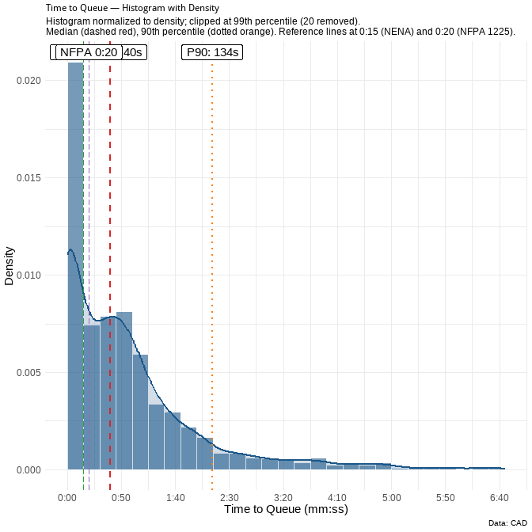

These combined histogram and density plots are designed to show the distribution of the elapsed time between events in the call's lifecycle. Using the 90^th^ percentile, we can state that 90% of all service calls are ready to be dispatched within 134 seconds. The same 90^th^ lines are reflected in the remaining plots below.

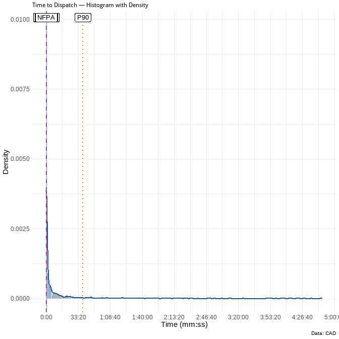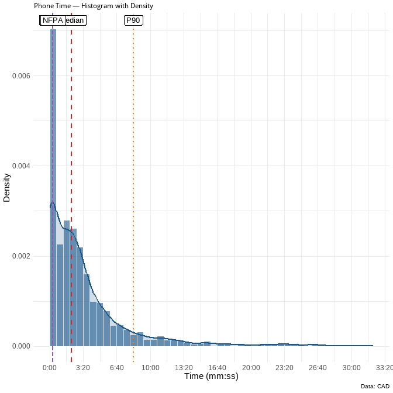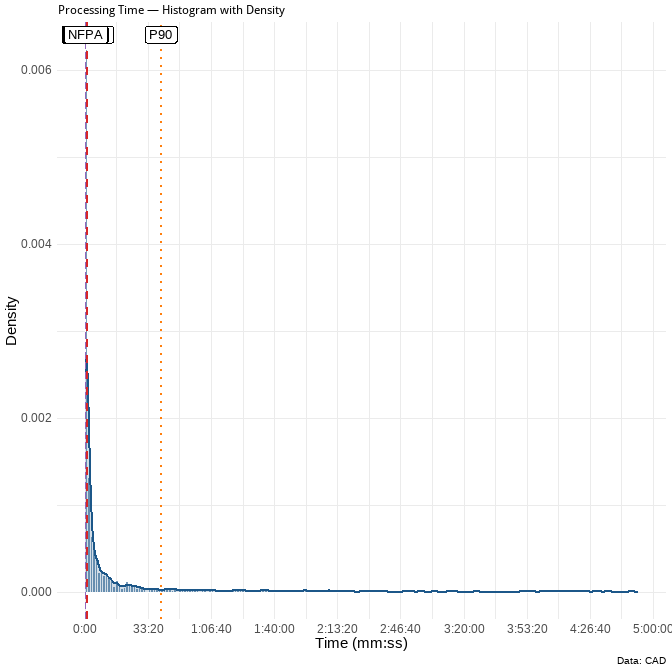

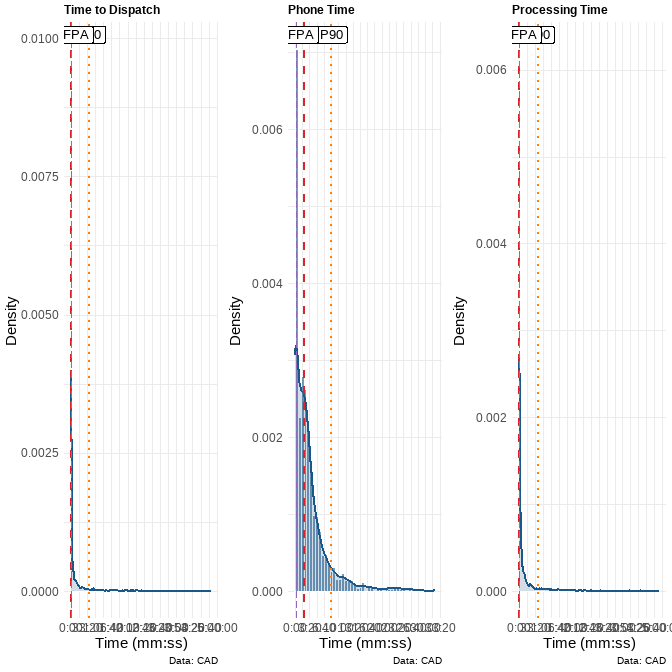

**Plot Key:**

| Line Type/Color      | Meaning                |
|---------------------|------------------------|
| **Dashed Red**    | Median                 |
| **Dotted Orange** | 90th Percentile (P90)  |
| **Longdash Green** | NENA 0:15 Standard     |
| **Longdash Purple** | NFPA 0:20 Standard     |

These show that the processing times for DECC are well within the NENA and NFPA guidelines. This is good operational data to show how well we are performing with respect to those guidelines. Over time, we can track these metrics to ensure that we continue to meet or exceed those standards.

## Discipline Analyses

As discussed earlier, we can create additional subsets from this data to look at specific areas of interest. We will create several new datasets from this weekly set for further analysis. The first will be a dataset that combines APD Priority 1 calls with AFD Priority 1 and 2 calls and evaluates those as emergency calls. We will also create specific datasets for law, fire, and EMS for specific analyses of the disciplines. We will also create datasets that identify calls that exceed certain parameters that have been defined from other reports. Finally, because we have been evaluating Cardiac Arrest calls for some time, we'll create and analyze that dataset.


By defining these datasets, we can now add to our analyses. For example, we can reuse the same information from above to drill down into APD and AFD calls. Starting with APD calls for service, we can examine everything as we did above.

### APD Analyses


This week, Wednesday was the busiest day of the week for APD service calls. Sunday, being the lightest day of the week overall, was the lightest day for the APD as well.


The busiest hours for the week were 1000 and 1700 hours. There is still a consistent pattern to the morning and afternoon rush hours being the busiest times of the week.


As can be seen, the majority of calls came through Phone. This stands in contrast to Phone being the vehicle for the most calls overall for the week.


The largest call type was for TRAFFIC STOP, which was also the largest call type for the week overall. This could be something to monitor over time to see how the trend changes over time.


As expected, the largest number of calls were Priority 2 calls which represent 56.6 percent of all APD calls. Again, this comports with the overall weekly trends.

<div class="tabwid"><style>.cl-ad369e70{}.cl-ad2d1594{font-family:'Arial';font-size:9pt;font-weight:bold;font-style:normal;text-decoration:none;color:rgba(0, 0, 0, 1.00);background-color:transparent;}.cl-ad2d15a8{font-family:'Arial';font-size:9pt;font-weight:normal;font-style:normal;text-decoration:none;color:rgba(0, 0, 0, 1.00);background-color:transparent;}.cl-ad3105c8{margin:0;text-align:left;border-bottom: 0 solid rgba(0, 0, 0, 1.00);border-top: 0 solid rgba(0, 0, 0, 1.00);border-left: 0 solid rgba(0, 0, 0, 1.00);border-right: 0 solid rgba(0, 0, 0, 1.00);padding-bottom:3pt;padding-top:3pt;padding-left:3pt;padding-right:3pt;line-height: 1;background-color:transparent;}.cl-ad3105dc{margin:0;text-align:right;border-bottom: 0 solid rgba(0, 0, 0, 1.00);border-top: 0 solid rgba(0, 0, 0, 1.00);border-left: 0 solid rgba(0, 0, 0, 1.00);border-right: 0 solid rgba(0, 0, 0, 1.00);padding-bottom:3pt;padding-top:3pt;padding-left:3pt;padding-right:3pt;line-height: 1;background-color:transparent;}.cl-ad312e40{width:1.191in;background-color:transparent;vertical-align: middle;border-bottom: 1.5pt solid rgba(102, 102, 102, 1.00);border-top: 1.5pt solid rgba(102, 102, 102, 1.00);border-left: 0 solid rgba(0, 0, 0, 1.00);border-right: 0 solid rgba(0, 0, 0, 1.00);margin-bottom:0;margin-top:0;margin-left:0;margin-right:0;}.cl-ad312e4a{width:0.566in;background-color:transparent;vertical-align: middle;border-bottom: 1.5pt solid rgba(102, 102, 102, 1.00);border-top: 1.5pt solid rgba(102, 102, 102, 1.00);border-left: 0 solid rgba(0, 0, 0, 1.00);border-right: 0 solid rgba(0, 0, 0, 1.00);margin-bottom:0;margin-top:0;margin-left:0;margin-right:0;}.cl-ad312e4b{width:0.698in;background-color:transparent;vertical-align: middle;border-bottom: 1.5pt solid rgba(102, 102, 102, 1.00);border-top: 1.5pt solid rgba(102, 102, 102, 1.00);border-left: 0 solid rgba(0, 0, 0, 1.00);border-right: 0 solid rgba(0, 0, 0, 1.00);margin-bottom:0;margin-top:0;margin-left:0;margin-right:0;}.cl-ad312e54{width:0.642in;background-color:transparent;vertical-align: middle;border-bottom: 1.5pt solid rgba(102, 102, 102, 1.00);border-top: 1.5pt solid rgba(102, 102, 102, 1.00);border-left: 0 solid rgba(0, 0, 0, 1.00);border-right: 0 solid rgba(0, 0, 0, 1.00);margin-bottom:0;margin-top:0;margin-left:0;margin-right:0;}.cl-ad312e55{width:1.191in;background-color:rgba(245, 245, 245, 1.00);vertical-align: middle;border-bottom: 0 solid rgba(0, 0, 0, 1.00);border-top: 0 solid rgba(0, 0, 0, 1.00);border-left: 0 solid rgba(0, 0, 0, 1.00);border-right: 0 solid rgba(0, 0, 0, 1.00);margin-bottom:0;margin-top:0;margin-left:0;margin-right:0;}.cl-ad312e5e{width:0.566in;background-color:rgba(245, 245, 245, 1.00);vertical-align: middle;border-bottom: 0 solid rgba(0, 0, 0, 1.00);border-top: 0 solid rgba(0, 0, 0, 1.00);border-left: 0 solid rgba(0, 0, 0, 1.00);border-right: 0 solid rgba(0, 0, 0, 1.00);margin-bottom:0;margin-top:0;margin-left:0;margin-right:0;}.cl-ad312e5f{width:0.698in;background-color:rgba(245, 245, 245, 1.00);vertical-align: middle;border-bottom: 0 solid rgba(0, 0, 0, 1.00);border-top: 0 solid rgba(0, 0, 0, 1.00);border-left: 0 solid rgba(0, 0, 0, 1.00);border-right: 0 solid rgba(0, 0, 0, 1.00);margin-bottom:0;margin-top:0;margin-left:0;margin-right:0;}.cl-ad312e60{width:0.642in;background-color:rgba(245, 245, 245, 1.00);vertical-align: middle;border-bottom: 0 solid rgba(0, 0, 0, 1.00);border-top: 0 solid rgba(0, 0, 0, 1.00);border-left: 0 solid rgba(0, 0, 0, 1.00);border-right: 0 solid rgba(0, 0, 0, 1.00);margin-bottom:0;margin-top:0;margin-left:0;margin-right:0;}.cl-ad312e72{width:1.191in;background-color:transparent;vertical-align: middle;border-bottom: 0 solid rgba(0, 0, 0, 1.00);border-top: 0 solid rgba(0, 0, 0, 1.00);border-left: 0 solid rgba(0, 0, 0, 1.00);border-right: 0 solid rgba(0, 0, 0, 1.00);margin-bottom:0;margin-top:0;margin-left:0;margin-right:0;}.cl-ad312e73{width:0.566in;background-color:transparent;vertical-align: middle;border-bottom: 0 solid rgba(0, 0, 0, 1.00);border-top: 0 solid rgba(0, 0, 0, 1.00);border-left: 0 solid rgba(0, 0, 0, 1.00);border-right: 0 solid rgba(0, 0, 0, 1.00);margin-bottom:0;margin-top:0;margin-left:0;margin-right:0;}.cl-ad312e74{width:0.698in;background-color:transparent;vertical-align: middle;border-bottom: 0 solid rgba(0, 0, 0, 1.00);border-top: 0 solid rgba(0, 0, 0, 1.00);border-left: 0 solid rgba(0, 0, 0, 1.00);border-right: 0 solid rgba(0, 0, 0, 1.00);margin-bottom:0;margin-top:0;margin-left:0;margin-right:0;}.cl-ad312e7c{width:0.642in;background-color:transparent;vertical-align: middle;border-bottom: 0 solid rgba(0, 0, 0, 1.00);border-top: 0 solid rgba(0, 0, 0, 1.00);border-left: 0 solid rgba(0, 0, 0, 1.00);border-right: 0 solid rgba(0, 0, 0, 1.00);margin-bottom:0;margin-top:0;margin-left:0;margin-right:0;}.cl-ad312e86{width:1.191in;background-color:rgba(245, 245, 245, 1.00);vertical-align: middle;border-bottom: 0 solid rgba(0, 0, 0, 1.00);border-top: 0 solid rgba(0, 0, 0, 1.00);border-left: 0 solid rgba(0, 0, 0, 1.00);border-right: 0 solid rgba(0, 0, 0, 1.00);margin-bottom:0;margin-top:0;margin-left:0;margin-right:0;}.cl-ad312e87{width:0.566in;background-color:rgba(245, 245, 245, 1.00);vertical-align: middle;border-bottom: 0 solid rgba(0, 0, 0, 1.00);border-top: 0 solid rgba(0, 0, 0, 1.00);border-left: 0 solid rgba(0, 0, 0, 1.00);border-right: 0 solid rgba(0, 0, 0, 1.00);margin-bottom:0;margin-top:0;margin-left:0;margin-right:0;}.cl-ad312e88{width:0.698in;background-color:rgba(245, 245, 245, 1.00);vertical-align: middle;border-bottom: 0 solid rgba(0, 0, 0, 1.00);border-top: 0 solid rgba(0, 0, 0, 1.00);border-left: 0 solid rgba(0, 0, 0, 1.00);border-right: 0 solid rgba(0, 0, 0, 1.00);margin-bottom:0;margin-top:0;margin-left:0;margin-right:0;}.cl-ad312e90{width:0.642in;background-color:rgba(245, 245, 245, 1.00);vertical-align: middle;border-bottom: 0 solid rgba(0, 0, 0, 1.00);border-top: 0 solid rgba(0, 0, 0, 1.00);border-left: 0 solid rgba(0, 0, 0, 1.00);border-right: 0 solid rgba(0, 0, 0, 1.00);margin-bottom:0;margin-top:0;margin-left:0;margin-right:0;}.cl-ad312e91{width:1.191in;background-color:transparent;vertical-align: middle;border-bottom: 0 solid rgba(0, 0, 0, 1.00);border-top: 0 solid rgba(0, 0, 0, 1.00);border-left: 0 solid rgba(0, 0, 0, 1.00);border-right: 0 solid rgba(0, 0, 0, 1.00);margin-bottom:0;margin-top:0;margin-left:0;margin-right:0;}.cl-ad312e92{width:0.566in;background-color:transparent;vertical-align: middle;border-bottom: 0 solid rgba(0, 0, 0, 1.00);border-top: 0 solid rgba(0, 0, 0, 1.00);border-left: 0 solid rgba(0, 0, 0, 1.00);border-right: 0 solid rgba(0, 0, 0, 1.00);margin-bottom:0;margin-top:0;margin-left:0;margin-right:0;}.cl-ad312e93{width:0.698in;background-color:transparent;vertical-align: middle;border-bottom: 0 solid rgba(0, 0, 0, 1.00);border-top: 0 solid rgba(0, 0, 0, 1.00);border-left: 0 solid rgba(0, 0, 0, 1.00);border-right: 0 solid rgba(0, 0, 0, 1.00);margin-bottom:0;margin-top:0;margin-left:0;margin-right:0;}.cl-ad312e9a{width:0.642in;background-color:transparent;vertical-align: middle;border-bottom: 0 solid rgba(0, 0, 0, 1.00);border-top: 0 solid rgba(0, 0, 0, 1.00);border-left: 0 solid rgba(0, 0, 0, 1.00);border-right: 0 solid rgba(0, 0, 0, 1.00);margin-bottom:0;margin-top:0;margin-left:0;margin-right:0;}.cl-ad312e9b{width:1.191in;background-color:transparent;vertical-align: middle;border-bottom: 0 solid rgba(0, 0, 0, 1.00);border-top: 0 solid rgba(0, 0, 0, 1.00);border-left: 0 solid rgba(0, 0, 0, 1.00);border-right: 0 solid rgba(0, 0, 0, 1.00);margin-bottom:0;margin-top:0;margin-left:0;margin-right:0;}.cl-ad312e9c{width:0.566in;background-color:transparent;vertical-align: middle;border-bottom: 0 solid rgba(0, 0, 0, 1.00);border-top: 0 solid rgba(0, 0, 0, 1.00);border-left: 0 solid rgba(0, 0, 0, 1.00);border-right: 0 solid rgba(0, 0, 0, 1.00);margin-bottom:0;margin-top:0;margin-left:0;margin-right:0;}.cl-ad312ea4{width:0.698in;background-color:transparent;vertical-align: middle;border-bottom: 0 solid rgba(0, 0, 0, 1.00);border-top: 0 solid rgba(0, 0, 0, 1.00);border-left: 0 solid rgba(0, 0, 0, 1.00);border-right: 0 solid rgba(0, 0, 0, 1.00);margin-bottom:0;margin-top:0;margin-left:0;margin-right:0;}.cl-ad312ea5{width:0.642in;background-color:transparent;vertical-align: middle;border-bottom: 0 solid rgba(0, 0, 0, 1.00);border-top: 0 solid rgba(0, 0, 0, 1.00);border-left: 0 solid rgba(0, 0, 0, 1.00);border-right: 0 solid rgba(0, 0, 0, 1.00);margin-bottom:0;margin-top:0;margin-left:0;margin-right:0;}.cl-ad312eae{width:1.191in;background-color:rgba(245, 245, 245, 1.00);vertical-align: middle;border-bottom: 1.5pt solid rgba(102, 102, 102, 1.00);border-top: 0 solid rgba(0, 0, 0, 1.00);border-left: 0 solid rgba(0, 0, 0, 1.00);border-right: 0 solid rgba(0, 0, 0, 1.00);margin-bottom:0;margin-top:0;margin-left:0;margin-right:0;}.cl-ad312eaf{width:0.566in;background-color:rgba(245, 245, 245, 1.00);vertical-align: middle;border-bottom: 1.5pt solid rgba(102, 102, 102, 1.00);border-top: 0 solid rgba(0, 0, 0, 1.00);border-left: 0 solid rgba(0, 0, 0, 1.00);border-right: 0 solid rgba(0, 0, 0, 1.00);margin-bottom:0;margin-top:0;margin-left:0;margin-right:0;}.cl-ad312eb0{width:0.698in;background-color:rgba(245, 245, 245, 1.00);vertical-align: middle;border-bottom: 1.5pt solid rgba(102, 102, 102, 1.00);border-top: 0 solid rgba(0, 0, 0, 1.00);border-left: 0 solid rgba(0, 0, 0, 1.00);border-right: 0 solid rgba(0, 0, 0, 1.00);margin-bottom:0;margin-top:0;margin-left:0;margin-right:0;}.cl-ad312eb8{width:0.642in;background-color:rgba(245, 245, 245, 1.00);vertical-align: middle;border-bottom: 1.5pt solid rgba(102, 102, 102, 1.00);border-top: 0 solid rgba(0, 0, 0, 1.00);border-left: 0 solid rgba(0, 0, 0, 1.00);border-right: 0 solid rgba(0, 0, 0, 1.00);margin-bottom:0;margin-top:0;margin-left:0;margin-right:0;}.tabwid {
  font-size: initial;
  padding-bottom: 1em;
}

.tabwid table{
  border-spacing:0px !important;
  border-collapse:collapse;
  line-height:1;
  margin-left:auto;
  margin-right:auto;
  border-width: 0;
  border-color: transparent;
  caption-side: top;
}
.tabwid-caption-bottom table{
  caption-side: bottom;
}
.tabwid_left table{
  margin-left:0;
}
.tabwid_right table{
  margin-right:0;
}
.tabwid td, .tabwid th {
    padding: 0;
}
.tabwid a {
  text-decoration: none;
}
.tabwid thead {
    background-color: transparent;
}
.tabwid tfoot {
    background-color: transparent;
}
.tabwid table tr {
background-color: transparent;
}
.katex-display {
    margin: 0 0 !important;
}</style><table data-quarto-disable-processing='true' class='cl-ad369e70'><thead><tr style="overflow-wrap:break-word;"><th class="cl-ad312e40"><p class="cl-ad3105c8"><span class="cl-ad2d1594">Time Metric</span></p></th><th class="cl-ad312e4a"><p class="cl-ad3105dc"><span class="cl-ad2d1594">Min</span></p></th><th class="cl-ad312e4b"><p class="cl-ad3105dc"><span class="cl-ad2d1594">Mean</span></p></th><th class="cl-ad312e54"><p class="cl-ad3105dc"><span class="cl-ad2d1594">Median</span></p></th></tr></thead><tbody><tr style="overflow-wrap:break-word;"><td class="cl-ad312e55"><p class="cl-ad3105c8"><span class="cl-ad2d15a8">Time To Queue</span></p></td><td class="cl-ad312e5e"><p class="cl-ad3105dc"><span class="cl-ad2d15a8">0</span></p></td><td class="cl-ad312e5f"><p class="cl-ad3105dc"><span class="cl-ad2d15a8">64.75</span></p></td><td class="cl-ad312e60"><p class="cl-ad3105dc"><span class="cl-ad2d15a8">39.0</span></p></td></tr><tr style="overflow-wrap:break-word;"><td class="cl-ad312e72"><p class="cl-ad3105c8"><span class="cl-ad2d15a8">Time To Dispatch</span></p></td><td class="cl-ad312e73"><p class="cl-ad3105dc"><span class="cl-ad2d15a8">-2,007</span></p></td><td class="cl-ad312e74"><p class="cl-ad3105dc"><span class="cl-ad2d15a8">1,647.40</span></p></td><td class="cl-ad312e7c"><p class="cl-ad3105dc"><span class="cl-ad2d15a8">122.0</span></p></td></tr><tr style="overflow-wrap:break-word;"><td class="cl-ad312e86"><p class="cl-ad3105c8"><span class="cl-ad2d15a8">Phone Time</span></p></td><td class="cl-ad312e87"><p class="cl-ad3105dc"><span class="cl-ad2d15a8">0</span></p></td><td class="cl-ad312e88"><p class="cl-ad3105dc"><span class="cl-ad2d15a8">224.26</span></p></td><td class="cl-ad312e90"><p class="cl-ad3105dc"><span class="cl-ad2d15a8">107.0</span></p></td></tr><tr style="overflow-wrap:break-word;"><td class="cl-ad312e91"><p class="cl-ad3105c8"><span class="cl-ad2d15a8">Processing Time</span></p></td><td class="cl-ad312e92"><p class="cl-ad3105dc"><span class="cl-ad2d15a8">-1,926</span></p></td><td class="cl-ad312e93"><p class="cl-ad3105dc"><span class="cl-ad2d15a8">1,712.16</span></p></td><td class="cl-ad312e9a"><p class="cl-ad3105dc"><span class="cl-ad2d15a8">208.5</span></p></td></tr><tr style="overflow-wrap:break-word;"><td class="cl-ad312e86"><p class="cl-ad3105c8"><span class="cl-ad2d15a8">Rollout Time</span></p></td><td class="cl-ad312e87"><p class="cl-ad3105dc"><span class="cl-ad2d15a8">0</span></p></td><td class="cl-ad312e88"><p class="cl-ad3105dc"><span class="cl-ad2d15a8">9.19</span></p></td><td class="cl-ad312e90"><p class="cl-ad3105dc"><span class="cl-ad2d15a8">0.0</span></p></td></tr><tr style="overflow-wrap:break-word;"><td class="cl-ad312e9b"><p class="cl-ad3105c8"><span class="cl-ad2d15a8">Transit Time</span></p></td><td class="cl-ad312e9c"><p class="cl-ad3105dc"><span class="cl-ad2d15a8">-1,729</span></p></td><td class="cl-ad312ea4"><p class="cl-ad3105dc"><span class="cl-ad2d15a8">535.78</span></p></td><td class="cl-ad312ea5"><p class="cl-ad3105dc"><span class="cl-ad2d15a8">158.0</span></p></td></tr><tr style="overflow-wrap:break-word;"><td class="cl-ad312eae"><p class="cl-ad3105c8"><span class="cl-ad2d15a8">Total Call Time</span></p></td><td class="cl-ad312eaf"><p class="cl-ad3105dc"><span class="cl-ad2d15a8">-1,698</span></p></td><td class="cl-ad312eb0"><p class="cl-ad3105dc"><span class="cl-ad2d15a8">6,005.56</span></p></td><td class="cl-ad312eb8"><p class="cl-ad3105dc"><span class="cl-ad2d15a8">2,502.0</span></p></td></tr></tbody></table></div>

This table shows that overall, we have a median time on the phones of about 107 seconds and it takes about double that for a call to start and be dispatched, 208.5 seconds. Some of that difference is going to be due to having to hold Priority 4 and above calls until there is a unit available. Since the P4 calls are 26.6 percent of APD calls, this could have a measureable impact on service times for DECC staff.

| Priority | Dispatched in SLA | Total Calls | Pct in SLA |
|:--------:|:--------:|:--------:|:--------:|
| 1 | 38 | 44 | 86.36% |
| 2 | 666 | 791 | 84.2% |
| 3 | 69 | 123 | 56.1% |
| 4 | 277 | 372 | 74.46% |

: SLA Compliance for APD Calls (P1 & P2) {.striped .hover}

As you will note, these numbers are significantly lower than those found in the other weekend reports. In those reports, there was an additional filter which removed all calls where the time in queue was longer than 30 minutes. This report reflects a more accurate view of actual compliance with our partners' SLAs. This table will be repeated for the fire and medical calls later in the report.

### AFD FIRE Analyses

Because AFD calls for service can be split into two distinct disciplines, fire-related calls and medical-related calls, DECC has, historically, separated the two disciplines for analytical purposes. So this section will look at fire-related calls for service for the week.

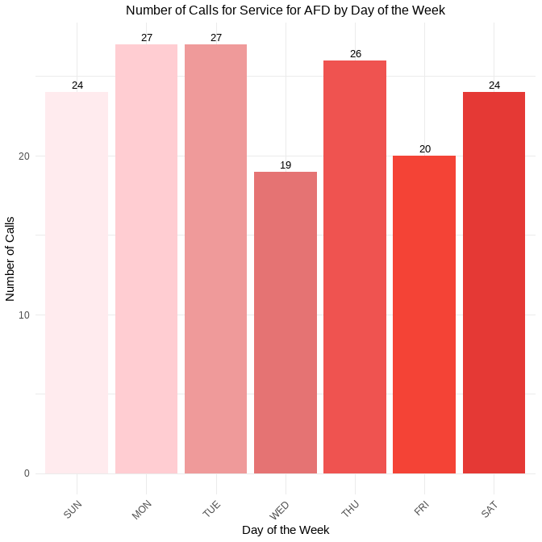

This week, the busiest day for fire-related calls was Monday with 27 calls for service. Wednesday was the lightest day for fire-related calls with 19 calls for service.

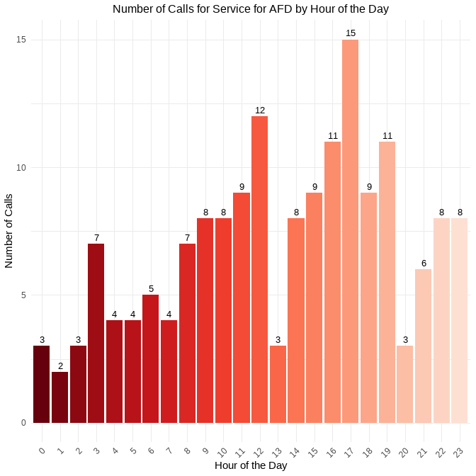

Fire-related calls are much more spread out through the day as can be seen in the graph above. However, 1800 hours was the busiest hour for the week There hasn't been an overall trend identified in the four weeks of this report. However, we will continue to observe the patterns to see if any trends emerge in fire related calls.

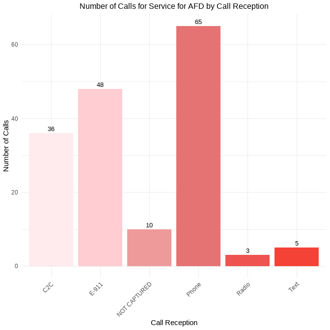

The majority of fire-related calls came in via Phone. That accounts for 38.92 percent of all fire-related calls. However the numbers for Mutual Aid and E-911 were larger percentages of the overall volume. In this case, Phone, not necessarily E-911 represented 38.92 percent of all fire-related service calls received.


The greatest number of fire-related service calls were for FIRE ALARM. That is an interesting observation and should be watched through the future.

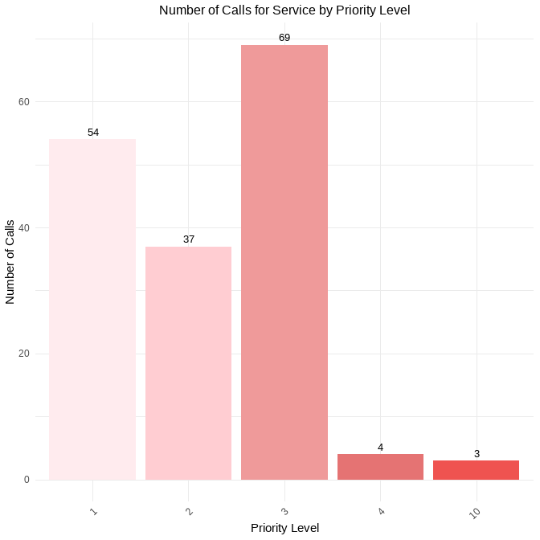

The most-used priority for fire-related calls was P3. P1 calls account for 32.3 percent of all fire-related calls this week.

<div class="tabwid"><style>.cl-ae796506{}.cl-ae6f70dc{font-family:'Arial';font-size:9pt;font-weight:bold;font-style:normal;text-decoration:none;color:rgba(0, 0, 0, 1.00);background-color:transparent;}.cl-ae6f70e6{font-family:'Arial';font-size:9pt;font-weight:normal;font-style:normal;text-decoration:none;color:rgba(0, 0, 0, 1.00);background-color:transparent;}.cl-ae7386cc{margin:0;text-align:left;border-bottom: 0 solid rgba(0, 0, 0, 1.00);border-top: 0 solid rgba(0, 0, 0, 1.00);border-left: 0 solid rgba(0, 0, 0, 1.00);border-right: 0 solid rgba(0, 0, 0, 1.00);padding-bottom:3pt;padding-top:3pt;padding-left:3pt;padding-right:3pt;line-height: 1;background-color:transparent;}.cl-ae7386e0{margin:0;text-align:right;border-bottom: 0 solid rgba(0, 0, 0, 1.00);border-top: 0 solid rgba(0, 0, 0, 1.00);border-left: 0 solid rgba(0, 0, 0, 1.00);border-right: 0 solid rgba(0, 0, 0, 1.00);padding-bottom:3pt;padding-top:3pt;padding-left:3pt;padding-right:3pt;line-height: 1;background-color:transparent;}.cl-ae73ce20{width:1.191in;background-color:transparent;vertical-align: middle;border-bottom: 1.5pt solid rgba(102, 102, 102, 1.00);border-top: 1.5pt solid rgba(102, 102, 102, 1.00);border-left: 0 solid rgba(0, 0, 0, 1.00);border-right: 0 solid rgba(0, 0, 0, 1.00);margin-bottom:0;margin-top:0;margin-left:0;margin-right:0;}.cl-ae73ce2a{width:0.635in;background-color:transparent;vertical-align: middle;border-bottom: 1.5pt solid rgba(102, 102, 102, 1.00);border-top: 1.5pt solid rgba(102, 102, 102, 1.00);border-left: 0 solid rgba(0, 0, 0, 1.00);border-right: 0 solid rgba(0, 0, 0, 1.00);margin-bottom:0;margin-top:0;margin-left:0;margin-right:0;}.cl-ae73ce34{width:0.698in;background-color:transparent;vertical-align: middle;border-bottom: 1.5pt solid rgba(102, 102, 102, 1.00);border-top: 1.5pt solid rgba(102, 102, 102, 1.00);border-left: 0 solid rgba(0, 0, 0, 1.00);border-right: 0 solid rgba(0, 0, 0, 1.00);margin-bottom:0;margin-top:0;margin-left:0;margin-right:0;}.cl-ae73ce35{width:0.642in;background-color:transparent;vertical-align: middle;border-bottom: 1.5pt solid rgba(102, 102, 102, 1.00);border-top: 1.5pt solid rgba(102, 102, 102, 1.00);border-left: 0 solid rgba(0, 0, 0, 1.00);border-right: 0 solid rgba(0, 0, 0, 1.00);margin-bottom:0;margin-top:0;margin-left:0;margin-right:0;}.cl-ae73ce3e{width:1.191in;background-color:rgba(245, 245, 245, 1.00);vertical-align: middle;border-bottom: 0 solid rgba(0, 0, 0, 1.00);border-top: 0 solid rgba(0, 0, 0, 1.00);border-left: 0 solid rgba(0, 0, 0, 1.00);border-right: 0 solid rgba(0, 0, 0, 1.00);margin-bottom:0;margin-top:0;margin-left:0;margin-right:0;}.cl-ae73ce3f{width:0.635in;background-color:rgba(245, 245, 245, 1.00);vertical-align: middle;border-bottom: 0 solid rgba(0, 0, 0, 1.00);border-top: 0 solid rgba(0, 0, 0, 1.00);border-left: 0 solid rgba(0, 0, 0, 1.00);border-right: 0 solid rgba(0, 0, 0, 1.00);margin-bottom:0;margin-top:0;margin-left:0;margin-right:0;}.cl-ae73ce48{width:0.698in;background-color:rgba(245, 245, 245, 1.00);vertical-align: middle;border-bottom: 0 solid rgba(0, 0, 0, 1.00);border-top: 0 solid rgba(0, 0, 0, 1.00);border-left: 0 solid rgba(0, 0, 0, 1.00);border-right: 0 solid rgba(0, 0, 0, 1.00);margin-bottom:0;margin-top:0;margin-left:0;margin-right:0;}.cl-ae73ce49{width:0.642in;background-color:rgba(245, 245, 245, 1.00);vertical-align: middle;border-bottom: 0 solid rgba(0, 0, 0, 1.00);border-top: 0 solid rgba(0, 0, 0, 1.00);border-left: 0 solid rgba(0, 0, 0, 1.00);border-right: 0 solid rgba(0, 0, 0, 1.00);margin-bottom:0;margin-top:0;margin-left:0;margin-right:0;}.cl-ae73ce52{width:1.191in;background-color:transparent;vertical-align: middle;border-bottom: 0 solid rgba(0, 0, 0, 1.00);border-top: 0 solid rgba(0, 0, 0, 1.00);border-left: 0 solid rgba(0, 0, 0, 1.00);border-right: 0 solid rgba(0, 0, 0, 1.00);margin-bottom:0;margin-top:0;margin-left:0;margin-right:0;}.cl-ae73ce53{width:0.635in;background-color:transparent;vertical-align: middle;border-bottom: 0 solid rgba(0, 0, 0, 1.00);border-top: 0 solid rgba(0, 0, 0, 1.00);border-left: 0 solid rgba(0, 0, 0, 1.00);border-right: 0 solid rgba(0, 0, 0, 1.00);margin-bottom:0;margin-top:0;margin-left:0;margin-right:0;}.cl-ae73ce54{width:0.698in;background-color:transparent;vertical-align: middle;border-bottom: 0 solid rgba(0, 0, 0, 1.00);border-top: 0 solid rgba(0, 0, 0, 1.00);border-left: 0 solid rgba(0, 0, 0, 1.00);border-right: 0 solid rgba(0, 0, 0, 1.00);margin-bottom:0;margin-top:0;margin-left:0;margin-right:0;}.cl-ae73ce5c{width:0.642in;background-color:transparent;vertical-align: middle;border-bottom: 0 solid rgba(0, 0, 0, 1.00);border-top: 0 solid rgba(0, 0, 0, 1.00);border-left: 0 solid rgba(0, 0, 0, 1.00);border-right: 0 solid rgba(0, 0, 0, 1.00);margin-bottom:0;margin-top:0;margin-left:0;margin-right:0;}.cl-ae73ce5d{width:1.191in;background-color:rgba(245, 245, 245, 1.00);vertical-align: middle;border-bottom: 0 solid rgba(0, 0, 0, 1.00);border-top: 0 solid rgba(0, 0, 0, 1.00);border-left: 0 solid rgba(0, 0, 0, 1.00);border-right: 0 solid rgba(0, 0, 0, 1.00);margin-bottom:0;margin-top:0;margin-left:0;margin-right:0;}.cl-ae73ce66{width:0.635in;background-color:rgba(245, 245, 245, 1.00);vertical-align: middle;border-bottom: 0 solid rgba(0, 0, 0, 1.00);border-top: 0 solid rgba(0, 0, 0, 1.00);border-left: 0 solid rgba(0, 0, 0, 1.00);border-right: 0 solid rgba(0, 0, 0, 1.00);margin-bottom:0;margin-top:0;margin-left:0;margin-right:0;}.cl-ae73ce70{width:0.698in;background-color:rgba(245, 245, 245, 1.00);vertical-align: middle;border-bottom: 0 solid rgba(0, 0, 0, 1.00);border-top: 0 solid rgba(0, 0, 0, 1.00);border-left: 0 solid rgba(0, 0, 0, 1.00);border-right: 0 solid rgba(0, 0, 0, 1.00);margin-bottom:0;margin-top:0;margin-left:0;margin-right:0;}.cl-ae73ce7a{width:0.642in;background-color:rgba(245, 245, 245, 1.00);vertical-align: middle;border-bottom: 0 solid rgba(0, 0, 0, 1.00);border-top: 0 solid rgba(0, 0, 0, 1.00);border-left: 0 solid rgba(0, 0, 0, 1.00);border-right: 0 solid rgba(0, 0, 0, 1.00);margin-bottom:0;margin-top:0;margin-left:0;margin-right:0;}.cl-ae73ce7b{width:1.191in;background-color:transparent;vertical-align: middle;border-bottom: 0 solid rgba(0, 0, 0, 1.00);border-top: 0 solid rgba(0, 0, 0, 1.00);border-left: 0 solid rgba(0, 0, 0, 1.00);border-right: 0 solid rgba(0, 0, 0, 1.00);margin-bottom:0;margin-top:0;margin-left:0;margin-right:0;}.cl-ae73ce84{width:0.635in;background-color:transparent;vertical-align: middle;border-bottom: 0 solid rgba(0, 0, 0, 1.00);border-top: 0 solid rgba(0, 0, 0, 1.00);border-left: 0 solid rgba(0, 0, 0, 1.00);border-right: 0 solid rgba(0, 0, 0, 1.00);margin-bottom:0;margin-top:0;margin-left:0;margin-right:0;}.cl-ae73ce85{width:0.698in;background-color:transparent;vertical-align: middle;border-bottom: 0 solid rgba(0, 0, 0, 1.00);border-top: 0 solid rgba(0, 0, 0, 1.00);border-left: 0 solid rgba(0, 0, 0, 1.00);border-right: 0 solid rgba(0, 0, 0, 1.00);margin-bottom:0;margin-top:0;margin-left:0;margin-right:0;}.cl-ae73ce86{width:0.642in;background-color:transparent;vertical-align: middle;border-bottom: 0 solid rgba(0, 0, 0, 1.00);border-top: 0 solid rgba(0, 0, 0, 1.00);border-left: 0 solid rgba(0, 0, 0, 1.00);border-right: 0 solid rgba(0, 0, 0, 1.00);margin-bottom:0;margin-top:0;margin-left:0;margin-right:0;}.cl-ae73ce8e{width:1.191in;background-color:rgba(245, 245, 245, 1.00);vertical-align: middle;border-bottom: 0 solid rgba(0, 0, 0, 1.00);border-top: 0 solid rgba(0, 0, 0, 1.00);border-left: 0 solid rgba(0, 0, 0, 1.00);border-right: 0 solid rgba(0, 0, 0, 1.00);margin-bottom:0;margin-top:0;margin-left:0;margin-right:0;}.cl-ae73ce8f{width:0.635in;background-color:rgba(245, 245, 245, 1.00);vertical-align: middle;border-bottom: 0 solid rgba(0, 0, 0, 1.00);border-top: 0 solid rgba(0, 0, 0, 1.00);border-left: 0 solid rgba(0, 0, 0, 1.00);border-right: 0 solid rgba(0, 0, 0, 1.00);margin-bottom:0;margin-top:0;margin-left:0;margin-right:0;}.cl-ae73ce98{width:0.698in;background-color:rgba(245, 245, 245, 1.00);vertical-align: middle;border-bottom: 0 solid rgba(0, 0, 0, 1.00);border-top: 0 solid rgba(0, 0, 0, 1.00);border-left: 0 solid rgba(0, 0, 0, 1.00);border-right: 0 solid rgba(0, 0, 0, 1.00);margin-bottom:0;margin-top:0;margin-left:0;margin-right:0;}.cl-ae73ce99{width:0.642in;background-color:rgba(245, 245, 245, 1.00);vertical-align: middle;border-bottom: 0 solid rgba(0, 0, 0, 1.00);border-top: 0 solid rgba(0, 0, 0, 1.00);border-left: 0 solid rgba(0, 0, 0, 1.00);border-right: 0 solid rgba(0, 0, 0, 1.00);margin-bottom:0;margin-top:0;margin-left:0;margin-right:0;}.cl-ae73ce9a{width:1.191in;background-color:transparent;vertical-align: middle;border-bottom: 0 solid rgba(0, 0, 0, 1.00);border-top: 0 solid rgba(0, 0, 0, 1.00);border-left: 0 solid rgba(0, 0, 0, 1.00);border-right: 0 solid rgba(0, 0, 0, 1.00);margin-bottom:0;margin-top:0;margin-left:0;margin-right:0;}.cl-ae73cea2{width:0.635in;background-color:transparent;vertical-align: middle;border-bottom: 0 solid rgba(0, 0, 0, 1.00);border-top: 0 solid rgba(0, 0, 0, 1.00);border-left: 0 solid rgba(0, 0, 0, 1.00);border-right: 0 solid rgba(0, 0, 0, 1.00);margin-bottom:0;margin-top:0;margin-left:0;margin-right:0;}.cl-ae73cea3{width:0.698in;background-color:transparent;vertical-align: middle;border-bottom: 0 solid rgba(0, 0, 0, 1.00);border-top: 0 solid rgba(0, 0, 0, 1.00);border-left: 0 solid rgba(0, 0, 0, 1.00);border-right: 0 solid rgba(0, 0, 0, 1.00);margin-bottom:0;margin-top:0;margin-left:0;margin-right:0;}.cl-ae73ceac{width:0.642in;background-color:transparent;vertical-align: middle;border-bottom: 0 solid rgba(0, 0, 0, 1.00);border-top: 0 solid rgba(0, 0, 0, 1.00);border-left: 0 solid rgba(0, 0, 0, 1.00);border-right: 0 solid rgba(0, 0, 0, 1.00);margin-bottom:0;margin-top:0;margin-left:0;margin-right:0;}.cl-ae73cead{width:1.191in;background-color:rgba(245, 245, 245, 1.00);vertical-align: middle;border-bottom: 1.5pt solid rgba(102, 102, 102, 1.00);border-top: 0 solid rgba(0, 0, 0, 1.00);border-left: 0 solid rgba(0, 0, 0, 1.00);border-right: 0 solid rgba(0, 0, 0, 1.00);margin-bottom:0;margin-top:0;margin-left:0;margin-right:0;}.cl-ae73ceae{width:0.635in;background-color:rgba(245, 245, 245, 1.00);vertical-align: middle;border-bottom: 1.5pt solid rgba(102, 102, 102, 1.00);border-top: 0 solid rgba(0, 0, 0, 1.00);border-left: 0 solid rgba(0, 0, 0, 1.00);border-right: 0 solid rgba(0, 0, 0, 1.00);margin-bottom:0;margin-top:0;margin-left:0;margin-right:0;}.cl-ae73ceb6{width:0.698in;background-color:rgba(245, 245, 245, 1.00);vertical-align: middle;border-bottom: 1.5pt solid rgba(102, 102, 102, 1.00);border-top: 0 solid rgba(0, 0, 0, 1.00);border-left: 0 solid rgba(0, 0, 0, 1.00);border-right: 0 solid rgba(0, 0, 0, 1.00);margin-bottom:0;margin-top:0;margin-left:0;margin-right:0;}.cl-ae73ceb7{width:0.642in;background-color:rgba(245, 245, 245, 1.00);vertical-align: middle;border-bottom: 1.5pt solid rgba(102, 102, 102, 1.00);border-top: 0 solid rgba(0, 0, 0, 1.00);border-left: 0 solid rgba(0, 0, 0, 1.00);border-right: 0 solid rgba(0, 0, 0, 1.00);margin-bottom:0;margin-top:0;margin-left:0;margin-right:0;}.tabwid {
  font-size: initial;
  padding-bottom: 1em;
}

.tabwid table{
  border-spacing:0px !important;
  border-collapse:collapse;
  line-height:1;
  margin-left:auto;
  margin-right:auto;
  border-width: 0;
  border-color: transparent;
  caption-side: top;
}
.tabwid-caption-bottom table{
  caption-side: bottom;
}
.tabwid_left table{
  margin-left:0;
}
.tabwid_right table{
  margin-right:0;
}
.tabwid td, .tabwid th {
    padding: 0;
}
.tabwid a {
  text-decoration: none;
}
.tabwid thead {
    background-color: transparent;
}
.tabwid tfoot {
    background-color: transparent;
}
.tabwid table tr {
background-color: transparent;
}
.katex-display {
    margin: 0 0 !important;
}</style><table data-quarto-disable-processing='true' class='cl-ae796506'><thead><tr style="overflow-wrap:break-word;"><th class="cl-ae73ce20"><p class="cl-ae7386cc"><span class="cl-ae6f70dc">Time Metric</span></p></th><th class="cl-ae73ce2a"><p class="cl-ae7386e0"><span class="cl-ae6f70dc">Min</span></p></th><th class="cl-ae73ce34"><p class="cl-ae7386e0"><span class="cl-ae6f70dc">Mean</span></p></th><th class="cl-ae73ce35"><p class="cl-ae7386e0"><span class="cl-ae6f70dc">Median</span></p></th></tr></thead><tbody><tr style="overflow-wrap:break-word;"><td class="cl-ae73ce3e"><p class="cl-ae7386cc"><span class="cl-ae6f70e6">Time To Queue</span></p></td><td class="cl-ae73ce3f"><p class="cl-ae7386e0"><span class="cl-ae6f70e6">0</span></p></td><td class="cl-ae73ce48"><p class="cl-ae7386e0"><span class="cl-ae6f70e6">148.02</span></p></td><td class="cl-ae73ce49"><p class="cl-ae7386e0"><span class="cl-ae6f70e6">31</span></p></td></tr><tr style="overflow-wrap:break-word;"><td class="cl-ae73ce52"><p class="cl-ae7386cc"><span class="cl-ae6f70e6">Time To Dispatch</span></p></td><td class="cl-ae73ce53"><p class="cl-ae7386e0"><span class="cl-ae6f70e6">-16,660</span></p></td><td class="cl-ae73ce54"><p class="cl-ae7386e0"><span class="cl-ae6f70e6">-96.19</span></p></td><td class="cl-ae73ce5c"><p class="cl-ae7386e0"><span class="cl-ae6f70e6">2</span></p></td></tr><tr style="overflow-wrap:break-word;"><td class="cl-ae73ce5d"><p class="cl-ae7386cc"><span class="cl-ae6f70e6">Phone Time</span></p></td><td class="cl-ae73ce66"><p class="cl-ae7386e0"><span class="cl-ae6f70e6">0</span></p></td><td class="cl-ae73ce70"><p class="cl-ae7386e0"><span class="cl-ae6f70e6">169.88</span></p></td><td class="cl-ae73ce7a"><p class="cl-ae7386e0"><span class="cl-ae6f70e6">113</span></p></td></tr><tr style="overflow-wrap:break-word;"><td class="cl-ae73ce7b"><p class="cl-ae7386cc"><span class="cl-ae6f70e6">Processing Time</span></p></td><td class="cl-ae73ce84"><p class="cl-ae7386e0"><span class="cl-ae6f70e6">0</span></p></td><td class="cl-ae73ce85"><p class="cl-ae7386e0"><span class="cl-ae6f70e6">51.83</span></p></td><td class="cl-ae73ce86"><p class="cl-ae7386e0"><span class="cl-ae6f70e6">34</span></p></td></tr><tr style="overflow-wrap:break-word;"><td class="cl-ae73ce8e"><p class="cl-ae7386cc"><span class="cl-ae6f70e6">Rollout Time</span></p></td><td class="cl-ae73ce8f"><p class="cl-ae7386e0"><span class="cl-ae6f70e6">1</span></p></td><td class="cl-ae73ce98"><p class="cl-ae7386e0"><span class="cl-ae6f70e6">69.17</span></p></td><td class="cl-ae73ce99"><p class="cl-ae7386e0"><span class="cl-ae6f70e6">72</span></p></td></tr><tr style="overflow-wrap:break-word;"><td class="cl-ae73ce9a"><p class="cl-ae7386cc"><span class="cl-ae6f70e6">Transit Time</span></p></td><td class="cl-ae73cea2"><p class="cl-ae7386e0"><span class="cl-ae6f70e6">68</span></p></td><td class="cl-ae73cea3"><p class="cl-ae7386e0"><span class="cl-ae6f70e6">334.75</span></p></td><td class="cl-ae73ceac"><p class="cl-ae7386e0"><span class="cl-ae6f70e6">275</span></p></td></tr><tr style="overflow-wrap:break-word;"><td class="cl-ae73cead"><p class="cl-ae7386cc"><span class="cl-ae6f70e6">Total Call Time</span></p></td><td class="cl-ae73ceae"><p class="cl-ae7386e0"><span class="cl-ae6f70e6">61</span></p></td><td class="cl-ae73ceb6"><p class="cl-ae7386e0"><span class="cl-ae6f70e6">1,355.75</span></p></td><td class="cl-ae73ceb7"><p class="cl-ae7386e0"><span class="cl-ae6f70e6">1,042</span></p></td></tr></tbody></table></div>

Overall, DECC operations appear to be very efficient at getting fire-related service calls out to the field. The median processing time was only  seconds. This shows that we can easily be in compliance with all necessary NENA and NFPA guidelines. The median time on the phone was  seconds. The mean time was  seconds, which is still amazing.

| Calls dispatched in 64 seconds | Calls dispatched in 106 seconds | P1 & P2 Calls | Pct in 64 sec. | Pct in 106 sec. |
|:--------:|:--------:|:--------:|:--------:|:--------:|:--------:|
| 91 | 91 | 91 | 100% | 100% |

: SLA Compliance for AFD Fire Calls (P1 & P2) {.striped .hover}

These numbers show that we are meeting and exceeding our SLAs with the AFD.

### AFD EMS Analyses

Because AFD calls for service can be split into two distinct disciplines, fire-related calls and medical-related calls, DECC has, historically, separated the two disciplines for analytical purposes. So this section will look at medical-related calls for service for the week.

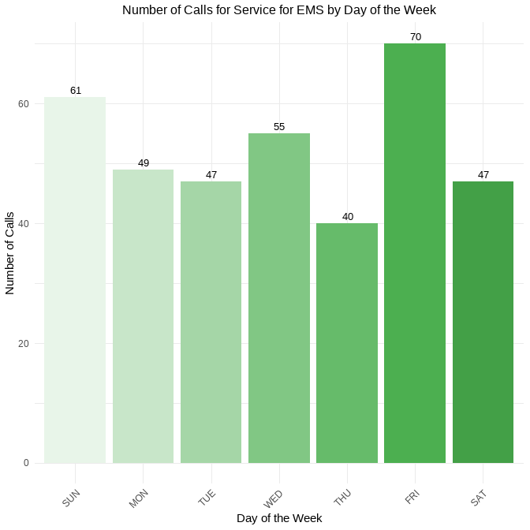

 This week, there is a spike in medical calls on Friday. This appears to correlate to the information that we saw earlier in the report. Outside of Friday, the remainder of the week appears to be consistent for the number of medical calls handled.


This week, the busiest hour was 13 hours. The afternoon to evening hours, this week, stayed consistently busy which appears to continue the trends previously observed.

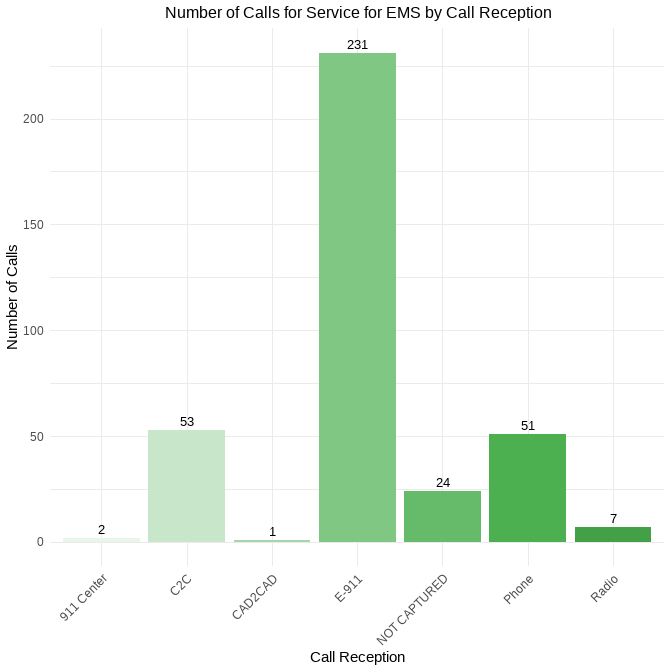

As expected, the vast majority of medical calls arrived via E-911. However, 6.5 percent of medical calls arrived without a method by which we recevied the call. We should continue to monitor and investigate why these are occurring.


The most prevalent medical service type this week was TROUBLE BREATHING ALS 1. Further we had 55 mutual aid medical calls this week.

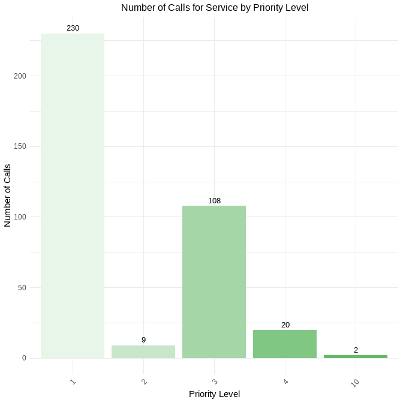

 The majority of medical service calls are P1, which is to be expected.

<div class="tabwid"><style>.cl-afb4a5f2{}.cl-afab58b2{font-family:'Arial';font-size:9pt;font-weight:bold;font-style:normal;text-decoration:none;color:rgba(0, 0, 0, 1.00);background-color:transparent;}.cl-afab58c6{font-family:'Arial';font-size:9pt;font-weight:normal;font-style:normal;text-decoration:none;color:rgba(0, 0, 0, 1.00);background-color:transparent;}.cl-afaefb20{margin:0;text-align:left;border-bottom: 0 solid rgba(0, 0, 0, 1.00);border-top: 0 solid rgba(0, 0, 0, 1.00);border-left: 0 solid rgba(0, 0, 0, 1.00);border-right: 0 solid rgba(0, 0, 0, 1.00);padding-bottom:3pt;padding-top:3pt;padding-left:3pt;padding-right:3pt;line-height: 1;background-color:transparent;}.cl-afaefb34{margin:0;text-align:right;border-bottom: 0 solid rgba(0, 0, 0, 1.00);border-top: 0 solid rgba(0, 0, 0, 1.00);border-left: 0 solid rgba(0, 0, 0, 1.00);border-right: 0 solid rgba(0, 0, 0, 1.00);padding-bottom:3pt;padding-top:3pt;padding-left:3pt;padding-right:3pt;line-height: 1;background-color:transparent;}.cl-afaf327a{width:1.191in;background-color:transparent;vertical-align: middle;border-bottom: 1.5pt solid rgba(102, 102, 102, 1.00);border-top: 1.5pt solid rgba(102, 102, 102, 1.00);border-left: 0 solid rgba(0, 0, 0, 1.00);border-right: 0 solid rgba(0, 0, 0, 1.00);margin-bottom:0;margin-top:0;margin-left:0;margin-right:0;}.cl-afaf3284{width:0.566in;background-color:transparent;vertical-align: middle;border-bottom: 1.5pt solid rgba(102, 102, 102, 1.00);border-top: 1.5pt solid rgba(102, 102, 102, 1.00);border-left: 0 solid rgba(0, 0, 0, 1.00);border-right: 0 solid rgba(0, 0, 0, 1.00);margin-bottom:0;margin-top:0;margin-left:0;margin-right:0;}.cl-afaf328e{width:0.698in;background-color:transparent;vertical-align: middle;border-bottom: 1.5pt solid rgba(102, 102, 102, 1.00);border-top: 1.5pt solid rgba(102, 102, 102, 1.00);border-left: 0 solid rgba(0, 0, 0, 1.00);border-right: 0 solid rgba(0, 0, 0, 1.00);margin-bottom:0;margin-top:0;margin-left:0;margin-right:0;}.cl-afaf328f{width:0.642in;background-color:transparent;vertical-align: middle;border-bottom: 1.5pt solid rgba(102, 102, 102, 1.00);border-top: 1.5pt solid rgba(102, 102, 102, 1.00);border-left: 0 solid rgba(0, 0, 0, 1.00);border-right: 0 solid rgba(0, 0, 0, 1.00);margin-bottom:0;margin-top:0;margin-left:0;margin-right:0;}.cl-afaf3298{width:1.191in;background-color:rgba(245, 245, 245, 1.00);vertical-align: middle;border-bottom: 0 solid rgba(0, 0, 0, 1.00);border-top: 0 solid rgba(0, 0, 0, 1.00);border-left: 0 solid rgba(0, 0, 0, 1.00);border-right: 0 solid rgba(0, 0, 0, 1.00);margin-bottom:0;margin-top:0;margin-left:0;margin-right:0;}.cl-afaf3299{width:0.566in;background-color:rgba(245, 245, 245, 1.00);vertical-align: middle;border-bottom: 0 solid rgba(0, 0, 0, 1.00);border-top: 0 solid rgba(0, 0, 0, 1.00);border-left: 0 solid rgba(0, 0, 0, 1.00);border-right: 0 solid rgba(0, 0, 0, 1.00);margin-bottom:0;margin-top:0;margin-left:0;margin-right:0;}.cl-afaf32a2{width:0.698in;background-color:rgba(245, 245, 245, 1.00);vertical-align: middle;border-bottom: 0 solid rgba(0, 0, 0, 1.00);border-top: 0 solid rgba(0, 0, 0, 1.00);border-left: 0 solid rgba(0, 0, 0, 1.00);border-right: 0 solid rgba(0, 0, 0, 1.00);margin-bottom:0;margin-top:0;margin-left:0;margin-right:0;}.cl-afaf32ac{width:0.642in;background-color:rgba(245, 245, 245, 1.00);vertical-align: middle;border-bottom: 0 solid rgba(0, 0, 0, 1.00);border-top: 0 solid rgba(0, 0, 0, 1.00);border-left: 0 solid rgba(0, 0, 0, 1.00);border-right: 0 solid rgba(0, 0, 0, 1.00);margin-bottom:0;margin-top:0;margin-left:0;margin-right:0;}.cl-afaf32b6{width:1.191in;background-color:transparent;vertical-align: middle;border-bottom: 0 solid rgba(0, 0, 0, 1.00);border-top: 0 solid rgba(0, 0, 0, 1.00);border-left: 0 solid rgba(0, 0, 0, 1.00);border-right: 0 solid rgba(0, 0, 0, 1.00);margin-bottom:0;margin-top:0;margin-left:0;margin-right:0;}.cl-afaf32b7{width:0.566in;background-color:transparent;vertical-align: middle;border-bottom: 0 solid rgba(0, 0, 0, 1.00);border-top: 0 solid rgba(0, 0, 0, 1.00);border-left: 0 solid rgba(0, 0, 0, 1.00);border-right: 0 solid rgba(0, 0, 0, 1.00);margin-bottom:0;margin-top:0;margin-left:0;margin-right:0;}.cl-afaf32b8{width:0.698in;background-color:transparent;vertical-align: middle;border-bottom: 0 solid rgba(0, 0, 0, 1.00);border-top: 0 solid rgba(0, 0, 0, 1.00);border-left: 0 solid rgba(0, 0, 0, 1.00);border-right: 0 solid rgba(0, 0, 0, 1.00);margin-bottom:0;margin-top:0;margin-left:0;margin-right:0;}.cl-afaf32c0{width:0.642in;background-color:transparent;vertical-align: middle;border-bottom: 0 solid rgba(0, 0, 0, 1.00);border-top: 0 solid rgba(0, 0, 0, 1.00);border-left: 0 solid rgba(0, 0, 0, 1.00);border-right: 0 solid rgba(0, 0, 0, 1.00);margin-bottom:0;margin-top:0;margin-left:0;margin-right:0;}.cl-afaf32c1{width:1.191in;background-color:rgba(245, 245, 245, 1.00);vertical-align: middle;border-bottom: 0 solid rgba(0, 0, 0, 1.00);border-top: 0 solid rgba(0, 0, 0, 1.00);border-left: 0 solid rgba(0, 0, 0, 1.00);border-right: 0 solid rgba(0, 0, 0, 1.00);margin-bottom:0;margin-top:0;margin-left:0;margin-right:0;}.cl-afaf32ca{width:0.566in;background-color:rgba(245, 245, 245, 1.00);vertical-align: middle;border-bottom: 0 solid rgba(0, 0, 0, 1.00);border-top: 0 solid rgba(0, 0, 0, 1.00);border-left: 0 solid rgba(0, 0, 0, 1.00);border-right: 0 solid rgba(0, 0, 0, 1.00);margin-bottom:0;margin-top:0;margin-left:0;margin-right:0;}.cl-afaf32cb{width:0.698in;background-color:rgba(245, 245, 245, 1.00);vertical-align: middle;border-bottom: 0 solid rgba(0, 0, 0, 1.00);border-top: 0 solid rgba(0, 0, 0, 1.00);border-left: 0 solid rgba(0, 0, 0, 1.00);border-right: 0 solid rgba(0, 0, 0, 1.00);margin-bottom:0;margin-top:0;margin-left:0;margin-right:0;}.cl-afaf32cc{width:0.642in;background-color:rgba(245, 245, 245, 1.00);vertical-align: middle;border-bottom: 0 solid rgba(0, 0, 0, 1.00);border-top: 0 solid rgba(0, 0, 0, 1.00);border-left: 0 solid rgba(0, 0, 0, 1.00);border-right: 0 solid rgba(0, 0, 0, 1.00);margin-bottom:0;margin-top:0;margin-left:0;margin-right:0;}.cl-afaf32d4{width:1.191in;background-color:transparent;vertical-align: middle;border-bottom: 0 solid rgba(0, 0, 0, 1.00);border-top: 0 solid rgba(0, 0, 0, 1.00);border-left: 0 solid rgba(0, 0, 0, 1.00);border-right: 0 solid rgba(0, 0, 0, 1.00);margin-bottom:0;margin-top:0;margin-left:0;margin-right:0;}.cl-afaf32d5{width:0.566in;background-color:transparent;vertical-align: middle;border-bottom: 0 solid rgba(0, 0, 0, 1.00);border-top: 0 solid rgba(0, 0, 0, 1.00);border-left: 0 solid rgba(0, 0, 0, 1.00);border-right: 0 solid rgba(0, 0, 0, 1.00);margin-bottom:0;margin-top:0;margin-left:0;margin-right:0;}.cl-afaf32de{width:0.698in;background-color:transparent;vertical-align: middle;border-bottom: 0 solid rgba(0, 0, 0, 1.00);border-top: 0 solid rgba(0, 0, 0, 1.00);border-left: 0 solid rgba(0, 0, 0, 1.00);border-right: 0 solid rgba(0, 0, 0, 1.00);margin-bottom:0;margin-top:0;margin-left:0;margin-right:0;}.cl-afaf32df{width:0.642in;background-color:transparent;vertical-align: middle;border-bottom: 0 solid rgba(0, 0, 0, 1.00);border-top: 0 solid rgba(0, 0, 0, 1.00);border-left: 0 solid rgba(0, 0, 0, 1.00);border-right: 0 solid rgba(0, 0, 0, 1.00);margin-bottom:0;margin-top:0;margin-left:0;margin-right:0;}.cl-afaf32e8{width:1.191in;background-color:rgba(245, 245, 245, 1.00);vertical-align: middle;border-bottom: 0 solid rgba(0, 0, 0, 1.00);border-top: 0 solid rgba(0, 0, 0, 1.00);border-left: 0 solid rgba(0, 0, 0, 1.00);border-right: 0 solid rgba(0, 0, 0, 1.00);margin-bottom:0;margin-top:0;margin-left:0;margin-right:0;}.cl-afaf32f2{width:0.566in;background-color:rgba(245, 245, 245, 1.00);vertical-align: middle;border-bottom: 0 solid rgba(0, 0, 0, 1.00);border-top: 0 solid rgba(0, 0, 0, 1.00);border-left: 0 solid rgba(0, 0, 0, 1.00);border-right: 0 solid rgba(0, 0, 0, 1.00);margin-bottom:0;margin-top:0;margin-left:0;margin-right:0;}.cl-afaf32f3{width:0.698in;background-color:rgba(245, 245, 245, 1.00);vertical-align: middle;border-bottom: 0 solid rgba(0, 0, 0, 1.00);border-top: 0 solid rgba(0, 0, 0, 1.00);border-left: 0 solid rgba(0, 0, 0, 1.00);border-right: 0 solid rgba(0, 0, 0, 1.00);margin-bottom:0;margin-top:0;margin-left:0;margin-right:0;}.cl-afaf32f4{width:0.642in;background-color:rgba(245, 245, 245, 1.00);vertical-align: middle;border-bottom: 0 solid rgba(0, 0, 0, 1.00);border-top: 0 solid rgba(0, 0, 0, 1.00);border-left: 0 solid rgba(0, 0, 0, 1.00);border-right: 0 solid rgba(0, 0, 0, 1.00);margin-bottom:0;margin-top:0;margin-left:0;margin-right:0;}.cl-afaf32fc{width:1.191in;background-color:transparent;vertical-align: middle;border-bottom: 0 solid rgba(0, 0, 0, 1.00);border-top: 0 solid rgba(0, 0, 0, 1.00);border-left: 0 solid rgba(0, 0, 0, 1.00);border-right: 0 solid rgba(0, 0, 0, 1.00);margin-bottom:0;margin-top:0;margin-left:0;margin-right:0;}.cl-afaf3306{width:0.566in;background-color:transparent;vertical-align: middle;border-bottom: 0 solid rgba(0, 0, 0, 1.00);border-top: 0 solid rgba(0, 0, 0, 1.00);border-left: 0 solid rgba(0, 0, 0, 1.00);border-right: 0 solid rgba(0, 0, 0, 1.00);margin-bottom:0;margin-top:0;margin-left:0;margin-right:0;}.cl-afaf3307{width:0.698in;background-color:transparent;vertical-align: middle;border-bottom: 0 solid rgba(0, 0, 0, 1.00);border-top: 0 solid rgba(0, 0, 0, 1.00);border-left: 0 solid rgba(0, 0, 0, 1.00);border-right: 0 solid rgba(0, 0, 0, 1.00);margin-bottom:0;margin-top:0;margin-left:0;margin-right:0;}.cl-afaf3308{width:0.642in;background-color:transparent;vertical-align: middle;border-bottom: 0 solid rgba(0, 0, 0, 1.00);border-top: 0 solid rgba(0, 0, 0, 1.00);border-left: 0 solid rgba(0, 0, 0, 1.00);border-right: 0 solid rgba(0, 0, 0, 1.00);margin-bottom:0;margin-top:0;margin-left:0;margin-right:0;}.cl-afaf3310{width:1.191in;background-color:rgba(245, 245, 245, 1.00);vertical-align: middle;border-bottom: 1.5pt solid rgba(102, 102, 102, 1.00);border-top: 0 solid rgba(0, 0, 0, 1.00);border-left: 0 solid rgba(0, 0, 0, 1.00);border-right: 0 solid rgba(0, 0, 0, 1.00);margin-bottom:0;margin-top:0;margin-left:0;margin-right:0;}.cl-afaf3311{width:0.566in;background-color:rgba(245, 245, 245, 1.00);vertical-align: middle;border-bottom: 1.5pt solid rgba(102, 102, 102, 1.00);border-top: 0 solid rgba(0, 0, 0, 1.00);border-left: 0 solid rgba(0, 0, 0, 1.00);border-right: 0 solid rgba(0, 0, 0, 1.00);margin-bottom:0;margin-top:0;margin-left:0;margin-right:0;}.cl-afaf3312{width:0.698in;background-color:rgba(245, 245, 245, 1.00);vertical-align: middle;border-bottom: 1.5pt solid rgba(102, 102, 102, 1.00);border-top: 0 solid rgba(0, 0, 0, 1.00);border-left: 0 solid rgba(0, 0, 0, 1.00);border-right: 0 solid rgba(0, 0, 0, 1.00);margin-bottom:0;margin-top:0;margin-left:0;margin-right:0;}.cl-afaf331a{width:0.642in;background-color:rgba(245, 245, 245, 1.00);vertical-align: middle;border-bottom: 1.5pt solid rgba(102, 102, 102, 1.00);border-top: 0 solid rgba(0, 0, 0, 1.00);border-left: 0 solid rgba(0, 0, 0, 1.00);border-right: 0 solid rgba(0, 0, 0, 1.00);margin-bottom:0;margin-top:0;margin-left:0;margin-right:0;}.tabwid {
  font-size: initial;
  padding-bottom: 1em;
}

.tabwid table{
  border-spacing:0px !important;
  border-collapse:collapse;
  line-height:1;
  margin-left:auto;
  margin-right:auto;
  border-width: 0;
  border-color: transparent;
  caption-side: top;
}
.tabwid-caption-bottom table{
  caption-side: bottom;
}
.tabwid_left table{
  margin-left:0;
}
.tabwid_right table{
  margin-right:0;
}
.tabwid td, .tabwid th {
    padding: 0;
}
.tabwid a {
  text-decoration: none;
}
.tabwid thead {
    background-color: transparent;
}
.tabwid tfoot {
    background-color: transparent;
}
.tabwid table tr {
background-color: transparent;
}
.katex-display {
    margin: 0 0 !important;
}</style><table data-quarto-disable-processing='true' class='cl-afb4a5f2'><thead><tr style="overflow-wrap:break-word;"><th class="cl-afaf327a"><p class="cl-afaefb20"><span class="cl-afab58b2">Time Metric</span></p></th><th class="cl-afaf3284"><p class="cl-afaefb34"><span class="cl-afab58b2">Min</span></p></th><th class="cl-afaf328e"><p class="cl-afaefb34"><span class="cl-afab58b2">Mean</span></p></th><th class="cl-afaf328f"><p class="cl-afaefb34"><span class="cl-afab58b2">Median</span></p></th></tr></thead><tbody><tr style="overflow-wrap:break-word;"><td class="cl-afaf3298"><p class="cl-afaefb20"><span class="cl-afab58c6">Time To Queue</span></p></td><td class="cl-afaf3299"><p class="cl-afaefb34"><span class="cl-afab58c6">0</span></p></td><td class="cl-afaf32a2"><p class="cl-afaefb34"><span class="cl-afab58c6">48.27</span></p></td><td class="cl-afaf32ac"><p class="cl-afaefb34"><span class="cl-afab58c6">44.0</span></p></td></tr><tr style="overflow-wrap:break-word;"><td class="cl-afaf32b6"><p class="cl-afaefb20"><span class="cl-afab58c6">Time To Dispatch</span></p></td><td class="cl-afaf32b7"><p class="cl-afaefb34"><span class="cl-afab58c6">0</span></p></td><td class="cl-afaf32b8"><p class="cl-afaefb34"><span class="cl-afab58c6">2.23</span></p></td><td class="cl-afaf32c0"><p class="cl-afaefb34"><span class="cl-afab58c6">2.0</span></p></td></tr><tr style="overflow-wrap:break-word;"><td class="cl-afaf32c1"><p class="cl-afaefb20"><span class="cl-afab58c6">Phone Time</span></p></td><td class="cl-afaf32ca"><p class="cl-afaefb34"><span class="cl-afab58c6">0</span></p></td><td class="cl-afaf32cb"><p class="cl-afaefb34"><span class="cl-afab58c6">260.69</span></p></td><td class="cl-afaf32cc"><p class="cl-afaefb34"><span class="cl-afab58c6">200.5</span></p></td></tr><tr style="overflow-wrap:break-word;"><td class="cl-afaf32d4"><p class="cl-afaefb20"><span class="cl-afab58c6">Processing Time</span></p></td><td class="cl-afaf32d5"><p class="cl-afaefb34"><span class="cl-afab58c6">0</span></p></td><td class="cl-afaf32de"><p class="cl-afaefb34"><span class="cl-afab58c6">50.50</span></p></td><td class="cl-afaf32df"><p class="cl-afaefb34"><span class="cl-afab58c6">47.0</span></p></td></tr><tr style="overflow-wrap:break-word;"><td class="cl-afaf32e8"><p class="cl-afaefb20"><span class="cl-afab58c6">Rollout Time</span></p></td><td class="cl-afaf32f2"><p class="cl-afaefb34"><span class="cl-afab58c6">3</span></p></td><td class="cl-afaf32f3"><p class="cl-afaefb34"><span class="cl-afab58c6">67.57</span></p></td><td class="cl-afaf32f4"><p class="cl-afaefb34"><span class="cl-afab58c6">61.0</span></p></td></tr><tr style="overflow-wrap:break-word;"><td class="cl-afaf32fc"><p class="cl-afaefb20"><span class="cl-afab58c6">Transit Time</span></p></td><td class="cl-afaf3306"><p class="cl-afaefb34"><span class="cl-afab58c6">1</span></p></td><td class="cl-afaf3307"><p class="cl-afaefb34"><span class="cl-afab58c6">335.01</span></p></td><td class="cl-afaf3308"><p class="cl-afaefb34"><span class="cl-afab58c6">294.0</span></p></td></tr><tr style="overflow-wrap:break-word;"><td class="cl-afaf3310"><p class="cl-afaefb20"><span class="cl-afab58c6">Total Call Time</span></p></td><td class="cl-afaf3311"><p class="cl-afaefb34"><span class="cl-afab58c6">-1,937</span></p></td><td class="cl-afaf3312"><p class="cl-afaefb34"><span class="cl-afab58c6">3,402.49</span></p></td><td class="cl-afaf331a"><p class="cl-afaefb34"><span class="cl-afab58c6">3,658.0</span></p></td></tr></tbody></table></div>

The median time to process medical calls was  seconds. Again, this puts us in good form when examening our operational efficiency. The median time on phones,  seconds, is longer than the overall median. That is to be expected with these calls taking longer to triage.

| Calls dispatched in 64 seconds | Calls dispatched in 106 seconds | P1 & P2 Calls | Pct in 64 sec. | Pct in 106 sec. |
|:--------:|:--------:|:--------:|:--------:|:--------:|:--------:|
| 185 | 228 | 239 | 77.4% | 95.4% |
: SLA Compliance for AFD Medical Calls (P1 & P2) {.striped .hover}

These numbers show that there is some room for improvement in meeting the SLAs for AFD medical calls. Like the APD SLA analysis, the change in numbers can be explained by the removal of the filter for calls that remained in queue over 30 minutes. Originally, this filter was implemented to address calls that appeared to be defective, but this may not be the case and further investigation is merited.

## Additional Analyses

Earlier, for this report, we created some additional datasets that we can investigate in the course of our analysis. The first two are lists of calls where the elapsed time prior to release to queue or the time spent in dispatch is greater than 60 seconds for *emergency* calls. For the first, there are 90 emergency service calls where the elapsed time from call start to the call entering the queue for dispatch was over 60 seconds. There are also 17 emergency service calls where the elapsed time from entering queue to the first unit assigned was over 60 seconds.

### Possible Service Delays

We can look at the datasets and see if there are telecommunicators who may experience more challenging calls during the week. First will be a table of telecommunicators who worked emergency calls that took longer than 60 seconds to go from start to queue. The second will be a table of dispatchers who assigned an emergency call that waited in queue longer than 60 seconds.

<div class="tabwid"><style>.cl-afe1f5a2{}.cl-afd8af7e{font-family:'Arial';font-size:9pt;font-weight:bold;font-style:normal;text-decoration:none;color:rgba(0, 0, 0, 1.00);background-color:transparent;}.cl-afd8af88{font-family:'Arial';font-size:9pt;font-weight:normal;font-style:normal;text-decoration:none;color:rgba(0, 0, 0, 1.00);background-color:transparent;}.cl-afdc7848{margin:0;text-align:left;border-bottom: 0 solid rgba(0, 0, 0, 1.00);border-top: 0 solid rgba(0, 0, 0, 1.00);border-left: 0 solid rgba(0, 0, 0, 1.00);border-right: 0 solid rgba(0, 0, 0, 1.00);padding-bottom:3pt;padding-top:3pt;padding-left:3pt;padding-right:3pt;line-height: 1;background-color:transparent;}.cl-afdc7852{margin:0;text-align:right;border-bottom: 0 solid rgba(0, 0, 0, 1.00);border-top: 0 solid rgba(0, 0, 0, 1.00);border-left: 0 solid rgba(0, 0, 0, 1.00);border-right: 0 solid rgba(0, 0, 0, 1.00);padding-bottom:3pt;padding-top:3pt;padding-left:3pt;padding-right:3pt;line-height: 1;background-color:transparent;}.cl-afdc9fda{width:1.677in;background-color:transparent;vertical-align: middle;border-bottom: 1.5pt solid rgba(102, 102, 102, 1.00);border-top: 1.5pt solid rgba(102, 102, 102, 1.00);border-left: 0 solid rgba(0, 0, 0, 1.00);border-right: 0 solid rgba(0, 0, 0, 1.00);margin-bottom:0;margin-top:0;margin-left:0;margin-right:0;}.cl-afdc9fdb{width:0.572in;background-color:transparent;vertical-align: middle;border-bottom: 1.5pt solid rgba(102, 102, 102, 1.00);border-top: 1.5pt solid rgba(102, 102, 102, 1.00);border-left: 0 solid rgba(0, 0, 0, 1.00);border-right: 0 solid rgba(0, 0, 0, 1.00);margin-bottom:0;margin-top:0;margin-left:0;margin-right:0;}.cl-afdc9fe4{width:1.677in;background-color:rgba(245, 245, 245, 1.00);vertical-align: middle;border-bottom: 0 solid rgba(0, 0, 0, 1.00);border-top: 0 solid rgba(0, 0, 0, 1.00);border-left: 0 solid rgba(0, 0, 0, 1.00);border-right: 0 solid rgba(0, 0, 0, 1.00);margin-bottom:0;margin-top:0;margin-left:0;margin-right:0;}.cl-afdc9fe5{width:0.572in;background-color:rgba(245, 245, 245, 1.00);vertical-align: middle;border-bottom: 0 solid rgba(0, 0, 0, 1.00);border-top: 0 solid rgba(0, 0, 0, 1.00);border-left: 0 solid rgba(0, 0, 0, 1.00);border-right: 0 solid rgba(0, 0, 0, 1.00);margin-bottom:0;margin-top:0;margin-left:0;margin-right:0;}.cl-afdc9fee{width:1.677in;background-color:transparent;vertical-align: middle;border-bottom: 0 solid rgba(0, 0, 0, 1.00);border-top: 0 solid rgba(0, 0, 0, 1.00);border-left: 0 solid rgba(0, 0, 0, 1.00);border-right: 0 solid rgba(0, 0, 0, 1.00);margin-bottom:0;margin-top:0;margin-left:0;margin-right:0;}.cl-afdc9fef{width:0.572in;background-color:transparent;vertical-align: middle;border-bottom: 0 solid rgba(0, 0, 0, 1.00);border-top: 0 solid rgba(0, 0, 0, 1.00);border-left: 0 solid rgba(0, 0, 0, 1.00);border-right: 0 solid rgba(0, 0, 0, 1.00);margin-bottom:0;margin-top:0;margin-left:0;margin-right:0;}.cl-afdc9ff8{width:1.677in;background-color:transparent;vertical-align: middle;border-bottom: 0 solid rgba(0, 0, 0, 1.00);border-top: 0 solid rgba(0, 0, 0, 1.00);border-left: 0 solid rgba(0, 0, 0, 1.00);border-right: 0 solid rgba(0, 0, 0, 1.00);margin-bottom:0;margin-top:0;margin-left:0;margin-right:0;}.cl-afdc9ff9{width:0.572in;background-color:transparent;vertical-align: middle;border-bottom: 0 solid rgba(0, 0, 0, 1.00);border-top: 0 solid rgba(0, 0, 0, 1.00);border-left: 0 solid rgba(0, 0, 0, 1.00);border-right: 0 solid rgba(0, 0, 0, 1.00);margin-bottom:0;margin-top:0;margin-left:0;margin-right:0;}.cl-afdca002{width:1.677in;background-color:rgba(245, 245, 245, 1.00);vertical-align: middle;border-bottom: 0 solid rgba(0, 0, 0, 1.00);border-top: 0 solid rgba(0, 0, 0, 1.00);border-left: 0 solid rgba(0, 0, 0, 1.00);border-right: 0 solid rgba(0, 0, 0, 1.00);margin-bottom:0;margin-top:0;margin-left:0;margin-right:0;}.cl-afdca003{width:0.572in;background-color:rgba(245, 245, 245, 1.00);vertical-align: middle;border-bottom: 0 solid rgba(0, 0, 0, 1.00);border-top: 0 solid rgba(0, 0, 0, 1.00);border-left: 0 solid rgba(0, 0, 0, 1.00);border-right: 0 solid rgba(0, 0, 0, 1.00);margin-bottom:0;margin-top:0;margin-left:0;margin-right:0;}.cl-afdca004{width:1.677in;background-color:transparent;vertical-align: middle;border-bottom: 0 solid rgba(0, 0, 0, 1.00);border-top: 0 solid rgba(0, 0, 0, 1.00);border-left: 0 solid rgba(0, 0, 0, 1.00);border-right: 0 solid rgba(0, 0, 0, 1.00);margin-bottom:0;margin-top:0;margin-left:0;margin-right:0;}.cl-afdca00c{width:0.572in;background-color:transparent;vertical-align: middle;border-bottom: 0 solid rgba(0, 0, 0, 1.00);border-top: 0 solid rgba(0, 0, 0, 1.00);border-left: 0 solid rgba(0, 0, 0, 1.00);border-right: 0 solid rgba(0, 0, 0, 1.00);margin-bottom:0;margin-top:0;margin-left:0;margin-right:0;}.cl-afdca00d{width:1.677in;background-color:rgba(245, 245, 245, 1.00);vertical-align: middle;border-bottom: 0 solid rgba(0, 0, 0, 1.00);border-top: 0 solid rgba(0, 0, 0, 1.00);border-left: 0 solid rgba(0, 0, 0, 1.00);border-right: 0 solid rgba(0, 0, 0, 1.00);margin-bottom:0;margin-top:0;margin-left:0;margin-right:0;}.cl-afdca00e{width:0.572in;background-color:rgba(245, 245, 245, 1.00);vertical-align: middle;border-bottom: 0 solid rgba(0, 0, 0, 1.00);border-top: 0 solid rgba(0, 0, 0, 1.00);border-left: 0 solid rgba(0, 0, 0, 1.00);border-right: 0 solid rgba(0, 0, 0, 1.00);margin-bottom:0;margin-top:0;margin-left:0;margin-right:0;}.cl-afdca00f{width:1.677in;background-color:rgba(245, 245, 245, 1.00);vertical-align: middle;border-bottom: 1.5pt solid rgba(102, 102, 102, 1.00);border-top: 0 solid rgba(0, 0, 0, 1.00);border-left: 0 solid rgba(0, 0, 0, 1.00);border-right: 0 solid rgba(0, 0, 0, 1.00);margin-bottom:0;margin-top:0;margin-left:0;margin-right:0;}.cl-afdca016{width:0.572in;background-color:rgba(245, 245, 245, 1.00);vertical-align: middle;border-bottom: 1.5pt solid rgba(102, 102, 102, 1.00);border-top: 0 solid rgba(0, 0, 0, 1.00);border-left: 0 solid rgba(0, 0, 0, 1.00);border-right: 0 solid rgba(0, 0, 0, 1.00);margin-bottom:0;margin-top:0;margin-left:0;margin-right:0;}.tabwid {
  font-size: initial;
  padding-bottom: 1em;
}

.tabwid table{
  border-spacing:0px !important;
  border-collapse:collapse;
  line-height:1;
  margin-left:auto;
  margin-right:auto;
  border-width: 0;
  border-color: transparent;
  caption-side: top;
}
.tabwid-caption-bottom table{
  caption-side: bottom;
}
.tabwid_left table{
  margin-left:0;
}
.tabwid_right table{
  margin-right:0;
}
.tabwid td, .tabwid th {
    padding: 0;
}
.tabwid a {
  text-decoration: none;
}
.tabwid thead {
    background-color: transparent;
}
.tabwid tfoot {
    background-color: transparent;
}
.tabwid table tr {
background-color: transparent;
}
.katex-display {
    margin: 0 0 !important;
}</style><table data-quarto-disable-processing='true' class='cl-afe1f5a2'><thead><tr style="overflow-wrap:break-word;"><th class="cl-afdc9fda"><p class="cl-afdc7848"><span class="cl-afd8af7e">Call Taker</span></p></th><th class="cl-afdc9fdb"><p class="cl-afdc7852"><span class="cl-afd8af7e">Count</span></p></th></tr></thead><tbody><tr style="overflow-wrap:break-word;"><td class="cl-afdc9fe4"><p class="cl-afdc7848"><span class="cl-afd8af88">GARCIA, VILMA</span></p></td><td class="cl-afdc9fe5"><p class="cl-afdc7852"><span class="cl-afd8af88">10</span></p></td></tr><tr style="overflow-wrap:break-word;"><td class="cl-afdc9fee"><p class="cl-afdc7848"><span class="cl-afd8af88">PEREZ, CARLOS</span></p></td><td class="cl-afdc9fef"><p class="cl-afdc7852"><span class="cl-afd8af88">9</span></p></td></tr><tr style="overflow-wrap:break-word;"><td class="cl-afdc9fe4"><p class="cl-afdc7848"><span class="cl-afd8af88">WILLIAMS, DARNELL</span></p></td><td class="cl-afdc9fe5"><p class="cl-afdc7852"><span class="cl-afd8af88">7</span></p></td></tr><tr style="overflow-wrap:break-word;"><td class="cl-afdc9fee"><p class="cl-afdc7848"><span class="cl-afd8af88">GOODWIN, SHEENA</span></p></td><td class="cl-afdc9fef"><p class="cl-afdc7852"><span class="cl-afd8af88">6</span></p></td></tr><tr style="overflow-wrap:break-word;"><td class="cl-afdc9fe4"><p class="cl-afdc7848"><span class="cl-afd8af88">CRUZ, STEPHANIE</span></p></td><td class="cl-afdc9fe5"><p class="cl-afdc7852"><span class="cl-afd8af88">5</span></p></td></tr><tr style="overflow-wrap:break-word;"><td class="cl-afdc9ff8"><p class="cl-afdc7848"><span class="cl-afd8af88">PRIESTLY, SHAVAUGHN</span></p></td><td class="cl-afdc9ff9"><p class="cl-afdc7852"><span class="cl-afd8af88">5</span></p></td></tr><tr style="overflow-wrap:break-word;"><td class="cl-afdca002"><p class="cl-afdc7848"><span class="cl-afd8af88">BRYANT, THEO</span></p></td><td class="cl-afdca003"><p class="cl-afdc7852"><span class="cl-afd8af88">4</span></p></td></tr><tr style="overflow-wrap:break-word;"><td class="cl-afdc9ff8"><p class="cl-afdc7848"><span class="cl-afd8af88">FARRI, ANGELINE</span></p></td><td class="cl-afdc9ff9"><p class="cl-afdc7852"><span class="cl-afd8af88">4</span></p></td></tr><tr style="overflow-wrap:break-word;"><td class="cl-afdca002"><p class="cl-afdc7848"><span class="cl-afd8af88">FLOURNOY, ERICKA</span></p></td><td class="cl-afdca003"><p class="cl-afdc7852"><span class="cl-afd8af88">4</span></p></td></tr><tr style="overflow-wrap:break-word;"><td class="cl-afdca004"><p class="cl-afdc7848"><span class="cl-afd8af88">VALENTIN, EMERITA</span></p></td><td class="cl-afdca00c"><p class="cl-afdc7852"><span class="cl-afd8af88">4</span></p></td></tr><tr style="overflow-wrap:break-word;"><td class="cl-afdca002"><p class="cl-afdc7848"><span class="cl-afd8af88">COOPER, KAKILA</span></p></td><td class="cl-afdca003"><p class="cl-afdc7852"><span class="cl-afd8af88">3</span></p></td></tr><tr style="overflow-wrap:break-word;"><td class="cl-afdc9fee"><p class="cl-afdc7848"><span class="cl-afd8af88">FOSTER, KANESHA</span></p></td><td class="cl-afdc9fef"><p class="cl-afdc7852"><span class="cl-afd8af88">3</span></p></td></tr><tr style="overflow-wrap:break-word;"><td class="cl-afdc9fe4"><p class="cl-afdc7848"><span class="cl-afd8af88">HARDING, AUTUMN</span></p></td><td class="cl-afdc9fe5"><p class="cl-afdc7852"><span class="cl-afd8af88">3</span></p></td></tr><tr style="overflow-wrap:break-word;"><td class="cl-afdc9ff8"><p class="cl-afdc7848"><span class="cl-afd8af88">MACK, BRIANA</span></p></td><td class="cl-afdc9ff9"><p class="cl-afdc7852"><span class="cl-afd8af88">3</span></p></td></tr><tr style="overflow-wrap:break-word;"><td class="cl-afdca002"><p class="cl-afdc7848"><span class="cl-afd8af88">MCLEOD, DOUGLAS</span></p></td><td class="cl-afdca003"><p class="cl-afdc7852"><span class="cl-afd8af88">3</span></p></td></tr><tr style="overflow-wrap:break-word;"><td class="cl-afdca004"><p class="cl-afdc7848"><span class="cl-afd8af88">WALKER, JUANITA</span></p></td><td class="cl-afdca00c"><p class="cl-afdc7852"><span class="cl-afd8af88">3</span></p></td></tr><tr style="overflow-wrap:break-word;"><td class="cl-afdca002"><p class="cl-afdc7848"><span class="cl-afd8af88">ANDERSON, MARILYN</span></p></td><td class="cl-afdca003"><p class="cl-afdc7852"><span class="cl-afd8af88">2</span></p></td></tr><tr style="overflow-wrap:break-word;"><td class="cl-afdc9fee"><p class="cl-afdc7848"><span class="cl-afd8af88">BONSU, VALERIE</span></p></td><td class="cl-afdc9fef"><p class="cl-afdc7852"><span class="cl-afd8af88">2</span></p></td></tr><tr style="overflow-wrap:break-word;"><td class="cl-afdc9fe4"><p class="cl-afdc7848"><span class="cl-afd8af88">GRAVES, CHRISTINA</span></p></td><td class="cl-afdc9fe5"><p class="cl-afdc7852"><span class="cl-afd8af88">2</span></p></td></tr><tr style="overflow-wrap:break-word;"><td class="cl-afdc9fee"><p class="cl-afdc7848"><span class="cl-afd8af88">JACKSON, MALIKA</span></p></td><td class="cl-afdc9fef"><p class="cl-afdc7852"><span class="cl-afd8af88">2</span></p></td></tr><tr style="overflow-wrap:break-word;"><td class="cl-afdca00d"><p class="cl-afdc7848"><span class="cl-afd8af88">WALKER, LATITIA</span></p></td><td class="cl-afdca00e"><p class="cl-afdc7852"><span class="cl-afd8af88">2</span></p></td></tr><tr style="overflow-wrap:break-word;"><td class="cl-afdc9fee"><p class="cl-afdc7848"><span class="cl-afd8af88">GATTO, GIANNA</span></p></td><td class="cl-afdc9fef"><p class="cl-afdc7852"><span class="cl-afd8af88">1</span></p></td></tr><tr style="overflow-wrap:break-word;"><td class="cl-afdc9fe4"><p class="cl-afdc7848"><span class="cl-afd8af88">LEWIS, LESLIE</span></p></td><td class="cl-afdc9fe5"><p class="cl-afdc7852"><span class="cl-afd8af88">1</span></p></td></tr><tr style="overflow-wrap:break-word;"><td class="cl-afdc9ff8"><p class="cl-afdc7848"><span class="cl-afd8af88">MESARIS, MATTHEW</span></p></td><td class="cl-afdc9ff9"><p class="cl-afdc7852"><span class="cl-afd8af88">1</span></p></td></tr><tr style="overflow-wrap:break-word;"><td class="cl-afdca00f"><p class="cl-afdc7848"><span class="cl-afd8af88">SWINTON, LATOYA</span></p></td><td class="cl-afdca016"><p class="cl-afdc7852"><span class="cl-afd8af88">1</span></p></td></tr></tbody></table></div>

From this, since there are a small number of telecommunicators who have more than one call in the table above, there may not be any need for amerlioration. This, however, could be something that is included in the report template in order to monitor. Should a telecommunicator appear multiple times in this table over a period of time, additional training or mentoring may be called for.

<div class="tabwid"><style>.cl-b0060776{}.cl-affd3812{font-family:'Arial';font-size:9pt;font-weight:bold;font-style:normal;text-decoration:none;color:rgba(0, 0, 0, 1.00);background-color:transparent;}.cl-affd3826{font-family:'Arial';font-size:9pt;font-weight:normal;font-style:normal;text-decoration:none;color:rgba(0, 0, 0, 1.00);background-color:transparent;}.cl-b000c45a{margin:0;text-align:left;border-bottom: 0 solid rgba(0, 0, 0, 1.00);border-top: 0 solid rgba(0, 0, 0, 1.00);border-left: 0 solid rgba(0, 0, 0, 1.00);border-right: 0 solid rgba(0, 0, 0, 1.00);padding-bottom:3pt;padding-top:3pt;padding-left:3pt;padding-right:3pt;line-height: 1;background-color:transparent;}.cl-b000c464{margin:0;text-align:right;border-bottom: 0 solid rgba(0, 0, 0, 1.00);border-top: 0 solid rgba(0, 0, 0, 1.00);border-left: 0 solid rgba(0, 0, 0, 1.00);border-right: 0 solid rgba(0, 0, 0, 1.00);padding-bottom:3pt;padding-top:3pt;padding-left:3pt;padding-right:3pt;line-height: 1;background-color:transparent;}.cl-b000f0ba{width:1.44in;background-color:transparent;vertical-align: middle;border-bottom: 1.5pt solid rgba(102, 102, 102, 1.00);border-top: 1.5pt solid rgba(102, 102, 102, 1.00);border-left: 0 solid rgba(0, 0, 0, 1.00);border-right: 0 solid rgba(0, 0, 0, 1.00);margin-bottom:0;margin-top:0;margin-left:0;margin-right:0;}.cl-b000f0c4{width:0.572in;background-color:transparent;vertical-align: middle;border-bottom: 1.5pt solid rgba(102, 102, 102, 1.00);border-top: 1.5pt solid rgba(102, 102, 102, 1.00);border-left: 0 solid rgba(0, 0, 0, 1.00);border-right: 0 solid rgba(0, 0, 0, 1.00);margin-bottom:0;margin-top:0;margin-left:0;margin-right:0;}.cl-b000f0c5{width:1.44in;background-color:rgba(245, 245, 245, 1.00);vertical-align: middle;border-bottom: 0 solid rgba(0, 0, 0, 1.00);border-top: 0 solid rgba(0, 0, 0, 1.00);border-left: 0 solid rgba(0, 0, 0, 1.00);border-right: 0 solid rgba(0, 0, 0, 1.00);margin-bottom:0;margin-top:0;margin-left:0;margin-right:0;}.cl-b000f0ce{width:0.572in;background-color:rgba(245, 245, 245, 1.00);vertical-align: middle;border-bottom: 0 solid rgba(0, 0, 0, 1.00);border-top: 0 solid rgba(0, 0, 0, 1.00);border-left: 0 solid rgba(0, 0, 0, 1.00);border-right: 0 solid rgba(0, 0, 0, 1.00);margin-bottom:0;margin-top:0;margin-left:0;margin-right:0;}.cl-b000f0cf{width:1.44in;background-color:transparent;vertical-align: middle;border-bottom: 0 solid rgba(0, 0, 0, 1.00);border-top: 0 solid rgba(0, 0, 0, 1.00);border-left: 0 solid rgba(0, 0, 0, 1.00);border-right: 0 solid rgba(0, 0, 0, 1.00);margin-bottom:0;margin-top:0;margin-left:0;margin-right:0;}.cl-b000f0d8{width:0.572in;background-color:transparent;vertical-align: middle;border-bottom: 0 solid rgba(0, 0, 0, 1.00);border-top: 0 solid rgba(0, 0, 0, 1.00);border-left: 0 solid rgba(0, 0, 0, 1.00);border-right: 0 solid rgba(0, 0, 0, 1.00);margin-bottom:0;margin-top:0;margin-left:0;margin-right:0;}.cl-b000f0d9{width:1.44in;background-color:rgba(245, 245, 245, 1.00);vertical-align: middle;border-bottom: 0 solid rgba(0, 0, 0, 1.00);border-top: 0 solid rgba(0, 0, 0, 1.00);border-left: 0 solid rgba(0, 0, 0, 1.00);border-right: 0 solid rgba(0, 0, 0, 1.00);margin-bottom:0;margin-top:0;margin-left:0;margin-right:0;}.cl-b000f0da{width:0.572in;background-color:rgba(245, 245, 245, 1.00);vertical-align: middle;border-bottom: 0 solid rgba(0, 0, 0, 1.00);border-top: 0 solid rgba(0, 0, 0, 1.00);border-left: 0 solid rgba(0, 0, 0, 1.00);border-right: 0 solid rgba(0, 0, 0, 1.00);margin-bottom:0;margin-top:0;margin-left:0;margin-right:0;}.cl-b000f0e2{width:1.44in;background-color:transparent;vertical-align: middle;border-bottom: 1.5pt solid rgba(102, 102, 102, 1.00);border-top: 0 solid rgba(0, 0, 0, 1.00);border-left: 0 solid rgba(0, 0, 0, 1.00);border-right: 0 solid rgba(0, 0, 0, 1.00);margin-bottom:0;margin-top:0;margin-left:0;margin-right:0;}.cl-b000f0e3{width:0.572in;background-color:transparent;vertical-align: middle;border-bottom: 1.5pt solid rgba(102, 102, 102, 1.00);border-top: 0 solid rgba(0, 0, 0, 1.00);border-left: 0 solid rgba(0, 0, 0, 1.00);border-right: 0 solid rgba(0, 0, 0, 1.00);margin-bottom:0;margin-top:0;margin-left:0;margin-right:0;}.tabwid {
  font-size: initial;
  padding-bottom: 1em;
}

.tabwid table{
  border-spacing:0px !important;
  border-collapse:collapse;
  line-height:1;
  margin-left:auto;
  margin-right:auto;
  border-width: 0;
  border-color: transparent;
  caption-side: top;
}
.tabwid-caption-bottom table{
  caption-side: bottom;
}
.tabwid_left table{
  margin-left:0;
}
.tabwid_right table{
  margin-right:0;
}
.tabwid td, .tabwid th {
    padding: 0;
}
.tabwid a {
  text-decoration: none;
}
.tabwid thead {
    background-color: transparent;
}
.tabwid tfoot {
    background-color: transparent;
}
.tabwid table tr {
background-color: transparent;
}
.katex-display {
    margin: 0 0 !important;
}</style><table data-quarto-disable-processing='true' class='cl-b0060776'><thead><tr style="overflow-wrap:break-word;"><th class="cl-b000f0ba"><p class="cl-b000c45a"><span class="cl-affd3812">Dispatcher</span></p></th><th class="cl-b000f0c4"><p class="cl-b000c464"><span class="cl-affd3812">Count</span></p></th></tr></thead><tbody><tr style="overflow-wrap:break-word;"><td class="cl-b000f0c5"><p class="cl-b000c45a"><span class="cl-affd3826">NULL</span></p></td><td class="cl-b000f0ce"><p class="cl-b000c464"><span class="cl-affd3826">12</span></p></td></tr><tr style="overflow-wrap:break-word;"><td class="cl-b000f0cf"><p class="cl-b000c45a"><span class="cl-affd3826">FLOURNOY, ERICKA</span></p></td><td class="cl-b000f0d8"><p class="cl-b000c464"><span class="cl-affd3826">2</span></p></td></tr><tr style="overflow-wrap:break-word;"><td class="cl-b000f0d9"><p class="cl-b000c45a"><span class="cl-affd3826">GATTO, GIANNA</span></p></td><td class="cl-b000f0da"><p class="cl-b000c464"><span class="cl-affd3826">2</span></p></td></tr><tr style="overflow-wrap:break-word;"><td class="cl-b000f0e2"><p class="cl-b000c45a"><span class="cl-affd3826">BONSU, VALERIE</span></p></td><td class="cl-b000f0e3"><p class="cl-b000c464"><span class="cl-affd3826">1</span></p></td></tr></tbody></table></div>

This list is fairly short and could simply be monitored in future should the need arise.

## High-Priority and Critical Calls

In this section, we will focus on the calls that are deemed high-priority or critical. This includes APD Priority 1 calls and AFD Priority 1 and 2 calls. We have identified these calls in the `df_hp` dataset created earlier.

### High-Priority Call Types


Almost all of the problem types in this graph belong to AFD and are medical calls. Based on the information above, this is to be expected.

### High-Priority Response Times

<div class="tabwid"><style>.cl-b0654f7e{}.cl-b05bbc84{font-family:'Arial';font-size:9pt;font-weight:bold;font-style:normal;text-decoration:none;color:rgba(0, 0, 0, 1.00);background-color:transparent;}.cl-b05bbc8e{font-family:'Arial';font-size:9pt;font-weight:normal;font-style:normal;text-decoration:none;color:rgba(0, 0, 0, 1.00);background-color:transparent;}.cl-b05f8508{margin:0;text-align:left;border-bottom: 0 solid rgba(0, 0, 0, 1.00);border-top: 0 solid rgba(0, 0, 0, 1.00);border-left: 0 solid rgba(0, 0, 0, 1.00);border-right: 0 solid rgba(0, 0, 0, 1.00);padding-bottom:3pt;padding-top:3pt;padding-left:3pt;padding-right:3pt;line-height: 1;background-color:transparent;}.cl-b05f851c{margin:0;text-align:right;border-bottom: 0 solid rgba(0, 0, 0, 1.00);border-top: 0 solid rgba(0, 0, 0, 1.00);border-left: 0 solid rgba(0, 0, 0, 1.00);border-right: 0 solid rgba(0, 0, 0, 1.00);padding-bottom:3pt;padding-top:3pt;padding-left:3pt;padding-right:3pt;line-height: 1;background-color:transparent;}.cl-b05fae34{width:1.191in;background-color:transparent;vertical-align: middle;border-bottom: 1.5pt solid rgba(102, 102, 102, 1.00);border-top: 1.5pt solid rgba(102, 102, 102, 1.00);border-left: 0 solid rgba(0, 0, 0, 1.00);border-right: 0 solid rgba(0, 0, 0, 1.00);margin-bottom:0;margin-top:0;margin-left:0;margin-right:0;}.cl-b05fae3e{width:0.426in;background-color:transparent;vertical-align: middle;border-bottom: 1.5pt solid rgba(102, 102, 102, 1.00);border-top: 1.5pt solid rgba(102, 102, 102, 1.00);border-left: 0 solid rgba(0, 0, 0, 1.00);border-right: 0 solid rgba(0, 0, 0, 1.00);margin-bottom:0;margin-top:0;margin-left:0;margin-right:0;}.cl-b05fae48{width:0.698in;background-color:transparent;vertical-align: middle;border-bottom: 1.5pt solid rgba(102, 102, 102, 1.00);border-top: 1.5pt solid rgba(102, 102, 102, 1.00);border-left: 0 solid rgba(0, 0, 0, 1.00);border-right: 0 solid rgba(0, 0, 0, 1.00);margin-bottom:0;margin-top:0;margin-left:0;margin-right:0;}.cl-b05fae49{width:0.642in;background-color:transparent;vertical-align: middle;border-bottom: 1.5pt solid rgba(102, 102, 102, 1.00);border-top: 1.5pt solid rgba(102, 102, 102, 1.00);border-left: 0 solid rgba(0, 0, 0, 1.00);border-right: 0 solid rgba(0, 0, 0, 1.00);margin-bottom:0;margin-top:0;margin-left:0;margin-right:0;}.cl-b05fae52{width:0.531in;background-color:transparent;vertical-align: middle;border-bottom: 1.5pt solid rgba(102, 102, 102, 1.00);border-top: 1.5pt solid rgba(102, 102, 102, 1.00);border-left: 0 solid rgba(0, 0, 0, 1.00);border-right: 0 solid rgba(0, 0, 0, 1.00);margin-bottom:0;margin-top:0;margin-left:0;margin-right:0;}.cl-b05fae53{width:0.524in;background-color:transparent;vertical-align: middle;border-bottom: 1.5pt solid rgba(102, 102, 102, 1.00);border-top: 1.5pt solid rgba(102, 102, 102, 1.00);border-left: 0 solid rgba(0, 0, 0, 1.00);border-right: 0 solid rgba(0, 0, 0, 1.00);margin-bottom:0;margin-top:0;margin-left:0;margin-right:0;}.cl-b05fae5c{width:1.191in;background-color:rgba(245, 245, 245, 1.00);vertical-align: middle;border-bottom: 0 solid rgba(0, 0, 0, 1.00);border-top: 0 solid rgba(0, 0, 0, 1.00);border-left: 0 solid rgba(0, 0, 0, 1.00);border-right: 0 solid rgba(0, 0, 0, 1.00);margin-bottom:0;margin-top:0;margin-left:0;margin-right:0;}.cl-b05fae5d{width:0.426in;background-color:rgba(245, 245, 245, 1.00);vertical-align: middle;border-bottom: 0 solid rgba(0, 0, 0, 1.00);border-top: 0 solid rgba(0, 0, 0, 1.00);border-left: 0 solid rgba(0, 0, 0, 1.00);border-right: 0 solid rgba(0, 0, 0, 1.00);margin-bottom:0;margin-top:0;margin-left:0;margin-right:0;}.cl-b05fae66{width:0.698in;background-color:rgba(245, 245, 245, 1.00);vertical-align: middle;border-bottom: 0 solid rgba(0, 0, 0, 1.00);border-top: 0 solid rgba(0, 0, 0, 1.00);border-left: 0 solid rgba(0, 0, 0, 1.00);border-right: 0 solid rgba(0, 0, 0, 1.00);margin-bottom:0;margin-top:0;margin-left:0;margin-right:0;}.cl-b05fae67{width:0.642in;background-color:rgba(245, 245, 245, 1.00);vertical-align: middle;border-bottom: 0 solid rgba(0, 0, 0, 1.00);border-top: 0 solid rgba(0, 0, 0, 1.00);border-left: 0 solid rgba(0, 0, 0, 1.00);border-right: 0 solid rgba(0, 0, 0, 1.00);margin-bottom:0;margin-top:0;margin-left:0;margin-right:0;}.cl-b05fae68{width:0.531in;background-color:rgba(245, 245, 245, 1.00);vertical-align: middle;border-bottom: 0 solid rgba(0, 0, 0, 1.00);border-top: 0 solid rgba(0, 0, 0, 1.00);border-left: 0 solid rgba(0, 0, 0, 1.00);border-right: 0 solid rgba(0, 0, 0, 1.00);margin-bottom:0;margin-top:0;margin-left:0;margin-right:0;}.cl-b05fae70{width:0.524in;background-color:rgba(245, 245, 245, 1.00);vertical-align: middle;border-bottom: 0 solid rgba(0, 0, 0, 1.00);border-top: 0 solid rgba(0, 0, 0, 1.00);border-left: 0 solid rgba(0, 0, 0, 1.00);border-right: 0 solid rgba(0, 0, 0, 1.00);margin-bottom:0;margin-top:0;margin-left:0;margin-right:0;}.cl-b05fae71{width:1.191in;background-color:transparent;vertical-align: middle;border-bottom: 0 solid rgba(0, 0, 0, 1.00);border-top: 0 solid rgba(0, 0, 0, 1.00);border-left: 0 solid rgba(0, 0, 0, 1.00);border-right: 0 solid rgba(0, 0, 0, 1.00);margin-bottom:0;margin-top:0;margin-left:0;margin-right:0;}.cl-b05fae72{width:0.426in;background-color:transparent;vertical-align: middle;border-bottom: 0 solid rgba(0, 0, 0, 1.00);border-top: 0 solid rgba(0, 0, 0, 1.00);border-left: 0 solid rgba(0, 0, 0, 1.00);border-right: 0 solid rgba(0, 0, 0, 1.00);margin-bottom:0;margin-top:0;margin-left:0;margin-right:0;}.cl-b05fae7a{width:0.698in;background-color:transparent;vertical-align: middle;border-bottom: 0 solid rgba(0, 0, 0, 1.00);border-top: 0 solid rgba(0, 0, 0, 1.00);border-left: 0 solid rgba(0, 0, 0, 1.00);border-right: 0 solid rgba(0, 0, 0, 1.00);margin-bottom:0;margin-top:0;margin-left:0;margin-right:0;}.cl-b05fae7b{width:0.642in;background-color:transparent;vertical-align: middle;border-bottom: 0 solid rgba(0, 0, 0, 1.00);border-top: 0 solid rgba(0, 0, 0, 1.00);border-left: 0 solid rgba(0, 0, 0, 1.00);border-right: 0 solid rgba(0, 0, 0, 1.00);margin-bottom:0;margin-top:0;margin-left:0;margin-right:0;}.cl-b05fae84{width:0.531in;background-color:transparent;vertical-align: middle;border-bottom: 0 solid rgba(0, 0, 0, 1.00);border-top: 0 solid rgba(0, 0, 0, 1.00);border-left: 0 solid rgba(0, 0, 0, 1.00);border-right: 0 solid rgba(0, 0, 0, 1.00);margin-bottom:0;margin-top:0;margin-left:0;margin-right:0;}.cl-b05fae85{width:0.524in;background-color:transparent;vertical-align: middle;border-bottom: 0 solid rgba(0, 0, 0, 1.00);border-top: 0 solid rgba(0, 0, 0, 1.00);border-left: 0 solid rgba(0, 0, 0, 1.00);border-right: 0 solid rgba(0, 0, 0, 1.00);margin-bottom:0;margin-top:0;margin-left:0;margin-right:0;}.cl-b05fae8e{width:1.191in;background-color:rgba(245, 245, 245, 1.00);vertical-align: middle;border-bottom: 0 solid rgba(0, 0, 0, 1.00);border-top: 0 solid rgba(0, 0, 0, 1.00);border-left: 0 solid rgba(0, 0, 0, 1.00);border-right: 0 solid rgba(0, 0, 0, 1.00);margin-bottom:0;margin-top:0;margin-left:0;margin-right:0;}.cl-b05fae8f{width:0.426in;background-color:rgba(245, 245, 245, 1.00);vertical-align: middle;border-bottom: 0 solid rgba(0, 0, 0, 1.00);border-top: 0 solid rgba(0, 0, 0, 1.00);border-left: 0 solid rgba(0, 0, 0, 1.00);border-right: 0 solid rgba(0, 0, 0, 1.00);margin-bottom:0;margin-top:0;margin-left:0;margin-right:0;}.cl-b05fae90{width:0.698in;background-color:rgba(245, 245, 245, 1.00);vertical-align: middle;border-bottom: 0 solid rgba(0, 0, 0, 1.00);border-top: 0 solid rgba(0, 0, 0, 1.00);border-left: 0 solid rgba(0, 0, 0, 1.00);border-right: 0 solid rgba(0, 0, 0, 1.00);margin-bottom:0;margin-top:0;margin-left:0;margin-right:0;}.cl-b05fae98{width:0.642in;background-color:rgba(245, 245, 245, 1.00);vertical-align: middle;border-bottom: 0 solid rgba(0, 0, 0, 1.00);border-top: 0 solid rgba(0, 0, 0, 1.00);border-left: 0 solid rgba(0, 0, 0, 1.00);border-right: 0 solid rgba(0, 0, 0, 1.00);margin-bottom:0;margin-top:0;margin-left:0;margin-right:0;}.cl-b05fae99{width:0.531in;background-color:rgba(245, 245, 245, 1.00);vertical-align: middle;border-bottom: 0 solid rgba(0, 0, 0, 1.00);border-top: 0 solid rgba(0, 0, 0, 1.00);border-left: 0 solid rgba(0, 0, 0, 1.00);border-right: 0 solid rgba(0, 0, 0, 1.00);margin-bottom:0;margin-top:0;margin-left:0;margin-right:0;}.cl-b05fae9a{width:0.524in;background-color:rgba(245, 245, 245, 1.00);vertical-align: middle;border-bottom: 0 solid rgba(0, 0, 0, 1.00);border-top: 0 solid rgba(0, 0, 0, 1.00);border-left: 0 solid rgba(0, 0, 0, 1.00);border-right: 0 solid rgba(0, 0, 0, 1.00);margin-bottom:0;margin-top:0;margin-left:0;margin-right:0;}.cl-b05faea2{width:1.191in;background-color:transparent;vertical-align: middle;border-bottom: 0 solid rgba(0, 0, 0, 1.00);border-top: 0 solid rgba(0, 0, 0, 1.00);border-left: 0 solid rgba(0, 0, 0, 1.00);border-right: 0 solid rgba(0, 0, 0, 1.00);margin-bottom:0;margin-top:0;margin-left:0;margin-right:0;}.cl-b05faea3{width:0.426in;background-color:transparent;vertical-align: middle;border-bottom: 0 solid rgba(0, 0, 0, 1.00);border-top: 0 solid rgba(0, 0, 0, 1.00);border-left: 0 solid rgba(0, 0, 0, 1.00);border-right: 0 solid rgba(0, 0, 0, 1.00);margin-bottom:0;margin-top:0;margin-left:0;margin-right:0;}.cl-b05faea4{width:0.698in;background-color:transparent;vertical-align: middle;border-bottom: 0 solid rgba(0, 0, 0, 1.00);border-top: 0 solid rgba(0, 0, 0, 1.00);border-left: 0 solid rgba(0, 0, 0, 1.00);border-right: 0 solid rgba(0, 0, 0, 1.00);margin-bottom:0;margin-top:0;margin-left:0;margin-right:0;}.cl-b05faeac{width:0.642in;background-color:transparent;vertical-align: middle;border-bottom: 0 solid rgba(0, 0, 0, 1.00);border-top: 0 solid rgba(0, 0, 0, 1.00);border-left: 0 solid rgba(0, 0, 0, 1.00);border-right: 0 solid rgba(0, 0, 0, 1.00);margin-bottom:0;margin-top:0;margin-left:0;margin-right:0;}.cl-b05faeb6{width:0.531in;background-color:transparent;vertical-align: middle;border-bottom: 0 solid rgba(0, 0, 0, 1.00);border-top: 0 solid rgba(0, 0, 0, 1.00);border-left: 0 solid rgba(0, 0, 0, 1.00);border-right: 0 solid rgba(0, 0, 0, 1.00);margin-bottom:0;margin-top:0;margin-left:0;margin-right:0;}.cl-b05faeb7{width:0.524in;background-color:transparent;vertical-align: middle;border-bottom: 0 solid rgba(0, 0, 0, 1.00);border-top: 0 solid rgba(0, 0, 0, 1.00);border-left: 0 solid rgba(0, 0, 0, 1.00);border-right: 0 solid rgba(0, 0, 0, 1.00);margin-bottom:0;margin-top:0;margin-left:0;margin-right:0;}.cl-b05faeb8{width:1.191in;background-color:transparent;vertical-align: middle;border-bottom: 0 solid rgba(0, 0, 0, 1.00);border-top: 0 solid rgba(0, 0, 0, 1.00);border-left: 0 solid rgba(0, 0, 0, 1.00);border-right: 0 solid rgba(0, 0, 0, 1.00);margin-bottom:0;margin-top:0;margin-left:0;margin-right:0;}.cl-b05faec0{width:0.426in;background-color:transparent;vertical-align: middle;border-bottom: 0 solid rgba(0, 0, 0, 1.00);border-top: 0 solid rgba(0, 0, 0, 1.00);border-left: 0 solid rgba(0, 0, 0, 1.00);border-right: 0 solid rgba(0, 0, 0, 1.00);margin-bottom:0;margin-top:0;margin-left:0;margin-right:0;}.cl-b05faec1{width:0.698in;background-color:transparent;vertical-align: middle;border-bottom: 0 solid rgba(0, 0, 0, 1.00);border-top: 0 solid rgba(0, 0, 0, 1.00);border-left: 0 solid rgba(0, 0, 0, 1.00);border-right: 0 solid rgba(0, 0, 0, 1.00);margin-bottom:0;margin-top:0;margin-left:0;margin-right:0;}.cl-b05faec2{width:0.642in;background-color:transparent;vertical-align: middle;border-bottom: 0 solid rgba(0, 0, 0, 1.00);border-top: 0 solid rgba(0, 0, 0, 1.00);border-left: 0 solid rgba(0, 0, 0, 1.00);border-right: 0 solid rgba(0, 0, 0, 1.00);margin-bottom:0;margin-top:0;margin-left:0;margin-right:0;}.cl-b05faeca{width:0.531in;background-color:transparent;vertical-align: middle;border-bottom: 0 solid rgba(0, 0, 0, 1.00);border-top: 0 solid rgba(0, 0, 0, 1.00);border-left: 0 solid rgba(0, 0, 0, 1.00);border-right: 0 solid rgba(0, 0, 0, 1.00);margin-bottom:0;margin-top:0;margin-left:0;margin-right:0;}.cl-b05faecb{width:0.524in;background-color:transparent;vertical-align: middle;border-bottom: 0 solid rgba(0, 0, 0, 1.00);border-top: 0 solid rgba(0, 0, 0, 1.00);border-left: 0 solid rgba(0, 0, 0, 1.00);border-right: 0 solid rgba(0, 0, 0, 1.00);margin-bottom:0;margin-top:0;margin-left:0;margin-right:0;}.cl-b05faed4{width:1.191in;background-color:rgba(245, 245, 245, 1.00);vertical-align: middle;border-bottom: 1.5pt solid rgba(102, 102, 102, 1.00);border-top: 0 solid rgba(0, 0, 0, 1.00);border-left: 0 solid rgba(0, 0, 0, 1.00);border-right: 0 solid rgba(0, 0, 0, 1.00);margin-bottom:0;margin-top:0;margin-left:0;margin-right:0;}.cl-b05faed5{width:0.426in;background-color:rgba(245, 245, 245, 1.00);vertical-align: middle;border-bottom: 1.5pt solid rgba(102, 102, 102, 1.00);border-top: 0 solid rgba(0, 0, 0, 1.00);border-left: 0 solid rgba(0, 0, 0, 1.00);border-right: 0 solid rgba(0, 0, 0, 1.00);margin-bottom:0;margin-top:0;margin-left:0;margin-right:0;}.cl-b05faede{width:0.698in;background-color:rgba(245, 245, 245, 1.00);vertical-align: middle;border-bottom: 1.5pt solid rgba(102, 102, 102, 1.00);border-top: 0 solid rgba(0, 0, 0, 1.00);border-left: 0 solid rgba(0, 0, 0, 1.00);border-right: 0 solid rgba(0, 0, 0, 1.00);margin-bottom:0;margin-top:0;margin-left:0;margin-right:0;}.cl-b05faedf{width:0.642in;background-color:rgba(245, 245, 245, 1.00);vertical-align: middle;border-bottom: 1.5pt solid rgba(102, 102, 102, 1.00);border-top: 0 solid rgba(0, 0, 0, 1.00);border-left: 0 solid rgba(0, 0, 0, 1.00);border-right: 0 solid rgba(0, 0, 0, 1.00);margin-bottom:0;margin-top:0;margin-left:0;margin-right:0;}.cl-b05faee8{width:0.531in;background-color:rgba(245, 245, 245, 1.00);vertical-align: middle;border-bottom: 1.5pt solid rgba(102, 102, 102, 1.00);border-top: 0 solid rgba(0, 0, 0, 1.00);border-left: 0 solid rgba(0, 0, 0, 1.00);border-right: 0 solid rgba(0, 0, 0, 1.00);margin-bottom:0;margin-top:0;margin-left:0;margin-right:0;}.cl-b05faef2{width:0.524in;background-color:rgba(245, 245, 245, 1.00);vertical-align: middle;border-bottom: 1.5pt solid rgba(102, 102, 102, 1.00);border-top: 0 solid rgba(0, 0, 0, 1.00);border-left: 0 solid rgba(0, 0, 0, 1.00);border-right: 0 solid rgba(0, 0, 0, 1.00);margin-bottom:0;margin-top:0;margin-left:0;margin-right:0;}.tabwid {
  font-size: initial;
  padding-bottom: 1em;
}

.tabwid table{
  border-spacing:0px !important;
  border-collapse:collapse;
  line-height:1;
  margin-left:auto;
  margin-right:auto;
  border-width: 0;
  border-color: transparent;
  caption-side: top;
}
.tabwid-caption-bottom table{
  caption-side: bottom;
}
.tabwid_left table{
  margin-left:0;
}
.tabwid_right table{
  margin-right:0;
}
.tabwid td, .tabwid th {
    padding: 0;
}
.tabwid a {
  text-decoration: none;
}
.tabwid thead {
    background-color: transparent;
}
.tabwid tfoot {
    background-color: transparent;
}
.tabwid table tr {
background-color: transparent;
}
.katex-display {
    margin: 0 0 !important;
}</style><table data-quarto-disable-processing='true' class='cl-b0654f7e'><thead><tr style="overflow-wrap:break-word;"><th class="cl-b05fae34"><p class="cl-b05f8508"><span class="cl-b05bbc84">Time Metric</span></p></th><th class="cl-b05fae3e"><p class="cl-b05f851c"><span class="cl-b05bbc84">Min</span></p></th><th class="cl-b05fae48"><p class="cl-b05f851c"><span class="cl-b05bbc84">Mean</span></p></th><th class="cl-b05fae49"><p class="cl-b05f851c"><span class="cl-b05bbc84">Median</span></p></th><th class="cl-b05fae48"><p class="cl-b05f851c"><span class="cl-b05bbc84">Std Dev</span></p></th><th class="cl-b05fae52"><p class="cl-b05f851c"><span class="cl-b05bbc84">Skew</span></p></th><th class="cl-b05fae53"><p class="cl-b05f851c"><span class="cl-b05bbc84">Kurt</span></p></th></tr></thead><tbody><tr style="overflow-wrap:break-word;"><td class="cl-b05fae5c"><p class="cl-b05f8508"><span class="cl-b05bbc8e">Time To Queue</span></p></td><td class="cl-b05fae5d"><p class="cl-b05f851c"><span class="cl-b05bbc8e">0</span></p></td><td class="cl-b05fae66"><p class="cl-b05f851c"><span class="cl-b05bbc8e">39.99</span></p></td><td class="cl-b05fae67"><p class="cl-b05f851c"><span class="cl-b05bbc8e">35.0</span></p></td><td class="cl-b05fae66"><p class="cl-b05f851c"><span class="cl-b05bbc8e">48.77</span></p></td><td class="cl-b05fae68"><p class="cl-b05f851c"><span class="cl-b05bbc8e">2.64</span></p></td><td class="cl-b05fae70"><p class="cl-b05f851c"><span class="cl-b05bbc8e">12.62</span></p></td></tr><tr style="overflow-wrap:break-word;"><td class="cl-b05fae71"><p class="cl-b05f8508"><span class="cl-b05bbc8e">Time To Dispatch</span></p></td><td class="cl-b05fae72"><p class="cl-b05f851c"><span class="cl-b05bbc8e">0</span></p></td><td class="cl-b05fae7a"><p class="cl-b05f851c"><span class="cl-b05bbc8e">10.43</span></p></td><td class="cl-b05fae7b"><p class="cl-b05f851c"><span class="cl-b05bbc8e">2.0</span></p></td><td class="cl-b05fae7a"><p class="cl-b05f851c"><span class="cl-b05bbc8e">38.43</span></p></td><td class="cl-b05fae84"><p class="cl-b05f851c"><span class="cl-b05bbc8e">7.73</span></p></td><td class="cl-b05fae85"><p class="cl-b05f851c"><span class="cl-b05bbc8e">73.58</span></p></td></tr><tr style="overflow-wrap:break-word;"><td class="cl-b05fae8e"><p class="cl-b05f8508"><span class="cl-b05bbc8e">Phone Time</span></p></td><td class="cl-b05fae8f"><p class="cl-b05f851c"><span class="cl-b05bbc8e">0</span></p></td><td class="cl-b05fae90"><p class="cl-b05f851c"><span class="cl-b05bbc8e">271.07</span></p></td><td class="cl-b05fae98"><p class="cl-b05f851c"><span class="cl-b05bbc8e">201.0</span></p></td><td class="cl-b05fae90"><p class="cl-b05f851c"><span class="cl-b05bbc8e">316.48</span></p></td><td class="cl-b05fae99"><p class="cl-b05f851c"><span class="cl-b05bbc8e">3.23</span></p></td><td class="cl-b05fae9a"><p class="cl-b05f851c"><span class="cl-b05bbc8e">15.15</span></p></td></tr><tr style="overflow-wrap:break-word;"><td class="cl-b05faea2"><p class="cl-b05f8508"><span class="cl-b05bbc8e">Processing Time</span></p></td><td class="cl-b05faea3"><p class="cl-b05f851c"><span class="cl-b05bbc8e">0</span></p></td><td class="cl-b05faea4"><p class="cl-b05f851c"><span class="cl-b05bbc8e">50.42</span></p></td><td class="cl-b05faeac"><p class="cl-b05f851c"><span class="cl-b05bbc8e">40.0</span></p></td><td class="cl-b05faea4"><p class="cl-b05f851c"><span class="cl-b05bbc8e">66.66</span></p></td><td class="cl-b05faeb6"><p class="cl-b05f851c"><span class="cl-b05bbc8e">3.27</span></p></td><td class="cl-b05faeb7"><p class="cl-b05f851c"><span class="cl-b05bbc8e">16.10</span></p></td></tr><tr style="overflow-wrap:break-word;"><td class="cl-b05fae8e"><p class="cl-b05f8508"><span class="cl-b05bbc8e">Rollout Time</span></p></td><td class="cl-b05fae8f"><p class="cl-b05f851c"><span class="cl-b05bbc8e">0</span></p></td><td class="cl-b05fae90"><p class="cl-b05f851c"><span class="cl-b05bbc8e">57.56</span></p></td><td class="cl-b05fae98"><p class="cl-b05f851c"><span class="cl-b05bbc8e">56.0</span></p></td><td class="cl-b05fae90"><p class="cl-b05f851c"><span class="cl-b05bbc8e">45.83</span></p></td><td class="cl-b05fae99"><p class="cl-b05f851c"><span class="cl-b05bbc8e">3.77</span></p></td><td class="cl-b05fae9a"><p class="cl-b05f851c"><span class="cl-b05bbc8e">31.69</span></p></td></tr><tr style="overflow-wrap:break-word;"><td class="cl-b05faeb8"><p class="cl-b05f8508"><span class="cl-b05bbc8e">Transit Time</span></p></td><td class="cl-b05faec0"><p class="cl-b05f851c"><span class="cl-b05bbc8e">0</span></p></td><td class="cl-b05faec1"><p class="cl-b05f851c"><span class="cl-b05bbc8e">282.03</span></p></td><td class="cl-b05faec2"><p class="cl-b05f851c"><span class="cl-b05bbc8e">258.5</span></p></td><td class="cl-b05faec1"><p class="cl-b05f851c"><span class="cl-b05bbc8e">166.58</span></p></td><td class="cl-b05faeca"><p class="cl-b05f851c"><span class="cl-b05bbc8e">2.98</span></p></td><td class="cl-b05faecb"><p class="cl-b05f851c"><span class="cl-b05bbc8e">15.88</span></p></td></tr><tr style="overflow-wrap:break-word;"><td class="cl-b05faed4"><p class="cl-b05f8508"><span class="cl-b05bbc8e">Total Call Time</span></p></td><td class="cl-b05faed5"><p class="cl-b05f851c"><span class="cl-b05bbc8e">25</span></p></td><td class="cl-b05faede"><p class="cl-b05f851c"><span class="cl-b05bbc8e">3,608.60</span></p></td><td class="cl-b05faedf"><p class="cl-b05f851c"><span class="cl-b05bbc8e">2,918.0</span></p></td><td class="cl-b05faede"><p class="cl-b05f851c"><span class="cl-b05bbc8e">4,395.77</span></p></td><td class="cl-b05faee8"><p class="cl-b05f851c"><span class="cl-b05bbc8e">4.18</span></p></td><td class="cl-b05faef2"><p class="cl-b05f851c"><span class="cl-b05bbc8e">23.85</span></p></td></tr></tbody></table></div>

## E-911 Service Call Analyses

This section will analyze calls that arrived to DECC via E-911 trunk lines. Last week, the median processing time for high-priority calls was 40 seconds.

### E-911 Call Response Summary

<div class="tabwid"><style>.cl-b09ff4da{}.cl-b09645ac{font-family:'Arial';font-size:9pt;font-weight:bold;font-style:normal;text-decoration:none;color:rgba(0, 0, 0, 1.00);background-color:transparent;}.cl-b09645b6{font-family:'Arial';font-size:9pt;font-weight:normal;font-style:normal;text-decoration:none;color:rgba(0, 0, 0, 1.00);background-color:transparent;}.cl-b09a1998{margin:0;text-align:left;border-bottom: 0 solid rgba(0, 0, 0, 1.00);border-top: 0 solid rgba(0, 0, 0, 1.00);border-left: 0 solid rgba(0, 0, 0, 1.00);border-right: 0 solid rgba(0, 0, 0, 1.00);padding-bottom:3pt;padding-top:3pt;padding-left:3pt;padding-right:3pt;line-height: 1;background-color:transparent;}.cl-b09a19a2{margin:0;text-align:right;border-bottom: 0 solid rgba(0, 0, 0, 1.00);border-top: 0 solid rgba(0, 0, 0, 1.00);border-left: 0 solid rgba(0, 0, 0, 1.00);border-right: 0 solid rgba(0, 0, 0, 1.00);padding-bottom:3pt;padding-top:3pt;padding-left:3pt;padding-right:3pt;line-height: 1;background-color:transparent;}.cl-b09a41b6{width:1.191in;background-color:transparent;vertical-align: middle;border-bottom: 1.5pt solid rgba(102, 102, 102, 1.00);border-top: 1.5pt solid rgba(102, 102, 102, 1.00);border-left: 0 solid rgba(0, 0, 0, 1.00);border-right: 0 solid rgba(0, 0, 0, 1.00);margin-bottom:0;margin-top:0;margin-left:0;margin-right:0;}.cl-b09a41c0{width:0.566in;background-color:transparent;vertical-align: middle;border-bottom: 1.5pt solid rgba(102, 102, 102, 1.00);border-top: 1.5pt solid rgba(102, 102, 102, 1.00);border-left: 0 solid rgba(0, 0, 0, 1.00);border-right: 0 solid rgba(0, 0, 0, 1.00);margin-bottom:0;margin-top:0;margin-left:0;margin-right:0;}.cl-b09a41ca{width:0.698in;background-color:transparent;vertical-align: middle;border-bottom: 1.5pt solid rgba(102, 102, 102, 1.00);border-top: 1.5pt solid rgba(102, 102, 102, 1.00);border-left: 0 solid rgba(0, 0, 0, 1.00);border-right: 0 solid rgba(0, 0, 0, 1.00);margin-bottom:0;margin-top:0;margin-left:0;margin-right:0;}.cl-b09a41cb{width:0.642in;background-color:transparent;vertical-align: middle;border-bottom: 1.5pt solid rgba(102, 102, 102, 1.00);border-top: 1.5pt solid rgba(102, 102, 102, 1.00);border-left: 0 solid rgba(0, 0, 0, 1.00);border-right: 0 solid rgba(0, 0, 0, 1.00);margin-bottom:0;margin-top:0;margin-left:0;margin-right:0;}.cl-b09a41d4{width:0.531in;background-color:transparent;vertical-align: middle;border-bottom: 1.5pt solid rgba(102, 102, 102, 1.00);border-top: 1.5pt solid rgba(102, 102, 102, 1.00);border-left: 0 solid rgba(0, 0, 0, 1.00);border-right: 0 solid rgba(0, 0, 0, 1.00);margin-bottom:0;margin-top:0;margin-left:0;margin-right:0;}.cl-b09a41d5{width:0.593in;background-color:transparent;vertical-align: middle;border-bottom: 1.5pt solid rgba(102, 102, 102, 1.00);border-top: 1.5pt solid rgba(102, 102, 102, 1.00);border-left: 0 solid rgba(0, 0, 0, 1.00);border-right: 0 solid rgba(0, 0, 0, 1.00);margin-bottom:0;margin-top:0;margin-left:0;margin-right:0;}.cl-b09a41de{width:1.191in;background-color:rgba(245, 245, 245, 1.00);vertical-align: middle;border-bottom: 0 solid rgba(0, 0, 0, 1.00);border-top: 0 solid rgba(0, 0, 0, 1.00);border-left: 0 solid rgba(0, 0, 0, 1.00);border-right: 0 solid rgba(0, 0, 0, 1.00);margin-bottom:0;margin-top:0;margin-left:0;margin-right:0;}.cl-b09a41e8{width:0.566in;background-color:rgba(245, 245, 245, 1.00);vertical-align: middle;border-bottom: 0 solid rgba(0, 0, 0, 1.00);border-top: 0 solid rgba(0, 0, 0, 1.00);border-left: 0 solid rgba(0, 0, 0, 1.00);border-right: 0 solid rgba(0, 0, 0, 1.00);margin-bottom:0;margin-top:0;margin-left:0;margin-right:0;}.cl-b09a41e9{width:0.698in;background-color:rgba(245, 245, 245, 1.00);vertical-align: middle;border-bottom: 0 solid rgba(0, 0, 0, 1.00);border-top: 0 solid rgba(0, 0, 0, 1.00);border-left: 0 solid rgba(0, 0, 0, 1.00);border-right: 0 solid rgba(0, 0, 0, 1.00);margin-bottom:0;margin-top:0;margin-left:0;margin-right:0;}.cl-b09a41f2{width:0.642in;background-color:rgba(245, 245, 245, 1.00);vertical-align: middle;border-bottom: 0 solid rgba(0, 0, 0, 1.00);border-top: 0 solid rgba(0, 0, 0, 1.00);border-left: 0 solid rgba(0, 0, 0, 1.00);border-right: 0 solid rgba(0, 0, 0, 1.00);margin-bottom:0;margin-top:0;margin-left:0;margin-right:0;}.cl-b09a41f3{width:0.531in;background-color:rgba(245, 245, 245, 1.00);vertical-align: middle;border-bottom: 0 solid rgba(0, 0, 0, 1.00);border-top: 0 solid rgba(0, 0, 0, 1.00);border-left: 0 solid rgba(0, 0, 0, 1.00);border-right: 0 solid rgba(0, 0, 0, 1.00);margin-bottom:0;margin-top:0;margin-left:0;margin-right:0;}.cl-b09a41f4{width:0.593in;background-color:rgba(245, 245, 245, 1.00);vertical-align: middle;border-bottom: 0 solid rgba(0, 0, 0, 1.00);border-top: 0 solid rgba(0, 0, 0, 1.00);border-left: 0 solid rgba(0, 0, 0, 1.00);border-right: 0 solid rgba(0, 0, 0, 1.00);margin-bottom:0;margin-top:0;margin-left:0;margin-right:0;}.cl-b09a41fc{width:1.191in;background-color:transparent;vertical-align: middle;border-bottom: 0 solid rgba(0, 0, 0, 1.00);border-top: 0 solid rgba(0, 0, 0, 1.00);border-left: 0 solid rgba(0, 0, 0, 1.00);border-right: 0 solid rgba(0, 0, 0, 1.00);margin-bottom:0;margin-top:0;margin-left:0;margin-right:0;}.cl-b09a41fd{width:0.566in;background-color:transparent;vertical-align: middle;border-bottom: 0 solid rgba(0, 0, 0, 1.00);border-top: 0 solid rgba(0, 0, 0, 1.00);border-left: 0 solid rgba(0, 0, 0, 1.00);border-right: 0 solid rgba(0, 0, 0, 1.00);margin-bottom:0;margin-top:0;margin-left:0;margin-right:0;}.cl-b09a4206{width:0.698in;background-color:transparent;vertical-align: middle;border-bottom: 0 solid rgba(0, 0, 0, 1.00);border-top: 0 solid rgba(0, 0, 0, 1.00);border-left: 0 solid rgba(0, 0, 0, 1.00);border-right: 0 solid rgba(0, 0, 0, 1.00);margin-bottom:0;margin-top:0;margin-left:0;margin-right:0;}.cl-b09a4207{width:0.642in;background-color:transparent;vertical-align: middle;border-bottom: 0 solid rgba(0, 0, 0, 1.00);border-top: 0 solid rgba(0, 0, 0, 1.00);border-left: 0 solid rgba(0, 0, 0, 1.00);border-right: 0 solid rgba(0, 0, 0, 1.00);margin-bottom:0;margin-top:0;margin-left:0;margin-right:0;}.cl-b09a4208{width:0.531in;background-color:transparent;vertical-align: middle;border-bottom: 0 solid rgba(0, 0, 0, 1.00);border-top: 0 solid rgba(0, 0, 0, 1.00);border-left: 0 solid rgba(0, 0, 0, 1.00);border-right: 0 solid rgba(0, 0, 0, 1.00);margin-bottom:0;margin-top:0;margin-left:0;margin-right:0;}.cl-b09a4210{width:0.593in;background-color:transparent;vertical-align: middle;border-bottom: 0 solid rgba(0, 0, 0, 1.00);border-top: 0 solid rgba(0, 0, 0, 1.00);border-left: 0 solid rgba(0, 0, 0, 1.00);border-right: 0 solid rgba(0, 0, 0, 1.00);margin-bottom:0;margin-top:0;margin-left:0;margin-right:0;}.cl-b09a4211{width:1.191in;background-color:rgba(245, 245, 245, 1.00);vertical-align: middle;border-bottom: 0 solid rgba(0, 0, 0, 1.00);border-top: 0 solid rgba(0, 0, 0, 1.00);border-left: 0 solid rgba(0, 0, 0, 1.00);border-right: 0 solid rgba(0, 0, 0, 1.00);margin-bottom:0;margin-top:0;margin-left:0;margin-right:0;}.cl-b09a421a{width:0.566in;background-color:rgba(245, 245, 245, 1.00);vertical-align: middle;border-bottom: 0 solid rgba(0, 0, 0, 1.00);border-top: 0 solid rgba(0, 0, 0, 1.00);border-left: 0 solid rgba(0, 0, 0, 1.00);border-right: 0 solid rgba(0, 0, 0, 1.00);margin-bottom:0;margin-top:0;margin-left:0;margin-right:0;}.cl-b09a4224{width:0.698in;background-color:rgba(245, 245, 245, 1.00);vertical-align: middle;border-bottom: 0 solid rgba(0, 0, 0, 1.00);border-top: 0 solid rgba(0, 0, 0, 1.00);border-left: 0 solid rgba(0, 0, 0, 1.00);border-right: 0 solid rgba(0, 0, 0, 1.00);margin-bottom:0;margin-top:0;margin-left:0;margin-right:0;}.cl-b09a4225{width:0.642in;background-color:rgba(245, 245, 245, 1.00);vertical-align: middle;border-bottom: 0 solid rgba(0, 0, 0, 1.00);border-top: 0 solid rgba(0, 0, 0, 1.00);border-left: 0 solid rgba(0, 0, 0, 1.00);border-right: 0 solid rgba(0, 0, 0, 1.00);margin-bottom:0;margin-top:0;margin-left:0;margin-right:0;}.cl-b09a4226{width:0.531in;background-color:rgba(245, 245, 245, 1.00);vertical-align: middle;border-bottom: 0 solid rgba(0, 0, 0, 1.00);border-top: 0 solid rgba(0, 0, 0, 1.00);border-left: 0 solid rgba(0, 0, 0, 1.00);border-right: 0 solid rgba(0, 0, 0, 1.00);margin-bottom:0;margin-top:0;margin-left:0;margin-right:0;}.cl-b09a4227{width:0.593in;background-color:rgba(245, 245, 245, 1.00);vertical-align: middle;border-bottom: 0 solid rgba(0, 0, 0, 1.00);border-top: 0 solid rgba(0, 0, 0, 1.00);border-left: 0 solid rgba(0, 0, 0, 1.00);border-right: 0 solid rgba(0, 0, 0, 1.00);margin-bottom:0;margin-top:0;margin-left:0;margin-right:0;}.cl-b09a422e{width:1.191in;background-color:transparent;vertical-align: middle;border-bottom: 0 solid rgba(0, 0, 0, 1.00);border-top: 0 solid rgba(0, 0, 0, 1.00);border-left: 0 solid rgba(0, 0, 0, 1.00);border-right: 0 solid rgba(0, 0, 0, 1.00);margin-bottom:0;margin-top:0;margin-left:0;margin-right:0;}.cl-b09a422f{width:0.566in;background-color:transparent;vertical-align: middle;border-bottom: 0 solid rgba(0, 0, 0, 1.00);border-top: 0 solid rgba(0, 0, 0, 1.00);border-left: 0 solid rgba(0, 0, 0, 1.00);border-right: 0 solid rgba(0, 0, 0, 1.00);margin-bottom:0;margin-top:0;margin-left:0;margin-right:0;}.cl-b09a4230{width:0.698in;background-color:transparent;vertical-align: middle;border-bottom: 0 solid rgba(0, 0, 0, 1.00);border-top: 0 solid rgba(0, 0, 0, 1.00);border-left: 0 solid rgba(0, 0, 0, 1.00);border-right: 0 solid rgba(0, 0, 0, 1.00);margin-bottom:0;margin-top:0;margin-left:0;margin-right:0;}.cl-b09a4238{width:0.642in;background-color:transparent;vertical-align: middle;border-bottom: 0 solid rgba(0, 0, 0, 1.00);border-top: 0 solid rgba(0, 0, 0, 1.00);border-left: 0 solid rgba(0, 0, 0, 1.00);border-right: 0 solid rgba(0, 0, 0, 1.00);margin-bottom:0;margin-top:0;margin-left:0;margin-right:0;}.cl-b09a4239{width:0.531in;background-color:transparent;vertical-align: middle;border-bottom: 0 solid rgba(0, 0, 0, 1.00);border-top: 0 solid rgba(0, 0, 0, 1.00);border-left: 0 solid rgba(0, 0, 0, 1.00);border-right: 0 solid rgba(0, 0, 0, 1.00);margin-bottom:0;margin-top:0;margin-left:0;margin-right:0;}.cl-b09a4242{width:0.593in;background-color:transparent;vertical-align: middle;border-bottom: 0 solid rgba(0, 0, 0, 1.00);border-top: 0 solid rgba(0, 0, 0, 1.00);border-left: 0 solid rgba(0, 0, 0, 1.00);border-right: 0 solid rgba(0, 0, 0, 1.00);margin-bottom:0;margin-top:0;margin-left:0;margin-right:0;}.cl-b09a424c{width:1.191in;background-color:transparent;vertical-align: middle;border-bottom: 0 solid rgba(0, 0, 0, 1.00);border-top: 0 solid rgba(0, 0, 0, 1.00);border-left: 0 solid rgba(0, 0, 0, 1.00);border-right: 0 solid rgba(0, 0, 0, 1.00);margin-bottom:0;margin-top:0;margin-left:0;margin-right:0;}.cl-b09a424d{width:0.566in;background-color:transparent;vertical-align: middle;border-bottom: 0 solid rgba(0, 0, 0, 1.00);border-top: 0 solid rgba(0, 0, 0, 1.00);border-left: 0 solid rgba(0, 0, 0, 1.00);border-right: 0 solid rgba(0, 0, 0, 1.00);margin-bottom:0;margin-top:0;margin-left:0;margin-right:0;}.cl-b09a424e{width:0.698in;background-color:transparent;vertical-align: middle;border-bottom: 0 solid rgba(0, 0, 0, 1.00);border-top: 0 solid rgba(0, 0, 0, 1.00);border-left: 0 solid rgba(0, 0, 0, 1.00);border-right: 0 solid rgba(0, 0, 0, 1.00);margin-bottom:0;margin-top:0;margin-left:0;margin-right:0;}.cl-b09a4256{width:0.642in;background-color:transparent;vertical-align: middle;border-bottom: 0 solid rgba(0, 0, 0, 1.00);border-top: 0 solid rgba(0, 0, 0, 1.00);border-left: 0 solid rgba(0, 0, 0, 1.00);border-right: 0 solid rgba(0, 0, 0, 1.00);margin-bottom:0;margin-top:0;margin-left:0;margin-right:0;}.cl-b09a4257{width:0.531in;background-color:transparent;vertical-align: middle;border-bottom: 0 solid rgba(0, 0, 0, 1.00);border-top: 0 solid rgba(0, 0, 0, 1.00);border-left: 0 solid rgba(0, 0, 0, 1.00);border-right: 0 solid rgba(0, 0, 0, 1.00);margin-bottom:0;margin-top:0;margin-left:0;margin-right:0;}.cl-b09a4258{width:0.593in;background-color:transparent;vertical-align: middle;border-bottom: 0 solid rgba(0, 0, 0, 1.00);border-top: 0 solid rgba(0, 0, 0, 1.00);border-left: 0 solid rgba(0, 0, 0, 1.00);border-right: 0 solid rgba(0, 0, 0, 1.00);margin-bottom:0;margin-top:0;margin-left:0;margin-right:0;}.cl-b09a4260{width:1.191in;background-color:rgba(245, 245, 245, 1.00);vertical-align: middle;border-bottom: 1.5pt solid rgba(102, 102, 102, 1.00);border-top: 0 solid rgba(0, 0, 0, 1.00);border-left: 0 solid rgba(0, 0, 0, 1.00);border-right: 0 solid rgba(0, 0, 0, 1.00);margin-bottom:0;margin-top:0;margin-left:0;margin-right:0;}.cl-b09a426a{width:0.566in;background-color:rgba(245, 245, 245, 1.00);vertical-align: middle;border-bottom: 1.5pt solid rgba(102, 102, 102, 1.00);border-top: 0 solid rgba(0, 0, 0, 1.00);border-left: 0 solid rgba(0, 0, 0, 1.00);border-right: 0 solid rgba(0, 0, 0, 1.00);margin-bottom:0;margin-top:0;margin-left:0;margin-right:0;}.cl-b09a426b{width:0.698in;background-color:rgba(245, 245, 245, 1.00);vertical-align: middle;border-bottom: 1.5pt solid rgba(102, 102, 102, 1.00);border-top: 0 solid rgba(0, 0, 0, 1.00);border-left: 0 solid rgba(0, 0, 0, 1.00);border-right: 0 solid rgba(0, 0, 0, 1.00);margin-bottom:0;margin-top:0;margin-left:0;margin-right:0;}.cl-b09a4274{width:0.642in;background-color:rgba(245, 245, 245, 1.00);vertical-align: middle;border-bottom: 1.5pt solid rgba(102, 102, 102, 1.00);border-top: 0 solid rgba(0, 0, 0, 1.00);border-left: 0 solid rgba(0, 0, 0, 1.00);border-right: 0 solid rgba(0, 0, 0, 1.00);margin-bottom:0;margin-top:0;margin-left:0;margin-right:0;}.cl-b09a4275{width:0.531in;background-color:rgba(245, 245, 245, 1.00);vertical-align: middle;border-bottom: 1.5pt solid rgba(102, 102, 102, 1.00);border-top: 0 solid rgba(0, 0, 0, 1.00);border-left: 0 solid rgba(0, 0, 0, 1.00);border-right: 0 solid rgba(0, 0, 0, 1.00);margin-bottom:0;margin-top:0;margin-left:0;margin-right:0;}.cl-b09a427e{width:0.593in;background-color:rgba(245, 245, 245, 1.00);vertical-align: middle;border-bottom: 1.5pt solid rgba(102, 102, 102, 1.00);border-top: 0 solid rgba(0, 0, 0, 1.00);border-left: 0 solid rgba(0, 0, 0, 1.00);border-right: 0 solid rgba(0, 0, 0, 1.00);margin-bottom:0;margin-top:0;margin-left:0;margin-right:0;}.tabwid {
  font-size: initial;
  padding-bottom: 1em;
}

.tabwid table{
  border-spacing:0px !important;
  border-collapse:collapse;
  line-height:1;
  margin-left:auto;
  margin-right:auto;
  border-width: 0;
  border-color: transparent;
  caption-side: top;
}
.tabwid-caption-bottom table{
  caption-side: bottom;
}
.tabwid_left table{
  margin-left:0;
}
.tabwid_right table{
  margin-right:0;
}
.tabwid td, .tabwid th {
    padding: 0;
}
.tabwid a {
  text-decoration: none;
}
.tabwid thead {
    background-color: transparent;
}
.tabwid tfoot {
    background-color: transparent;
}
.tabwid table tr {
background-color: transparent;
}
.katex-display {
    margin: 0 0 !important;
}</style><table data-quarto-disable-processing='true' class='cl-b09ff4da'><thead><tr style="overflow-wrap:break-word;"><th class="cl-b09a41b6"><p class="cl-b09a1998"><span class="cl-b09645ac">Time Metric</span></p></th><th class="cl-b09a41c0"><p class="cl-b09a19a2"><span class="cl-b09645ac">Min</span></p></th><th class="cl-b09a41ca"><p class="cl-b09a19a2"><span class="cl-b09645ac">Mean</span></p></th><th class="cl-b09a41cb"><p class="cl-b09a19a2"><span class="cl-b09645ac">Median</span></p></th><th class="cl-b09a41ca"><p class="cl-b09a19a2"><span class="cl-b09645ac">Std Dev</span></p></th><th class="cl-b09a41d4"><p class="cl-b09a19a2"><span class="cl-b09645ac">Skew</span></p></th><th class="cl-b09a41d5"><p class="cl-b09a19a2"><span class="cl-b09645ac">Kurt</span></p></th></tr></thead><tbody><tr style="overflow-wrap:break-word;"><td class="cl-b09a41de"><p class="cl-b09a1998"><span class="cl-b09645b6">Time To Queue</span></p></td><td class="cl-b09a41e8"><p class="cl-b09a19a2"><span class="cl-b09645b6">0</span></p></td><td class="cl-b09a41e9"><p class="cl-b09a19a2"><span class="cl-b09645b6">73.40</span></p></td><td class="cl-b09a41f2"><p class="cl-b09a19a2"><span class="cl-b09645b6">56</span></p></td><td class="cl-b09a41e9"><p class="cl-b09a19a2"><span class="cl-b09645b6">69.21</span></p></td><td class="cl-b09a41f3"><p class="cl-b09a19a2"><span class="cl-b09645b6">4.10</span></p></td><td class="cl-b09a41f4"><p class="cl-b09a19a2"><span class="cl-b09645b6">26.50</span></p></td></tr><tr style="overflow-wrap:break-word;"><td class="cl-b09a41fc"><p class="cl-b09a1998"><span class="cl-b09645b6">Time To Dispatch</span></p></td><td class="cl-b09a41fd"><p class="cl-b09a19a2"><span class="cl-b09645b6">0</span></p></td><td class="cl-b09a4206"><p class="cl-b09a19a2"><span class="cl-b09645b6">417.15</span></p></td><td class="cl-b09a4207"><p class="cl-b09a19a2"><span class="cl-b09645b6">3</span></p></td><td class="cl-b09a4206"><p class="cl-b09a19a2"><span class="cl-b09645b6">1,699.36</span></p></td><td class="cl-b09a4208"><p class="cl-b09a19a2"><span class="cl-b09645b6">9.14</span></p></td><td class="cl-b09a4210"><p class="cl-b09a19a2"><span class="cl-b09645b6">104.80</span></p></td></tr><tr style="overflow-wrap:break-word;"><td class="cl-b09a4211"><p class="cl-b09a1998"><span class="cl-b09645b6">Phone Time</span></p></td><td class="cl-b09a421a"><p class="cl-b09a19a2"><span class="cl-b09645b6">0</span></p></td><td class="cl-b09a4224"><p class="cl-b09a19a2"><span class="cl-b09645b6">319.57</span></p></td><td class="cl-b09a4225"><p class="cl-b09a19a2"><span class="cl-b09645b6">228</span></p></td><td class="cl-b09a4224"><p class="cl-b09a19a2"><span class="cl-b09645b6">355.24</span></p></td><td class="cl-b09a4226"><p class="cl-b09a19a2"><span class="cl-b09645b6">5.17</span></p></td><td class="cl-b09a4227"><p class="cl-b09a19a2"><span class="cl-b09645b6">42.77</span></p></td></tr><tr style="overflow-wrap:break-word;"><td class="cl-b09a422e"><p class="cl-b09a1998"><span class="cl-b09645b6">Processing Time</span></p></td><td class="cl-b09a422f"><p class="cl-b09a19a2"><span class="cl-b09645b6">0</span></p></td><td class="cl-b09a4230"><p class="cl-b09a19a2"><span class="cl-b09645b6">490.54</span></p></td><td class="cl-b09a4238"><p class="cl-b09a19a2"><span class="cl-b09645b6">79</span></p></td><td class="cl-b09a4230"><p class="cl-b09a19a2"><span class="cl-b09645b6">1,715.23</span></p></td><td class="cl-b09a4239"><p class="cl-b09a19a2"><span class="cl-b09645b6">9.05</span></p></td><td class="cl-b09a4242"><p class="cl-b09a19a2"><span class="cl-b09645b6">102.92</span></p></td></tr><tr style="overflow-wrap:break-word;"><td class="cl-b09a4211"><p class="cl-b09a1998"><span class="cl-b09645b6">Rollout Time</span></p></td><td class="cl-b09a421a"><p class="cl-b09a19a2"><span class="cl-b09645b6">0</span></p></td><td class="cl-b09a4224"><p class="cl-b09a19a2"><span class="cl-b09645b6">40.49</span></p></td><td class="cl-b09a4225"><p class="cl-b09a19a2"><span class="cl-b09645b6">28</span></p></td><td class="cl-b09a4224"><p class="cl-b09a19a2"><span class="cl-b09645b6">44.06</span></p></td><td class="cl-b09a4226"><p class="cl-b09a19a2"><span class="cl-b09645b6">1.73</span></p></td><td class="cl-b09a4227"><p class="cl-b09a19a2"><span class="cl-b09645b6">6.37</span></p></td></tr><tr style="overflow-wrap:break-word;"><td class="cl-b09a424c"><p class="cl-b09a1998"><span class="cl-b09645b6">Transit Time</span></p></td><td class="cl-b09a424d"><p class="cl-b09a19a2"><span class="cl-b09645b6">0</span></p></td><td class="cl-b09a424e"><p class="cl-b09a19a2"><span class="cl-b09645b6">601.46</span></p></td><td class="cl-b09a4256"><p class="cl-b09a19a2"><span class="cl-b09645b6">295</span></p></td><td class="cl-b09a424e"><p class="cl-b09a19a2"><span class="cl-b09645b6">4,652.13</span></p></td><td class="cl-b09a4257"><p class="cl-b09a19a2"><span class="cl-b09645b6">21.23</span></p></td><td class="cl-b09a4258"><p class="cl-b09a19a2"><span class="cl-b09645b6">457.19</span></p></td></tr><tr style="overflow-wrap:break-word;"><td class="cl-b09a4260"><p class="cl-b09a1998"><span class="cl-b09645b6">Total Call Time</span></p></td><td class="cl-b09a426a"><p class="cl-b09a19a2"><span class="cl-b09645b6">-1,937</span></p></td><td class="cl-b09a426b"><p class="cl-b09a19a2"><span class="cl-b09645b6">5,415.77</span></p></td><td class="cl-b09a4274"><p class="cl-b09a19a2"><span class="cl-b09645b6">3,868</span></p></td><td class="cl-b09a426b"><p class="cl-b09a19a2"><span class="cl-b09645b6">7,548.49</span></p></td><td class="cl-b09a4275"><p class="cl-b09a19a2"><span class="cl-b09645b6">6.91</span></p></td><td class="cl-b09a427e"><p class="cl-b09a19a2"><span class="cl-b09645b6">79.05</span></p></td></tr></tbody></table></div>

The table above shows the information about the handling of calls that arrived by 9-1-1 trunk lines. The median time to process those calls for dispatch was 79 seconds.


### E-911 Call Breakdowns

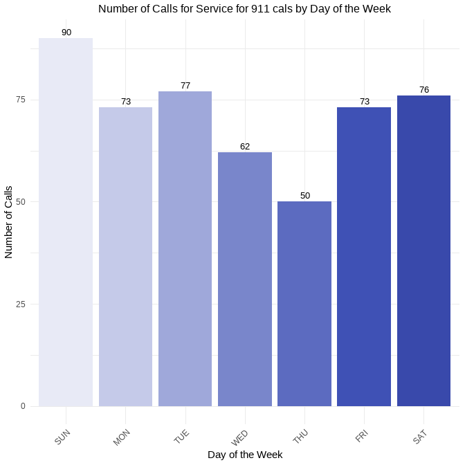

As can be seen Sunday was the busiest day for E-911 calls this week. This is inline with the busiest day of the week for all calls to the center.

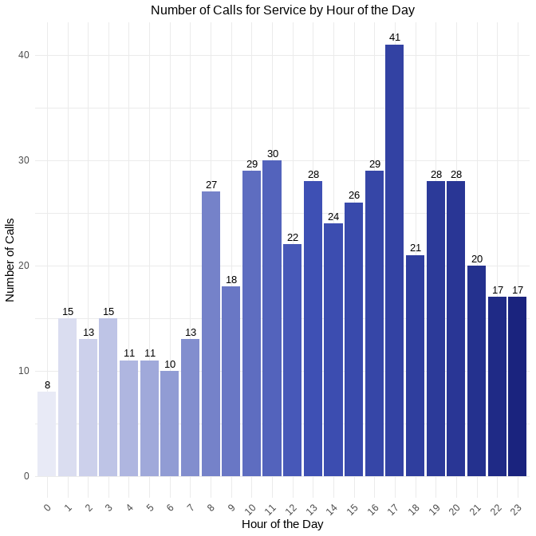

This shows that while the overall pattern for 9-1-1 calls is in keeping with the general weekly trend. However, the spike at 1700 hours stands out. Was there a significant call for service during that hour that generated a lot of calls on the 9-1-1 lines for the floor?

### Non 9-1-1 Call Breakdowns

Additionally, we've been asked to report on calls that were received by other means than the 9-1-1 trunk lines. These will include calls arriving on the administrative trunk lines, officer generated call, walk-in calls at 3600 Wheeler, etc. There is an interest in paying attention to these calls to identify trends and determine if there are operational; improvement opportunities present in handling these non-9-1-1 calls.

<div class="tabwid"><style>.cl-b1595718{}.cl-b14ff6a0{font-family:'Arial';font-size:9pt;font-weight:bold;font-style:normal;text-decoration:none;color:rgba(0, 0, 0, 1.00);background-color:transparent;}.cl-b14ff6b4{font-family:'Arial';font-size:9pt;font-weight:normal;font-style:normal;text-decoration:none;color:rgba(0, 0, 0, 1.00);background-color:transparent;}.cl-b153a048{margin:0;text-align:left;border-bottom: 0 solid rgba(0, 0, 0, 1.00);border-top: 0 solid rgba(0, 0, 0, 1.00);border-left: 0 solid rgba(0, 0, 0, 1.00);border-right: 0 solid rgba(0, 0, 0, 1.00);padding-bottom:3pt;padding-top:3pt;padding-left:3pt;padding-right:3pt;line-height: 1;background-color:transparent;}.cl-b153a052{margin:0;text-align:right;border-bottom: 0 solid rgba(0, 0, 0, 1.00);border-top: 0 solid rgba(0, 0, 0, 1.00);border-left: 0 solid rgba(0, 0, 0, 1.00);border-right: 0 solid rgba(0, 0, 0, 1.00);padding-bottom:3pt;padding-top:3pt;padding-left:3pt;padding-right:3pt;line-height: 1;background-color:transparent;}.cl-b153c8d4{width:1.191in;background-color:transparent;vertical-align: middle;border-bottom: 1.5pt solid rgba(102, 102, 102, 1.00);border-top: 1.5pt solid rgba(102, 102, 102, 1.00);border-left: 0 solid rgba(0, 0, 0, 1.00);border-right: 0 solid rgba(0, 0, 0, 1.00);margin-bottom:0;margin-top:0;margin-left:0;margin-right:0;}.cl-b153c8de{width:0.635in;background-color:transparent;vertical-align: middle;border-bottom: 1.5pt solid rgba(102, 102, 102, 1.00);border-top: 1.5pt solid rgba(102, 102, 102, 1.00);border-left: 0 solid rgba(0, 0, 0, 1.00);border-right: 0 solid rgba(0, 0, 0, 1.00);margin-bottom:0;margin-top:0;margin-left:0;margin-right:0;}.cl-b153c8df{width:0.698in;background-color:transparent;vertical-align: middle;border-bottom: 1.5pt solid rgba(102, 102, 102, 1.00);border-top: 1.5pt solid rgba(102, 102, 102, 1.00);border-left: 0 solid rgba(0, 0, 0, 1.00);border-right: 0 solid rgba(0, 0, 0, 1.00);margin-bottom:0;margin-top:0;margin-left:0;margin-right:0;}.cl-b153c8e8{width:0.642in;background-color:transparent;vertical-align: middle;border-bottom: 1.5pt solid rgba(102, 102, 102, 1.00);border-top: 1.5pt solid rgba(102, 102, 102, 1.00);border-left: 0 solid rgba(0, 0, 0, 1.00);border-right: 0 solid rgba(0, 0, 0, 1.00);margin-bottom:0;margin-top:0;margin-left:0;margin-right:0;}.cl-b153c8e9{width:0.531in;background-color:transparent;vertical-align: middle;border-bottom: 1.5pt solid rgba(102, 102, 102, 1.00);border-top: 1.5pt solid rgba(102, 102, 102, 1.00);border-left: 0 solid rgba(0, 0, 0, 1.00);border-right: 0 solid rgba(0, 0, 0, 1.00);margin-bottom:0;margin-top:0;margin-left:0;margin-right:0;}.cl-b153c8ea{width:1.191in;background-color:rgba(245, 245, 245, 1.00);vertical-align: middle;border-bottom: 0 solid rgba(0, 0, 0, 1.00);border-top: 0 solid rgba(0, 0, 0, 1.00);border-left: 0 solid rgba(0, 0, 0, 1.00);border-right: 0 solid rgba(0, 0, 0, 1.00);margin-bottom:0;margin-top:0;margin-left:0;margin-right:0;}.cl-b153c8f2{width:0.635in;background-color:rgba(245, 245, 245, 1.00);vertical-align: middle;border-bottom: 0 solid rgba(0, 0, 0, 1.00);border-top: 0 solid rgba(0, 0, 0, 1.00);border-left: 0 solid rgba(0, 0, 0, 1.00);border-right: 0 solid rgba(0, 0, 0, 1.00);margin-bottom:0;margin-top:0;margin-left:0;margin-right:0;}.cl-b153c8fc{width:0.698in;background-color:rgba(245, 245, 245, 1.00);vertical-align: middle;border-bottom: 0 solid rgba(0, 0, 0, 1.00);border-top: 0 solid rgba(0, 0, 0, 1.00);border-left: 0 solid rgba(0, 0, 0, 1.00);border-right: 0 solid rgba(0, 0, 0, 1.00);margin-bottom:0;margin-top:0;margin-left:0;margin-right:0;}.cl-b153c906{width:0.642in;background-color:rgba(245, 245, 245, 1.00);vertical-align: middle;border-bottom: 0 solid rgba(0, 0, 0, 1.00);border-top: 0 solid rgba(0, 0, 0, 1.00);border-left: 0 solid rgba(0, 0, 0, 1.00);border-right: 0 solid rgba(0, 0, 0, 1.00);margin-bottom:0;margin-top:0;margin-left:0;margin-right:0;}.cl-b153c907{width:0.531in;background-color:rgba(245, 245, 245, 1.00);vertical-align: middle;border-bottom: 0 solid rgba(0, 0, 0, 1.00);border-top: 0 solid rgba(0, 0, 0, 1.00);border-left: 0 solid rgba(0, 0, 0, 1.00);border-right: 0 solid rgba(0, 0, 0, 1.00);margin-bottom:0;margin-top:0;margin-left:0;margin-right:0;}.cl-b153c908{width:1.191in;background-color:transparent;vertical-align: middle;border-bottom: 0 solid rgba(0, 0, 0, 1.00);border-top: 0 solid rgba(0, 0, 0, 1.00);border-left: 0 solid rgba(0, 0, 0, 1.00);border-right: 0 solid rgba(0, 0, 0, 1.00);margin-bottom:0;margin-top:0;margin-left:0;margin-right:0;}.cl-b153c910{width:0.635in;background-color:transparent;vertical-align: middle;border-bottom: 0 solid rgba(0, 0, 0, 1.00);border-top: 0 solid rgba(0, 0, 0, 1.00);border-left: 0 solid rgba(0, 0, 0, 1.00);border-right: 0 solid rgba(0, 0, 0, 1.00);margin-bottom:0;margin-top:0;margin-left:0;margin-right:0;}.cl-b153c911{width:0.698in;background-color:transparent;vertical-align: middle;border-bottom: 0 solid rgba(0, 0, 0, 1.00);border-top: 0 solid rgba(0, 0, 0, 1.00);border-left: 0 solid rgba(0, 0, 0, 1.00);border-right: 0 solid rgba(0, 0, 0, 1.00);margin-bottom:0;margin-top:0;margin-left:0;margin-right:0;}.cl-b153c912{width:0.642in;background-color:transparent;vertical-align: middle;border-bottom: 0 solid rgba(0, 0, 0, 1.00);border-top: 0 solid rgba(0, 0, 0, 1.00);border-left: 0 solid rgba(0, 0, 0, 1.00);border-right: 0 solid rgba(0, 0, 0, 1.00);margin-bottom:0;margin-top:0;margin-left:0;margin-right:0;}.cl-b153c91a{width:0.531in;background-color:transparent;vertical-align: middle;border-bottom: 0 solid rgba(0, 0, 0, 1.00);border-top: 0 solid rgba(0, 0, 0, 1.00);border-left: 0 solid rgba(0, 0, 0, 1.00);border-right: 0 solid rgba(0, 0, 0, 1.00);margin-bottom:0;margin-top:0;margin-left:0;margin-right:0;}.cl-b153c91b{width:1.191in;background-color:rgba(245, 245, 245, 1.00);vertical-align: middle;border-bottom: 0 solid rgba(0, 0, 0, 1.00);border-top: 0 solid rgba(0, 0, 0, 1.00);border-left: 0 solid rgba(0, 0, 0, 1.00);border-right: 0 solid rgba(0, 0, 0, 1.00);margin-bottom:0;margin-top:0;margin-left:0;margin-right:0;}.cl-b153c91c{width:0.635in;background-color:rgba(245, 245, 245, 1.00);vertical-align: middle;border-bottom: 0 solid rgba(0, 0, 0, 1.00);border-top: 0 solid rgba(0, 0, 0, 1.00);border-left: 0 solid rgba(0, 0, 0, 1.00);border-right: 0 solid rgba(0, 0, 0, 1.00);margin-bottom:0;margin-top:0;margin-left:0;margin-right:0;}.cl-b153c924{width:0.698in;background-color:rgba(245, 245, 245, 1.00);vertical-align: middle;border-bottom: 0 solid rgba(0, 0, 0, 1.00);border-top: 0 solid rgba(0, 0, 0, 1.00);border-left: 0 solid rgba(0, 0, 0, 1.00);border-right: 0 solid rgba(0, 0, 0, 1.00);margin-bottom:0;margin-top:0;margin-left:0;margin-right:0;}.cl-b153c925{width:0.642in;background-color:rgba(245, 245, 245, 1.00);vertical-align: middle;border-bottom: 0 solid rgba(0, 0, 0, 1.00);border-top: 0 solid rgba(0, 0, 0, 1.00);border-left: 0 solid rgba(0, 0, 0, 1.00);border-right: 0 solid rgba(0, 0, 0, 1.00);margin-bottom:0;margin-top:0;margin-left:0;margin-right:0;}.cl-b153c926{width:0.531in;background-color:rgba(245, 245, 245, 1.00);vertical-align: middle;border-bottom: 0 solid rgba(0, 0, 0, 1.00);border-top: 0 solid rgba(0, 0, 0, 1.00);border-left: 0 solid rgba(0, 0, 0, 1.00);border-right: 0 solid rgba(0, 0, 0, 1.00);margin-bottom:0;margin-top:0;margin-left:0;margin-right:0;}.cl-b153c92e{width:1.191in;background-color:transparent;vertical-align: middle;border-bottom: 0 solid rgba(0, 0, 0, 1.00);border-top: 0 solid rgba(0, 0, 0, 1.00);border-left: 0 solid rgba(0, 0, 0, 1.00);border-right: 0 solid rgba(0, 0, 0, 1.00);margin-bottom:0;margin-top:0;margin-left:0;margin-right:0;}.cl-b153c938{width:0.635in;background-color:transparent;vertical-align: middle;border-bottom: 0 solid rgba(0, 0, 0, 1.00);border-top: 0 solid rgba(0, 0, 0, 1.00);border-left: 0 solid rgba(0, 0, 0, 1.00);border-right: 0 solid rgba(0, 0, 0, 1.00);margin-bottom:0;margin-top:0;margin-left:0;margin-right:0;}.cl-b153c939{width:0.698in;background-color:transparent;vertical-align: middle;border-bottom: 0 solid rgba(0, 0, 0, 1.00);border-top: 0 solid rgba(0, 0, 0, 1.00);border-left: 0 solid rgba(0, 0, 0, 1.00);border-right: 0 solid rgba(0, 0, 0, 1.00);margin-bottom:0;margin-top:0;margin-left:0;margin-right:0;}.cl-b153c93a{width:0.642in;background-color:transparent;vertical-align: middle;border-bottom: 0 solid rgba(0, 0, 0, 1.00);border-top: 0 solid rgba(0, 0, 0, 1.00);border-left: 0 solid rgba(0, 0, 0, 1.00);border-right: 0 solid rgba(0, 0, 0, 1.00);margin-bottom:0;margin-top:0;margin-left:0;margin-right:0;}.cl-b153c942{width:0.531in;background-color:transparent;vertical-align: middle;border-bottom: 0 solid rgba(0, 0, 0, 1.00);border-top: 0 solid rgba(0, 0, 0, 1.00);border-left: 0 solid rgba(0, 0, 0, 1.00);border-right: 0 solid rgba(0, 0, 0, 1.00);margin-bottom:0;margin-top:0;margin-left:0;margin-right:0;}.cl-b153c943{width:1.191in;background-color:transparent;vertical-align: middle;border-bottom: 0 solid rgba(0, 0, 0, 1.00);border-top: 0 solid rgba(0, 0, 0, 1.00);border-left: 0 solid rgba(0, 0, 0, 1.00);border-right: 0 solid rgba(0, 0, 0, 1.00);margin-bottom:0;margin-top:0;margin-left:0;margin-right:0;}.cl-b153c94c{width:0.635in;background-color:transparent;vertical-align: middle;border-bottom: 0 solid rgba(0, 0, 0, 1.00);border-top: 0 solid rgba(0, 0, 0, 1.00);border-left: 0 solid rgba(0, 0, 0, 1.00);border-right: 0 solid rgba(0, 0, 0, 1.00);margin-bottom:0;margin-top:0;margin-left:0;margin-right:0;}.cl-b153c94d{width:0.698in;background-color:transparent;vertical-align: middle;border-bottom: 0 solid rgba(0, 0, 0, 1.00);border-top: 0 solid rgba(0, 0, 0, 1.00);border-left: 0 solid rgba(0, 0, 0, 1.00);border-right: 0 solid rgba(0, 0, 0, 1.00);margin-bottom:0;margin-top:0;margin-left:0;margin-right:0;}.cl-b153c956{width:0.642in;background-color:transparent;vertical-align: middle;border-bottom: 0 solid rgba(0, 0, 0, 1.00);border-top: 0 solid rgba(0, 0, 0, 1.00);border-left: 0 solid rgba(0, 0, 0, 1.00);border-right: 0 solid rgba(0, 0, 0, 1.00);margin-bottom:0;margin-top:0;margin-left:0;margin-right:0;}.cl-b153c957{width:0.531in;background-color:transparent;vertical-align: middle;border-bottom: 0 solid rgba(0, 0, 0, 1.00);border-top: 0 solid rgba(0, 0, 0, 1.00);border-left: 0 solid rgba(0, 0, 0, 1.00);border-right: 0 solid rgba(0, 0, 0, 1.00);margin-bottom:0;margin-top:0;margin-left:0;margin-right:0;}.cl-b153c958{width:1.191in;background-color:rgba(245, 245, 245, 1.00);vertical-align: middle;border-bottom: 1.5pt solid rgba(102, 102, 102, 1.00);border-top: 0 solid rgba(0, 0, 0, 1.00);border-left: 0 solid rgba(0, 0, 0, 1.00);border-right: 0 solid rgba(0, 0, 0, 1.00);margin-bottom:0;margin-top:0;margin-left:0;margin-right:0;}.cl-b153c960{width:0.635in;background-color:rgba(245, 245, 245, 1.00);vertical-align: middle;border-bottom: 1.5pt solid rgba(102, 102, 102, 1.00);border-top: 0 solid rgba(0, 0, 0, 1.00);border-left: 0 solid rgba(0, 0, 0, 1.00);border-right: 0 solid rgba(0, 0, 0, 1.00);margin-bottom:0;margin-top:0;margin-left:0;margin-right:0;}.cl-b153c961{width:0.698in;background-color:rgba(245, 245, 245, 1.00);vertical-align: middle;border-bottom: 1.5pt solid rgba(102, 102, 102, 1.00);border-top: 0 solid rgba(0, 0, 0, 1.00);border-left: 0 solid rgba(0, 0, 0, 1.00);border-right: 0 solid rgba(0, 0, 0, 1.00);margin-bottom:0;margin-top:0;margin-left:0;margin-right:0;}.cl-b153c962{width:0.642in;background-color:rgba(245, 245, 245, 1.00);vertical-align: middle;border-bottom: 1.5pt solid rgba(102, 102, 102, 1.00);border-top: 0 solid rgba(0, 0, 0, 1.00);border-left: 0 solid rgba(0, 0, 0, 1.00);border-right: 0 solid rgba(0, 0, 0, 1.00);margin-bottom:0;margin-top:0;margin-left:0;margin-right:0;}.cl-b153c96a{width:0.531in;background-color:rgba(245, 245, 245, 1.00);vertical-align: middle;border-bottom: 1.5pt solid rgba(102, 102, 102, 1.00);border-top: 0 solid rgba(0, 0, 0, 1.00);border-left: 0 solid rgba(0, 0, 0, 1.00);border-right: 0 solid rgba(0, 0, 0, 1.00);margin-bottom:0;margin-top:0;margin-left:0;margin-right:0;}.tabwid {
  font-size: initial;
  padding-bottom: 1em;
}

.tabwid table{
  border-spacing:0px !important;
  border-collapse:collapse;
  line-height:1;
  margin-left:auto;
  margin-right:auto;
  border-width: 0;
  border-color: transparent;
  caption-side: top;
}
.tabwid-caption-bottom table{
  caption-side: bottom;
}
.tabwid_left table{
  margin-left:0;
}
.tabwid_right table{
  margin-right:0;
}
.tabwid td, .tabwid th {
    padding: 0;
}
.tabwid a {
  text-decoration: none;
}
.tabwid thead {
    background-color: transparent;
}
.tabwid tfoot {
    background-color: transparent;
}
.tabwid table tr {
background-color: transparent;
}
.katex-display {
    margin: 0 0 !important;
}</style><table data-quarto-disable-processing='true' class='cl-b1595718'><thead><tr style="overflow-wrap:break-word;"><th class="cl-b153c8d4"><p class="cl-b153a048"><span class="cl-b14ff6a0">Time Metric</span></p></th><th class="cl-b153c8de"><p class="cl-b153a052"><span class="cl-b14ff6a0">Min</span></p></th><th class="cl-b153c8df"><p class="cl-b153a052"><span class="cl-b14ff6a0">Mean</span></p></th><th class="cl-b153c8e8"><p class="cl-b153a052"><span class="cl-b14ff6a0">Median</span></p></th><th class="cl-b153c8df"><p class="cl-b153a052"><span class="cl-b14ff6a0">Std Dev</span></p></th><th class="cl-b153c8e9"><p class="cl-b153a052"><span class="cl-b14ff6a0">Skew</span></p></th><th class="cl-b153c8df"><p class="cl-b153a052"><span class="cl-b14ff6a0">Kurt</span></p></th></tr></thead><tbody><tr style="overflow-wrap:break-word;"><td class="cl-b153c8ea"><p class="cl-b153a048"><span class="cl-b14ff6b4">Time To Queue</span></p></td><td class="cl-b153c8f2"><p class="cl-b153a052"><span class="cl-b14ff6b4">0</span></p></td><td class="cl-b153c8fc"><p class="cl-b153a052"><span class="cl-b14ff6b4">67.19</span></p></td><td class="cl-b153c906"><p class="cl-b153a052"><span class="cl-b14ff6b4">26.0</span></p></td><td class="cl-b153c8fc"><p class="cl-b153a052"><span class="cl-b14ff6b4">452.79</span></p></td><td class="cl-b153c907"><p class="cl-b153a052"><span class="cl-b14ff6b4">34.74</span></p></td><td class="cl-b153c8fc"><p class="cl-b153a052"><span class="cl-b14ff6b4">1,272.01</span></p></td></tr><tr style="overflow-wrap:break-word;"><td class="cl-b153c908"><p class="cl-b153a048"><span class="cl-b14ff6b4">Time To Dispatch</span></p></td><td class="cl-b153c910"><p class="cl-b153a052"><span class="cl-b14ff6b4">-16,660</span></p></td><td class="cl-b153c911"><p class="cl-b153a052"><span class="cl-b14ff6b4">1,450.69</span></p></td><td class="cl-b153c912"><p class="cl-b153a052"><span class="cl-b14ff6b4">29.0</span></p></td><td class="cl-b153c911"><p class="cl-b153a052"><span class="cl-b14ff6b4">6,521.52</span></p></td><td class="cl-b153c91a"><p class="cl-b153a052"><span class="cl-b14ff6b4">10.09</span></p></td><td class="cl-b153c911"><p class="cl-b153a052"><span class="cl-b14ff6b4">124.23</span></p></td></tr><tr style="overflow-wrap:break-word;"><td class="cl-b153c91b"><p class="cl-b153a048"><span class="cl-b14ff6b4">Phone Time</span></p></td><td class="cl-b153c91c"><p class="cl-b153a052"><span class="cl-b14ff6b4">0</span></p></td><td class="cl-b153c924"><p class="cl-b153a052"><span class="cl-b14ff6b4">191.93</span></p></td><td class="cl-b153c925"><p class="cl-b153a052"><span class="cl-b14ff6b4">87.0</span></p></td><td class="cl-b153c924"><p class="cl-b153a052"><span class="cl-b14ff6b4">428.36</span></p></td><td class="cl-b153c926"><p class="cl-b153a052"><span class="cl-b14ff6b4">6.77</span></p></td><td class="cl-b153c924"><p class="cl-b153a052"><span class="cl-b14ff6b4">63.67</span></p></td></tr><tr style="overflow-wrap:break-word;"><td class="cl-b153c92e"><p class="cl-b153a048"><span class="cl-b14ff6b4">Processing Time</span></p></td><td class="cl-b153c938"><p class="cl-b153a052"><span class="cl-b14ff6b4">-1,926</span></p></td><td class="cl-b153c939"><p class="cl-b153a052"><span class="cl-b14ff6b4">1,517.88</span></p></td><td class="cl-b153c93a"><p class="cl-b153a052"><span class="cl-b14ff6b4">88.0</span></p></td><td class="cl-b153c939"><p class="cl-b153a052"><span class="cl-b14ff6b4">6,516.48</span></p></td><td class="cl-b153c942"><p class="cl-b153a052"><span class="cl-b14ff6b4">10.15</span></p></td><td class="cl-b153c939"><p class="cl-b153a052"><span class="cl-b14ff6b4">125.05</span></p></td></tr><tr style="overflow-wrap:break-word;"><td class="cl-b153c91b"><p class="cl-b153a048"><span class="cl-b14ff6b4">Rollout Time</span></p></td><td class="cl-b153c91c"><p class="cl-b153a052"><span class="cl-b14ff6b4">0</span></p></td><td class="cl-b153c924"><p class="cl-b153a052"><span class="cl-b14ff6b4">20.19</span></p></td><td class="cl-b153c925"><p class="cl-b153a052"><span class="cl-b14ff6b4">1.0</span></p></td><td class="cl-b153c924"><p class="cl-b153a052"><span class="cl-b14ff6b4">100.02</span></p></td><td class="cl-b153c926"><p class="cl-b153a052"><span class="cl-b14ff6b4">21.60</span></p></td><td class="cl-b153c924"><p class="cl-b153a052"><span class="cl-b14ff6b4">530.99</span></p></td></tr><tr style="overflow-wrap:break-word;"><td class="cl-b153c943"><p class="cl-b153a048"><span class="cl-b14ff6b4">Transit Time</span></p></td><td class="cl-b153c94c"><p class="cl-b153a052"><span class="cl-b14ff6b4">-1,729</span></p></td><td class="cl-b153c94d"><p class="cl-b153a052"><span class="cl-b14ff6b4">434.81</span></p></td><td class="cl-b153c956"><p class="cl-b153a052"><span class="cl-b14ff6b4">178.0</span></p></td><td class="cl-b153c94d"><p class="cl-b153a052"><span class="cl-b14ff6b4">1,528.17</span></p></td><td class="cl-b153c957"><p class="cl-b153a052"><span class="cl-b14ff6b4">18.96</span></p></td><td class="cl-b153c94d"><p class="cl-b153a052"><span class="cl-b14ff6b4">486.26</span></p></td></tr><tr style="overflow-wrap:break-word;"><td class="cl-b153c958"><p class="cl-b153a048"><span class="cl-b14ff6b4">Total Call Time</span></p></td><td class="cl-b153c960"><p class="cl-b153a052"><span class="cl-b14ff6b4">-1,698</span></p></td><td class="cl-b153c961"><p class="cl-b153a052"><span class="cl-b14ff6b4">4,998.47</span></p></td><td class="cl-b153c962"><p class="cl-b153a052"><span class="cl-b14ff6b4">1,875.5</span></p></td><td class="cl-b153c961"><p class="cl-b153a052"><span class="cl-b14ff6b4">7,954.47</span></p></td><td class="cl-b153c96a"><p class="cl-b153a052"><span class="cl-b14ff6b4">3.60</span></p></td><td class="cl-b153c961"><p class="cl-b153a052"><span class="cl-b14ff6b4">20.31</span></p></td></tr></tbody></table></div>

It is interesting to note that the median processing time, 88 seconds, is not that much longer than the 9-1-1 median processing time. Also interesting to note is that the median time on the phones, 87 seconds is less than the same for E-911 calls. This is likely because the calls coming in on the E-911 lines will require more triage and support during the call's lifespan.


As can be seen Wednesday was the busiest day for Non-E-911 calls this week. This is inline with the busiest day of the week for all calls to the center.

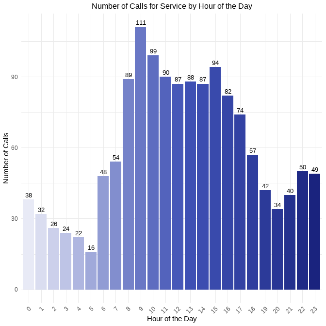

## Topical Analyses

These specific analyses have been included regardless of the emergency status of the call. They include types of calls that we have been requested to monitor and looking at outlier calls for any existing patterns.

### Cardiac Arrest Calls Analysis

Finally, we will look into the specific subset of calls that are related to cardiac arrests. These calls have been identified in the `df_ca` dataset.


As we can see, with a very limited number of cardiac arrest calls for the week.

<div class="tabwid"><style>.cl-b2401d06{}.cl-b236bebe{font-family:'Arial';font-size:9pt;font-weight:bold;font-style:normal;text-decoration:none;color:rgba(0, 0, 0, 1.00);background-color:transparent;}.cl-b236bec8{font-family:'Arial';font-size:9pt;font-weight:normal;font-style:normal;text-decoration:none;color:rgba(0, 0, 0, 1.00);background-color:transparent;}.cl-b23a736a{margin:0;text-align:left;border-bottom: 0 solid rgba(0, 0, 0, 1.00);border-top: 0 solid rgba(0, 0, 0, 1.00);border-left: 0 solid rgba(0, 0, 0, 1.00);border-right: 0 solid rgba(0, 0, 0, 1.00);padding-bottom:3pt;padding-top:3pt;padding-left:3pt;padding-right:3pt;line-height: 1;background-color:transparent;}.cl-b23a7374{margin:0;text-align:right;border-bottom: 0 solid rgba(0, 0, 0, 1.00);border-top: 0 solid rgba(0, 0, 0, 1.00);border-left: 0 solid rgba(0, 0, 0, 1.00);border-right: 0 solid rgba(0, 0, 0, 1.00);padding-bottom:3pt;padding-top:3pt;padding-left:3pt;padding-right:3pt;line-height: 1;background-color:transparent;}.cl-b23a9f84{width:1.191in;background-color:transparent;vertical-align: middle;border-bottom: 1.5pt solid rgba(102, 102, 102, 1.00);border-top: 1.5pt solid rgba(102, 102, 102, 1.00);border-left: 0 solid rgba(0, 0, 0, 1.00);border-right: 0 solid rgba(0, 0, 0, 1.00);margin-bottom:0;margin-top:0;margin-left:0;margin-right:0;}.cl-b23a9f8e{width:0.426in;background-color:transparent;vertical-align: middle;border-bottom: 1.5pt solid rgba(102, 102, 102, 1.00);border-top: 1.5pt solid rgba(102, 102, 102, 1.00);border-left: 0 solid rgba(0, 0, 0, 1.00);border-right: 0 solid rgba(0, 0, 0, 1.00);margin-bottom:0;margin-top:0;margin-left:0;margin-right:0;}.cl-b23a9f8f{width:0.698in;background-color:transparent;vertical-align: middle;border-bottom: 1.5pt solid rgba(102, 102, 102, 1.00);border-top: 1.5pt solid rgba(102, 102, 102, 1.00);border-left: 0 solid rgba(0, 0, 0, 1.00);border-right: 0 solid rgba(0, 0, 0, 1.00);margin-bottom:0;margin-top:0;margin-left:0;margin-right:0;}.cl-b23a9f98{width:0.642in;background-color:transparent;vertical-align: middle;border-bottom: 1.5pt solid rgba(102, 102, 102, 1.00);border-top: 1.5pt solid rgba(102, 102, 102, 1.00);border-left: 0 solid rgba(0, 0, 0, 1.00);border-right: 0 solid rgba(0, 0, 0, 1.00);margin-bottom:0;margin-top:0;margin-left:0;margin-right:0;}.cl-b23a9f99{width:0.531in;background-color:transparent;vertical-align: middle;border-bottom: 1.5pt solid rgba(102, 102, 102, 1.00);border-top: 1.5pt solid rgba(102, 102, 102, 1.00);border-left: 0 solid rgba(0, 0, 0, 1.00);border-right: 0 solid rgba(0, 0, 0, 1.00);margin-bottom:0;margin-top:0;margin-left:0;margin-right:0;}.cl-b23a9fa2{width:0.718in;background-color:transparent;vertical-align: middle;border-bottom: 1.5pt solid rgba(102, 102, 102, 1.00);border-top: 1.5pt solid rgba(102, 102, 102, 1.00);border-left: 0 solid rgba(0, 0, 0, 1.00);border-right: 0 solid rgba(0, 0, 0, 1.00);margin-bottom:0;margin-top:0;margin-left:0;margin-right:0;}.cl-b23a9fac{width:1.191in;background-color:rgba(245, 245, 245, 1.00);vertical-align: middle;border-bottom: 0 solid rgba(0, 0, 0, 1.00);border-top: 0 solid rgba(0, 0, 0, 1.00);border-left: 0 solid rgba(0, 0, 0, 1.00);border-right: 0 solid rgba(0, 0, 0, 1.00);margin-bottom:0;margin-top:0;margin-left:0;margin-right:0;}.cl-b23a9fad{width:0.426in;background-color:rgba(245, 245, 245, 1.00);vertical-align: middle;border-bottom: 0 solid rgba(0, 0, 0, 1.00);border-top: 0 solid rgba(0, 0, 0, 1.00);border-left: 0 solid rgba(0, 0, 0, 1.00);border-right: 0 solid rgba(0, 0, 0, 1.00);margin-bottom:0;margin-top:0;margin-left:0;margin-right:0;}.cl-b23a9fb6{width:0.698in;background-color:rgba(245, 245, 245, 1.00);vertical-align: middle;border-bottom: 0 solid rgba(0, 0, 0, 1.00);border-top: 0 solid rgba(0, 0, 0, 1.00);border-left: 0 solid rgba(0, 0, 0, 1.00);border-right: 0 solid rgba(0, 0, 0, 1.00);margin-bottom:0;margin-top:0;margin-left:0;margin-right:0;}.cl-b23a9fb7{width:0.642in;background-color:rgba(245, 245, 245, 1.00);vertical-align: middle;border-bottom: 0 solid rgba(0, 0, 0, 1.00);border-top: 0 solid rgba(0, 0, 0, 1.00);border-left: 0 solid rgba(0, 0, 0, 1.00);border-right: 0 solid rgba(0, 0, 0, 1.00);margin-bottom:0;margin-top:0;margin-left:0;margin-right:0;}.cl-b23a9fc0{width:0.531in;background-color:rgba(245, 245, 245, 1.00);vertical-align: middle;border-bottom: 0 solid rgba(0, 0, 0, 1.00);border-top: 0 solid rgba(0, 0, 0, 1.00);border-left: 0 solid rgba(0, 0, 0, 1.00);border-right: 0 solid rgba(0, 0, 0, 1.00);margin-bottom:0;margin-top:0;margin-left:0;margin-right:0;}.cl-b23a9fc1{width:0.718in;background-color:rgba(245, 245, 245, 1.00);vertical-align: middle;border-bottom: 0 solid rgba(0, 0, 0, 1.00);border-top: 0 solid rgba(0, 0, 0, 1.00);border-left: 0 solid rgba(0, 0, 0, 1.00);border-right: 0 solid rgba(0, 0, 0, 1.00);margin-bottom:0;margin-top:0;margin-left:0;margin-right:0;}.cl-b23a9fca{width:1.191in;background-color:transparent;vertical-align: middle;border-bottom: 0 solid rgba(0, 0, 0, 1.00);border-top: 0 solid rgba(0, 0, 0, 1.00);border-left: 0 solid rgba(0, 0, 0, 1.00);border-right: 0 solid rgba(0, 0, 0, 1.00);margin-bottom:0;margin-top:0;margin-left:0;margin-right:0;}.cl-b23a9fcb{width:0.426in;background-color:transparent;vertical-align: middle;border-bottom: 0 solid rgba(0, 0, 0, 1.00);border-top: 0 solid rgba(0, 0, 0, 1.00);border-left: 0 solid rgba(0, 0, 0, 1.00);border-right: 0 solid rgba(0, 0, 0, 1.00);margin-bottom:0;margin-top:0;margin-left:0;margin-right:0;}.cl-b23a9fcc{width:0.698in;background-color:transparent;vertical-align: middle;border-bottom: 0 solid rgba(0, 0, 0, 1.00);border-top: 0 solid rgba(0, 0, 0, 1.00);border-left: 0 solid rgba(0, 0, 0, 1.00);border-right: 0 solid rgba(0, 0, 0, 1.00);margin-bottom:0;margin-top:0;margin-left:0;margin-right:0;}.cl-b23a9fd4{width:0.642in;background-color:transparent;vertical-align: middle;border-bottom: 0 solid rgba(0, 0, 0, 1.00);border-top: 0 solid rgba(0, 0, 0, 1.00);border-left: 0 solid rgba(0, 0, 0, 1.00);border-right: 0 solid rgba(0, 0, 0, 1.00);margin-bottom:0;margin-top:0;margin-left:0;margin-right:0;}.cl-b23a9fd5{width:0.531in;background-color:transparent;vertical-align: middle;border-bottom: 0 solid rgba(0, 0, 0, 1.00);border-top: 0 solid rgba(0, 0, 0, 1.00);border-left: 0 solid rgba(0, 0, 0, 1.00);border-right: 0 solid rgba(0, 0, 0, 1.00);margin-bottom:0;margin-top:0;margin-left:0;margin-right:0;}.cl-b23a9fd6{width:0.718in;background-color:transparent;vertical-align: middle;border-bottom: 0 solid rgba(0, 0, 0, 1.00);border-top: 0 solid rgba(0, 0, 0, 1.00);border-left: 0 solid rgba(0, 0, 0, 1.00);border-right: 0 solid rgba(0, 0, 0, 1.00);margin-bottom:0;margin-top:0;margin-left:0;margin-right:0;}.cl-b23a9fde{width:1.191in;background-color:rgba(245, 245, 245, 1.00);vertical-align: middle;border-bottom: 0 solid rgba(0, 0, 0, 1.00);border-top: 0 solid rgba(0, 0, 0, 1.00);border-left: 0 solid rgba(0, 0, 0, 1.00);border-right: 0 solid rgba(0, 0, 0, 1.00);margin-bottom:0;margin-top:0;margin-left:0;margin-right:0;}.cl-b23a9fdf{width:0.426in;background-color:rgba(245, 245, 245, 1.00);vertical-align: middle;border-bottom: 0 solid rgba(0, 0, 0, 1.00);border-top: 0 solid rgba(0, 0, 0, 1.00);border-left: 0 solid rgba(0, 0, 0, 1.00);border-right: 0 solid rgba(0, 0, 0, 1.00);margin-bottom:0;margin-top:0;margin-left:0;margin-right:0;}.cl-b23a9fe8{width:0.698in;background-color:rgba(245, 245, 245, 1.00);vertical-align: middle;border-bottom: 0 solid rgba(0, 0, 0, 1.00);border-top: 0 solid rgba(0, 0, 0, 1.00);border-left: 0 solid rgba(0, 0, 0, 1.00);border-right: 0 solid rgba(0, 0, 0, 1.00);margin-bottom:0;margin-top:0;margin-left:0;margin-right:0;}.cl-b23a9fe9{width:0.642in;background-color:rgba(245, 245, 245, 1.00);vertical-align: middle;border-bottom: 0 solid rgba(0, 0, 0, 1.00);border-top: 0 solid rgba(0, 0, 0, 1.00);border-left: 0 solid rgba(0, 0, 0, 1.00);border-right: 0 solid rgba(0, 0, 0, 1.00);margin-bottom:0;margin-top:0;margin-left:0;margin-right:0;}.cl-b23a9ff2{width:0.531in;background-color:rgba(245, 245, 245, 1.00);vertical-align: middle;border-bottom: 0 solid rgba(0, 0, 0, 1.00);border-top: 0 solid rgba(0, 0, 0, 1.00);border-left: 0 solid rgba(0, 0, 0, 1.00);border-right: 0 solid rgba(0, 0, 0, 1.00);margin-bottom:0;margin-top:0;margin-left:0;margin-right:0;}.cl-b23a9ffc{width:0.718in;background-color:rgba(245, 245, 245, 1.00);vertical-align: middle;border-bottom: 0 solid rgba(0, 0, 0, 1.00);border-top: 0 solid rgba(0, 0, 0, 1.00);border-left: 0 solid rgba(0, 0, 0, 1.00);border-right: 0 solid rgba(0, 0, 0, 1.00);margin-bottom:0;margin-top:0;margin-left:0;margin-right:0;}.cl-b23a9ffd{width:1.191in;background-color:transparent;vertical-align: middle;border-bottom: 0 solid rgba(0, 0, 0, 1.00);border-top: 0 solid rgba(0, 0, 0, 1.00);border-left: 0 solid rgba(0, 0, 0, 1.00);border-right: 0 solid rgba(0, 0, 0, 1.00);margin-bottom:0;margin-top:0;margin-left:0;margin-right:0;}.cl-b23a9ffe{width:0.426in;background-color:transparent;vertical-align: middle;border-bottom: 0 solid rgba(0, 0, 0, 1.00);border-top: 0 solid rgba(0, 0, 0, 1.00);border-left: 0 solid rgba(0, 0, 0, 1.00);border-right: 0 solid rgba(0, 0, 0, 1.00);margin-bottom:0;margin-top:0;margin-left:0;margin-right:0;}.cl-b23a9fff{width:0.698in;background-color:transparent;vertical-align: middle;border-bottom: 0 solid rgba(0, 0, 0, 1.00);border-top: 0 solid rgba(0, 0, 0, 1.00);border-left: 0 solid rgba(0, 0, 0, 1.00);border-right: 0 solid rgba(0, 0, 0, 1.00);margin-bottom:0;margin-top:0;margin-left:0;margin-right:0;}.cl-b23aa006{width:0.642in;background-color:transparent;vertical-align: middle;border-bottom: 0 solid rgba(0, 0, 0, 1.00);border-top: 0 solid rgba(0, 0, 0, 1.00);border-left: 0 solid rgba(0, 0, 0, 1.00);border-right: 0 solid rgba(0, 0, 0, 1.00);margin-bottom:0;margin-top:0;margin-left:0;margin-right:0;}.cl-b23aa010{width:0.531in;background-color:transparent;vertical-align: middle;border-bottom: 0 solid rgba(0, 0, 0, 1.00);border-top: 0 solid rgba(0, 0, 0, 1.00);border-left: 0 solid rgba(0, 0, 0, 1.00);border-right: 0 solid rgba(0, 0, 0, 1.00);margin-bottom:0;margin-top:0;margin-left:0;margin-right:0;}.cl-b23aa011{width:0.718in;background-color:transparent;vertical-align: middle;border-bottom: 0 solid rgba(0, 0, 0, 1.00);border-top: 0 solid rgba(0, 0, 0, 1.00);border-left: 0 solid rgba(0, 0, 0, 1.00);border-right: 0 solid rgba(0, 0, 0, 1.00);margin-bottom:0;margin-top:0;margin-left:0;margin-right:0;}.cl-b23aa01a{width:1.191in;background-color:transparent;vertical-align: middle;border-bottom: 0 solid rgba(0, 0, 0, 1.00);border-top: 0 solid rgba(0, 0, 0, 1.00);border-left: 0 solid rgba(0, 0, 0, 1.00);border-right: 0 solid rgba(0, 0, 0, 1.00);margin-bottom:0;margin-top:0;margin-left:0;margin-right:0;}.cl-b23aa01b{width:0.426in;background-color:transparent;vertical-align: middle;border-bottom: 0 solid rgba(0, 0, 0, 1.00);border-top: 0 solid rgba(0, 0, 0, 1.00);border-left: 0 solid rgba(0, 0, 0, 1.00);border-right: 0 solid rgba(0, 0, 0, 1.00);margin-bottom:0;margin-top:0;margin-left:0;margin-right:0;}.cl-b23aa01c{width:0.698in;background-color:transparent;vertical-align: middle;border-bottom: 0 solid rgba(0, 0, 0, 1.00);border-top: 0 solid rgba(0, 0, 0, 1.00);border-left: 0 solid rgba(0, 0, 0, 1.00);border-right: 0 solid rgba(0, 0, 0, 1.00);margin-bottom:0;margin-top:0;margin-left:0;margin-right:0;}.cl-b23aa024{width:0.642in;background-color:transparent;vertical-align: middle;border-bottom: 0 solid rgba(0, 0, 0, 1.00);border-top: 0 solid rgba(0, 0, 0, 1.00);border-left: 0 solid rgba(0, 0, 0, 1.00);border-right: 0 solid rgba(0, 0, 0, 1.00);margin-bottom:0;margin-top:0;margin-left:0;margin-right:0;}.cl-b23aa025{width:0.531in;background-color:transparent;vertical-align: middle;border-bottom: 0 solid rgba(0, 0, 0, 1.00);border-top: 0 solid rgba(0, 0, 0, 1.00);border-left: 0 solid rgba(0, 0, 0, 1.00);border-right: 0 solid rgba(0, 0, 0, 1.00);margin-bottom:0;margin-top:0;margin-left:0;margin-right:0;}.cl-b23aa026{width:0.718in;background-color:transparent;vertical-align: middle;border-bottom: 0 solid rgba(0, 0, 0, 1.00);border-top: 0 solid rgba(0, 0, 0, 1.00);border-left: 0 solid rgba(0, 0, 0, 1.00);border-right: 0 solid rgba(0, 0, 0, 1.00);margin-bottom:0;margin-top:0;margin-left:0;margin-right:0;}.cl-b23aa027{width:1.191in;background-color:rgba(245, 245, 245, 1.00);vertical-align: middle;border-bottom: 1.5pt solid rgba(102, 102, 102, 1.00);border-top: 0 solid rgba(0, 0, 0, 1.00);border-left: 0 solid rgba(0, 0, 0, 1.00);border-right: 0 solid rgba(0, 0, 0, 1.00);margin-bottom:0;margin-top:0;margin-left:0;margin-right:0;}.cl-b23aa02e{width:0.426in;background-color:rgba(245, 245, 245, 1.00);vertical-align: middle;border-bottom: 1.5pt solid rgba(102, 102, 102, 1.00);border-top: 0 solid rgba(0, 0, 0, 1.00);border-left: 0 solid rgba(0, 0, 0, 1.00);border-right: 0 solid rgba(0, 0, 0, 1.00);margin-bottom:0;margin-top:0;margin-left:0;margin-right:0;}.cl-b23aa02f{width:0.698in;background-color:rgba(245, 245, 245, 1.00);vertical-align: middle;border-bottom: 1.5pt solid rgba(102, 102, 102, 1.00);border-top: 0 solid rgba(0, 0, 0, 1.00);border-left: 0 solid rgba(0, 0, 0, 1.00);border-right: 0 solid rgba(0, 0, 0, 1.00);margin-bottom:0;margin-top:0;margin-left:0;margin-right:0;}.cl-b23aa038{width:0.642in;background-color:rgba(245, 245, 245, 1.00);vertical-align: middle;border-bottom: 1.5pt solid rgba(102, 102, 102, 1.00);border-top: 0 solid rgba(0, 0, 0, 1.00);border-left: 0 solid rgba(0, 0, 0, 1.00);border-right: 0 solid rgba(0, 0, 0, 1.00);margin-bottom:0;margin-top:0;margin-left:0;margin-right:0;}.cl-b23aa039{width:0.531in;background-color:rgba(245, 245, 245, 1.00);vertical-align: middle;border-bottom: 1.5pt solid rgba(102, 102, 102, 1.00);border-top: 0 solid rgba(0, 0, 0, 1.00);border-left: 0 solid rgba(0, 0, 0, 1.00);border-right: 0 solid rgba(0, 0, 0, 1.00);margin-bottom:0;margin-top:0;margin-left:0;margin-right:0;}.cl-b23aa03a{width:0.718in;background-color:rgba(245, 245, 245, 1.00);vertical-align: middle;border-bottom: 1.5pt solid rgba(102, 102, 102, 1.00);border-top: 0 solid rgba(0, 0, 0, 1.00);border-left: 0 solid rgba(0, 0, 0, 1.00);border-right: 0 solid rgba(0, 0, 0, 1.00);margin-bottom:0;margin-top:0;margin-left:0;margin-right:0;}.tabwid {
  font-size: initial;
  padding-bottom: 1em;
}

.tabwid table{
  border-spacing:0px !important;
  border-collapse:collapse;
  line-height:1;
  margin-left:auto;
  margin-right:auto;
  border-width: 0;
  border-color: transparent;
  caption-side: top;
}
.tabwid-caption-bottom table{
  caption-side: bottom;
}
.tabwid_left table{
  margin-left:0;
}
.tabwid_right table{
  margin-right:0;
}
.tabwid td, .tabwid th {
    padding: 0;
}
.tabwid a {
  text-decoration: none;
}
.tabwid thead {
    background-color: transparent;
}
.tabwid tfoot {
    background-color: transparent;
}
.tabwid table tr {
background-color: transparent;
}
.katex-display {
    margin: 0 0 !important;
}</style><table data-quarto-disable-processing='true' class='cl-b2401d06'><thead><tr style="overflow-wrap:break-word;"><th class="cl-b23a9f84"><p class="cl-b23a736a"><span class="cl-b236bebe">Time Metric</span></p></th><th class="cl-b23a9f8e"><p class="cl-b23a7374"><span class="cl-b236bebe">Min</span></p></th><th class="cl-b23a9f8f"><p class="cl-b23a7374"><span class="cl-b236bebe">Mean</span></p></th><th class="cl-b23a9f98"><p class="cl-b23a7374"><span class="cl-b236bebe">Median</span></p></th><th class="cl-b23a9f8f"><p class="cl-b23a7374"><span class="cl-b236bebe">Std Dev</span></p></th><th class="cl-b23a9f99"><p class="cl-b23a7374"><span class="cl-b236bebe">Skew</span></p></th><th class="cl-b23a9fa2"><p class="cl-b23a7374"><span class="cl-b236bebe">Kurtosis</span></p></th></tr></thead><tbody><tr style="overflow-wrap:break-word;"><td class="cl-b23a9fac"><p class="cl-b23a736a"><span class="cl-b236bec8">Time To Queue</span></p></td><td class="cl-b23a9fad"><p class="cl-b23a7374"><span class="cl-b236bec8">0</span></p></td><td class="cl-b23a9fb6"><p class="cl-b23a7374"><span class="cl-b236bec8">62.00</span></p></td><td class="cl-b23a9fb7"><p class="cl-b23a7374"><span class="cl-b236bec8">36.0</span></p></td><td class="cl-b23a9fb6"><p class="cl-b23a7374"><span class="cl-b236bec8">73.30</span></p></td><td class="cl-b23a9fc0"><p class="cl-b23a7374"><span class="cl-b236bec8">1.14</span></p></td><td class="cl-b23a9fc1"><p class="cl-b23a7374"><span class="cl-b236bec8">0.71</span></p></td></tr><tr style="overflow-wrap:break-word;"><td class="cl-b23a9fca"><p class="cl-b23a736a"><span class="cl-b236bec8">Time To Dispatch</span></p></td><td class="cl-b23a9fcb"><p class="cl-b23a7374"><span class="cl-b236bec8">2</span></p></td><td class="cl-b23a9fcc"><p class="cl-b23a7374"><span class="cl-b236bec8">5.50</span></p></td><td class="cl-b23a9fd4"><p class="cl-b23a7374"><span class="cl-b236bec8">3.0</span></p></td><td class="cl-b23a9fcc"><p class="cl-b23a7374"><span class="cl-b236bec8">6.63</span></p></td><td class="cl-b23a9fd5"><p class="cl-b23a7374"><span class="cl-b236bec8">1.35</span></p></td><td class="cl-b23a9fd6"><p class="cl-b23a7374"><span class="cl-b236bec8">1.17</span></p></td></tr><tr style="overflow-wrap:break-word;"><td class="cl-b23a9fde"><p class="cl-b23a736a"><span class="cl-b236bec8">Phone Time</span></p></td><td class="cl-b23a9fdf"><p class="cl-b23a7374"><span class="cl-b236bec8">0</span></p></td><td class="cl-b23a9fe8"><p class="cl-b23a7374"><span class="cl-b236bec8">327.83</span></p></td><td class="cl-b23a9fe9"><p class="cl-b23a7374"><span class="cl-b236bec8">278.0</span></p></td><td class="cl-b23a9fe8"><p class="cl-b23a7374"><span class="cl-b236bec8">321.52</span></p></td><td class="cl-b23a9ff2"><p class="cl-b23a7374"><span class="cl-b236bec8">0.89</span></p></td><td class="cl-b23a9ffc"><p class="cl-b23a7374"><span class="cl-b236bec8">0.28</span></p></td></tr><tr style="overflow-wrap:break-word;"><td class="cl-b23a9ffd"><p class="cl-b23a736a"><span class="cl-b236bec8">Processing Time</span></p></td><td class="cl-b23a9ffe"><p class="cl-b23a7374"><span class="cl-b236bec8">3</span></p></td><td class="cl-b23a9fff"><p class="cl-b23a7374"><span class="cl-b236bec8">67.50</span></p></td><td class="cl-b23aa006"><p class="cl-b23a7374"><span class="cl-b236bec8">47.0</span></p></td><td class="cl-b23a9fff"><p class="cl-b23a7374"><span class="cl-b236bec8">72.37</span></p></td><td class="cl-b23aa010"><p class="cl-b23a7374"><span class="cl-b236bec8">1.10</span></p></td><td class="cl-b23aa011"><p class="cl-b23a7374"><span class="cl-b236bec8">0.67</span></p></td></tr><tr style="overflow-wrap:break-word;"><td class="cl-b23a9fde"><p class="cl-b23a736a"><span class="cl-b236bec8">Rollout Time</span></p></td><td class="cl-b23a9fdf"><p class="cl-b23a7374"><span class="cl-b236bec8">25</span></p></td><td class="cl-b23a9fe8"><p class="cl-b23a7374"><span class="cl-b236bec8">50.33</span></p></td><td class="cl-b23a9fe9"><p class="cl-b23a7374"><span class="cl-b236bec8">51.5</span></p></td><td class="cl-b23a9fe8"><p class="cl-b23a7374"><span class="cl-b236bec8">23.34</span></p></td><td class="cl-b23a9ff2"><p class="cl-b23a7374"><span class="cl-b236bec8">-0.02</span></p></td><td class="cl-b23a9ffc"><p class="cl-b23a7374"><span class="cl-b236bec8">-1.89</span></p></td></tr><tr style="overflow-wrap:break-word;"><td class="cl-b23aa01a"><p class="cl-b23a736a"><span class="cl-b236bec8">Transit Time</span></p></td><td class="cl-b23aa01b"><p class="cl-b23a7374"><span class="cl-b236bec8">84</span></p></td><td class="cl-b23aa01c"><p class="cl-b23a7374"><span class="cl-b236bec8">230.00</span></p></td><td class="cl-b23aa024"><p class="cl-b23a7374"><span class="cl-b236bec8">250.0</span></p></td><td class="cl-b23aa01c"><p class="cl-b23a7374"><span class="cl-b236bec8">112.49</span></p></td><td class="cl-b23aa025"><p class="cl-b23a7374"><span class="cl-b236bec8">-0.29</span></p></td><td class="cl-b23aa026"><p class="cl-b23a7374"><span class="cl-b236bec8">-1.33</span></p></td></tr><tr style="overflow-wrap:break-word;"><td class="cl-b23aa027"><p class="cl-b23a736a"><span class="cl-b236bec8">Total Call Time</span></p></td><td class="cl-b23aa02e"><p class="cl-b23a7374"><span class="cl-b236bec8">440</span></p></td><td class="cl-b23aa02f"><p class="cl-b23a7374"><span class="cl-b236bec8">3,920.67</span></p></td><td class="cl-b23aa038"><p class="cl-b23a7374"><span class="cl-b236bec8">3,548.5</span></p></td><td class="cl-b23aa02f"><p class="cl-b23a7374"><span class="cl-b236bec8">3,996.95</span></p></td><td class="cl-b23aa039"><p class="cl-b23a7374"><span class="cl-b236bec8">0.82</span></p></td><td class="cl-b23aa03a"><p class="cl-b23a7374"><span class="cl-b236bec8">0.06</span></p></td></tr></tbody></table></div>

However, we can see that the median time to process a cardiac arrest and get the units rolling is about 47 seconds. The median time that we are on the phone is significantly longer, 278 seconds. That is to be expected since the calltaker is likely giving T-CPR instructions while the units are en route.

### Mental Health Analyses

With the advent of Marcus' Law in Virginia, there has been an emphasis on how mental health calls are processed and serviced. The following analyses will focus on the mental health calls that have been defined as such after consultation with DCHS.

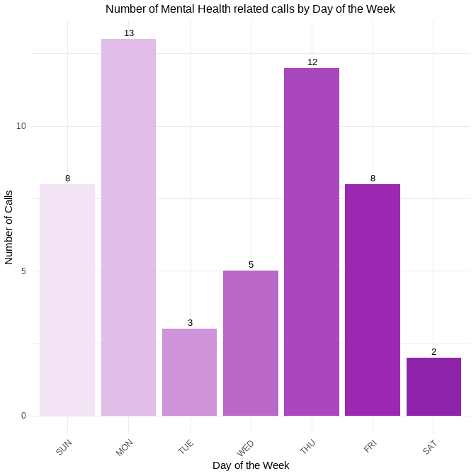

The busiest day of the week for mental health calls was Monday with 13 service calls.

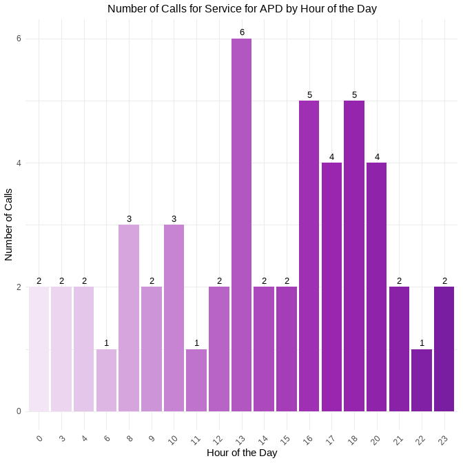

Most of these calls arrived, for this past week, in the late mornings through evenings. Again, should this data prove to be part of a trend, then we should adjust the availability of repsonders to address the community's needs.


This week, most of our mental health calls Phone Further analysis could be understaken to determine if any of these are transfer calls from our local 988 provider partner.


The most used call type was MENTAL HEALTH CASE which is expected.


Since MENTAL HEALTH CASE was the most used call type and is a P2 call, Priority 2 is the most used priority. The question, in the future, will be does these calls need to changed to a higher priority?

<div class="tabwid"><style>.cl-b379661e{}.cl-b36fff20{font-family:'Arial';font-size:9pt;font-weight:bold;font-style:normal;text-decoration:none;color:rgba(0, 0, 0, 1.00);background-color:transparent;}.cl-b36fff2a{font-family:'Arial';font-size:9pt;font-weight:normal;font-style:normal;text-decoration:none;color:rgba(0, 0, 0, 1.00);background-color:transparent;}.cl-b373d104{margin:0;text-align:left;border-bottom: 0 solid rgba(0, 0, 0, 1.00);border-top: 0 solid rgba(0, 0, 0, 1.00);border-left: 0 solid rgba(0, 0, 0, 1.00);border-right: 0 solid rgba(0, 0, 0, 1.00);padding-bottom:3pt;padding-top:3pt;padding-left:3pt;padding-right:3pt;line-height: 1;background-color:transparent;}.cl-b373d118{margin:0;text-align:right;border-bottom: 0 solid rgba(0, 0, 0, 1.00);border-top: 0 solid rgba(0, 0, 0, 1.00);border-left: 0 solid rgba(0, 0, 0, 1.00);border-right: 0 solid rgba(0, 0, 0, 1.00);padding-bottom:3pt;padding-top:3pt;padding-left:3pt;padding-right:3pt;line-height: 1;background-color:transparent;}.cl-b373f832{width:1.191in;background-color:transparent;vertical-align: middle;border-bottom: 1.5pt solid rgba(102, 102, 102, 1.00);border-top: 1.5pt solid rgba(102, 102, 102, 1.00);border-left: 0 solid rgba(0, 0, 0, 1.00);border-right: 0 solid rgba(0, 0, 0, 1.00);margin-bottom:0;margin-top:0;margin-left:0;margin-right:0;}.cl-b373f83c{width:0.426in;background-color:transparent;vertical-align: middle;border-bottom: 1.5pt solid rgba(102, 102, 102, 1.00);border-top: 1.5pt solid rgba(102, 102, 102, 1.00);border-left: 0 solid rgba(0, 0, 0, 1.00);border-right: 0 solid rgba(0, 0, 0, 1.00);margin-bottom:0;margin-top:0;margin-left:0;margin-right:0;}.cl-b373f83d{width:0.767in;background-color:transparent;vertical-align: middle;border-bottom: 1.5pt solid rgba(102, 102, 102, 1.00);border-top: 1.5pt solid rgba(102, 102, 102, 1.00);border-left: 0 solid rgba(0, 0, 0, 1.00);border-right: 0 solid rgba(0, 0, 0, 1.00);margin-bottom:0;margin-top:0;margin-left:0;margin-right:0;}.cl-b373f846{width:0.642in;background-color:transparent;vertical-align: middle;border-bottom: 1.5pt solid rgba(102, 102, 102, 1.00);border-top: 1.5pt solid rgba(102, 102, 102, 1.00);border-left: 0 solid rgba(0, 0, 0, 1.00);border-right: 0 solid rgba(0, 0, 0, 1.00);margin-bottom:0;margin-top:0;margin-left:0;margin-right:0;}.cl-b373f850{width:1.191in;background-color:rgba(245, 245, 245, 1.00);vertical-align: middle;border-bottom: 0 solid rgba(0, 0, 0, 1.00);border-top: 0 solid rgba(0, 0, 0, 1.00);border-left: 0 solid rgba(0, 0, 0, 1.00);border-right: 0 solid rgba(0, 0, 0, 1.00);margin-bottom:0;margin-top:0;margin-left:0;margin-right:0;}.cl-b373f851{width:0.426in;background-color:rgba(245, 245, 245, 1.00);vertical-align: middle;border-bottom: 0 solid rgba(0, 0, 0, 1.00);border-top: 0 solid rgba(0, 0, 0, 1.00);border-left: 0 solid rgba(0, 0, 0, 1.00);border-right: 0 solid rgba(0, 0, 0, 1.00);margin-bottom:0;margin-top:0;margin-left:0;margin-right:0;}.cl-b373f852{width:0.767in;background-color:rgba(245, 245, 245, 1.00);vertical-align: middle;border-bottom: 0 solid rgba(0, 0, 0, 1.00);border-top: 0 solid rgba(0, 0, 0, 1.00);border-left: 0 solid rgba(0, 0, 0, 1.00);border-right: 0 solid rgba(0, 0, 0, 1.00);margin-bottom:0;margin-top:0;margin-left:0;margin-right:0;}.cl-b373f85a{width:0.642in;background-color:rgba(245, 245, 245, 1.00);vertical-align: middle;border-bottom: 0 solid rgba(0, 0, 0, 1.00);border-top: 0 solid rgba(0, 0, 0, 1.00);border-left: 0 solid rgba(0, 0, 0, 1.00);border-right: 0 solid rgba(0, 0, 0, 1.00);margin-bottom:0;margin-top:0;margin-left:0;margin-right:0;}.cl-b373f864{width:1.191in;background-color:transparent;vertical-align: middle;border-bottom: 0 solid rgba(0, 0, 0, 1.00);border-top: 0 solid rgba(0, 0, 0, 1.00);border-left: 0 solid rgba(0, 0, 0, 1.00);border-right: 0 solid rgba(0, 0, 0, 1.00);margin-bottom:0;margin-top:0;margin-left:0;margin-right:0;}.cl-b373f865{width:0.426in;background-color:transparent;vertical-align: middle;border-bottom: 0 solid rgba(0, 0, 0, 1.00);border-top: 0 solid rgba(0, 0, 0, 1.00);border-left: 0 solid rgba(0, 0, 0, 1.00);border-right: 0 solid rgba(0, 0, 0, 1.00);margin-bottom:0;margin-top:0;margin-left:0;margin-right:0;}.cl-b373f866{width:0.767in;background-color:transparent;vertical-align: middle;border-bottom: 0 solid rgba(0, 0, 0, 1.00);border-top: 0 solid rgba(0, 0, 0, 1.00);border-left: 0 solid rgba(0, 0, 0, 1.00);border-right: 0 solid rgba(0, 0, 0, 1.00);margin-bottom:0;margin-top:0;margin-left:0;margin-right:0;}.cl-b373f86e{width:0.642in;background-color:transparent;vertical-align: middle;border-bottom: 0 solid rgba(0, 0, 0, 1.00);border-top: 0 solid rgba(0, 0, 0, 1.00);border-left: 0 solid rgba(0, 0, 0, 1.00);border-right: 0 solid rgba(0, 0, 0, 1.00);margin-bottom:0;margin-top:0;margin-left:0;margin-right:0;}.cl-b373f86f{width:1.191in;background-color:rgba(245, 245, 245, 1.00);vertical-align: middle;border-bottom: 0 solid rgba(0, 0, 0, 1.00);border-top: 0 solid rgba(0, 0, 0, 1.00);border-left: 0 solid rgba(0, 0, 0, 1.00);border-right: 0 solid rgba(0, 0, 0, 1.00);margin-bottom:0;margin-top:0;margin-left:0;margin-right:0;}.cl-b373f870{width:0.426in;background-color:rgba(245, 245, 245, 1.00);vertical-align: middle;border-bottom: 0 solid rgba(0, 0, 0, 1.00);border-top: 0 solid rgba(0, 0, 0, 1.00);border-left: 0 solid rgba(0, 0, 0, 1.00);border-right: 0 solid rgba(0, 0, 0, 1.00);margin-bottom:0;margin-top:0;margin-left:0;margin-right:0;}.cl-b373f878{width:0.767in;background-color:rgba(245, 245, 245, 1.00);vertical-align: middle;border-bottom: 0 solid rgba(0, 0, 0, 1.00);border-top: 0 solid rgba(0, 0, 0, 1.00);border-left: 0 solid rgba(0, 0, 0, 1.00);border-right: 0 solid rgba(0, 0, 0, 1.00);margin-bottom:0;margin-top:0;margin-left:0;margin-right:0;}.cl-b373f879{width:0.642in;background-color:rgba(245, 245, 245, 1.00);vertical-align: middle;border-bottom: 0 solid rgba(0, 0, 0, 1.00);border-top: 0 solid rgba(0, 0, 0, 1.00);border-left: 0 solid rgba(0, 0, 0, 1.00);border-right: 0 solid rgba(0, 0, 0, 1.00);margin-bottom:0;margin-top:0;margin-left:0;margin-right:0;}.cl-b373f87a{width:1.191in;background-color:transparent;vertical-align: middle;border-bottom: 0 solid rgba(0, 0, 0, 1.00);border-top: 0 solid rgba(0, 0, 0, 1.00);border-left: 0 solid rgba(0, 0, 0, 1.00);border-right: 0 solid rgba(0, 0, 0, 1.00);margin-bottom:0;margin-top:0;margin-left:0;margin-right:0;}.cl-b373f87b{width:0.426in;background-color:transparent;vertical-align: middle;border-bottom: 0 solid rgba(0, 0, 0, 1.00);border-top: 0 solid rgba(0, 0, 0, 1.00);border-left: 0 solid rgba(0, 0, 0, 1.00);border-right: 0 solid rgba(0, 0, 0, 1.00);margin-bottom:0;margin-top:0;margin-left:0;margin-right:0;}.cl-b373f882{width:0.767in;background-color:transparent;vertical-align: middle;border-bottom: 0 solid rgba(0, 0, 0, 1.00);border-top: 0 solid rgba(0, 0, 0, 1.00);border-left: 0 solid rgba(0, 0, 0, 1.00);border-right: 0 solid rgba(0, 0, 0, 1.00);margin-bottom:0;margin-top:0;margin-left:0;margin-right:0;}.cl-b373f883{width:0.642in;background-color:transparent;vertical-align: middle;border-bottom: 0 solid rgba(0, 0, 0, 1.00);border-top: 0 solid rgba(0, 0, 0, 1.00);border-left: 0 solid rgba(0, 0, 0, 1.00);border-right: 0 solid rgba(0, 0, 0, 1.00);margin-bottom:0;margin-top:0;margin-left:0;margin-right:0;}.cl-b373f88c{width:1.191in;background-color:transparent;vertical-align: middle;border-bottom: 0 solid rgba(0, 0, 0, 1.00);border-top: 0 solid rgba(0, 0, 0, 1.00);border-left: 0 solid rgba(0, 0, 0, 1.00);border-right: 0 solid rgba(0, 0, 0, 1.00);margin-bottom:0;margin-top:0;margin-left:0;margin-right:0;}.cl-b373f88d{width:0.426in;background-color:transparent;vertical-align: middle;border-bottom: 0 solid rgba(0, 0, 0, 1.00);border-top: 0 solid rgba(0, 0, 0, 1.00);border-left: 0 solid rgba(0, 0, 0, 1.00);border-right: 0 solid rgba(0, 0, 0, 1.00);margin-bottom:0;margin-top:0;margin-left:0;margin-right:0;}.cl-b373f88e{width:0.767in;background-color:transparent;vertical-align: middle;border-bottom: 0 solid rgba(0, 0, 0, 1.00);border-top: 0 solid rgba(0, 0, 0, 1.00);border-left: 0 solid rgba(0, 0, 0, 1.00);border-right: 0 solid rgba(0, 0, 0, 1.00);margin-bottom:0;margin-top:0;margin-left:0;margin-right:0;}.cl-b373f896{width:0.642in;background-color:transparent;vertical-align: middle;border-bottom: 0 solid rgba(0, 0, 0, 1.00);border-top: 0 solid rgba(0, 0, 0, 1.00);border-left: 0 solid rgba(0, 0, 0, 1.00);border-right: 0 solid rgba(0, 0, 0, 1.00);margin-bottom:0;margin-top:0;margin-left:0;margin-right:0;}.cl-b373f897{width:1.191in;background-color:rgba(245, 245, 245, 1.00);vertical-align: middle;border-bottom: 1.5pt solid rgba(102, 102, 102, 1.00);border-top: 0 solid rgba(0, 0, 0, 1.00);border-left: 0 solid rgba(0, 0, 0, 1.00);border-right: 0 solid rgba(0, 0, 0, 1.00);margin-bottom:0;margin-top:0;margin-left:0;margin-right:0;}.cl-b373f898{width:0.426in;background-color:rgba(245, 245, 245, 1.00);vertical-align: middle;border-bottom: 1.5pt solid rgba(102, 102, 102, 1.00);border-top: 0 solid rgba(0, 0, 0, 1.00);border-left: 0 solid rgba(0, 0, 0, 1.00);border-right: 0 solid rgba(0, 0, 0, 1.00);margin-bottom:0;margin-top:0;margin-left:0;margin-right:0;}.cl-b373f8a0{width:0.767in;background-color:rgba(245, 245, 245, 1.00);vertical-align: middle;border-bottom: 1.5pt solid rgba(102, 102, 102, 1.00);border-top: 0 solid rgba(0, 0, 0, 1.00);border-left: 0 solid rgba(0, 0, 0, 1.00);border-right: 0 solid rgba(0, 0, 0, 1.00);margin-bottom:0;margin-top:0;margin-left:0;margin-right:0;}.cl-b373f8a1{width:0.642in;background-color:rgba(245, 245, 245, 1.00);vertical-align: middle;border-bottom: 1.5pt solid rgba(102, 102, 102, 1.00);border-top: 0 solid rgba(0, 0, 0, 1.00);border-left: 0 solid rgba(0, 0, 0, 1.00);border-right: 0 solid rgba(0, 0, 0, 1.00);margin-bottom:0;margin-top:0;margin-left:0;margin-right:0;}.tabwid {
  font-size: initial;
  padding-bottom: 1em;
}

.tabwid table{
  border-spacing:0px !important;
  border-collapse:collapse;
  line-height:1;
  margin-left:auto;
  margin-right:auto;
  border-width: 0;
  border-color: transparent;
  caption-side: top;
}
.tabwid-caption-bottom table{
  caption-side: bottom;
}
.tabwid_left table{
  margin-left:0;
}
.tabwid_right table{
  margin-right:0;
}
.tabwid td, .tabwid th {
    padding: 0;
}
.tabwid a {
  text-decoration: none;
}
.tabwid thead {
    background-color: transparent;
}
.tabwid tfoot {
    background-color: transparent;
}
.tabwid table tr {
background-color: transparent;
}
.katex-display {
    margin: 0 0 !important;
}</style><table data-quarto-disable-processing='true' class='cl-b379661e'><thead><tr style="overflow-wrap:break-word;"><th class="cl-b373f832"><p class="cl-b373d104"><span class="cl-b36fff20">Time Metric</span></p></th><th class="cl-b373f83c"><p class="cl-b373d118"><span class="cl-b36fff20">Min</span></p></th><th class="cl-b373f83d"><p class="cl-b373d118"><span class="cl-b36fff20">Mean</span></p></th><th class="cl-b373f846"><p class="cl-b373d118"><span class="cl-b36fff20">Median</span></p></th></tr></thead><tbody><tr style="overflow-wrap:break-word;"><td class="cl-b373f850"><p class="cl-b373d104"><span class="cl-b36fff2a">Time To Queue</span></p></td><td class="cl-b373f851"><p class="cl-b373d118"><span class="cl-b36fff2a">0</span></p></td><td class="cl-b373f852"><p class="cl-b373d118"><span class="cl-b36fff2a">95.25</span></p></td><td class="cl-b373f85a"><p class="cl-b373d118"><span class="cl-b36fff2a">68.0</span></p></td></tr><tr style="overflow-wrap:break-word;"><td class="cl-b373f864"><p class="cl-b373d104"><span class="cl-b36fff2a">Time To Dispatch</span></p></td><td class="cl-b373f865"><p class="cl-b373d118"><span class="cl-b36fff2a">0</span></p></td><td class="cl-b373f866"><p class="cl-b373d118"><span class="cl-b36fff2a">389.67</span></p></td><td class="cl-b373f86e"><p class="cl-b373d118"><span class="cl-b36fff2a">105.0</span></p></td></tr><tr style="overflow-wrap:break-word;"><td class="cl-b373f86f"><p class="cl-b373d104"><span class="cl-b36fff2a">Phone Time</span></p></td><td class="cl-b373f870"><p class="cl-b373d118"><span class="cl-b36fff2a">0</span></p></td><td class="cl-b373f878"><p class="cl-b373d118"><span class="cl-b36fff2a">377.06</span></p></td><td class="cl-b373f879"><p class="cl-b373d118"><span class="cl-b36fff2a">289.0</span></p></td></tr><tr style="overflow-wrap:break-word;"><td class="cl-b373f87a"><p class="cl-b373d104"><span class="cl-b36fff2a">Processing Time</span></p></td><td class="cl-b373f87b"><p class="cl-b373d118"><span class="cl-b36fff2a">0</span></p></td><td class="cl-b373f882"><p class="cl-b373d118"><span class="cl-b36fff2a">484.92</span></p></td><td class="cl-b373f883"><p class="cl-b373d118"><span class="cl-b36fff2a">216.0</span></p></td></tr><tr style="overflow-wrap:break-word;"><td class="cl-b373f86f"><p class="cl-b373d104"><span class="cl-b36fff2a">Rollout Time</span></p></td><td class="cl-b373f870"><p class="cl-b373d118"><span class="cl-b36fff2a">0</span></p></td><td class="cl-b373f878"><p class="cl-b373d118"><span class="cl-b36fff2a">11.37</span></p></td><td class="cl-b373f879"><p class="cl-b373d118"><span class="cl-b36fff2a">3.0</span></p></td></tr><tr style="overflow-wrap:break-word;"><td class="cl-b373f88c"><p class="cl-b373d104"><span class="cl-b36fff2a">Transit Time</span></p></td><td class="cl-b373f88d"><p class="cl-b373d118"><span class="cl-b36fff2a">0</span></p></td><td class="cl-b373f88e"><p class="cl-b373d118"><span class="cl-b36fff2a">658.04</span></p></td><td class="cl-b373f896"><p class="cl-b373d118"><span class="cl-b36fff2a">286.5</span></p></td></tr><tr style="overflow-wrap:break-word;"><td class="cl-b373f897"><p class="cl-b373d104"><span class="cl-b36fff2a">Total Call Time</span></p></td><td class="cl-b373f898"><p class="cl-b373d118"><span class="cl-b36fff2a">540</span></p></td><td class="cl-b373f8a0"><p class="cl-b373d118"><span class="cl-b36fff2a">10,821.88</span></p></td><td class="cl-b373f8a1"><p class="cl-b373d118"><span class="cl-b36fff2a">4,245.0</span></p></td></tr></tbody></table></div>

Processing times for these calls are longer, somewhere around 216 seconds. There are several factors that can impact this. The time to make it dispatchable was longer, implying that with these types of calls, it take calltakers longer to get the information necessary in the initial triage to accurately locate and classify the call. Another possible issue, in reviewing the dispatch times is that these calls require specialized training and skill sets on the part of the field responders. If those responders are already assigned to other calls, this could create the delay as seen here. As these values change over time, we should be able to build better pictures and determine the delay points and create strategies to ameliorate them.

### Call Source Unrecorded

As discussed earlier in the document, there are 46 calls where the call reception method was not recorded. In order to determine if there are any operational issues behind this, we can deep dive into these calls and see what information we can obtain from them.

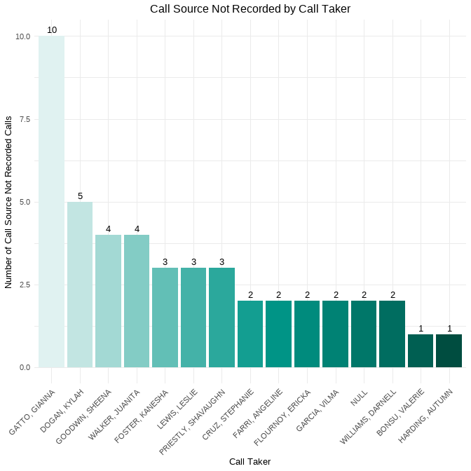

There are a few calltakers with more than one call where the call source went unrecorded. GATTO, GIANNA had the most calls without recording the source with 10 calls. We should look into those calls to see what additional factors exist that caused this to occur and work to address those.

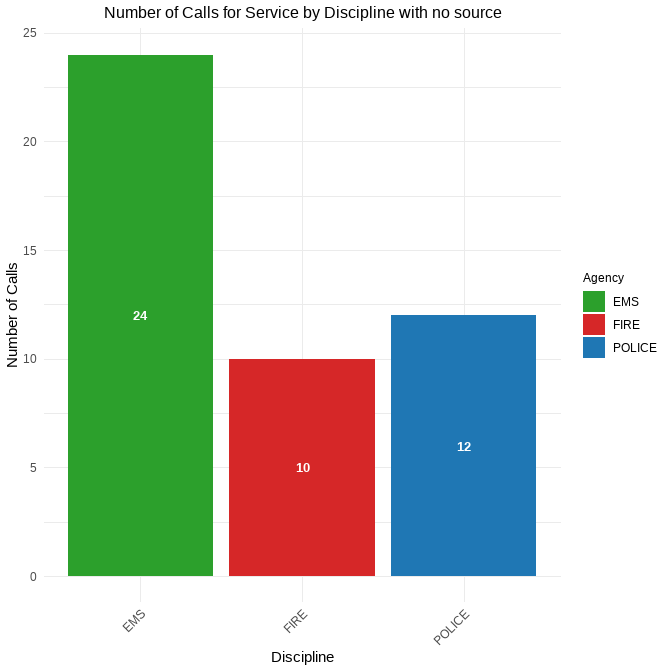

The majority of calls with no source were for EMS with 24 calls for service. This week, that is substatially higher than the other two agencies combined.

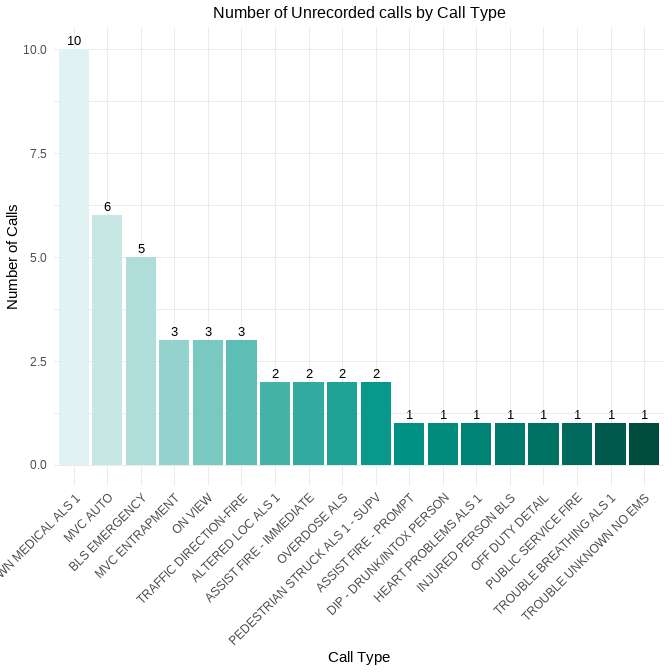

### Hybrid Call Takers

This week, the hybrid call takers took 333 calls compared to 282 calls last week. The following bar chart shows the distribution of calls taken by the hybrid call takers.

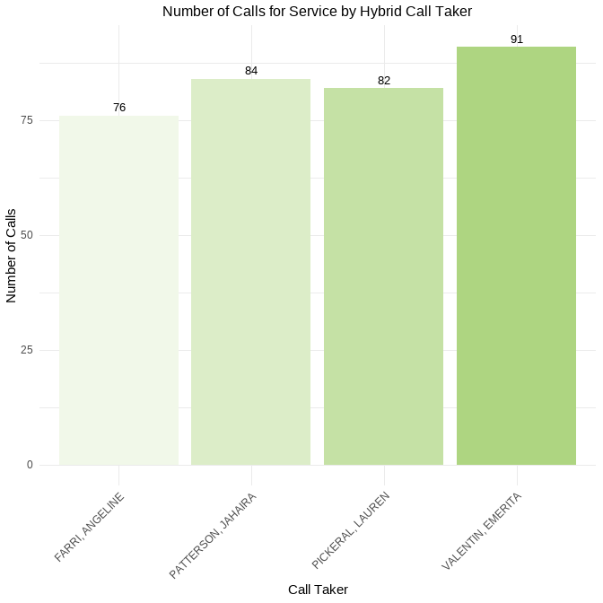

From this we can see that VALENTIN, EMERITA took the most calls among the hybrid call takers with 91 calls for service. 

This chart will show the number of calls taken by call reception type. There should be very few E-911 calls present in this bar chart.

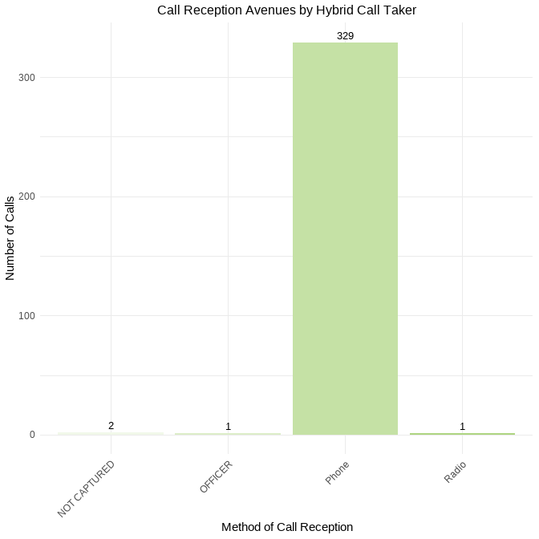

This chart shows that Phone was the method by which the Hybrid Call Takers received the most calls with 329 calls for service. This represents 98.8% of calls received by the hybrid call takers. 

The hybrid call takers answered 0 911 trunk line calls this week, compared to 4 calls last week.

The summary table below shows the number of calls with the mean and median times to get a call to queue and the times on the phone for the hybrid call takers.

<div class="tabwid"><style>.cl-b4a89a46{}.cl-b49cfb0a{font-family:'Arial';font-size:9pt;font-weight:bold;font-style:normal;text-decoration:none;color:rgba(0, 0, 0, 1.00);background-color:transparent;}.cl-b49cfb14{font-family:'Arial';font-size:9pt;font-weight:normal;font-style:normal;text-decoration:none;color:rgba(0, 0, 0, 1.00);background-color:transparent;}.cl-b4a1205e{margin:0;text-align:left;border-bottom: 0 solid rgba(0, 0, 0, 1.00);border-top: 0 solid rgba(0, 0, 0, 1.00);border-left: 0 solid rgba(0, 0, 0, 1.00);border-right: 0 solid rgba(0, 0, 0, 1.00);padding-bottom:3pt;padding-top:3pt;padding-left:3pt;padding-right:3pt;line-height: 1;background-color:transparent;}.cl-b4a12068{margin:0;text-align:right;border-bottom: 0 solid rgba(0, 0, 0, 1.00);border-top: 0 solid rgba(0, 0, 0, 1.00);border-left: 0 solid rgba(0, 0, 0, 1.00);border-right: 0 solid rgba(0, 0, 0, 1.00);padding-bottom:3pt;padding-top:3pt;padding-left:3pt;padding-right:3pt;line-height: 1;background-color:transparent;}.cl-b4a149bc{width:1.572in;background-color:transparent;vertical-align: middle;border-bottom: 1.5pt solid rgba(102, 102, 102, 1.00);border-top: 1.5pt solid rgba(102, 102, 102, 1.00);border-left: 0 solid rgba(0, 0, 0, 1.00);border-right: 0 solid rgba(0, 0, 0, 1.00);margin-bottom:0;margin-top:0;margin-left:0;margin-right:0;}.cl-b4a149c6{width:0.51in;background-color:transparent;vertical-align: middle;border-bottom: 1.5pt solid rgba(102, 102, 102, 1.00);border-top: 1.5pt solid rgba(102, 102, 102, 1.00);border-left: 0 solid rgba(0, 0, 0, 1.00);border-right: 0 solid rgba(0, 0, 0, 1.00);margin-bottom:0;margin-top:0;margin-left:0;margin-right:0;}.cl-b4a149d0{width:1.142in;background-color:transparent;vertical-align: middle;border-bottom: 1.5pt solid rgba(102, 102, 102, 1.00);border-top: 1.5pt solid rgba(102, 102, 102, 1.00);border-left: 0 solid rgba(0, 0, 0, 1.00);border-right: 0 solid rgba(0, 0, 0, 1.00);margin-bottom:0;margin-top:0;margin-left:0;margin-right:0;}.cl-b4a149d1{width:1.253in;background-color:transparent;vertical-align: middle;border-bottom: 1.5pt solid rgba(102, 102, 102, 1.00);border-top: 1.5pt solid rgba(102, 102, 102, 1.00);border-left: 0 solid rgba(0, 0, 0, 1.00);border-right: 0 solid rgba(0, 0, 0, 1.00);margin-bottom:0;margin-top:0;margin-left:0;margin-right:0;}.cl-b4a149d2{width:1.274in;background-color:transparent;vertical-align: middle;border-bottom: 1.5pt solid rgba(102, 102, 102, 1.00);border-top: 1.5pt solid rgba(102, 102, 102, 1.00);border-left: 0 solid rgba(0, 0, 0, 1.00);border-right: 0 solid rgba(0, 0, 0, 1.00);margin-bottom:0;margin-top:0;margin-left:0;margin-right:0;}.cl-b4a149da{width:1.385in;background-color:transparent;vertical-align: middle;border-bottom: 1.5pt solid rgba(102, 102, 102, 1.00);border-top: 1.5pt solid rgba(102, 102, 102, 1.00);border-left: 0 solid rgba(0, 0, 0, 1.00);border-right: 0 solid rgba(0, 0, 0, 1.00);margin-bottom:0;margin-top:0;margin-left:0;margin-right:0;}.cl-b4a149db{width:1.572in;background-color:rgba(245, 245, 245, 1.00);vertical-align: middle;border-bottom: 0 solid rgba(0, 0, 0, 1.00);border-top: 0 solid rgba(0, 0, 0, 1.00);border-left: 0 solid rgba(0, 0, 0, 1.00);border-right: 0 solid rgba(0, 0, 0, 1.00);margin-bottom:0;margin-top:0;margin-left:0;margin-right:0;}.cl-b4a149e4{width:0.51in;background-color:rgba(245, 245, 245, 1.00);vertical-align: middle;border-bottom: 0 solid rgba(0, 0, 0, 1.00);border-top: 0 solid rgba(0, 0, 0, 1.00);border-left: 0 solid rgba(0, 0, 0, 1.00);border-right: 0 solid rgba(0, 0, 0, 1.00);margin-bottom:0;margin-top:0;margin-left:0;margin-right:0;}.cl-b4a149e5{width:1.142in;background-color:rgba(245, 245, 245, 1.00);vertical-align: middle;border-bottom: 0 solid rgba(0, 0, 0, 1.00);border-top: 0 solid rgba(0, 0, 0, 1.00);border-left: 0 solid rgba(0, 0, 0, 1.00);border-right: 0 solid rgba(0, 0, 0, 1.00);margin-bottom:0;margin-top:0;margin-left:0;margin-right:0;}.cl-b4a149e6{width:1.253in;background-color:rgba(245, 245, 245, 1.00);vertical-align: middle;border-bottom: 0 solid rgba(0, 0, 0, 1.00);border-top: 0 solid rgba(0, 0, 0, 1.00);border-left: 0 solid rgba(0, 0, 0, 1.00);border-right: 0 solid rgba(0, 0, 0, 1.00);margin-bottom:0;margin-top:0;margin-left:0;margin-right:0;}.cl-b4a149ee{width:1.274in;background-color:rgba(245, 245, 245, 1.00);vertical-align: middle;border-bottom: 0 solid rgba(0, 0, 0, 1.00);border-top: 0 solid rgba(0, 0, 0, 1.00);border-left: 0 solid rgba(0, 0, 0, 1.00);border-right: 0 solid rgba(0, 0, 0, 1.00);margin-bottom:0;margin-top:0;margin-left:0;margin-right:0;}.cl-b4a149f8{width:1.385in;background-color:rgba(245, 245, 245, 1.00);vertical-align: middle;border-bottom: 0 solid rgba(0, 0, 0, 1.00);border-top: 0 solid rgba(0, 0, 0, 1.00);border-left: 0 solid rgba(0, 0, 0, 1.00);border-right: 0 solid rgba(0, 0, 0, 1.00);margin-bottom:0;margin-top:0;margin-left:0;margin-right:0;}.cl-b4a14a02{width:1.572in;background-color:transparent;vertical-align: middle;border-bottom: 0 solid rgba(0, 0, 0, 1.00);border-top: 0 solid rgba(0, 0, 0, 1.00);border-left: 0 solid rgba(0, 0, 0, 1.00);border-right: 0 solid rgba(0, 0, 0, 1.00);margin-bottom:0;margin-top:0;margin-left:0;margin-right:0;}.cl-b4a14a03{width:0.51in;background-color:transparent;vertical-align: middle;border-bottom: 0 solid rgba(0, 0, 0, 1.00);border-top: 0 solid rgba(0, 0, 0, 1.00);border-left: 0 solid rgba(0, 0, 0, 1.00);border-right: 0 solid rgba(0, 0, 0, 1.00);margin-bottom:0;margin-top:0;margin-left:0;margin-right:0;}.cl-b4a14a0c{width:1.142in;background-color:transparent;vertical-align: middle;border-bottom: 0 solid rgba(0, 0, 0, 1.00);border-top: 0 solid rgba(0, 0, 0, 1.00);border-left: 0 solid rgba(0, 0, 0, 1.00);border-right: 0 solid rgba(0, 0, 0, 1.00);margin-bottom:0;margin-top:0;margin-left:0;margin-right:0;}.cl-b4a14a16{width:1.253in;background-color:transparent;vertical-align: middle;border-bottom: 0 solid rgba(0, 0, 0, 1.00);border-top: 0 solid rgba(0, 0, 0, 1.00);border-left: 0 solid rgba(0, 0, 0, 1.00);border-right: 0 solid rgba(0, 0, 0, 1.00);margin-bottom:0;margin-top:0;margin-left:0;margin-right:0;}.cl-b4a14a17{width:1.274in;background-color:transparent;vertical-align: middle;border-bottom: 0 solid rgba(0, 0, 0, 1.00);border-top: 0 solid rgba(0, 0, 0, 1.00);border-left: 0 solid rgba(0, 0, 0, 1.00);border-right: 0 solid rgba(0, 0, 0, 1.00);margin-bottom:0;margin-top:0;margin-left:0;margin-right:0;}.cl-b4a14a20{width:1.385in;background-color:transparent;vertical-align: middle;border-bottom: 0 solid rgba(0, 0, 0, 1.00);border-top: 0 solid rgba(0, 0, 0, 1.00);border-left: 0 solid rgba(0, 0, 0, 1.00);border-right: 0 solid rgba(0, 0, 0, 1.00);margin-bottom:0;margin-top:0;margin-left:0;margin-right:0;}.cl-b4a14a21{width:1.572in;background-color:transparent;vertical-align: middle;border-bottom: 1.5pt solid rgba(102, 102, 102, 1.00);border-top: 0 solid rgba(0, 0, 0, 1.00);border-left: 0 solid rgba(0, 0, 0, 1.00);border-right: 0 solid rgba(0, 0, 0, 1.00);margin-bottom:0;margin-top:0;margin-left:0;margin-right:0;}.cl-b4a14a22{width:0.51in;background-color:transparent;vertical-align: middle;border-bottom: 1.5pt solid rgba(102, 102, 102, 1.00);border-top: 0 solid rgba(0, 0, 0, 1.00);border-left: 0 solid rgba(0, 0, 0, 1.00);border-right: 0 solid rgba(0, 0, 0, 1.00);margin-bottom:0;margin-top:0;margin-left:0;margin-right:0;}.cl-b4a14a2a{width:1.142in;background-color:transparent;vertical-align: middle;border-bottom: 1.5pt solid rgba(102, 102, 102, 1.00);border-top: 0 solid rgba(0, 0, 0, 1.00);border-left: 0 solid rgba(0, 0, 0, 1.00);border-right: 0 solid rgba(0, 0, 0, 1.00);margin-bottom:0;margin-top:0;margin-left:0;margin-right:0;}.cl-b4a14a2b{width:1.253in;background-color:transparent;vertical-align: middle;border-bottom: 1.5pt solid rgba(102, 102, 102, 1.00);border-top: 0 solid rgba(0, 0, 0, 1.00);border-left: 0 solid rgba(0, 0, 0, 1.00);border-right: 0 solid rgba(0, 0, 0, 1.00);margin-bottom:0;margin-top:0;margin-left:0;margin-right:0;}.cl-b4a14a2c{width:1.274in;background-color:transparent;vertical-align: middle;border-bottom: 1.5pt solid rgba(102, 102, 102, 1.00);border-top: 0 solid rgba(0, 0, 0, 1.00);border-left: 0 solid rgba(0, 0, 0, 1.00);border-right: 0 solid rgba(0, 0, 0, 1.00);margin-bottom:0;margin-top:0;margin-left:0;margin-right:0;}.cl-b4a14a34{width:1.385in;background-color:transparent;vertical-align: middle;border-bottom: 1.5pt solid rgba(102, 102, 102, 1.00);border-top: 0 solid rgba(0, 0, 0, 1.00);border-left: 0 solid rgba(0, 0, 0, 1.00);border-right: 0 solid rgba(0, 0, 0, 1.00);margin-bottom:0;margin-top:0;margin-left:0;margin-right:0;}.tabwid {
  font-size: initial;
  padding-bottom: 1em;
}

.tabwid table{
  border-spacing:0px !important;
  border-collapse:collapse;
  line-height:1;
  margin-left:auto;
  margin-right:auto;
  border-width: 0;
  border-color: transparent;
  caption-side: top;
}
.tabwid-caption-bottom table{
  caption-side: bottom;
}
.tabwid_left table{
  margin-left:0;
}
.tabwid_right table{
  margin-right:0;
}
.tabwid td, .tabwid th {
    padding: 0;
}
.tabwid a {
  text-decoration: none;
}
.tabwid thead {
    background-color: transparent;
}
.tabwid tfoot {
    background-color: transparent;
}
.tabwid table tr {
background-color: transparent;
}
.katex-display {
    margin: 0 0 !important;
}</style><table data-quarto-disable-processing='true' class='cl-b4a89a46'><thead><tr style="overflow-wrap:break-word;"><th class="cl-b4a149bc"><p class="cl-b4a1205e"><span class="cl-b49cfb0a">Call_Taker</span></p></th><th class="cl-b4a149c6"><p class="cl-b4a12068"><span class="cl-b49cfb0a">Calls</span></p></th><th class="cl-b4a149d0"><p class="cl-b4a12068"><span class="cl-b49cfb0a">Mean TTQ (sec)</span></p></th><th class="cl-b4a149d1"><p class="cl-b4a12068"><span class="cl-b49cfb0a">Median TTQ (sec)</span></p></th><th class="cl-b4a149d2"><p class="cl-b4a12068"><span class="cl-b49cfb0a">Mean Phone (sec)</span></p></th><th class="cl-b4a149da"><p class="cl-b4a12068"><span class="cl-b49cfb0a">Median Phone (sec)</span></p></th></tr></thead><tbody><tr style="overflow-wrap:break-word;"><td class="cl-b4a149db"><p class="cl-b4a1205e"><span class="cl-b49cfb14">FARRI, ANGELINE</span></p></td><td class="cl-b4a149e4"><p class="cl-b4a12068"><span class="cl-b49cfb14">76</span></p></td><td class="cl-b4a149e5"><p class="cl-b4a12068"><span class="cl-b49cfb14">77.47</span></p></td><td class="cl-b4a149e6"><p class="cl-b4a12068"><span class="cl-b49cfb14">54</span></p></td><td class="cl-b4a149ee"><p class="cl-b4a12068"><span class="cl-b49cfb14">231.49</span></p></td><td class="cl-b4a149f8"><p class="cl-b4a12068"><span class="cl-b49cfb14">136.5</span></p></td></tr><tr style="overflow-wrap:break-word;"><td class="cl-b4a14a02"><p class="cl-b4a1205e"><span class="cl-b49cfb14">PATTERSON, JAHAIRA</span></p></td><td class="cl-b4a14a03"><p class="cl-b4a12068"><span class="cl-b49cfb14">84</span></p></td><td class="cl-b4a14a0c"><p class="cl-b4a12068"><span class="cl-b49cfb14">72.56</span></p></td><td class="cl-b4a14a16"><p class="cl-b4a12068"><span class="cl-b49cfb14">41</span></p></td><td class="cl-b4a14a17"><p class="cl-b4a12068"><span class="cl-b49cfb14">410.35</span></p></td><td class="cl-b4a14a20"><p class="cl-b4a12068"><span class="cl-b49cfb14">128.0</span></p></td></tr><tr style="overflow-wrap:break-word;"><td class="cl-b4a149db"><p class="cl-b4a1205e"><span class="cl-b49cfb14">PICKERAL, LAUREN</span></p></td><td class="cl-b4a149e4"><p class="cl-b4a12068"><span class="cl-b49cfb14">82</span></p></td><td class="cl-b4a149e5"><p class="cl-b4a12068"><span class="cl-b49cfb14">55.98</span></p></td><td class="cl-b4a149e6"><p class="cl-b4a12068"><span class="cl-b49cfb14">46</span></p></td><td class="cl-b4a149ee"><p class="cl-b4a12068"><span class="cl-b49cfb14">132.12</span></p></td><td class="cl-b4a149f8"><p class="cl-b4a12068"><span class="cl-b49cfb14">94.0</span></p></td></tr><tr style="overflow-wrap:break-word;"><td class="cl-b4a14a21"><p class="cl-b4a1205e"><span class="cl-b49cfb14">VALENTIN, EMERITA</span></p></td><td class="cl-b4a14a22"><p class="cl-b4a12068"><span class="cl-b49cfb14">91</span></p></td><td class="cl-b4a14a2a"><p class="cl-b4a12068"><span class="cl-b49cfb14">129.26</span></p></td><td class="cl-b4a14a2b"><p class="cl-b4a12068"><span class="cl-b49cfb14">82</span></p></td><td class="cl-b4a14a2c"><p class="cl-b4a12068"><span class="cl-b49cfb14">500.76</span></p></td><td class="cl-b4a14a34"><p class="cl-b4a12068"><span class="cl-b49cfb14">212.0</span></p></td></tr></tbody></table></div>

This shows, from this information, that VALENTIN, EMERITA had the largest median time to get a call into queue at 82 seconds and VALENTIN, EMERITA had the largest median time on the phone at 212 seconds. In this case, the same hybrid call taker took the least number of calls for the week. This could be something that the supervisors will want to monitor.

## Outlier Identification

The calls in this set have been identified as outliers using four methods. The first is called the 'Z-score' method. This method calculates the number of standard deviations the observation is from the mean. When that number is greater than 3 or less than -3, the observation will be flagged as an outlier. The second method uses the Interquartile range (IQR), or the distance between the 25th and 75th percentiles. Each row is evaluated to see if the column in question contains a value that is greater than 1.5 times the IQR above the 75th percentile or less than 1.5 times the IQR below the 25th percentile.
The third is called the Hampel identifier. This method uses the median and the median absolute deviation (MAD) to identify outliers. The MAD is multiplied by 3 and added to and subtracted from the median to create upper and lower bounds for the data. Any value outside of these bounds is flagged as an outlier. This method is more robust than the Z-score method as it is less affected by extreme values in the data. This method was included because this data is non-parametric and we are relying on the median values in our reports. A final test that is used occasionally is to identify the rows that are in the 1st and 99th percentiles for the column in question. Each of these methods has advantages and disadvantages in use. Additionally, the IQR can pre-suppose a normal distribution of data, which as can be seen above, does not exist in our datasets. The output of this test should identify rows with values larger than the target values and very few, if any, that are lower than the target values. This is also due to the distribution of the data.

### Critical Priority Outlier Alerts


⚠️ **CRITICAL ALERT - Priority 1 Time to Queue Outliers**

The following Priority 1 calls had exceptionally long Time to Queue values:


Table: Top 5 P1 Calls by Time to Queue

|Master_Incident_Number |Agency |Problem                    |Call_Taker          | Time_To_Queue| Time_To_Dispatch|
|:----------------------|:------|:--------------------------|:-------------------|-------------:|----------------:|
|25-093640              |POLICE |MISSING PERSON CRITICAL    |PRIESTLY, SHAVAUGHN |           417|               53|
|25-094279              |POLICE |SUICIDE IN PROG NO INJ     |WILLIAMS, DARNELL   |           284|               28|
|25-026503              |EMS    |UNKNOWN MEDICAL ALS 1      |FARRI, ANGELINE     |           268|                2|
|25-026802              |EMS    |CARDIAC ARREST ALS 2- SUPV |PEREZ, CARLOS       |           206|                3|
|25-026728              |EMS    |UNKNOWN MEDICAL ALS 1      |CRUZ, STEPHANIE     |           182|                2|


⚠️ **CRITICAL ALERT - Priority 1 Time to Dispatch Outliers**

The following Priority 1 calls had exceptionally long Time to Dispatch values:


Table: Top 5 P1 Calls by Time to Dispatch

|Master_Incident_Number |Agency |Problem                      |Dispatcher       | Time_To_Queue| Time_To_Dispatch|
|:----------------------|:------|:----------------------------|:----------------|-------------:|----------------:|
|25-094476              |POLICE |MENTAL HEALTH CASE           |NULL             |            66|              471|
|25-094250              |POLICE |BURGLARY RESIDENTIAL IN PROG |NULL             |           137|              318|
|25-092500              |POLICE |TROUBLE UNKNOWN EMS          |FLOURNOY, ERICKA |            64|              289|
|25-093895              |POLICE |SUICIDE IN PROG NO INJ       |BONSU, VALERIE   |             0|              180|
|25-092564              |POLICE |DOMESTIC VIOL NO INJ         |NULL             |            39|              177|


⚠️ **WARNING - Priority 2 Time to Queue Outliers**

The following Priority 2 calls had exceptionally long Time to Queue values:


Table: Top 5 P2 Calls by Time to Queue

|Master_Incident_Number |Agency |Problem               |Call_Taker         | Time_To_Queue| Time_To_Dispatch|
|:----------------------|:------|:---------------------|:------------------|-------------:|----------------:|
|25-093421              |POLICE |ANIMAL STRAY          |VALENTIN, EMERITA  |          2071|               35|
|25-092609              |POLICE |DISORDERLY CONDUCT    |FOSTER, KANESHA    |          1043|              162|
|25-094377              |POLICE |WARRANT SERVICE       |PEREZ, CARLOS      |           431|              295|
|25-092551              |POLICE |MENTAL HEALTH CASE    |WALKER, KAREN      |           427|              168|
|25-093215              |POLICE |ASSIST OUTSIDE AGENCY |PATTERSON, JAHAIRA |           419|             1460|


⚠️ **WARNING - Priority 2 Time to Dispatch Outliers**

The following Priority 2 calls had exceptionally long Time to Dispatch values:


Table: Top 5 P2 Calls by Time to Dispatch

|Master_Incident_Number |Agency |Problem               |Dispatcher          | Time_To_Queue| Time_To_Dispatch|
|:----------------------|:------|:---------------------|:-------------------|-------------:|----------------:|
|25-093552              |POLICE |SHOPLIFTING IN PROG   |NULL                |            32|            59714|
|25-094523              |POLICE |WARRANT SERVICE       |NULL                |            17|            18318|
|25-093207              |POLICE |WARRANT SERVICE       |NULL                |           188|            18010|
|25-093601              |POLICE |ASSIST OUTSIDE AGENCY |PRIESTLY, SHAVAUGHN |           154|            16085|
|25-093569              |POLICE |WARRANT SERVICE       |GATTO, GIANNA       |           117|            14671|


**Recommendation:** Review these incidents to identify root causes and implement corrective actions to prevent recurrence.

### General Outlier Analysis


This filter identified 48 rows that should be investigated as outliers. We can now look at those calls specifically and examine them in detail to see why these have been collected in our outlier set. If we wish to separate out each of the different metrics, we can separate out each of the four elapsed time measures and look at their specific details. This table shows the number of outliers in each category. Please note that the individual categories may total more than the number of outliers reported in the combined dataset. A call may be considered an outlier in more than one category.

| Category | Outlier Count |
| :------: | :-----------: |
| Time To Queue | 3 |
| Time To Dispatch | 19 |
| Phone Time | 30 |
| Processing Time | 18 |

The volumes for each category are interesting and future analyses may give insights into different factors. Further analyses of these calls wil occur below to enhance our understanding of the information contained in these datasets.

This table will show the ranges that are used to determine which calls are considered outliers and which are not. Please note that calls that appear in the count and analyses have been identified as outliers have been identified as such in four separate tests. The only one that will not be reflected in the table below is the Z-score. That score measures the number of standard deviations from the mean for the value. All calls with a Z-score > 3 are considered possible outliers, since 99% of data should be within 3 standard deviations of the mean.

The three measures included in this table are the Percentile Tests which measures the most extreme values by identifying the calls below the 2.5th percentile or above the 97.5th percentile, the Interquartile Range which uses the 25th and 75th percentiles to calculate the range, then identifies values that are less than 1.5 times that range from the 25th percentile or greater than 1.5 times that range from the 75th percentile, and finally the Hampel Metric. This measure sets bounds at 3 times the median absolute deviation from the median, so it's similar to the Z-score.  

| Category | Percentile Lower | Percentile Upper | IQR Lower | IQR Upper | Hampel Lower | Hampel Upper |
| :--- | :--- | :--- | :--- | :--- | :--- | :--- |
| Time To Queue | 0 | 275 | -112 | 188 | -80 | 160 |
| Time To Dispatch | 0 | 8565 | -600 | 1004 | -34 | 68 |
| Phone Time | 0 | 1227 | -384 | 640 | -258 | 516 |
| Processing Time | 0 | 8661 | -762 | 1275 | -164 | 328 |

Based on the information in the table above, all of the outlier data will come at the upper bounds of values, since the lower bounds for the interquartile range and Hampel filters are both less than zero. The largest upper bound value uses the 97.5th percentile to identify potential outliers. If we want ot change this filter in the future, it may create an increase in the number of outliers reported.

### Detailed Outliers Information


The graph shows that CARLISLE, DESTINY had the most outlier calls with 1 calls. Overall there were a small number of call takers that had outlier values in getting a call sent for dispatch.

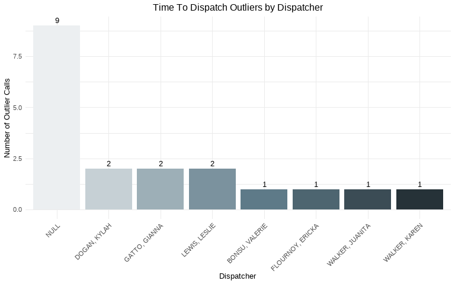

This graph shows the distribution of calls where the time to dispatch the first unit was considered to be an outlier value. It is interesting to note that NULL has the most outlier values. We should carefully examine those calls to see how this has happened, so those calls do not fall through the cracks.

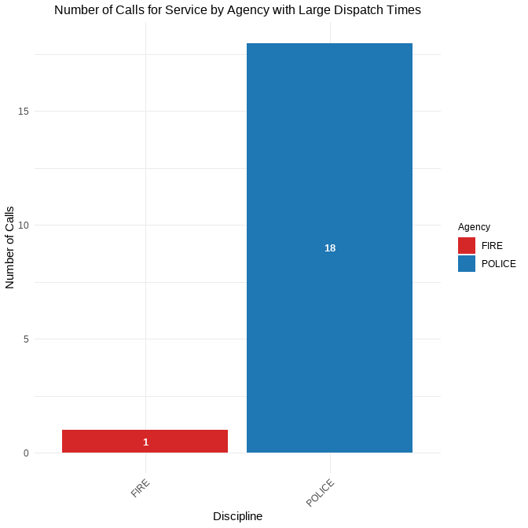

As expected, all of the calls that have an outlier in the time to dispatch the calls belonged to POLICE. This was expected because AFD FIRE and EMS calls use auto-dispatch and rarely wait for more than a few seconds.

### Outlier Impact

Below is an illustration of the impact that the outliers that we've identified have on the overall numbers we've reported.

<div class="tabwid"><style>.cl-b5bbae32{}.cl-b5b192ee{font-family:'Arial';font-size:9pt;font-weight:bold;font-style:normal;text-decoration:none;color:rgba(0, 0, 0, 1.00);background-color:transparent;}.cl-b5b19302{font-family:'Arial';font-size:9pt;font-weight:normal;font-style:normal;text-decoration:none;color:rgba(0, 0, 0, 1.00);background-color:transparent;}.cl-b5b5929a{margin:0;text-align:left;border-bottom: 0 solid rgba(0, 0, 0, 1.00);border-top: 0 solid rgba(0, 0, 0, 1.00);border-left: 0 solid rgba(0, 0, 0, 1.00);border-right: 0 solid rgba(0, 0, 0, 1.00);padding-bottom:3pt;padding-top:3pt;padding-left:3pt;padding-right:3pt;line-height: 1;background-color:transparent;}.cl-b5b592ae{margin:0;text-align:right;border-bottom: 0 solid rgba(0, 0, 0, 1.00);border-top: 0 solid rgba(0, 0, 0, 1.00);border-left: 0 solid rgba(0, 0, 0, 1.00);border-right: 0 solid rgba(0, 0, 0, 1.00);padding-bottom:3pt;padding-top:3pt;padding-left:3pt;padding-right:3pt;line-height: 1;background-color:transparent;}.cl-b5b60770{width:1.191in;background-color:transparent;vertical-align: middle;border-bottom: 1.5pt solid rgba(102, 102, 102, 1.00);border-top: 1.5pt solid rgba(102, 102, 102, 1.00);border-left: 0 solid rgba(0, 0, 0, 1.00);border-right: 0 solid rgba(0, 0, 0, 1.00);margin-bottom:0;margin-top:0;margin-left:0;margin-right:0;}.cl-b5b60784{width:0.635in;background-color:transparent;vertical-align: middle;border-bottom: 1.5pt solid rgba(102, 102, 102, 1.00);border-top: 1.5pt solid rgba(102, 102, 102, 1.00);border-left: 0 solid rgba(0, 0, 0, 1.00);border-right: 0 solid rgba(0, 0, 0, 1.00);margin-bottom:0;margin-top:0;margin-left:0;margin-right:0;}.cl-b5b6078e{width:0.698in;background-color:transparent;vertical-align: middle;border-bottom: 1.5pt solid rgba(102, 102, 102, 1.00);border-top: 1.5pt solid rgba(102, 102, 102, 1.00);border-left: 0 solid rgba(0, 0, 0, 1.00);border-right: 0 solid rgba(0, 0, 0, 1.00);margin-bottom:0;margin-top:0;margin-left:0;margin-right:0;}.cl-b5b6078f{width:0.642in;background-color:transparent;vertical-align: middle;border-bottom: 1.5pt solid rgba(102, 102, 102, 1.00);border-top: 1.5pt solid rgba(102, 102, 102, 1.00);border-left: 0 solid rgba(0, 0, 0, 1.00);border-right: 0 solid rgba(0, 0, 0, 1.00);margin-bottom:0;margin-top:0;margin-left:0;margin-right:0;}.cl-b5b60798{width:0.531in;background-color:transparent;vertical-align: middle;border-bottom: 1.5pt solid rgba(102, 102, 102, 1.00);border-top: 1.5pt solid rgba(102, 102, 102, 1.00);border-left: 0 solid rgba(0, 0, 0, 1.00);border-right: 0 solid rgba(0, 0, 0, 1.00);margin-bottom:0;margin-top:0;margin-left:0;margin-right:0;}.cl-b5b60799{width:1.191in;background-color:rgba(245, 245, 245, 1.00);vertical-align: middle;border-bottom: 0 solid rgba(0, 0, 0, 1.00);border-top: 0 solid rgba(0, 0, 0, 1.00);border-left: 0 solid rgba(0, 0, 0, 1.00);border-right: 0 solid rgba(0, 0, 0, 1.00);margin-bottom:0;margin-top:0;margin-left:0;margin-right:0;}.cl-b5b607a2{width:0.635in;background-color:rgba(245, 245, 245, 1.00);vertical-align: middle;border-bottom: 0 solid rgba(0, 0, 0, 1.00);border-top: 0 solid rgba(0, 0, 0, 1.00);border-left: 0 solid rgba(0, 0, 0, 1.00);border-right: 0 solid rgba(0, 0, 0, 1.00);margin-bottom:0;margin-top:0;margin-left:0;margin-right:0;}.cl-b5b607a3{width:0.698in;background-color:rgba(245, 245, 245, 1.00);vertical-align: middle;border-bottom: 0 solid rgba(0, 0, 0, 1.00);border-top: 0 solid rgba(0, 0, 0, 1.00);border-left: 0 solid rgba(0, 0, 0, 1.00);border-right: 0 solid rgba(0, 0, 0, 1.00);margin-bottom:0;margin-top:0;margin-left:0;margin-right:0;}.cl-b5b607a4{width:0.642in;background-color:rgba(245, 245, 245, 1.00);vertical-align: middle;border-bottom: 0 solid rgba(0, 0, 0, 1.00);border-top: 0 solid rgba(0, 0, 0, 1.00);border-left: 0 solid rgba(0, 0, 0, 1.00);border-right: 0 solid rgba(0, 0, 0, 1.00);margin-bottom:0;margin-top:0;margin-left:0;margin-right:0;}.cl-b5b607ac{width:0.531in;background-color:rgba(245, 245, 245, 1.00);vertical-align: middle;border-bottom: 0 solid rgba(0, 0, 0, 1.00);border-top: 0 solid rgba(0, 0, 0, 1.00);border-left: 0 solid rgba(0, 0, 0, 1.00);border-right: 0 solid rgba(0, 0, 0, 1.00);margin-bottom:0;margin-top:0;margin-left:0;margin-right:0;}.cl-b5b607b6{width:1.191in;background-color:transparent;vertical-align: middle;border-bottom: 0 solid rgba(0, 0, 0, 1.00);border-top: 0 solid rgba(0, 0, 0, 1.00);border-left: 0 solid rgba(0, 0, 0, 1.00);border-right: 0 solid rgba(0, 0, 0, 1.00);margin-bottom:0;margin-top:0;margin-left:0;margin-right:0;}.cl-b5b607b7{width:0.635in;background-color:transparent;vertical-align: middle;border-bottom: 0 solid rgba(0, 0, 0, 1.00);border-top: 0 solid rgba(0, 0, 0, 1.00);border-left: 0 solid rgba(0, 0, 0, 1.00);border-right: 0 solid rgba(0, 0, 0, 1.00);margin-bottom:0;margin-top:0;margin-left:0;margin-right:0;}.cl-b5b607b8{width:0.698in;background-color:transparent;vertical-align: middle;border-bottom: 0 solid rgba(0, 0, 0, 1.00);border-top: 0 solid rgba(0, 0, 0, 1.00);border-left: 0 solid rgba(0, 0, 0, 1.00);border-right: 0 solid rgba(0, 0, 0, 1.00);margin-bottom:0;margin-top:0;margin-left:0;margin-right:0;}.cl-b5b607ca{width:0.642in;background-color:transparent;vertical-align: middle;border-bottom: 0 solid rgba(0, 0, 0, 1.00);border-top: 0 solid rgba(0, 0, 0, 1.00);border-left: 0 solid rgba(0, 0, 0, 1.00);border-right: 0 solid rgba(0, 0, 0, 1.00);margin-bottom:0;margin-top:0;margin-left:0;margin-right:0;}.cl-b5b607cb{width:0.531in;background-color:transparent;vertical-align: middle;border-bottom: 0 solid rgba(0, 0, 0, 1.00);border-top: 0 solid rgba(0, 0, 0, 1.00);border-left: 0 solid rgba(0, 0, 0, 1.00);border-right: 0 solid rgba(0, 0, 0, 1.00);margin-bottom:0;margin-top:0;margin-left:0;margin-right:0;}.cl-b5b607d4{width:1.191in;background-color:rgba(245, 245, 245, 1.00);vertical-align: middle;border-bottom: 0 solid rgba(0, 0, 0, 1.00);border-top: 0 solid rgba(0, 0, 0, 1.00);border-left: 0 solid rgba(0, 0, 0, 1.00);border-right: 0 solid rgba(0, 0, 0, 1.00);margin-bottom:0;margin-top:0;margin-left:0;margin-right:0;}.cl-b5b607d5{width:0.635in;background-color:rgba(245, 245, 245, 1.00);vertical-align: middle;border-bottom: 0 solid rgba(0, 0, 0, 1.00);border-top: 0 solid rgba(0, 0, 0, 1.00);border-left: 0 solid rgba(0, 0, 0, 1.00);border-right: 0 solid rgba(0, 0, 0, 1.00);margin-bottom:0;margin-top:0;margin-left:0;margin-right:0;}.cl-b5b607de{width:0.698in;background-color:rgba(245, 245, 245, 1.00);vertical-align: middle;border-bottom: 0 solid rgba(0, 0, 0, 1.00);border-top: 0 solid rgba(0, 0, 0, 1.00);border-left: 0 solid rgba(0, 0, 0, 1.00);border-right: 0 solid rgba(0, 0, 0, 1.00);margin-bottom:0;margin-top:0;margin-left:0;margin-right:0;}.cl-b5b607df{width:0.642in;background-color:rgba(245, 245, 245, 1.00);vertical-align: middle;border-bottom: 0 solid rgba(0, 0, 0, 1.00);border-top: 0 solid rgba(0, 0, 0, 1.00);border-left: 0 solid rgba(0, 0, 0, 1.00);border-right: 0 solid rgba(0, 0, 0, 1.00);margin-bottom:0;margin-top:0;margin-left:0;margin-right:0;}.cl-b5b607e8{width:0.531in;background-color:rgba(245, 245, 245, 1.00);vertical-align: middle;border-bottom: 0 solid rgba(0, 0, 0, 1.00);border-top: 0 solid rgba(0, 0, 0, 1.00);border-left: 0 solid rgba(0, 0, 0, 1.00);border-right: 0 solid rgba(0, 0, 0, 1.00);margin-bottom:0;margin-top:0;margin-left:0;margin-right:0;}.cl-b5b607e9{width:1.191in;background-color:transparent;vertical-align: middle;border-bottom: 0 solid rgba(0, 0, 0, 1.00);border-top: 0 solid rgba(0, 0, 0, 1.00);border-left: 0 solid rgba(0, 0, 0, 1.00);border-right: 0 solid rgba(0, 0, 0, 1.00);margin-bottom:0;margin-top:0;margin-left:0;margin-right:0;}.cl-b5b607f2{width:0.635in;background-color:transparent;vertical-align: middle;border-bottom: 0 solid rgba(0, 0, 0, 1.00);border-top: 0 solid rgba(0, 0, 0, 1.00);border-left: 0 solid rgba(0, 0, 0, 1.00);border-right: 0 solid rgba(0, 0, 0, 1.00);margin-bottom:0;margin-top:0;margin-left:0;margin-right:0;}.cl-b5b607fc{width:0.698in;background-color:transparent;vertical-align: middle;border-bottom: 0 solid rgba(0, 0, 0, 1.00);border-top: 0 solid rgba(0, 0, 0, 1.00);border-left: 0 solid rgba(0, 0, 0, 1.00);border-right: 0 solid rgba(0, 0, 0, 1.00);margin-bottom:0;margin-top:0;margin-left:0;margin-right:0;}.cl-b5b60806{width:0.642in;background-color:transparent;vertical-align: middle;border-bottom: 0 solid rgba(0, 0, 0, 1.00);border-top: 0 solid rgba(0, 0, 0, 1.00);border-left: 0 solid rgba(0, 0, 0, 1.00);border-right: 0 solid rgba(0, 0, 0, 1.00);margin-bottom:0;margin-top:0;margin-left:0;margin-right:0;}.cl-b5b60807{width:0.531in;background-color:transparent;vertical-align: middle;border-bottom: 0 solid rgba(0, 0, 0, 1.00);border-top: 0 solid rgba(0, 0, 0, 1.00);border-left: 0 solid rgba(0, 0, 0, 1.00);border-right: 0 solid rgba(0, 0, 0, 1.00);margin-bottom:0;margin-top:0;margin-left:0;margin-right:0;}.cl-b5b60808{width:1.191in;background-color:rgba(245, 245, 245, 1.00);vertical-align: middle;border-bottom: 0 solid rgba(0, 0, 0, 1.00);border-top: 0 solid rgba(0, 0, 0, 1.00);border-left: 0 solid rgba(0, 0, 0, 1.00);border-right: 0 solid rgba(0, 0, 0, 1.00);margin-bottom:0;margin-top:0;margin-left:0;margin-right:0;}.cl-b5b60810{width:0.635in;background-color:rgba(245, 245, 245, 1.00);vertical-align: middle;border-bottom: 0 solid rgba(0, 0, 0, 1.00);border-top: 0 solid rgba(0, 0, 0, 1.00);border-left: 0 solid rgba(0, 0, 0, 1.00);border-right: 0 solid rgba(0, 0, 0, 1.00);margin-bottom:0;margin-top:0;margin-left:0;margin-right:0;}.cl-b5b60811{width:0.698in;background-color:rgba(245, 245, 245, 1.00);vertical-align: middle;border-bottom: 0 solid rgba(0, 0, 0, 1.00);border-top: 0 solid rgba(0, 0, 0, 1.00);border-left: 0 solid rgba(0, 0, 0, 1.00);border-right: 0 solid rgba(0, 0, 0, 1.00);margin-bottom:0;margin-top:0;margin-left:0;margin-right:0;}.cl-b5b6081a{width:0.642in;background-color:rgba(245, 245, 245, 1.00);vertical-align: middle;border-bottom: 0 solid rgba(0, 0, 0, 1.00);border-top: 0 solid rgba(0, 0, 0, 1.00);border-left: 0 solid rgba(0, 0, 0, 1.00);border-right: 0 solid rgba(0, 0, 0, 1.00);margin-bottom:0;margin-top:0;margin-left:0;margin-right:0;}.cl-b5b6081b{width:0.531in;background-color:rgba(245, 245, 245, 1.00);vertical-align: middle;border-bottom: 0 solid rgba(0, 0, 0, 1.00);border-top: 0 solid rgba(0, 0, 0, 1.00);border-left: 0 solid rgba(0, 0, 0, 1.00);border-right: 0 solid rgba(0, 0, 0, 1.00);margin-bottom:0;margin-top:0;margin-left:0;margin-right:0;}.cl-b5b6081c{width:1.191in;background-color:transparent;vertical-align: middle;border-bottom: 0 solid rgba(0, 0, 0, 1.00);border-top: 0 solid rgba(0, 0, 0, 1.00);border-left: 0 solid rgba(0, 0, 0, 1.00);border-right: 0 solid rgba(0, 0, 0, 1.00);margin-bottom:0;margin-top:0;margin-left:0;margin-right:0;}.cl-b5b60824{width:0.635in;background-color:transparent;vertical-align: middle;border-bottom: 0 solid rgba(0, 0, 0, 1.00);border-top: 0 solid rgba(0, 0, 0, 1.00);border-left: 0 solid rgba(0, 0, 0, 1.00);border-right: 0 solid rgba(0, 0, 0, 1.00);margin-bottom:0;margin-top:0;margin-left:0;margin-right:0;}.cl-b5b60825{width:0.698in;background-color:transparent;vertical-align: middle;border-bottom: 0 solid rgba(0, 0, 0, 1.00);border-top: 0 solid rgba(0, 0, 0, 1.00);border-left: 0 solid rgba(0, 0, 0, 1.00);border-right: 0 solid rgba(0, 0, 0, 1.00);margin-bottom:0;margin-top:0;margin-left:0;margin-right:0;}.cl-b5b6082e{width:0.642in;background-color:transparent;vertical-align: middle;border-bottom: 0 solid rgba(0, 0, 0, 1.00);border-top: 0 solid rgba(0, 0, 0, 1.00);border-left: 0 solid rgba(0, 0, 0, 1.00);border-right: 0 solid rgba(0, 0, 0, 1.00);margin-bottom:0;margin-top:0;margin-left:0;margin-right:0;}.cl-b5b60838{width:0.531in;background-color:transparent;vertical-align: middle;border-bottom: 0 solid rgba(0, 0, 0, 1.00);border-top: 0 solid rgba(0, 0, 0, 1.00);border-left: 0 solid rgba(0, 0, 0, 1.00);border-right: 0 solid rgba(0, 0, 0, 1.00);margin-bottom:0;margin-top:0;margin-left:0;margin-right:0;}.cl-b5b60839{width:1.191in;background-color:rgba(245, 245, 245, 1.00);vertical-align: middle;border-bottom: 1.5pt solid rgba(102, 102, 102, 1.00);border-top: 0 solid rgba(0, 0, 0, 1.00);border-left: 0 solid rgba(0, 0, 0, 1.00);border-right: 0 solid rgba(0, 0, 0, 1.00);margin-bottom:0;margin-top:0;margin-left:0;margin-right:0;}.cl-b5b60842{width:0.635in;background-color:rgba(245, 245, 245, 1.00);vertical-align: middle;border-bottom: 1.5pt solid rgba(102, 102, 102, 1.00);border-top: 0 solid rgba(0, 0, 0, 1.00);border-left: 0 solid rgba(0, 0, 0, 1.00);border-right: 0 solid rgba(0, 0, 0, 1.00);margin-bottom:0;margin-top:0;margin-left:0;margin-right:0;}.cl-b5b60843{width:0.698in;background-color:rgba(245, 245, 245, 1.00);vertical-align: middle;border-bottom: 1.5pt solid rgba(102, 102, 102, 1.00);border-top: 0 solid rgba(0, 0, 0, 1.00);border-left: 0 solid rgba(0, 0, 0, 1.00);border-right: 0 solid rgba(0, 0, 0, 1.00);margin-bottom:0;margin-top:0;margin-left:0;margin-right:0;}.cl-b5b6084c{width:0.642in;background-color:rgba(245, 245, 245, 1.00);vertical-align: middle;border-bottom: 1.5pt solid rgba(102, 102, 102, 1.00);border-top: 0 solid rgba(0, 0, 0, 1.00);border-left: 0 solid rgba(0, 0, 0, 1.00);border-right: 0 solid rgba(0, 0, 0, 1.00);margin-bottom:0;margin-top:0;margin-left:0;margin-right:0;}.cl-b5b6084d{width:0.531in;background-color:rgba(245, 245, 245, 1.00);vertical-align: middle;border-bottom: 1.5pt solid rgba(102, 102, 102, 1.00);border-top: 0 solid rgba(0, 0, 0, 1.00);border-left: 0 solid rgba(0, 0, 0, 1.00);border-right: 0 solid rgba(0, 0, 0, 1.00);margin-bottom:0;margin-top:0;margin-left:0;margin-right:0;}.tabwid {
  font-size: initial;
  padding-bottom: 1em;
}

.tabwid table{
  border-spacing:0px !important;
  border-collapse:collapse;
  line-height:1;
  margin-left:auto;
  margin-right:auto;
  border-width: 0;
  border-color: transparent;
  caption-side: top;
}
.tabwid-caption-bottom table{
  caption-side: bottom;
}
.tabwid_left table{
  margin-left:0;
}
.tabwid_right table{
  margin-right:0;
}
.tabwid td, .tabwid th {
    padding: 0;
}
.tabwid a {
  text-decoration: none;
}
.tabwid thead {
    background-color: transparent;
}
.tabwid tfoot {
    background-color: transparent;
}
.tabwid table tr {
background-color: transparent;
}
.katex-display {
    margin: 0 0 !important;
}</style><table data-quarto-disable-processing='true' class='cl-b5bbae32'><thead><tr style="overflow-wrap:break-word;"><th class="cl-b5b60770"><p class="cl-b5b5929a"><span class="cl-b5b192ee">Time Metric</span></p></th><th class="cl-b5b60784"><p class="cl-b5b592ae"><span class="cl-b5b192ee">Min</span></p></th><th class="cl-b5b6078e"><p class="cl-b5b592ae"><span class="cl-b5b192ee">Mean</span></p></th><th class="cl-b5b6078f"><p class="cl-b5b592ae"><span class="cl-b5b192ee">Median</span></p></th><th class="cl-b5b6078e"><p class="cl-b5b592ae"><span class="cl-b5b192ee">Std Dev</span></p></th><th class="cl-b5b60798"><p class="cl-b5b592ae"><span class="cl-b5b192ee">Skew</span></p></th><th class="cl-b5b6078e"><p class="cl-b5b592ae"><span class="cl-b5b192ee">Kurt</span></p></th></tr></thead><tbody><tr style="overflow-wrap:break-word;"><td class="cl-b5b60799"><p class="cl-b5b5929a"><span class="cl-b5b19302">Time To Queue</span></p></td><td class="cl-b5b607a2"><p class="cl-b5b592ae"><span class="cl-b5b19302">0</span></p></td><td class="cl-b5b607a3"><p class="cl-b5b592ae"><span class="cl-b5b19302">68.78</span></p></td><td class="cl-b5b607a4"><p class="cl-b5b592ae"><span class="cl-b5b19302">39.0</span></p></td><td class="cl-b5b607a3"><p class="cl-b5b592ae"><span class="cl-b5b19302">396.11</span></p></td><td class="cl-b5b607ac"><p class="cl-b5b592ae"><span class="cl-b5b19302">39.42</span></p></td><td class="cl-b5b607a3"><p class="cl-b5b592ae"><span class="cl-b5b19302">1,649.73</span></p></td></tr><tr style="overflow-wrap:break-word;"><td class="cl-b5b607b6"><p class="cl-b5b5929a"><span class="cl-b5b19302">Time To Dispatch</span></p></td><td class="cl-b5b607b7"><p class="cl-b5b592ae"><span class="cl-b5b19302">-16,660</span></p></td><td class="cl-b5b607b8"><p class="cl-b5b592ae"><span class="cl-b5b19302">1,209.31</span></p></td><td class="cl-b5b607ca"><p class="cl-b5b592ae"><span class="cl-b5b19302">19.0</span></p></td><td class="cl-b5b607b8"><p class="cl-b5b592ae"><span class="cl-b5b19302">5,766.29</span></p></td><td class="cl-b5b607cb"><p class="cl-b5b592ae"><span class="cl-b5b19302">11.27</span></p></td><td class="cl-b5b607b8"><p class="cl-b5b592ae"><span class="cl-b5b19302">157.16</span></p></td></tr><tr style="overflow-wrap:break-word;"><td class="cl-b5b607d4"><p class="cl-b5b5929a"><span class="cl-b5b19302">Phone Time</span></p></td><td class="cl-b5b607d5"><p class="cl-b5b592ae"><span class="cl-b5b19302">0</span></p></td><td class="cl-b5b607de"><p class="cl-b5b592ae"><span class="cl-b5b19302">227.50</span></p></td><td class="cl-b5b607df"><p class="cl-b5b592ae"><span class="cl-b5b19302">128.0</span></p></td><td class="cl-b5b607de"><p class="cl-b5b592ae"><span class="cl-b5b19302">417.77</span></p></td><td class="cl-b5b607e8"><p class="cl-b5b592ae"><span class="cl-b5b19302">6.27</span></p></td><td class="cl-b5b607de"><p class="cl-b5b592ae"><span class="cl-b5b19302">57.70</span></p></td></tr><tr style="overflow-wrap:break-word;"><td class="cl-b5b607e9"><p class="cl-b5b5929a"><span class="cl-b5b19302">Processing Time</span></p></td><td class="cl-b5b607f2"><p class="cl-b5b592ae"><span class="cl-b5b19302">0</span></p></td><td class="cl-b5b607fc"><p class="cl-b5b592ae"><span class="cl-b5b19302">1,278.09</span></p></td><td class="cl-b5b60806"><p class="cl-b5b592ae"><span class="cl-b5b19302">83.5</span></p></td><td class="cl-b5b607fc"><p class="cl-b5b592ae"><span class="cl-b5b19302">5,762.96</span></p></td><td class="cl-b5b60807"><p class="cl-b5b592ae"><span class="cl-b5b19302">11.33</span></p></td><td class="cl-b5b607fc"><p class="cl-b5b592ae"><span class="cl-b5b19302">158.05</span></p></td></tr><tr style="overflow-wrap:break-word;"><td class="cl-b5b60808"><p class="cl-b5b5929a"><span class="cl-b5b19302">Rollout Time</span></p></td><td class="cl-b5b60810"><p class="cl-b5b592ae"><span class="cl-b5b19302">0</span></p></td><td class="cl-b5b60811"><p class="cl-b5b592ae"><span class="cl-b5b19302">24.82</span></p></td><td class="cl-b5b6081a"><p class="cl-b5b592ae"><span class="cl-b5b19302">3.0</span></p></td><td class="cl-b5b60811"><p class="cl-b5b592ae"><span class="cl-b5b19302">89.04</span></p></td><td class="cl-b5b6081b"><p class="cl-b5b592ae"><span class="cl-b5b19302">22.99</span></p></td><td class="cl-b5b60811"><p class="cl-b5b592ae"><span class="cl-b5b19302">635.03</span></p></td></tr><tr style="overflow-wrap:break-word;"><td class="cl-b5b6081c"><p class="cl-b5b5929a"><span class="cl-b5b19302">Transit Time</span></p></td><td class="cl-b5b60824"><p class="cl-b5b592ae"><span class="cl-b5b19302">0</span></p></td><td class="cl-b5b60825"><p class="cl-b5b592ae"><span class="cl-b5b19302">486.34</span></p></td><td class="cl-b5b6082e"><p class="cl-b5b592ae"><span class="cl-b5b19302">233.0</span></p></td><td class="cl-b5b60825"><p class="cl-b5b592ae"><span class="cl-b5b19302">2,814.83</span></p></td><td class="cl-b5b60838"><p class="cl-b5b592ae"><span class="cl-b5b19302">29.80</span></p></td><td class="cl-b5b60825"><p class="cl-b5b592ae"><span class="cl-b5b19302">1,014.08</span></p></td></tr><tr style="overflow-wrap:break-word;"><td class="cl-b5b60839"><p class="cl-b5b5929a"><span class="cl-b5b19302">Total Call Time</span></p></td><td class="cl-b5b60842"><p class="cl-b5b592ae"><span class="cl-b5b19302">9</span></p></td><td class="cl-b5b60843"><p class="cl-b5b592ae"><span class="cl-b5b19302">5,111.44</span></p></td><td class="cl-b5b6084c"><p class="cl-b5b592ae"><span class="cl-b5b19302">2,492.0</span></p></td><td class="cl-b5b60843"><p class="cl-b5b592ae"><span class="cl-b5b19302">7,669.08</span></p></td><td class="cl-b5b6084d"><p class="cl-b5b592ae"><span class="cl-b5b19302">4.08</span></p></td><td class="cl-b5b60843"><p class="cl-b5b592ae"><span class="cl-b5b19302">30.08</span></p></td></tr></tbody></table></div>

### Comparison: Overall vs. Outlier Statistics

For comparison purposes, here is the overall summary table again:

<div class="tabwid"><style>.cl-b5f8d8b6{}.cl-b5ef1876{font-family:'Arial';font-size:9pt;font-weight:bold;font-style:normal;text-decoration:none;color:rgba(0, 0, 0, 1.00);background-color:transparent;}.cl-b5ef188a{font-family:'Arial';font-size:9pt;font-weight:normal;font-style:normal;text-decoration:none;color:rgba(0, 0, 0, 1.00);background-color:transparent;}.cl-b5f2ea64{margin:0;text-align:left;border-bottom: 0 solid rgba(0, 0, 0, 1.00);border-top: 0 solid rgba(0, 0, 0, 1.00);border-left: 0 solid rgba(0, 0, 0, 1.00);border-right: 0 solid rgba(0, 0, 0, 1.00);padding-bottom:3pt;padding-top:3pt;padding-left:3pt;padding-right:3pt;line-height: 1;background-color:transparent;}.cl-b5f2ea78{margin:0;text-align:right;border-bottom: 0 solid rgba(0, 0, 0, 1.00);border-top: 0 solid rgba(0, 0, 0, 1.00);border-left: 0 solid rgba(0, 0, 0, 1.00);border-right: 0 solid rgba(0, 0, 0, 1.00);padding-bottom:3pt;padding-top:3pt;padding-left:3pt;padding-right:3pt;line-height: 1;background-color:transparent;}.cl-b5f315de{width:1.191in;background-color:transparent;vertical-align: middle;border-bottom: 1.5pt solid rgba(102, 102, 102, 1.00);border-top: 1.5pt solid rgba(102, 102, 102, 1.00);border-left: 0 solid rgba(0, 0, 0, 1.00);border-right: 0 solid rgba(0, 0, 0, 1.00);margin-bottom:0;margin-top:0;margin-left:0;margin-right:0;}.cl-b5f315df{width:0.635in;background-color:transparent;vertical-align: middle;border-bottom: 1.5pt solid rgba(102, 102, 102, 1.00);border-top: 1.5pt solid rgba(102, 102, 102, 1.00);border-left: 0 solid rgba(0, 0, 0, 1.00);border-right: 0 solid rgba(0, 0, 0, 1.00);margin-bottom:0;margin-top:0;margin-left:0;margin-right:0;}.cl-b5f315f2{width:0.698in;background-color:transparent;vertical-align: middle;border-bottom: 1.5pt solid rgba(102, 102, 102, 1.00);border-top: 1.5pt solid rgba(102, 102, 102, 1.00);border-left: 0 solid rgba(0, 0, 0, 1.00);border-right: 0 solid rgba(0, 0, 0, 1.00);margin-bottom:0;margin-top:0;margin-left:0;margin-right:0;}.cl-b5f315f3{width:0.642in;background-color:transparent;vertical-align: middle;border-bottom: 1.5pt solid rgba(102, 102, 102, 1.00);border-top: 1.5pt solid rgba(102, 102, 102, 1.00);border-left: 0 solid rgba(0, 0, 0, 1.00);border-right: 0 solid rgba(0, 0, 0, 1.00);margin-bottom:0;margin-top:0;margin-left:0;margin-right:0;}.cl-b5f315fc{width:0.531in;background-color:transparent;vertical-align: middle;border-bottom: 1.5pt solid rgba(102, 102, 102, 1.00);border-top: 1.5pt solid rgba(102, 102, 102, 1.00);border-left: 0 solid rgba(0, 0, 0, 1.00);border-right: 0 solid rgba(0, 0, 0, 1.00);margin-bottom:0;margin-top:0;margin-left:0;margin-right:0;}.cl-b5f315fd{width:1.191in;background-color:rgba(245, 245, 245, 1.00);vertical-align: middle;border-bottom: 0 solid rgba(0, 0, 0, 1.00);border-top: 0 solid rgba(0, 0, 0, 1.00);border-left: 0 solid rgba(0, 0, 0, 1.00);border-right: 0 solid rgba(0, 0, 0, 1.00);margin-bottom:0;margin-top:0;margin-left:0;margin-right:0;}.cl-b5f31606{width:0.635in;background-color:rgba(245, 245, 245, 1.00);vertical-align: middle;border-bottom: 0 solid rgba(0, 0, 0, 1.00);border-top: 0 solid rgba(0, 0, 0, 1.00);border-left: 0 solid rgba(0, 0, 0, 1.00);border-right: 0 solid rgba(0, 0, 0, 1.00);margin-bottom:0;margin-top:0;margin-left:0;margin-right:0;}.cl-b5f31610{width:0.698in;background-color:rgba(245, 245, 245, 1.00);vertical-align: middle;border-bottom: 0 solid rgba(0, 0, 0, 1.00);border-top: 0 solid rgba(0, 0, 0, 1.00);border-left: 0 solid rgba(0, 0, 0, 1.00);border-right: 0 solid rgba(0, 0, 0, 1.00);margin-bottom:0;margin-top:0;margin-left:0;margin-right:0;}.cl-b5f3161a{width:0.642in;background-color:rgba(245, 245, 245, 1.00);vertical-align: middle;border-bottom: 0 solid rgba(0, 0, 0, 1.00);border-top: 0 solid rgba(0, 0, 0, 1.00);border-left: 0 solid rgba(0, 0, 0, 1.00);border-right: 0 solid rgba(0, 0, 0, 1.00);margin-bottom:0;margin-top:0;margin-left:0;margin-right:0;}.cl-b5f3161b{width:0.531in;background-color:rgba(245, 245, 245, 1.00);vertical-align: middle;border-bottom: 0 solid rgba(0, 0, 0, 1.00);border-top: 0 solid rgba(0, 0, 0, 1.00);border-left: 0 solid rgba(0, 0, 0, 1.00);border-right: 0 solid rgba(0, 0, 0, 1.00);margin-bottom:0;margin-top:0;margin-left:0;margin-right:0;}.cl-b5f3161c{width:1.191in;background-color:transparent;vertical-align: middle;border-bottom: 0 solid rgba(0, 0, 0, 1.00);border-top: 0 solid rgba(0, 0, 0, 1.00);border-left: 0 solid rgba(0, 0, 0, 1.00);border-right: 0 solid rgba(0, 0, 0, 1.00);margin-bottom:0;margin-top:0;margin-left:0;margin-right:0;}.cl-b5f31624{width:0.635in;background-color:transparent;vertical-align: middle;border-bottom: 0 solid rgba(0, 0, 0, 1.00);border-top: 0 solid rgba(0, 0, 0, 1.00);border-left: 0 solid rgba(0, 0, 0, 1.00);border-right: 0 solid rgba(0, 0, 0, 1.00);margin-bottom:0;margin-top:0;margin-left:0;margin-right:0;}.cl-b5f31625{width:0.698in;background-color:transparent;vertical-align: middle;border-bottom: 0 solid rgba(0, 0, 0, 1.00);border-top: 0 solid rgba(0, 0, 0, 1.00);border-left: 0 solid rgba(0, 0, 0, 1.00);border-right: 0 solid rgba(0, 0, 0, 1.00);margin-bottom:0;margin-top:0;margin-left:0;margin-right:0;}.cl-b5f3162e{width:0.642in;background-color:transparent;vertical-align: middle;border-bottom: 0 solid rgba(0, 0, 0, 1.00);border-top: 0 solid rgba(0, 0, 0, 1.00);border-left: 0 solid rgba(0, 0, 0, 1.00);border-right: 0 solid rgba(0, 0, 0, 1.00);margin-bottom:0;margin-top:0;margin-left:0;margin-right:0;}.cl-b5f3162f{width:0.531in;background-color:transparent;vertical-align: middle;border-bottom: 0 solid rgba(0, 0, 0, 1.00);border-top: 0 solid rgba(0, 0, 0, 1.00);border-left: 0 solid rgba(0, 0, 0, 1.00);border-right: 0 solid rgba(0, 0, 0, 1.00);margin-bottom:0;margin-top:0;margin-left:0;margin-right:0;}.cl-b5f31638{width:1.191in;background-color:rgba(245, 245, 245, 1.00);vertical-align: middle;border-bottom: 0 solid rgba(0, 0, 0, 1.00);border-top: 0 solid rgba(0, 0, 0, 1.00);border-left: 0 solid rgba(0, 0, 0, 1.00);border-right: 0 solid rgba(0, 0, 0, 1.00);margin-bottom:0;margin-top:0;margin-left:0;margin-right:0;}.cl-b5f31639{width:0.635in;background-color:rgba(245, 245, 245, 1.00);vertical-align: middle;border-bottom: 0 solid rgba(0, 0, 0, 1.00);border-top: 0 solid rgba(0, 0, 0, 1.00);border-left: 0 solid rgba(0, 0, 0, 1.00);border-right: 0 solid rgba(0, 0, 0, 1.00);margin-bottom:0;margin-top:0;margin-left:0;margin-right:0;}.cl-b5f3163a{width:0.698in;background-color:rgba(245, 245, 245, 1.00);vertical-align: middle;border-bottom: 0 solid rgba(0, 0, 0, 1.00);border-top: 0 solid rgba(0, 0, 0, 1.00);border-left: 0 solid rgba(0, 0, 0, 1.00);border-right: 0 solid rgba(0, 0, 0, 1.00);margin-bottom:0;margin-top:0;margin-left:0;margin-right:0;}.cl-b5f31642{width:0.642in;background-color:rgba(245, 245, 245, 1.00);vertical-align: middle;border-bottom: 0 solid rgba(0, 0, 0, 1.00);border-top: 0 solid rgba(0, 0, 0, 1.00);border-left: 0 solid rgba(0, 0, 0, 1.00);border-right: 0 solid rgba(0, 0, 0, 1.00);margin-bottom:0;margin-top:0;margin-left:0;margin-right:0;}.cl-b5f31643{width:0.531in;background-color:rgba(245, 245, 245, 1.00);vertical-align: middle;border-bottom: 0 solid rgba(0, 0, 0, 1.00);border-top: 0 solid rgba(0, 0, 0, 1.00);border-left: 0 solid rgba(0, 0, 0, 1.00);border-right: 0 solid rgba(0, 0, 0, 1.00);margin-bottom:0;margin-top:0;margin-left:0;margin-right:0;}.cl-b5f31644{width:1.191in;background-color:transparent;vertical-align: middle;border-bottom: 0 solid rgba(0, 0, 0, 1.00);border-top: 0 solid rgba(0, 0, 0, 1.00);border-left: 0 solid rgba(0, 0, 0, 1.00);border-right: 0 solid rgba(0, 0, 0, 1.00);margin-bottom:0;margin-top:0;margin-left:0;margin-right:0;}.cl-b5f3164c{width:0.635in;background-color:transparent;vertical-align: middle;border-bottom: 0 solid rgba(0, 0, 0, 1.00);border-top: 0 solid rgba(0, 0, 0, 1.00);border-left: 0 solid rgba(0, 0, 0, 1.00);border-right: 0 solid rgba(0, 0, 0, 1.00);margin-bottom:0;margin-top:0;margin-left:0;margin-right:0;}.cl-b5f31656{width:0.698in;background-color:transparent;vertical-align: middle;border-bottom: 0 solid rgba(0, 0, 0, 1.00);border-top: 0 solid rgba(0, 0, 0, 1.00);border-left: 0 solid rgba(0, 0, 0, 1.00);border-right: 0 solid rgba(0, 0, 0, 1.00);margin-bottom:0;margin-top:0;margin-left:0;margin-right:0;}.cl-b5f31657{width:0.642in;background-color:transparent;vertical-align: middle;border-bottom: 0 solid rgba(0, 0, 0, 1.00);border-top: 0 solid rgba(0, 0, 0, 1.00);border-left: 0 solid rgba(0, 0, 0, 1.00);border-right: 0 solid rgba(0, 0, 0, 1.00);margin-bottom:0;margin-top:0;margin-left:0;margin-right:0;}.cl-b5f31658{width:0.531in;background-color:transparent;vertical-align: middle;border-bottom: 0 solid rgba(0, 0, 0, 1.00);border-top: 0 solid rgba(0, 0, 0, 1.00);border-left: 0 solid rgba(0, 0, 0, 1.00);border-right: 0 solid rgba(0, 0, 0, 1.00);margin-bottom:0;margin-top:0;margin-left:0;margin-right:0;}.cl-b5f31659{width:1.191in;background-color:transparent;vertical-align: middle;border-bottom: 0 solid rgba(0, 0, 0, 1.00);border-top: 0 solid rgba(0, 0, 0, 1.00);border-left: 0 solid rgba(0, 0, 0, 1.00);border-right: 0 solid rgba(0, 0, 0, 1.00);margin-bottom:0;margin-top:0;margin-left:0;margin-right:0;}.cl-b5f31660{width:0.635in;background-color:transparent;vertical-align: middle;border-bottom: 0 solid rgba(0, 0, 0, 1.00);border-top: 0 solid rgba(0, 0, 0, 1.00);border-left: 0 solid rgba(0, 0, 0, 1.00);border-right: 0 solid rgba(0, 0, 0, 1.00);margin-bottom:0;margin-top:0;margin-left:0;margin-right:0;}.cl-b5f31661{width:0.698in;background-color:transparent;vertical-align: middle;border-bottom: 0 solid rgba(0, 0, 0, 1.00);border-top: 0 solid rgba(0, 0, 0, 1.00);border-left: 0 solid rgba(0, 0, 0, 1.00);border-right: 0 solid rgba(0, 0, 0, 1.00);margin-bottom:0;margin-top:0;margin-left:0;margin-right:0;}.cl-b5f3166a{width:0.642in;background-color:transparent;vertical-align: middle;border-bottom: 0 solid rgba(0, 0, 0, 1.00);border-top: 0 solid rgba(0, 0, 0, 1.00);border-left: 0 solid rgba(0, 0, 0, 1.00);border-right: 0 solid rgba(0, 0, 0, 1.00);margin-bottom:0;margin-top:0;margin-left:0;margin-right:0;}.cl-b5f3166b{width:0.531in;background-color:transparent;vertical-align: middle;border-bottom: 0 solid rgba(0, 0, 0, 1.00);border-top: 0 solid rgba(0, 0, 0, 1.00);border-left: 0 solid rgba(0, 0, 0, 1.00);border-right: 0 solid rgba(0, 0, 0, 1.00);margin-bottom:0;margin-top:0;margin-left:0;margin-right:0;}.cl-b5f3166c{width:1.191in;background-color:rgba(245, 245, 245, 1.00);vertical-align: middle;border-bottom: 1.5pt solid rgba(102, 102, 102, 1.00);border-top: 0 solid rgba(0, 0, 0, 1.00);border-left: 0 solid rgba(0, 0, 0, 1.00);border-right: 0 solid rgba(0, 0, 0, 1.00);margin-bottom:0;margin-top:0;margin-left:0;margin-right:0;}.cl-b5f3167e{width:0.635in;background-color:rgba(245, 245, 245, 1.00);vertical-align: middle;border-bottom: 1.5pt solid rgba(102, 102, 102, 1.00);border-top: 0 solid rgba(0, 0, 0, 1.00);border-left: 0 solid rgba(0, 0, 0, 1.00);border-right: 0 solid rgba(0, 0, 0, 1.00);margin-bottom:0;margin-top:0;margin-left:0;margin-right:0;}.cl-b5f3167f{width:0.698in;background-color:rgba(245, 245, 245, 1.00);vertical-align: middle;border-bottom: 1.5pt solid rgba(102, 102, 102, 1.00);border-top: 0 solid rgba(0, 0, 0, 1.00);border-left: 0 solid rgba(0, 0, 0, 1.00);border-right: 0 solid rgba(0, 0, 0, 1.00);margin-bottom:0;margin-top:0;margin-left:0;margin-right:0;}.cl-b5f31688{width:0.642in;background-color:rgba(245, 245, 245, 1.00);vertical-align: middle;border-bottom: 1.5pt solid rgba(102, 102, 102, 1.00);border-top: 0 solid rgba(0, 0, 0, 1.00);border-left: 0 solid rgba(0, 0, 0, 1.00);border-right: 0 solid rgba(0, 0, 0, 1.00);margin-bottom:0;margin-top:0;margin-left:0;margin-right:0;}.cl-b5f31689{width:0.531in;background-color:rgba(245, 245, 245, 1.00);vertical-align: middle;border-bottom: 1.5pt solid rgba(102, 102, 102, 1.00);border-top: 0 solid rgba(0, 0, 0, 1.00);border-left: 0 solid rgba(0, 0, 0, 1.00);border-right: 0 solid rgba(0, 0, 0, 1.00);margin-bottom:0;margin-top:0;margin-left:0;margin-right:0;}.tabwid {
  font-size: initial;
  padding-bottom: 1em;
}

.tabwid table{
  border-spacing:0px !important;
  border-collapse:collapse;
  line-height:1;
  margin-left:auto;
  margin-right:auto;
  border-width: 0;
  border-color: transparent;
  caption-side: top;
}
.tabwid-caption-bottom table{
  caption-side: bottom;
}
.tabwid_left table{
  margin-left:0;
}
.tabwid_right table{
  margin-right:0;
}
.tabwid td, .tabwid th {
    padding: 0;
}
.tabwid a {
  text-decoration: none;
}
.tabwid thead {
    background-color: transparent;
}
.tabwid tfoot {
    background-color: transparent;
}
.tabwid table tr {
background-color: transparent;
}
.katex-display {
    margin: 0 0 !important;
}</style><table data-quarto-disable-processing='true' class='cl-b5f8d8b6'><thead><tr style="overflow-wrap:break-word;"><th class="cl-b5f315de"><p class="cl-b5f2ea64"><span class="cl-b5ef1876">Time Metric</span></p></th><th class="cl-b5f315df"><p class="cl-b5f2ea78"><span class="cl-b5ef1876">Min</span></p></th><th class="cl-b5f315f2"><p class="cl-b5f2ea78"><span class="cl-b5ef1876">Mean</span></p></th><th class="cl-b5f315f3"><p class="cl-b5f2ea78"><span class="cl-b5ef1876">Median</span></p></th><th class="cl-b5f315f2"><p class="cl-b5f2ea78"><span class="cl-b5ef1876">Std Dev</span></p></th><th class="cl-b5f315fc"><p class="cl-b5f2ea78"><span class="cl-b5ef1876">Skew</span></p></th><th class="cl-b5f315f2"><p class="cl-b5f2ea78"><span class="cl-b5ef1876">Kurt</span></p></th></tr></thead><tbody><tr style="overflow-wrap:break-word;"><td class="cl-b5f315fd"><p class="cl-b5f2ea64"><span class="cl-b5ef188a">Time To Queue</span></p></td><td class="cl-b5f31606"><p class="cl-b5f2ea78"><span class="cl-b5ef188a">0</span></p></td><td class="cl-b5f31610"><p class="cl-b5f2ea78"><span class="cl-b5ef188a">68.80</span></p></td><td class="cl-b5f3161a"><p class="cl-b5f2ea78"><span class="cl-b5ef188a">40</span></p></td><td class="cl-b5f31610"><p class="cl-b5f2ea78"><span class="cl-b5ef188a">391.31</span></p></td><td class="cl-b5f3161b"><p class="cl-b5f2ea78"><span class="cl-b5ef188a">39.88</span></p></td><td class="cl-b5f31610"><p class="cl-b5f2ea78"><span class="cl-b5ef188a">1,689.23</span></p></td></tr><tr style="overflow-wrap:break-word;"><td class="cl-b5f3161c"><p class="cl-b5f2ea64"><span class="cl-b5ef188a">Time To Dispatch</span></p></td><td class="cl-b5f31624"><p class="cl-b5f2ea78"><span class="cl-b5ef188a">-16,660</span></p></td><td class="cl-b5f31625"><p class="cl-b5f2ea78"><span class="cl-b5ef188a">1,182.95</span></p></td><td class="cl-b5f3162e"><p class="cl-b5f2ea78"><span class="cl-b5ef188a">17</span></p></td><td class="cl-b5f31625"><p class="cl-b5f2ea78"><span class="cl-b5ef188a">5,697.31</span></p></td><td class="cl-b5f3162f"><p class="cl-b5f2ea78"><span class="cl-b5ef188a">11.40</span></p></td><td class="cl-b5f31625"><p class="cl-b5f2ea78"><span class="cl-b5ef188a">161.10</span></p></td></tr><tr style="overflow-wrap:break-word;"><td class="cl-b5f31638"><p class="cl-b5f2ea64"><span class="cl-b5ef188a">Phone Time</span></p></td><td class="cl-b5f31639"><p class="cl-b5f2ea78"><span class="cl-b5ef188a">0</span></p></td><td class="cl-b5f3163a"><p class="cl-b5f2ea78"><span class="cl-b5ef188a">226.66</span></p></td><td class="cl-b5f31642"><p class="cl-b5f2ea78"><span class="cl-b5ef188a">129</span></p></td><td class="cl-b5f3163a"><p class="cl-b5f2ea78"><span class="cl-b5ef188a">413.58</span></p></td><td class="cl-b5f31643"><p class="cl-b5f2ea78"><span class="cl-b5ef188a">6.31</span></p></td><td class="cl-b5f3163a"><p class="cl-b5f2ea78"><span class="cl-b5ef188a">58.63</span></p></td></tr><tr style="overflow-wrap:break-word;"><td class="cl-b5f31644"><p class="cl-b5f2ea64"><span class="cl-b5ef188a">Processing Time</span></p></td><td class="cl-b5f3164c"><p class="cl-b5f2ea78"><span class="cl-b5ef188a">-1,926</span></p></td><td class="cl-b5f31656"><p class="cl-b5f2ea78"><span class="cl-b5ef188a">1,251.75</span></p></td><td class="cl-b5f31657"><p class="cl-b5f2ea78"><span class="cl-b5ef188a">82</span></p></td><td class="cl-b5f31656"><p class="cl-b5f2ea78"><span class="cl-b5ef188a">5,694.05</span></p></td><td class="cl-b5f31658"><p class="cl-b5f2ea78"><span class="cl-b5ef188a">11.47</span></p></td><td class="cl-b5f31656"><p class="cl-b5f2ea78"><span class="cl-b5ef188a">162.01</span></p></td></tr><tr style="overflow-wrap:break-word;"><td class="cl-b5f31638"><p class="cl-b5f2ea64"><span class="cl-b5ef188a">Rollout Time</span></p></td><td class="cl-b5f31639"><p class="cl-b5f2ea78"><span class="cl-b5ef188a">0</span></p></td><td class="cl-b5f3163a"><p class="cl-b5f2ea78"><span class="cl-b5ef188a">25.51</span></p></td><td class="cl-b5f31642"><p class="cl-b5f2ea78"><span class="cl-b5ef188a">3</span></p></td><td class="cl-b5f3163a"><p class="cl-b5f2ea78"><span class="cl-b5ef188a">89.27</span></p></td><td class="cl-b5f31643"><p class="cl-b5f2ea78"><span class="cl-b5ef188a">22.35</span></p></td><td class="cl-b5f3163a"><p class="cl-b5f2ea78"><span class="cl-b5ef188a">612.65</span></p></td></tr><tr style="overflow-wrap:break-word;"><td class="cl-b5f31659"><p class="cl-b5f2ea64"><span class="cl-b5ef188a">Transit Time</span></p></td><td class="cl-b5f31660"><p class="cl-b5f2ea78"><span class="cl-b5ef188a">-1,729</span></p></td><td class="cl-b5f31661"><p class="cl-b5f2ea78"><span class="cl-b5ef188a">481.35</span></p></td><td class="cl-b5f3166a"><p class="cl-b5f2ea78"><span class="cl-b5ef188a">236</span></p></td><td class="cl-b5f31661"><p class="cl-b5f2ea78"><span class="cl-b5ef188a">2,778.99</span></p></td><td class="cl-b5f3166b"><p class="cl-b5f2ea78"><span class="cl-b5ef188a">30.18</span></p></td><td class="cl-b5f31661"><p class="cl-b5f2ea78"><span class="cl-b5ef188a">1,040.07</span></p></td></tr><tr style="overflow-wrap:break-word;"><td class="cl-b5f3166c"><p class="cl-b5f2ea64"><span class="cl-b5ef188a">Total Call Time</span></p></td><td class="cl-b5f3167e"><p class="cl-b5f2ea78"><span class="cl-b5ef188a">-1,937</span></p></td><td class="cl-b5f3167f"><p class="cl-b5f2ea78"><span class="cl-b5ef188a">5,106.47</span></p></td><td class="cl-b5f31688"><p class="cl-b5f2ea78"><span class="cl-b5ef188a">2,461</span></p></td><td class="cl-b5f3167f"><p class="cl-b5f2ea78"><span class="cl-b5ef188a">7,851.61</span></p></td><td class="cl-b5f31689"><p class="cl-b5f2ea78"><span class="cl-b5ef188a">4.36</span></p></td><td class="cl-b5f3167f"><p class="cl-b5f2ea78"><span class="cl-b5ef188a">33.38</span></p></td></tr></tbody></table></div>

It is interesting to see that removing the outliers had the opposite effect and seems to show that they do not have a significant impact on our summary statistics. This is likely because we have only removed 48 rows from the dataset when recalculating

After this summary table, we can measure the difference between the original medians and the medians after the 48 outlier rows were removed. This table shows that impact.

| Time Point | Overall Median | Post-Outlier Median | Impact in Seconds |
| :--------: | :------------: | :-----------------: | :---------------: |
| Time To Queue | 40 | 39 | 1 |
| Time To Dispatch | 17 | 19 | -2 |
| Phone Time | 129 | 128 | 1 |
| Processing Time | 82 | 83.5 | -1.5 |

There is little impact on the median times because the median value is less sensitive to the impact of outliers.

## Comparisons

This section is meant to compare this report week's data with the week prior. This will allow us to view some trend information and allow us to generate additional insights. For example there were 1934 service calls this week and 1849 service calls the week prior, this represents a change of 85 calls from the week prior to last week. When the delta is positive, we had more calls last week, than the week prior. If the delta is negative, we had fewer service calls last week than the week prior.

### General Comparisons

This table will show the differences for some of the collected statistics.

| Statistic | Report Week | Previous Week | Delta | Pct. Change |
| :-------: | :---------: | :-----------: | :---: | :---------: |
| Call Count | 1934 | 1849 | 85 | 4.6% |
| APD Calls | 1398 | 1298 | 100 | 7.7% |
| AFD Fire Calls | 167 | 193 | -26 | -13.47% |
| AFD EMS Calls | 369 | 358 | 11 | 3.07% |

As we can see, there were a few more calls last week than the week prior. APD calls were also up, by a higher percentage than the general call volume. Interesting to note, but there was no difference between the two weeks for AFD non-medical calls. Medical calls were down over 7% from the week prior.

### Outlier Comparisons

This table will show the differences in the numbers of likely outlier values from the last two weeks. 

| Statistic | Report Week | Previous Week | Delta | Pct. Change |
| :-------: | :---------: | :-----------: | :---: | :---------: |
| Time To Queue | 3 | 47 | -44 | -93.62% |
| Time To Dispatch | 19 | 12 | 7 | 58.33% |
| Phone Time | 30 | 27 | 3 | 11.11% |
| Processing Time | 18 | 12 | 6 | 50% |

From this table, we can see that the number of calls where we've identified a potential outlier value have come down significantly last week from the week prior. The largest decline was in the time taken from phone pickup to dispatch ready. There are, possibly, several reasons behind this and this could be a study in trend analysis in the future.

## Conclusion

This report has covered various aspects of the calls for service during week 45. We have analyzed the data for completeness and accuracy, explored it for insights into call patterns and trends, and focused on specific areas of interest such as high-priority calls and cardiac arrest incidents. The findings will assist in making informed decisions to improve service delivery and operational efficiency.
